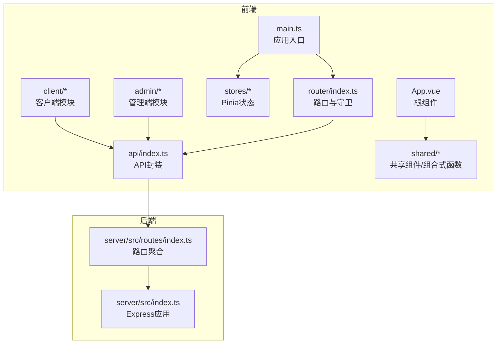
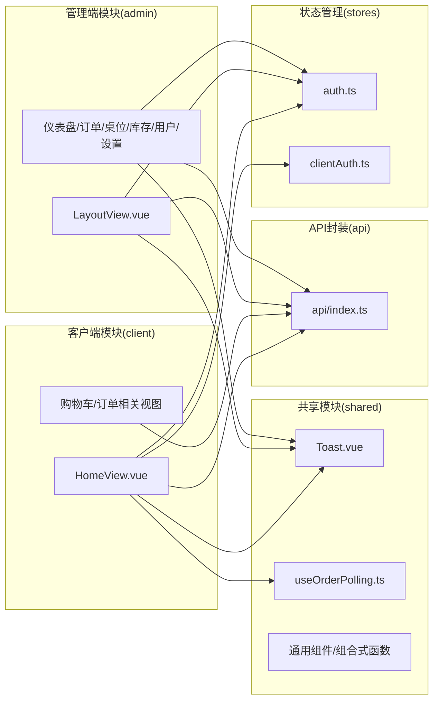
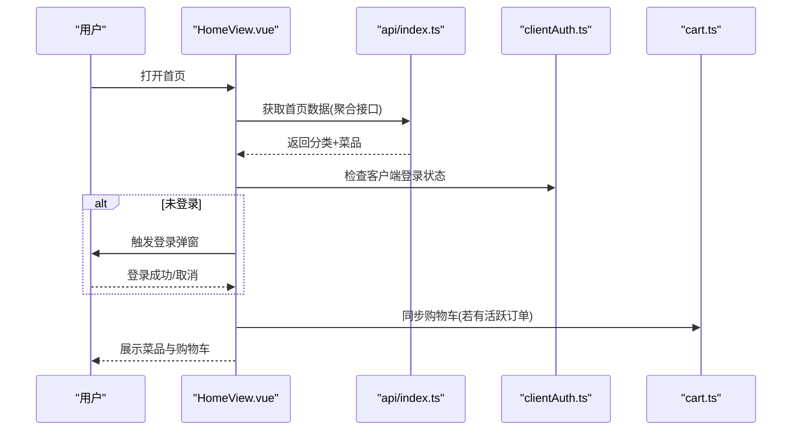
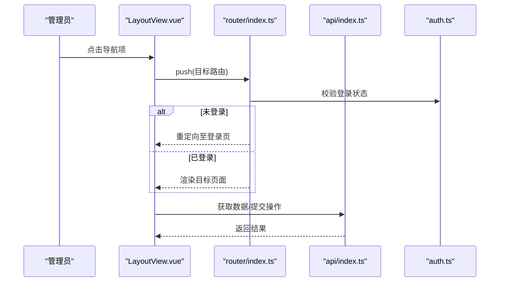
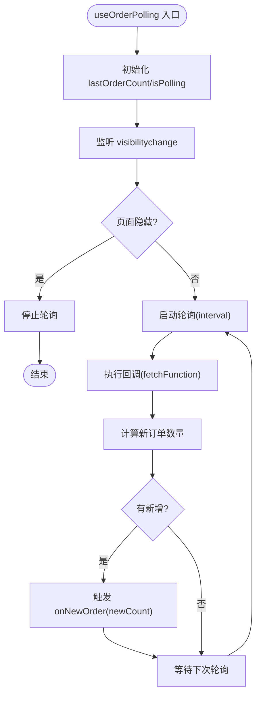
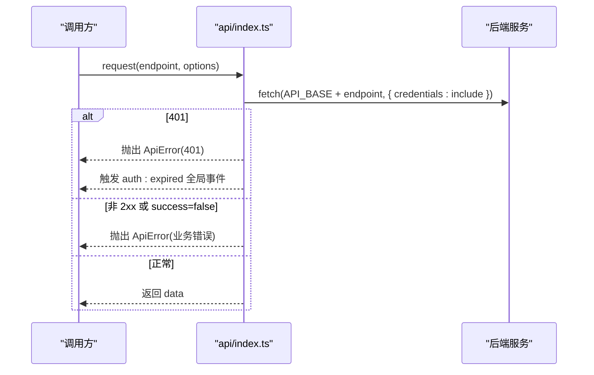
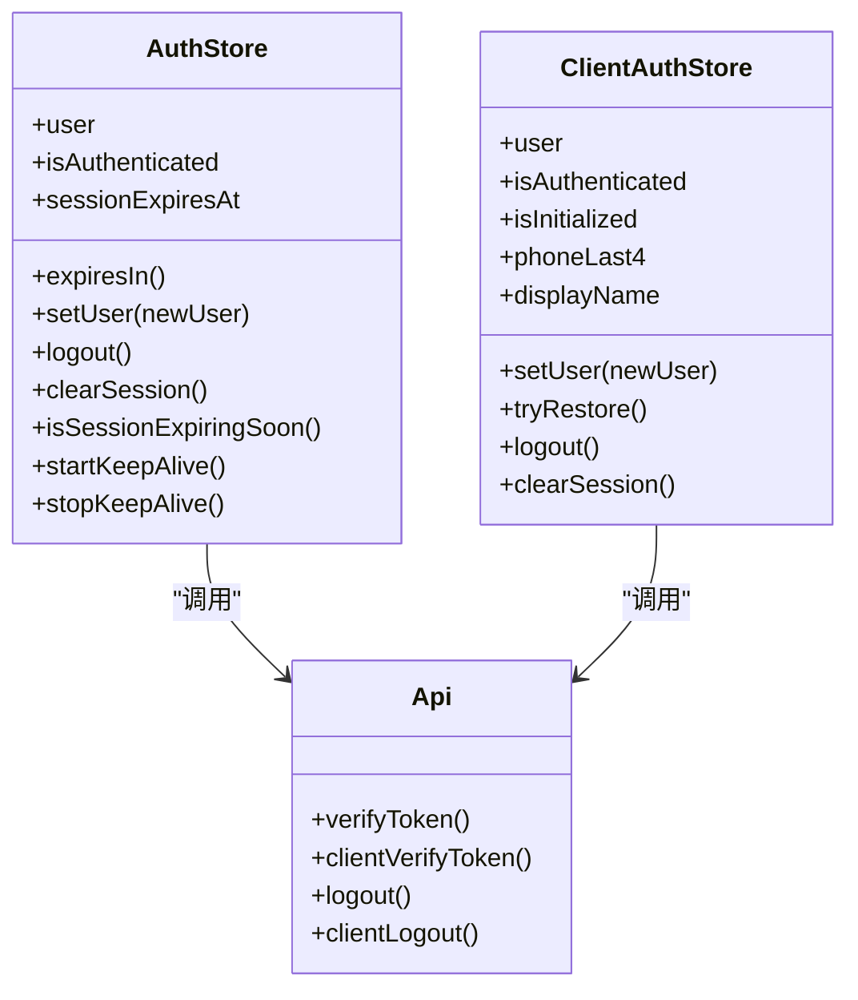
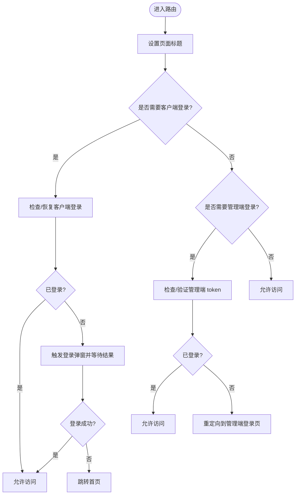
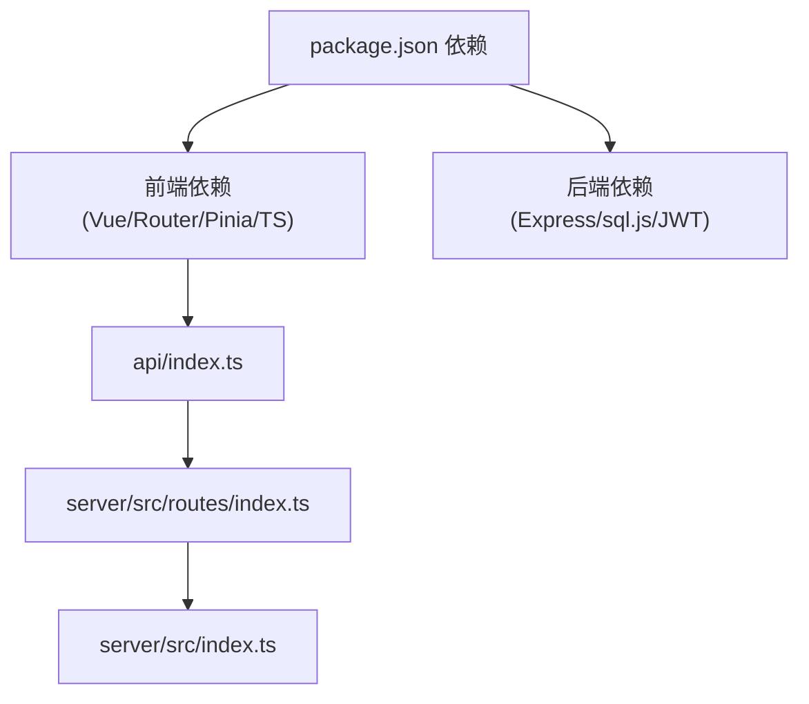

# 模块化设计

<cite>
**本文引用的文件**
- [src/main.ts](file://src/main.ts)
- [src/router/index.ts](file://src/router/index.ts)
- [src/App.vue](file://src/App.vue)
- [src/api/index.ts](file://src/api/index.ts)
- [src/stores/auth.ts](file://src/stores/auth.ts)
- [src/stores/clientAuth.ts](file://src/stores/clientAuth.ts)
- [src/shared/components/Toast.vue](file://src/shared/components/Toast.vue)
- [src/shared/composables/useOrderPolling.ts](file://src/shared/composables/useOrderPolling.ts)
- [src/types/index.ts](file://src/types/index.ts)
- [src/admin/views/LayoutView.vue](file://src/admin/views/LayoutView.vue)
- [src/client/views/HomeView.vue](file://src/client/views/HomeView.vue)
- [server/src/index.ts](file://server/src/index.ts)
- [server/src/routes/index.ts](file://server/src/routes/index.ts)
- [package.json](file://package.json)
- [README.md](file://README.md)
</cite>

## 目录
1. [引言](#引言)
2. [项目结构](#项目结构)
3. [核心组件](#核心组件)
4. [架构总览](#架构总览)
5. [详细组件分析](#详细组件分析)
6. [依赖分析](#依赖分析)
7. [性能考虑](#性能考虑)
8. [故障排查指南](#故障排查指南)
9. [结论](#结论)
10. [附录](#附录)

## 引言
本设计文档围绕 RLRMS 餐厅管理系统，系统化阐述其模块化架构与设计原则，重点覆盖：
- 模块划分与边界：客户端模块、管理端模块、共享模块
- 模块间依赖与通信：组件复用、状态共享、事件传递
- 模块化带来的收益：解耦、职责分离、易测试与维护
- 扩展性设计：新增模块与修改策略
- 模块依赖图与接口设计规范
- 最佳实践总结

## 项目结构
项目采用“前后端分离 + 前端多模块”的组织方式：
- 前端模块
  - 客户端模块（client）：面向到店顾客的自助点餐体验
  - 管理端模块（admin）：面向餐厅管理员/服务员的后台管理
  - 共享模块（shared）：跨模块通用组件与组合式函数
  - API 封装（api）：统一请求层与缓存策略
  - 类型定义（types）：前后端一致的数据契约
  - 状态管理（stores）：Pinia Store（管理端认证、客户端认证、购物车等）
  - 路由（router）：统一路由表与导航守卫
  - 根组件（App.vue）：全局事件与提示组件挂载
  - 入口（main.ts）：应用初始化、插件注册、预加载策略
- 后端模块
  - 路由聚合（server/src/routes/index.ts）：按领域拆分的 API 路由
  - 应用入口（server/src/index.ts）：Express 应用创建、中间件、静态资源、健康检查、错误处理

图表来源
- [src/main.ts:1-37](file://src/main.ts#L1-L37)
- [src/App.vue:1-113](file://src/App.vue#L1-L113)
- [src/router/index.ts:1-317](file://src/router/index.ts#L1-L317)
- [src/api/index.ts:1-608](file://src/api/index.ts#L1-L608)
- [server/src/index.ts:1-176](file://server/src/index.ts#L1-L176)
- [server/src/routes/index.ts:1-18](file://server/src/routes/index.ts#L1-L18)

章节来源
- [README.md:61-174](file://README.md#L61-L174)
- [package.json:1-64](file://package.json#L1-L64)

## 核心组件
- 应用入口与初始化
  - main.ts：创建应用、注册插件（Pinia、Router）、全局输入防拼写检查、移除加载 splash、预加载关键路由
  - App.vue：全局监听认证过期事件，区分 C/B 端路径进行不同处理；挂载 Toast 与客户端登录弹窗
- 路由与导航守卫
  - router/index.ts：定义客户端与管理端路由、标题设置、导航守卫（鉴权与登录拦截）、路由预取与关键路由预加载
- API 封装与缓存
  - api/index.ts：统一请求封装、超时与信号合并、401 全局处理、前端内存缓存（stale-while-revalidate）、导出/导入数据
- 状态管理
  - stores/auth.ts：管理端认证状态、会话保活、过期处理
  - stores/clientAuth.ts：客户端认证状态、登录恢复、登出
- 共享能力
  - shared/components/Toast.vue：全局提示展示
  - shared/composables/useOrderPolling.ts：轮询与可见性感知
- 类型契约
  - types/index.ts：统一的数据模型定义（用户、菜品、订单、库存等）

章节来源
- [src/main.ts:1-37](file://src/main.ts#L1-L37)
- [src/App.vue:1-113](file://src/App.vue#L1-L113)
- [src/router/index.ts:1-317](file://src/router/index.ts#L1-L317)
- [src/api/index.ts:1-608](file://src/api/index.ts#L1-L608)
- [src/stores/auth.ts:1-128](file://src/stores/auth.ts#L1-L128)
- [src/stores/clientAuth.ts:1-87](file://src/stores/clientAuth.ts#L1-L87)
- [src/shared/components/Toast.vue:1-138](file://src/shared/components/Toast.vue#L1-L138)
- [src/shared/composables/useOrderPolling.ts:1-74](file://src/shared/composables/useOrderPolling.ts#L1-L74)
- [src/types/index.ts:1-133](file://src/types/index.ts#L1-L133)

## 架构总览
系统采用“前端多模块 + 后端领域路由”的模块化架构：
- 前端模块边界清晰：client/admin/shared/api/types/stores/router
- 模块间通信机制：
  - 组件复用：shared 提供通用组件与组合式函数，client/admin 通过 import 复用
  - 状态共享：Pinia Store 在全局作用域共享，client/admin 通过 store 读写状态
  - 事件传递：全局事件（auth:expired、client:require-login、client:login-success/login-cancel）实现跨模块解耦通信
- 后端模块边界：按领域拆分（dishes/tables/orders/auth/admin），统一经 /api 前缀暴露

图表来源
- [src/client/views/HomeView.vue:1-902](file://src/client/views/HomeView.vue#L1-L902)
- [src/admin/views/LayoutView.vue:1-769](file://src/admin/views/LayoutView.vue#L1-L769)
- [src/shared/components/Toast.vue:1-138](file://src/shared/components/Toast.vue#L1-L138)
- [src/shared/composables/useOrderPolling.ts:1-74](file://src/shared/composables/useOrderPolling.ts#L1-L74)
- [src/api/index.ts:1-608](file://src/api/index.ts#L1-L608)
- [src/stores/auth.ts:1-128](file://src/stores/auth.ts#L1-L128)
- [src/stores/clientAuth.ts:1-87](file://src/stores/clientAuth.ts#L1-L87)

## 详细组件分析

### 客户端模块（client）
- 功能边界
  - 首页：分类浏览、菜品网格、侧边栏目录、骨架屏、购物车抽屉、加菜/确认下单
  - 订单相关：订单确认、订单详情、订单二维码、全部订单
  - 搜索与设置：菜品搜索、个人设置
- 关键交互
  - 首页加载首页数据（聚合接口 + 前端缓存），恢复滚动位置与分类选择
  - 客户端登录拦截：未登录时触发登录弹窗，登录成功后继续流程
  - 桌位检测：首次进入首页检测可用桌位，若无则弹窗提示
  - 购物车：与 Pinia store 同步，支持数量增减与清空
- 依赖关系
  - 依赖 api 封装进行数据获取
  - 依赖 stores/clientAuth 与 stores/cart 进行状态管理
  - 依赖 shared 组件（DishCard、QuantityControl、Skeleton、Toast）

图表来源
- [src/client/views/HomeView.vue:1-902](file://src/client/views/HomeView.vue#L1-L902)
- [src/api/index.ts:1-608](file://src/api/index.ts#L1-L608)
- [src/stores/clientAuth.ts:1-87](file://src/stores/clientAuth.ts#L1-L87)

章节来源
- [src/client/views/HomeView.vue:1-902](file://src/client/views/HomeView.vue#L1-L902)

### 管理端模块（admin）
- 功能边界
  - 登录：管理员认证，失败重定向与提示
  - 仪表盘：今日订单、收入、待处理订单、可用桌位、最近订单
  - 桌位管理：增删改查、状态更新
  - 菜单管理：菜品 CRUD、分类管理、排序、图片上传
  - 订单管理：列表、搜索、状态更新
  - 库存管理：库存项 CRUD、排序、预警
  - 用户管理：用户 CRUD、角色与资料
  - 系统设置：通用配置
  - 调试工具：SQL 查询、Schema 浏览、API 调试
- 关键交互
  - LayoutView.vue：侧边栏导航、移动端抽屉、调试菜单折叠、退出登录
  - 导航守卫：管理端路由鉴权，未登录重定向至登录页
  - 实时推送：SSE（后端提供，前端通过 api 封装与路由联动）

图表来源
- [src/admin/views/LayoutView.vue:1-769](file://src/admin/views/LayoutView.vue#L1-L769)
- [src/router/index.ts:1-317](file://src/router/index.ts#L1-L317)
- [src/api/index.ts:1-608](file://src/api/index.ts#L1-L608)
- [src/stores/auth.ts:1-128](file://src/stores/auth.ts#L1-L128)

章节来源
- [src/admin/views/LayoutView.vue:1-769](file://src/admin/views/LayoutView.vue#L1-L769)
- [src/router/index.ts:1-317](file://src/router/index.ts#L1-L317)

### 共享模块（shared）
- 组件复用
  - Toast.vue：全局提示栈，Teleport 到 body，支持多种类型与动画
  - QuantityControl、ConfirmDialog、Modal、Loading、Skeleton 等
- 组合式函数
  - useOrderPolling.ts：轮询控制、可见性感知、新订单增量通知
- 设计要点
  - 低耦合：仅依赖 Pinia store 与基础 UI 组件
  - 可插拔：通过 props 与事件与上层解耦

图表来源
- [src/shared/composables/useOrderPolling.ts:1-74](file://src/shared/composables/useOrderPolling.ts#L1-L74)

章节来源
- [src/shared/components/Toast.vue:1-138](file://src/shared/components/Toast.vue#L1-L138)
- [src/shared/composables/useOrderPolling.ts:1-74](file://src/shared/composables/useOrderPolling.ts#L1-L74)

### API 封装（api）
- 统一请求层
  - 基础 URL、Content-Type、credentials: include
  - 超时与 AbortSignal 合并、非 JSON 防御
  - 401 统一处理：触发全局 auth:expired 事件
- 缓存策略
  - 前端内存缓存（Map + TTL），stale-while-revalidate
  - 首页数据与分类数据使用缓存优化
- 导出/导入
  - 导出 ZIP 并自动下载
  - 导入 ZIP 并解析统计结果
- 错误处理
  - 自定义 ApiError，携带 status 与 data
  - 区分业务错误与网络错误

图表来源
- [src/api/index.ts:1-608](file://src/api/index.ts#L1-L608)

章节来源
- [src/api/index.ts:1-608](file://src/api/index.ts#L1-L608)

### 状态管理（stores）
- 管理端认证（auth.ts）
  - 用户信息、登录态、会话过期时间
  - 会话保活：定时器定期验证 token，失败则触发 auth:expired
  - 登出与清除会话
- 客户端认证（clientAuth.ts）
  - 客户端用户信息、显示名与尾号
  - 登录恢复：通过 clientVerifyToken 恢复会话
  - 登出与清除本地状态
- 购物车（cart.ts）
  - 与 HomeView 联动，支持从活跃订单同步
  - 支持 IndexedDB 持久化（在 HomeView 中异步恢复）

图表来源
- [src/stores/auth.ts:1-128](file://src/stores/auth.ts#L1-L128)
- [src/stores/clientAuth.ts:1-87](file://src/stores/clientAuth.ts#L1-L87)
- [src/api/index.ts:1-608](file://src/api/index.ts#L1-L608)

章节来源
- [src/stores/auth.ts:1-128](file://src/stores/auth.ts#L1-L128)
- [src/stores/clientAuth.ts:1-87](file://src/stores/clientAuth.ts#L1-L87)

### 路由与导航守卫（router）
- 客户端路由
  - 首页、菜品详情、搜索、订单确认、订单详情、订单二维码、全部订单、设置
  - requiresClientAuth 控制客户端登录保护
- 管理端路由
  - 登录、仪表盘、桌位/菜单/订单/库存/用户/设置、调试工具
  - requiresAuth 控制管理端登录保护
- 导航守卫
  - 标题设置、登录拦截、登录弹窗触发与结果处理
  - 关键路由预加载与导航后预取，提升首屏与切换性能

图表来源
- [src/router/index.ts:1-317](file://src/router/index.ts#L1-L317)

章节来源
- [src/router/index.ts:1-317](file://src/router/index.ts#L1-L317)

## 依赖分析
- 前端依赖
  - Vue 3 + Vue Router + Pinia + TypeScript
  - Lucide Vue Next（图标）、Zod（参数校验）
- 后端依赖
  - Express + sql.js（SQLite JS 实现）+ JWT + bcryptjs + QRCode/JsBarcode + Sharp + Multer + Zod
- 模块间依赖
  - client/admin 依赖 api 封装
  - client/admin 依赖 stores 状态
  - shared 低耦合复用，不依赖具体业务模块
  - router 依赖 stores 与 api，驱动鉴权与数据获取
  - server/routes 聚合各领域路由，统一暴露 /api 前缀

图表来源
- [package.json:1-64](file://package.json#L1-L64)
- [server/src/routes/index.ts:1-18](file://server/src/routes/index.ts#L1-L18)
- [server/src/index.ts:1-176](file://server/src/index.ts#L1-L176)

章节来源
- [package.json:1-64](file://package.json#L1-L64)
- [server/src/routes/index.ts:1-18](file://server/src/routes/index.ts#L1-L18)
- [server/src/index.ts:1-176](file://server/src/index.ts#L1-L176)

## 性能考虑
- 路由预加载与预取
  - 关键路由组件预加载（首页、管理首页、管理布局）
  - 导航后根据路由预测预取相关页面组件
- 前端缓存
  - api 封装使用前端内存缓存（stale-while-revalidate），降低重复请求
- 网络与安全
  - 401 统一处理与全局事件，避免重复分支判断
  - 压缩中间件与 SSE 特殊处理，保证实时推送不被缓冲
- 可见性感知轮询
  - useOrderPolling 在页面隐藏时自动停止轮询，减少无效请求

章节来源
- [src/router/index.ts:19-40](file://src/router/index.ts#L19-L40)
- [src/router/index.ts:283-314](file://src/router/index.ts#L283-L314)
- [src/api/index.ts:54-114](file://src/api/index.ts#L54-L114)
- [src/api/index.ts:129-148](file://src/api/index.ts#L129-L148)
- [src/shared/composables/useOrderPolling.ts:19-47](file://src/shared/composables/useOrderPolling.ts#L19-L47)
- [server/src/index.ts:46-56](file://server/src/index.ts#L46-L56)

## 故障排查指南
- 认证过期
  - 管理端：auth:expired 事件触发后清除状态并跳转登录页
  - 客户端：auth:expired 事件触发后清除客户端会话并弹出登录
  - 401 统一处理：api 封装抛出 ApiError 并触发 auth:expired
- 登录拦截
  - 客户端路由 requiresClientAuth：未登录时触发 client:require-login，并等待 client:login-success 或 client:login-cancel
  - 管理端路由 requiresAuth：未登录时重定向到 /admin/login
- 状态异常
  - 检查 stores.auth 与 stores.clientAuth 的 setUser/clearSession 是否正确调用
  - 检查 api 封装的 credentials: include 与 Cookie 传输
- 轮询问题
  - useOrderPolling 在页面隐藏时停止，确保页面可见时轮询恢复
- 导航卡顿
  - 检查路由预加载与预取策略是否生效，确认关键路由组件体积与懒加载是否合理

章节来源
- [src/App.vue:16-39](file://src/App.vue#L16-L39)
- [src/api/index.ts:94-104](file://src/api/index.ts#L94-L104)
- [src/router/index.ts:201-277](file://src/router/index.ts#L201-L277)
- [src/shared/composables/useOrderPolling.ts:41-47](file://src/shared/composables/useOrderPolling.ts#L41-L47)

## 结论
本项目通过明确的模块划分与清晰的通信机制，实现了高内聚、低耦合的前端架构：
- 客户端与管理端模块边界清晰，职责分离
- 共享模块提供可复用能力，降低重复开发
- 状态管理与事件传递解耦了模块间的直接依赖
- API 封装与路由守卫统一了鉴权与错误处理
- 预加载、预取与前端缓存提升了用户体验与性能
- 扩展性强：新增模块只需遵循目录约定与接口契约，即可快速接入

## 附录

### 模块化最佳实践
- 目录约定
  - views：页面组件
  - components：可复用组件
  - composables：组合式函数（use 前缀）
  - stores：Pinia 状态
  - api：统一请求封装
  - types：类型定义
  - utils：工具函数
- 接口设计规范
  - 统一响应结构：{ success, data?, error?, message? }
  - 参数校验：后端使用 Zod，前端使用类型约束
  - 错误处理：401 统一触发 auth:expired，业务错误抛出自定义异常
- 事件传递
  - 全局事件命名规范：auth:expired、client:require-login、client:login-success、client:login-cancel
  - 事件承载数据：包含 redirect 与 message 等上下文信息
- 扩展性设计
  - 新增模块：在 client/admin 下新增 views/components，按需引入 shared 能力
  - 修改策略：保持 api 封装与类型定义稳定，通过 store 与事件维持模块间解耦

章节来源
- [README.md:589-599](file://README.md#L589-L599)
- [src/api/index.ts:1-608](file://src/api/index.ts#L1-L608)
- [src/types/index.ts:1-133](file://src/types/index.ts#L1-L133)