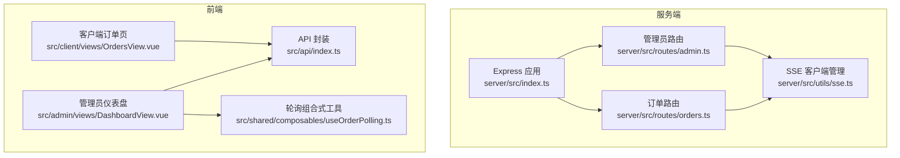
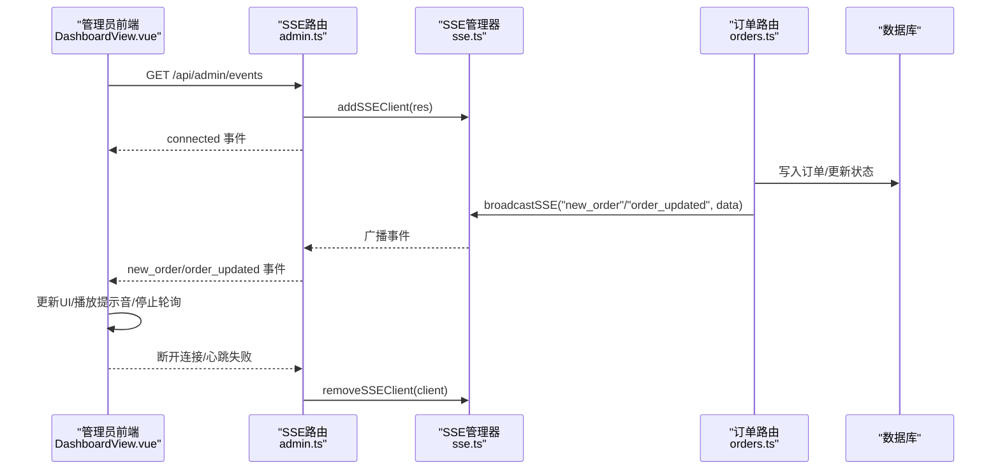
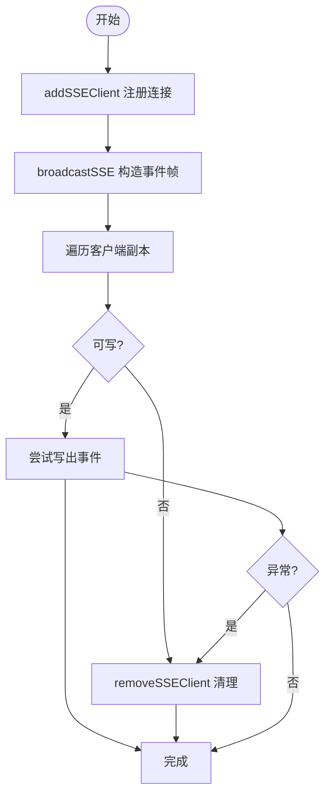
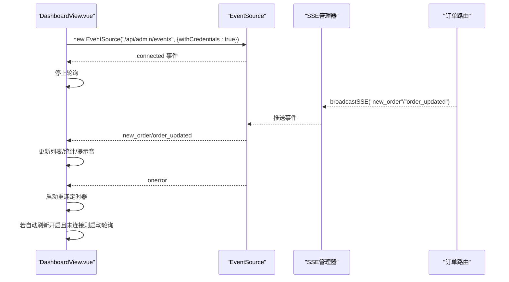
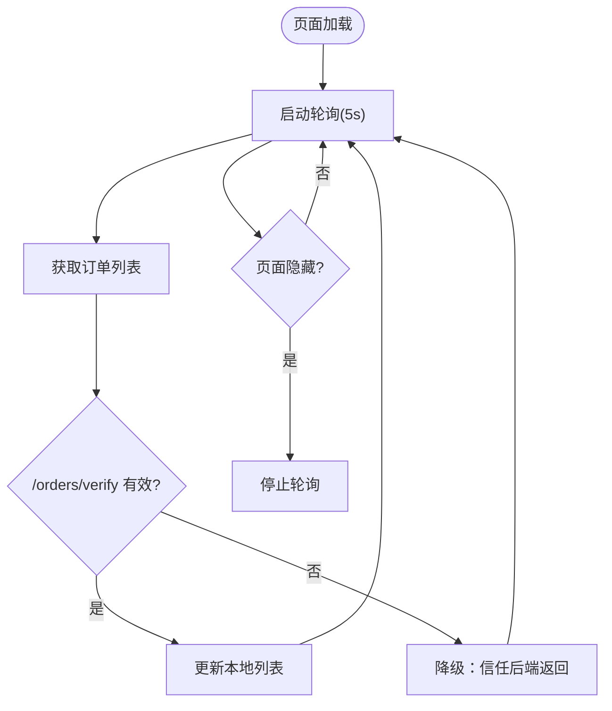
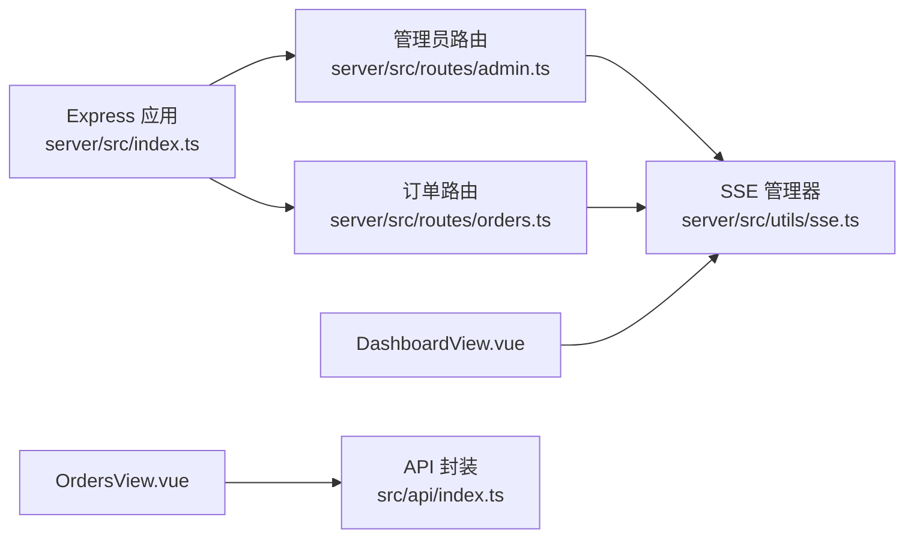

# 实时通信系统

<cite>
**本文引用的文件**
- [server/src/utils/sse.ts](file://server/src/utils/sse.ts)
- [server/src/routes/admin.ts](file://server/src/routes/admin.ts)
- [server/src/routes/orders.ts](file://server/src/routes/orders.ts)
- [server/src/index.ts](file://server/src/index.ts)
- [src/admin/views/DashboardView.vue](file://src/admin/views/DashboardView.vue)
- [src/client/views/OrdersView.vue](file://src/client/views/OrdersView.vue)
- [src/shared/composables/useOrderPolling.ts](file://src/shared/composables/useOrderPolling.ts)
- [src/api/index.ts](file://src/api/index.ts)
</cite>

## 目录
1. [简介](#简介)
2. [项目结构](#项目结构)
3. [核心组件](#核心组件)
4. [架构总览](#架构总览)
5. [详细组件分析](#详细组件分析)
6. [依赖关系分析](#依赖关系分析)
7. [性能考量](#性能考量)
8. [故障排查指南](#故障排查指南)
9. [结论](#结论)

## 简介
本文件面向RLRMS餐厅管理系统，系统性阐述基于Server-Sent Events（SSE）的实时通信机制，覆盖事件广播、客户端监听、连接管理与状态同步等核心技术。文档重点解释以下场景：
- 实时订单状态更新：新订单、订单状态变更、加菜请求等事件的实时推送与界面同步
- 管理员界面同步：仪表盘与订单列表的实时刷新与交互提示
- 客户订单跟踪：客户侧订单列表的轮询与幽灵订单清理策略
- 错误重连与降级：SSE断线后的自动重连与轮询降级策略
- 性能优化与最佳实践：压缩过滤、心跳保活、缓存与超时控制

## 项目结构
实时通信相关模块分布于服务端与前端：
- 服务端
  - SSE客户端管理与广播：server/src/utils/sse.ts
  - 管理端SSE事件路由：server/src/routes/admin.ts
  - 订单业务路由与事件触发：server/src/routes/orders.ts
  - 通用应用入口与SSE压缩过滤：server/src/index.ts
- 前端
  - 管理端仪表盘与SSE监听：src/admin/views/DashboardView.vue
  - 客户端订单列表轮询：src/client/views/OrdersView.vue
  - 通用轮询组合式工具：src/shared/composables/useOrderPolling.ts
  - API封装与跨域凭据：src/api/index.ts

图表来源
- [server/src/index.ts:34-143](file://server/src/index.ts#L34-L143)
- [server/src/utils/sse.ts:1-58](file://server/src/utils/sse.ts#L1-L58)
- [server/src/routes/admin.ts:133-162](file://server/src/routes/admin.ts#L133-L162)
- [server/src/routes/orders.ts:342-343](file://server/src/routes/orders.ts#L342-L343)
- [src/admin/views/DashboardView.vue:302-452](file://src/admin/views/DashboardView.vue#L302-L452)
- [src/client/views/OrdersView.vue:88-136](file://src/client/views/OrdersView.vue#L88-L136)
- [src/shared/composables/useOrderPolling.ts:10-73](file://src/shared/composables/useOrderPolling.ts#L10-L73)
- [src/api/index.ts:76-114](file://src/api/index.ts#L76-L114)

章节来源
- [server/src/index.ts:34-143](file://server/src/index.ts#L34-L143)
- [server/src/utils/sse.ts:1-58](file://server/src/utils/sse.ts#L1-L58)
- [server/src/routes/admin.ts:133-162](file://server/src/routes/admin.ts#L133-L162)
- [server/src/routes/orders.ts:342-343](file://server/src/routes/orders.ts#L342-L343)
- [src/admin/views/DashboardView.vue:302-452](file://src/admin/views/DashboardView.vue#L302-L452)
- [src/client/views/OrdersView.vue:88-136](file://src/client/views/OrdersView.vue#L88-L136)
- [src/shared/composables/useOrderPolling.ts:10-73](file://src/shared/composables/useOrderPolling.ts#L10-L73)
- [src/api/index.ts:76-114](file://src/api/index.ts#L76-L114)

## 核心组件
- SSE客户端管理器
  - 维护连接池、分配客户端ID、广播事件、统计连接数
  - 关键接口：addSSEClient、removeSSEClient、broadcastSSE、getSSEClientCount
- 管理端SSE事件路由
  - 建立SSE连接、设置响应头、心跳保活、断开清理
  - 事件类型：connected、new_order、order_updated
- 订单业务事件触发
  - 下单成功、取消订单、加菜更新后通过broadcastSSE广播
- 前端SSE监听与降级轮询
  - 管理端：EventSource监听、断线重连、自动刷新切换
  - 客户端：轮询刷新、幽灵订单验证
- 通用轮询组合式工具
  - 提供统一的轮询生命周期与可见性控制

章节来源
- [server/src/utils/sse.ts:15-58](file://server/src/utils/sse.ts#L15-L58)
- [server/src/routes/admin.ts:133-162](file://server/src/routes/admin.ts#L133-L162)
- [server/src/routes/orders.ts:342-343](file://server/src/routes/orders.ts#L342-L343)
- [src/admin/views/DashboardView.vue:302-452](file://src/admin/views/DashboardView.vue#L302-L452)
- [src/client/views/OrdersView.vue:88-136](file://src/client/views/OrdersView.vue#L88-L136)
- [src/shared/composables/useOrderPolling.ts:10-73](file://src/shared/composables/useOrderPolling.ts#L10-L73)

## 架构总览
SSE实时通信采用“服务端事件广播 + 前端事件监听”的模式，结合HTTP长连接与心跳保活，实现低延迟、低开销的双向状态同步。

图表来源
- [server/src/routes/admin.ts:133-162](file://server/src/routes/admin.ts#L133-L162)
- [server/src/utils/sse.ts:15-58](file://server/src/utils/sse.ts#L15-L58)
- [server/src/routes/orders.ts:342-343](file://server/src/routes/orders.ts#L342-L343)
- [src/admin/views/DashboardView.vue:302-452](file://src/admin/views/DashboardView.vue#L302-L452)

## 详细组件分析

### SSE客户端管理器（server/src/utils/sse.ts）
- 设计要点
  - 客户端对象包含唯一ID与底层Response对象
  - 广播时遍历副本，避免并发修改导致的迭代问题
  - 对异常写入进行捕获并移除失效连接
- 关键流程
  - addSSEClient：注册新连接
  - removeSSEClient：清理断开连接
  - broadcastSSE：构造SSE事件帧并逐个写出
  - getSSEClientCount：用于监控与调试

图表来源
- [server/src/utils/sse.ts:15-58](file://server/src/utils/sse.ts#L15-L58)

章节来源
- [server/src/utils/sse.ts:15-58](file://server/src/utils/sse.ts#L15-L58)

### 管理端SSE事件路由（server/src/routes/admin.ts）
- SSE连接建立
  - 设置Content-Type为text/event-stream，禁用缓存与代理缓冲
  - 写入connected事件并携带clientId
  - 每30秒发送心跳行，维持连接活跃
  - 监听close事件清理客户端
- 事件类型
  - connected：连接确认
  - new_order：新增订单
  - order_updated：订单状态变更或加菜请求

章节来源
- [server/src/routes/admin.ts:133-162](file://server/src/routes/admin.ts#L133-L162)

### 订单业务事件触发（server/src/routes/orders.ts）
- 下单成功后广播new_order事件，携带完整订单数据
- 取消订单或加菜更新后广播order_updated事件，携带订单ID与状态
- 事件触发位置
  - 新订单：创建订单成功后调用broadcastSSE
  - 订单取消：取消成功后调用broadcastSSE
  - 加菜更新：更新成功后调用broadcastSSE

章节来源
- [server/src/routes/orders.ts:342-343](file://server/src/routes/orders.ts#L342-L343)
- [server/src/routes/orders.ts:410-411](file://server/src/routes/orders.ts#L410-L411)
- [server/src/routes/orders.ts:544-545](file://server/src/routes/orders.ts#L544-L545)

### 管理端前端监听与降级（src/admin/views/DashboardView.vue）
- SSE连接
  - 使用EventSource连接到/admin/events，withCredentials启用Cookie
  - 监听connected事件后停止轮询
  - 监听new_order与order_updated事件，增量更新UI并播放提示音
- 断线重连
  - onerror回调中关闭连接、清理定时器
  - 启动定时器按固定间隔重连
  - 若自动刷新开启且SSE未连接则启动轮询
- 自动刷新控制
  - 切换开关时根据SSE连接状态决定是否启动轮询
  - 监听watch自动刷新状态，必要时尝试重连SSE

图表来源
- [src/admin/views/DashboardView.vue:302-452](file://src/admin/views/DashboardView.vue#L302-L452)
- [server/src/utils/sse.ts:15-58](file://server/src/utils/sse.ts#L15-L58)
- [server/src/routes/orders.ts:342-343](file://server/src/routes/orders.ts#L342-L343)

章节来源
- [src/admin/views/DashboardView.vue:302-452](file://src/admin/views/DashboardView.vue#L302-L452)

### 客户端订单跟踪（src/client/views/OrdersView.vue）
- 轮询策略
  - 页面加载与可见性变化时启动/停止轮询
  - 每5秒拉取一次订单列表
- 幽灵订单清理
  - 获取订单列表后，使用/verify接口验证订单ID有效性
  - 若验证失败，降级信任后端返回数据，避免因网络波动导致的错删
- 本地状态更新
  - 轮询成功后替换本地订单列表
  - 保持UI简洁与一致性

图表来源
- [src/client/views/OrdersView.vue:88-136](file://src/client/views/OrdersView.vue#L88-L136)

章节来源
- [src/client/views/OrdersView.vue:88-136](file://src/client/views/OrdersView.vue#L88-L136)

### 通用轮询组合式工具（src/shared/composables/useOrderPolling.ts）
- 功能
  - 统一轮询生命周期管理
  - 支持自定义轮询间隔与回调
  - 在页面隐藏时自动停止轮询，恢复时重启
  - 提供shouldPoll钩子，便于与SSE连接状态联动
- 使用场景
  - 管理端：当SSE未连接时启用轮询
  - 客户端：独立轮询刷新

章节来源
- [src/shared/composables/useOrderPolling.ts:10-73](file://src/shared/composables/useOrderPolling.ts#L10-L73)

### API封装与跨域凭据（src/api/index.ts）
- 统一请求封装
  - 默认携带credentials: 'include'，确保Cookie随请求传递
  - 非JSON响应拦截与401处理
  - 超时控制与信号合并
- 与SSE的协作
  - 管理端SSE连接使用withCredentials: true，配合后端Cookie认证
  - 前端API层统一处理跨域与凭据，保障SSE与REST一致的认证体验

章节来源
- [src/api/index.ts:76-114](file://src/api/index.ts#L76-L114)
- [src/admin/views/DashboardView.vue:312](file://src/admin/views/DashboardView.vue#L312)

## 依赖关系分析
- 服务端
  - Express应用在中间件阶段启用压缩过滤，排除SSE流以避免缓冲
  - 管理端SSE路由依赖SSE管理器进行连接注册与事件广播
  - 订单路由在业务成功后调用SSE管理器进行广播
- 前端
  - 管理端DashboardView通过EventSource订阅SSE事件
  - 客户端OrdersView通过轮询与后端API交互
  - 两者均通过统一的API封装进行请求与错误处理

图表来源
- [server/src/index.ts:46-56](file://server/src/index.ts#L46-L56)
- [server/src/routes/admin.ts:133-162](file://server/src/routes/admin.ts#L133-L162)
- [server/src/routes/orders.ts:342-343](file://server/src/routes/orders.ts#L342-L343)
- [server/src/utils/sse.ts:15-58](file://server/src/utils/sse.ts#L15-L58)
- [src/admin/views/DashboardView.vue:302-452](file://src/admin/views/DashboardView.vue#L302-L452)
- [src/client/views/OrdersView.vue:88-136](file://src/client/views/OrdersView.vue#L88-L136)
- [src/api/index.ts:76-114](file://src/api/index.ts#L76-L114)

章节来源
- [server/src/index.ts:46-56](file://server/src/index.ts#L46-L56)
- [server/src/routes/admin.ts:133-162](file://server/src/routes/admin.ts#L133-L162)
- [server/src/routes/orders.ts:342-343](file://server/src/routes/orders.ts#L342-L343)
- [server/src/utils/sse.ts:15-58](file://server/src/utils/sse.ts#L15-L58)
- [src/admin/views/DashboardView.vue:302-452](file://src/admin/views/DashboardView.vue#L302-L452)
- [src/client/views/OrdersView.vue:88-136](file://src/client/views/OrdersView.vue#L88-L136)
- [src/api/index.ts:76-114](file://src/api/index.ts#L76-L114)

## 性能考量
- 压缩过滤
  - SSE响应不进行压缩，避免代理/网关缓冲导致的实时性损失
- 心跳保活
  - 每30秒发送心跳行，降低Nginx等代理的空闲超时风险
- 广播效率
  - 广播时遍历副本，避免在迭代过程中修改数组
  - 异常捕获与连接清理，减少无效写入
- 轮询降级
  - SSE断线后自动启用轮询，保证基本可用性
  - 页面隐藏时停止轮询，节省资源
- 缓存与超时
  - 前端API层统一超时控制与信号合并，避免长时间阻塞

章节来源
- [server/src/index.ts:46-56](file://server/src/index.ts#L46-L56)
- [server/src/utils/sse.ts:37-50](file://server/src/utils/sse.ts#L37-L50)
- [src/admin/views/DashboardView.vue:147-155](file://src/admin/views/DashboardView.vue#L147-L155)
- [src/shared/composables/useOrderPolling.ts:19-31](file://src/shared/composables/useOrderPolling.ts#L19-L31)
- [src/api/index.ts:67-81](file://src/api/index.ts#L67-L81)

## 故障排查指南
- SSE连接失败
  - 检查后端SSE路由是否正确设置响应头与withCredentials
  - 确认浏览器EventSource支持与CORS配置
  - 观察前端onerror回调与重连定时器是否触发
- 事件未到达
  - 确认订单路由在业务成功后调用了broadcastSSE
  - 检查SSE管理器是否仍在维护连接池
- 轮询未生效
  - 管理端：确认shouldPoll在SSE连接时返回false
  - 客户端：确认轮询定时器已启动且页面未隐藏
- 幽灵订单问题
  - 客户端verify接口失败时会降级信任后端返回数据
  - 建议在日志中记录verify失败原因并提示用户重试

章节来源
- [src/admin/views/DashboardView.vue:375-390](file://src/admin/views/DashboardView.vue#L375-L390)
- [server/src/routes/orders.ts:342-343](file://server/src/routes/orders.ts#L342-L343)
- [src/client/views/OrdersView.vue:98-114](file://src/client/views/OrdersView.vue#L98-L114)

## 结论
RLRMS通过SSE实现了低延迟、低开销的实时通信，结合心跳保活与断线重连，确保在复杂网络环境下仍能稳定推送订单状态变化。管理端与客户端分别采用SSE与轮询的混合策略，在保证实时性的同时兼顾了可靠性与性能。建议在生产环境中持续监控SSE连接数与事件延迟，并根据业务峰值调整心跳周期与轮询间隔，以获得最佳用户体验与运营效率。