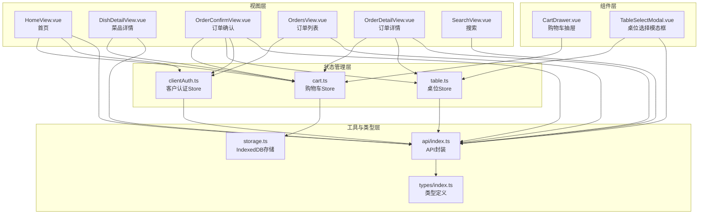
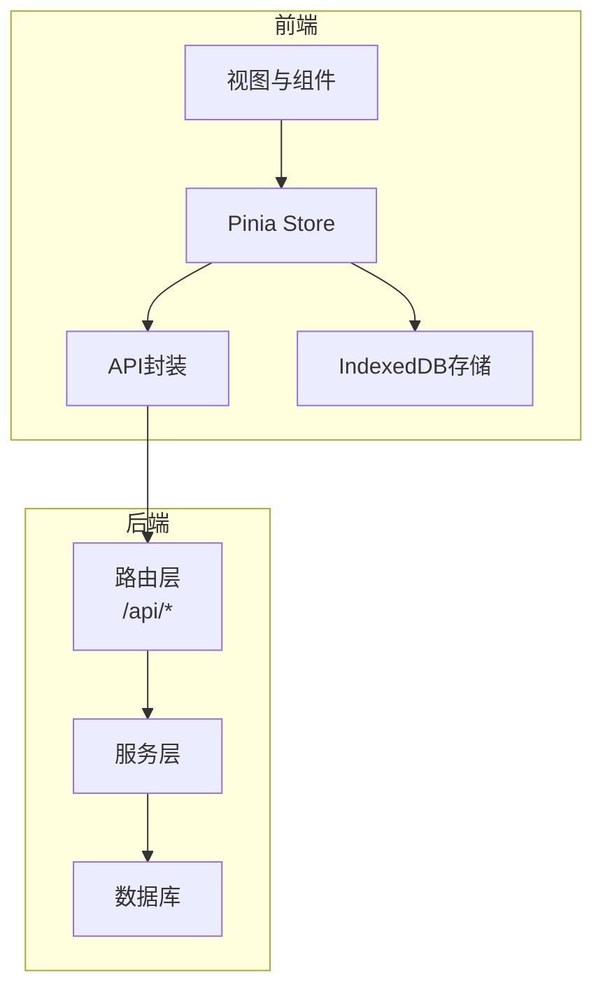
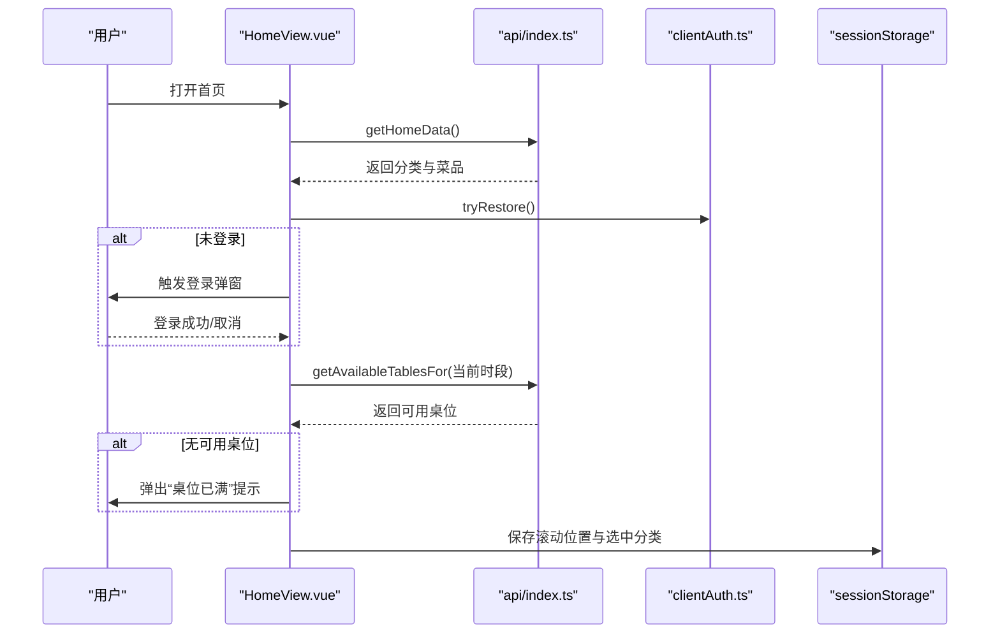
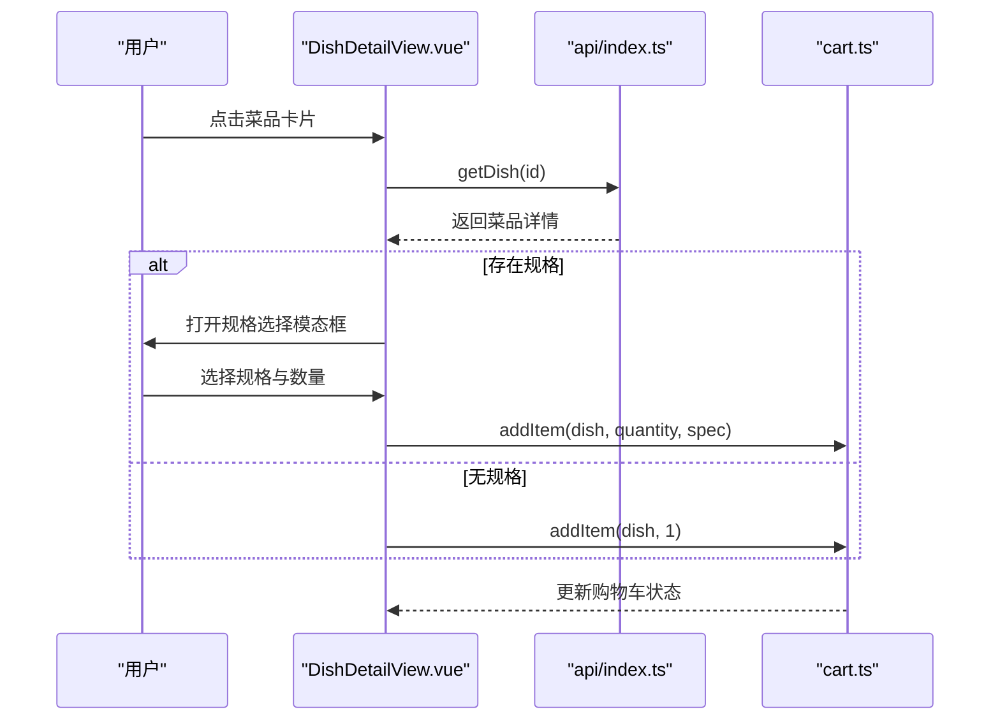
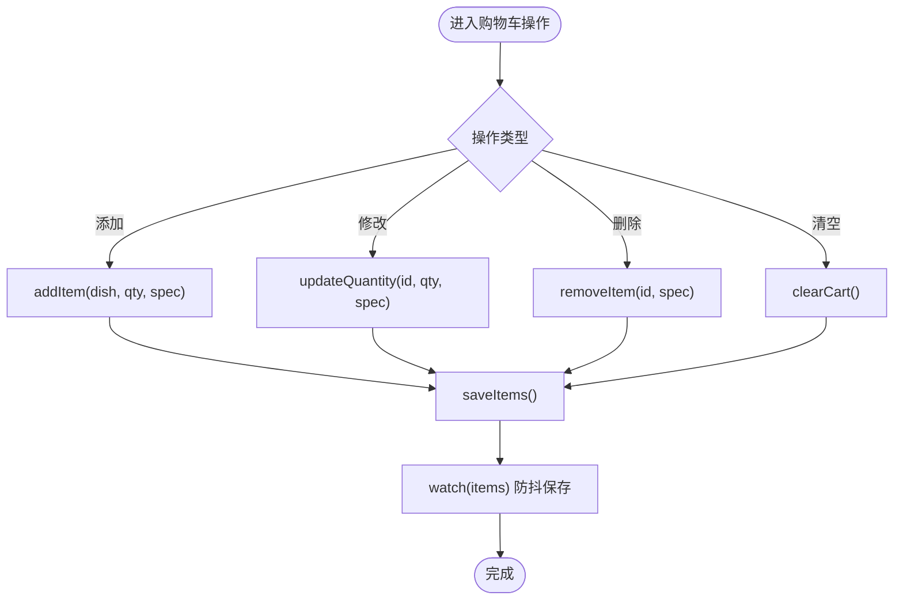
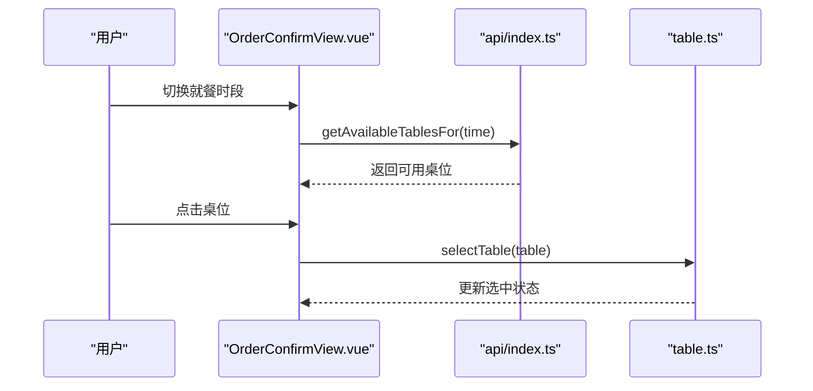
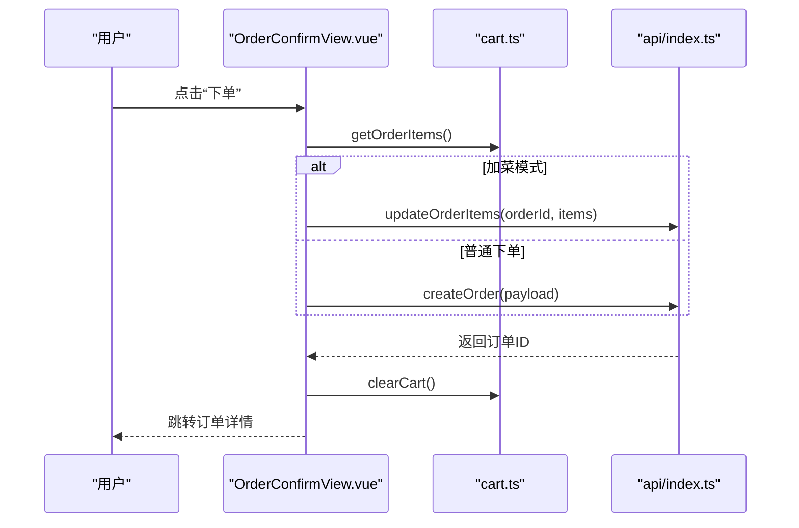
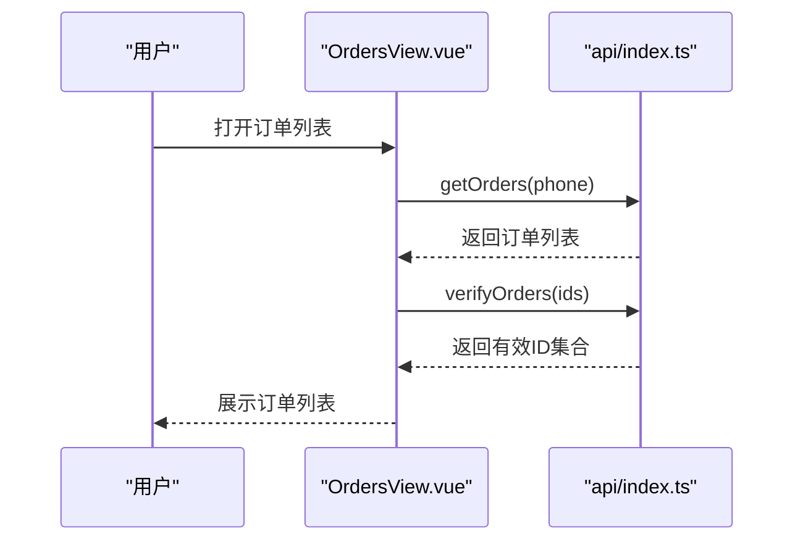
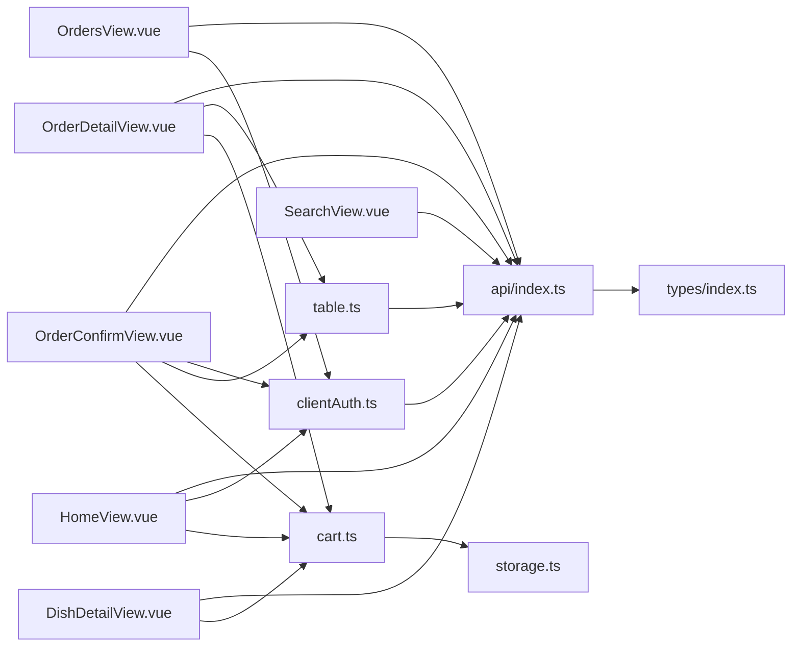

# 客户功能模块

<cite>
**本文档引用的文件**
- [HomeView.vue](file://src/client/views/HomeView.vue)
- [DishDetailView.vue](file://src/client/views/DishDetailView.vue)
- [CartDrawer.vue](file://src/client/components/CartDrawer.vue)
- [TableSelectModal.vue](file://src/client/components/TableSelectModal.vue)
- [OrderConfirmView.vue](file://src/client/views/OrderConfirmView.vue)
- [OrdersView.vue](file://src/client/views/OrdersView.vue)
- [OrderDetailView.vue](file://src/client/views/OrderDetailView.vue)
- [SearchView.vue](file://src/client/views/SearchView.vue)
- [cart.ts](file://src/stores/cart.ts)
- [clientAuth.ts](file://src/stores/clientAuth.ts)
- [table.ts](file://src/stores/table.ts)
- [api/index.ts](file://src/api/index.ts)
- [storage.ts](file://src/utils/storage.ts)
- [types/index.ts](file://src/types/index.ts)
</cite>

## 目录
1. [简介](#简介)
2. [项目结构](#项目结构)
3. [核心组件](#核心组件)
4. [架构总览](#架构总览)
5. [详细组件分析](#详细组件分析)
6. [依赖关系分析](#依赖关系分析)
7. [性能考虑](#性能考虑)
8. [故障排除指南](#故障排除指南)
9. [结论](#结论)

## 简介
本文件面向RLRMS餐厅管理系统中的客户自助点餐功能模块，系统性阐述从首页菜品浏览、分类导航、菜品详情查看、购物车管理、桌位选择到订单确认的完整用户旅程。文档不仅解释各功能模块的实现原理与业务逻辑，还深入说明客户认证机制、会话管理以及数据持久化策略，并提供具体代码示例路径与使用场景，帮助开发者快速理解技术实现细节与用户体验优化方案。

## 项目结构
客户功能模块主要由以下层次构成：
- 视图层：负责用户界面展示与交互，如首页、菜品详情、订单确认、订单列表与详情、搜索等视图组件。
- 组件层：可复用UI组件，如购物车抽屉、桌位选择模态框、数量控制等。
- 状态管理层：基于Pinia的状态存储，包括购物车、客户认证、桌位选择等。
- 工具与类型层：封装IndexedDB存储工具、API请求封装与统一类型定义。
- 类型定义：前后端一致的数据模型，确保类型安全与开发效率。

图表来源
- [HomeView.vue:1-867](file://src/client/views/HomeView.vue#L1-L867)
- [DishDetailView.vue:1-428](file://src/client/views/DishDetailView.vue#L1-L428)
- [OrderConfirmView.vue:1-981](file://src/client/views/OrderConfirmView.vue#L1-L981)
- [OrdersView.vue:1-290](file://src/client/views/OrdersView.vue#L1-L290)
- [OrderDetailView.vue:1-670](file://src/client/views/OrderDetailView.vue#L1-L670)
- [SearchView.vue:1-359](file://src/client/views/SearchView.vue#L1-L359)
- [CartDrawer.vue:1-314](file://src/client/components/CartDrawer.vue#L1-L314)
- [TableSelectModal.vue:1-231](file://src/client/components/TableSelectModal.vue#L1-L231)
- [cart.ts:1-183](file://src/stores/cart.ts#L1-L183)
- [clientAuth.ts:1-87](file://src/stores/clientAuth.ts#L1-L87)
- [table.ts:1-25](file://src/stores/table.ts#L1-L25)
- [api/index.ts:1-608](file://src/api/index.ts#L1-L608)
- [storage.ts:1-109](file://src/utils/storage.ts#L1-L109)
- [types/index.ts:1-133](file://src/types/index.ts#L1-L133)

章节来源
- [HomeView.vue:1-867](file://src/client/views/HomeView.vue#L1-L867)
- [DishDetailView.vue:1-428](file://src/client/views/DishDetailView.vue#L1-L428)
- [OrderConfirmView.vue:1-981](file://src/client/views/OrderConfirmView.vue#L1-L981)
- [OrdersView.vue:1-290](file://src/client/views/OrdersView.vue#L1-L290)
- [OrderDetailView.vue:1-670](file://src/client/views/OrderDetailView.vue#L1-L670)
- [SearchView.vue:1-359](file://src/client/views/SearchView.vue#L1-L359)
- [CartDrawer.vue:1-314](file://src/client/components/CartDrawer.vue#L1-L314)
- [TableSelectModal.vue:1-231](file://src/client/components/TableSelectModal.vue#L1-L231)
- [cart.ts:1-183](file://src/stores/cart.ts#L1-L183)
- [clientAuth.ts:1-87](file://src/stores/clientAuth.ts#L1-L87)
- [table.ts:1-25](file://src/stores/table.ts#L1-L25)
- [api/index.ts:1-608](file://src/api/index.ts#L1-L608)
- [storage.ts:1-109](file://src/utils/storage.ts#L1-L109)
- [types/index.ts:1-133](file://src/types/index.ts#L1-L133)

## 核心组件
本模块的核心组件围绕“客户自助点餐”这一主线构建，涵盖以下关键能力：
- 首页菜品浏览与分类导航：支持按分类分组展示菜品、侧边栏快速定位、骨架屏加载体验与滚动位置记忆。
- 菜品详情查看：支持规格选择、数量调整、加入购物车与购物车联动。
- 购物车管理：支持增删改查、批量清空、金额与数量计算、IndexedDB持久化。
- 桌位选择：支持时段切换、内联桌位网格选择、分页与状态可视化。
- 订单确认：支持联系信息自动填充、下单进度动画、加菜模式与普通下单两种流程。
- 订单列表与详情：支持轮询更新、状态可视化、二维码/条形码生成、加菜与取消操作。
- 搜索功能：支持搜索历史、关键词检索与历史清空。

章节来源
- [HomeView.vue:1-867](file://src/client/views/HomeView.vue#L1-L867)
- [DishDetailView.vue:1-428](file://src/client/views/DishDetailView.vue#L1-L428)
- [CartDrawer.vue:1-314](file://src/client/components/CartDrawer.vue#L1-L314)
- [TableSelectModal.vue:1-231](file://src/client/components/TableSelectModal.vue#L1-L231)
- [OrderConfirmView.vue:1-981](file://src/client/views/OrderConfirmView.vue#L1-L981)
- [OrdersView.vue:1-290](file://src/client/views/OrdersView.vue#L1-L290)
- [OrderDetailView.vue:1-670](file://src/client/views/OrderDetailView.vue#L1-L670)
- [SearchView.vue:1-359](file://src/client/views/SearchView.vue#L1-L359)
- [cart.ts:1-183](file://src/stores/cart.ts#L1-L183)
- [clientAuth.ts:1-87](file://src/stores/clientAuth.ts#L1-L87)
- [table.ts:1-25](file://src/stores/table.ts#L1-L25)
- [api/index.ts:1-608](file://src/api/index.ts#L1-L608)
- [storage.ts:1-109](file://src/utils/storage.ts#L1-L109)
- [types/index.ts:1-133](file://src/types/index.ts#L1-L133)

## 架构总览
客户功能模块采用前后端分离架构，前端通过统一的API封装进行HTTP请求，后端提供REST风格接口；状态管理采用Pinia，数据持久化采用IndexedDB，确保离线可用与跨会话恢复。

图表来源
- [api/index.ts:1-608](file://src/api/index.ts#L1-L608)
- [storage.ts:1-109](file://src/utils/storage.ts#L1-L109)
- [cart.ts:1-183](file://src/stores/cart.ts#L1-L183)
- [clientAuth.ts:1-87](file://src/stores/clientAuth.ts#L1-L87)
- [table.ts:1-25](file://src/stores/table.ts#L1-L25)

## 详细组件分析

### 首页菜品浏览与分类导航
- 功能要点
  - 首次进入时触发数据拉取，使用骨架屏提升加载体验。
  - 按分类分组菜品，隐藏无菜品的分类，支持“其他”分类兜底。
  - 侧边栏根据可见分类渲染，点击滚动至对应区域并高亮选中项。
  - 支持从详情页返回时恢复滚动位置与选中分类。
  - 首次进入且未登录时触发登录弹窗，登录完成后检查桌位是否已满并提示。
- 关键实现
  - 使用计算属性对菜品按分类分组与排序，结合可见分类过滤。
  - 使用sessionStorage在路由离开时保存滚动位置与选中分类，onMounted时恢复。
  - 登录状态通过clientAuthStore的tryRestore方法恢复，若失败则触发登录事件。
  - 桌位检查通过api.getAvailableTablesFor查询当前时段可用桌位，若为空则弹出“桌位已满”提示。
- 用户体验优化
  - 骨架屏与平滑滚动增强首屏体验。
  - 分类高亮与选中态反馈，提升导航效率。
  - 登录前置与桌位提示减少后续流程阻塞。

图表来源
- [HomeView.vue:68-210](file://src/client/views/HomeView.vue#L68-L210)
- [api/index.ts:129-148](file://src/api/index.ts#L129-L148)
- [clientAuth.ts:38-54](file://src/stores/clientAuth.ts#L38-L54)

章节来源
- [HomeView.vue:1-867](file://src/client/views/HomeView.vue#L1-L867)
- [api/index.ts:129-148](file://src/api/index.ts#L129-L148)
- [clientAuth.ts:1-87](file://src/stores/clientAuth.ts#L1-L87)

### 菜品详情查看与规格选择
- 功能要点
  - 加载菜品详情，支持图片占位与描述展示。
  - 若菜品存在规格，则弹出规格选择与数量控制模态框；否则直接加入购物车。
  - 已在购物车中的菜品显示数量控件，支持增减与删除。
- 关键实现
  - 通过route.params.id获取菜品ID，调用api.getDish获取详情。
  - hasSpecs计算属性判断是否存在规格，handleAddToCart根据情况打开规格模态框或直接加入。
  - 数量更新逻辑根据是否有规格区分处理，避免重复规格项叠加导致的异常。
- 用户体验优化
  - 规格选项高亮反馈，数量控件直观易用。
  - 已在购物车中的菜品直接显示数量，减少二次选择成本。

图表来源
- [DishDetailView.vue:38-95](file://src/client/views/DishDetailView.vue#L38-L95)
- [api/index.ts:156-158](file://src/api/index.ts#L156-L158)
- [cart.ts:27-41](file://src/stores/cart.ts#L27-L41)

章节来源
- [DishDetailView.vue:1-428](file://src/client/views/DishDetailView.vue#L1-L428)
- [api/index.ts:156-158](file://src/api/index.ts#L156-L158)
- [cart.ts:1-183](file://src/stores/cart.ts#L1-L183)

### 购物车管理与持久化
- 功能要点
  - 支持添加、删除、修改数量与清空购物车。
  - 自动计算总金额与总数量，支持批量清空与单项删除。
  - 通过IndexedDB持久化购物车数据，确保刷新后恢复。
- 关键实现
  - addItem/updateQuantity/removeItem/clearCart提供标准操作。
  - saveItems/saveOrderId使用toRaw序列化Vue响应式对象，避免Proxy污染IndexedDB存储。
  - watch深度监听items与addDishOrderId，防抖保存，兜底异常路径。
  - restore在store初始化时从IndexedDB恢复购物车与加菜订单ID。
- 用户体验优化
  - 购物车抽屉与底部栏双入口，便于不同场景使用。
  - 数量变更即时生效并持久化，提升可靠性。

图表来源
- [cart.ts:27-75](file://src/stores/cart.ts#L27-L75)
- [cart.ts:113-130](file://src/stores/cart.ts#L113-L130)
- [cart.ts:154-164](file://src/stores/cart.ts#L154-L164)
- [storage.ts:42-91](file://src/utils/storage.ts#L42-L91)

章节来源
- [cart.ts:1-183](file://src/stores/cart.ts#L1-L183)
- [storage.ts:1-109](file://src/utils/storage.ts#L1-L109)

### 桌位选择与内联选择器
- 功能要点
  - 支持按就餐时段查询可用桌位，内联网格展示，支持分页与选中态。
  - 桌位状态以图标与颜色标识，清晰反映可用/已预订/已占用。
  - 选择后通过tableStore.selectTable设置全局选中状态。
- 关键实现
  - diningTime计算当前时段，watch监听变化并刷新可用桌位列表。
  - paginatedTables基于TABLE_PAGE_SIZE分页展示，支持左右翻页。
  - handleSelect仅对available状态的桌位生效，避免误选。
- 用户体验优化
  - 图标与颜色直观表达状态，减少认知负担。
  - 分页与选中态反馈，提升大列表下的交互效率。

图表来源
- [OrderConfirmView.vue:69-94](file://src/client/views/OrderConfirmView.vue#L69-L94)
- [OrderConfirmView.vue:82-84](file://src/client/views/OrderConfirmView.vue#L82-L84)
- [api/index.ts:182-184](file://src/api/index.ts#L182-L184)
- [table.ts:10-16](file://src/stores/table.ts#L10-L16)

章节来源
- [OrderConfirmView.vue:1-981](file://src/client/views/OrderConfirmView.vue#L1-L981)
- [TableSelectModal.vue:1-231](file://src/client/components/TableSelectModal.vue#L1-L231)
- [table.ts:1-25](file://src/stores/table.ts#L1-L25)
- [api/index.ts:174-184](file://src/api/index.ts#L174-L184)

### 订单确认与提交流程
- 功能要点
  - 支持普通下单与加菜两种模式：加菜模式无需选择桌位，直接更新订单菜品。
  - 联系信息自动填充（已登录用户手机号自动填入，姓名从IndexedDB恢复）。
  - 提交过程包含三步进度动画，提升用户感知与信任度。
- 关键实现
  - isAddDishMode通过cartStore.addDishOrderId判断是否为加菜模式。
  - canSubmit根据是否加菜模式分别校验桌位、联系信息与购物车状态。
  - handleSubmit根据模式调用createOrder或updateOrderItems，提交后清理购物车并跳转订单详情。
- 用户体验优化
  - 进度动画与步骤提示，降低等待焦虑。
  - 自动填充减少输入成本，提升转化率。

图表来源
- [OrderConfirmView.vue:177-231](file://src/client/views/OrderConfirmView.vue#L177-L231)
- [cart.ts:78-87](file://src/stores/cart.ts#L78-L87)
- [api/index.ts:187-243](file://src/api/index.ts#L187-L243)

章节来源
- [OrderConfirmView.vue:1-981](file://src/client/views/OrderConfirmView.vue#L1-L981)
- [cart.ts:1-183](file://src/stores/cart.ts#L1-L183)
- [api/index.ts:187-243](file://src/api/index.ts#L187-L243)

### 订单列表与详情
- 订单列表
  - 支持轮询更新，隐藏页面时停止轮询，显示时恢复。
  - 对订单有效性进行二次校验，避免幽灵订单。
- 订单详情
  - 支持状态轮询，pending/confirmed状态下定时刷新。
  - 支持加菜（将订单菜品导入购物车）、取消订单（需手机号验证）与二维码/条形码生成。
- 关键实现
  - OrdersView.vue使用setInterval轮询，visibilitychange事件优化性能。
  - OrderDetailView.vue对active状态（pending/confirmed）进行轮询，404时友好提示。
  - 取消订单前校验手机号，避免无效操作。
- 用户体验优化
  - 状态颜色与文案直观表达进度。
  - 加菜与取消按钮按权限与状态动态启用，减少误操作。

图表来源
- [OrdersView.vue:33-63](file://src/client/views/OrdersView.vue#L33-L63)
- [OrdersView.vue:92-127](file://src/client/views/OrdersView.vue#L92-L127)
- [api/index.ts:207-222](file://src/api/index.ts#L207-L222)

章节来源
- [OrdersView.vue:1-290](file://src/client/views/OrdersView.vue#L1-L290)
- [OrderDetailView.vue:1-670](file://src/client/views/OrderDetailView.vue#L1-L670)
- [api/index.ts:207-243](file://src/api/index.ts#L207-L243)

### 搜索功能
- 功能要点
  - 支持关键词搜索菜品，搜索历史持久化，支持清空与逐项删除。
  - 搜索结果以网格展示，点击进入菜品详情。
- 关键实现
  - 使用getItem/setItem/removeItem管理搜索历史，限制最多10条。
  - 搜索结果通过api.searchDishes获取，支持回车快捷提交。
- 用户体验优化
  - 历史标签一键使用，减少重复输入。
  - 空状态与加载状态明确，提升可预期性。

章节来源
- [SearchView.vue:1-359](file://src/client/views/SearchView.vue#L1-L359)
- [api/index.ts:160-162](file://src/api/index.ts#L160-L162)
- [storage.ts:42-91](file://src/utils/storage.ts#L42-L91)

## 依赖关系分析
- 组件耦合
  - 视图组件通过Pinia Store与API封装解耦，降低相互依赖。
  - 购物车与桌位选择作为跨页面共享状态，通过独立Store管理。
- 外部依赖
  - API封装统一处理超时、401、非JSON响应等异常，提供全局事件通知。
  - IndexedDB存储提供可靠的数据持久化，避免Cookie限制。
- 循环依赖
  - 通过Store与API的单向依赖避免循环，组件间通过事件与状态通信。

图表来源
- [DishDetailView.vue:1-428](file://src/client/views/DishDetailView.vue#L1-L428)
- [HomeView.vue:1-867](file://src/client/views/HomeView.vue#L1-L867)
- [OrderConfirmView.vue:1-981](file://src/client/views/OrderConfirmView.vue#L1-L981)
- [OrdersView.vue:1-290](file://src/client/views/OrdersView.vue#L1-L290)
- [OrderDetailView.vue:1-670](file://src/client/views/OrderDetailView.vue#L1-L670)
- [SearchView.vue:1-359](file://src/client/views/SearchView.vue#L1-L359)
- [cart.ts:1-183](file://src/stores/cart.ts#L1-L183)
- [clientAuth.ts:1-87](file://src/stores/clientAuth.ts#L1-L87)
- [table.ts:1-25](file://src/stores/table.ts#L1-L25)
- [api/index.ts:1-608](file://src/api/index.ts#L1-L608)
- [storage.ts:1-109](file://src/utils/storage.ts#L1-L109)
- [types/index.ts:1-133](file://src/types/index.ts#L1-L133)

章节来源
- [DishDetailView.vue:1-428](file://src/client/views/DishDetailView.vue#L1-L428)
- [HomeView.vue:1-867](file://src/client/views/HomeView.vue#L1-L867)
- [OrderConfirmView.vue:1-981](file://src/client/views/OrderConfirmView.vue#L1-L981)
- [OrdersView.vue:1-290](file://src/client/views/OrdersView.vue#L1-L290)
- [OrderDetailView.vue:1-670](file://src/client/views/OrderDetailView.vue#L1-L670)
- [SearchView.vue:1-359](file://src/client/views/SearchView.vue#L1-L359)
- [cart.ts:1-183](file://src/stores/cart.ts#L1-L183)
- [clientAuth.ts:1-87](file://src/stores/clientAuth.ts#L1-L87)
- [table.ts:1-25](file://src/stores/table.ts#L1-L25)
- [api/index.ts:1-608](file://src/api/index.ts#L1-L608)
- [storage.ts:1-109](file://src/utils/storage.ts#L1-L109)
- [types/index.ts:1-133](file://src/types/index.ts#L1-L133)

## 性能考虑
- 请求缓存
  - API封装采用stale-while-revalidate策略，首页数据与分类列表使用内存缓存，提升首屏与切换性能。
- 轮询优化
  - 订单列表与详情在页面隐藏时停止轮询，显示时恢复，减少不必要的网络与CPU消耗。
- 防抖与批处理
  - 购物车变更使用watch防抖保存，避免频繁IO与状态抖动。
- 交互优化
  - 骨架屏与平滑滚动减少感知延迟，提升流畅度。
  - 分页与高亮反馈降低长列表交互成本。

## 故障排除指南
- 登录失效
  - 当后端返回401时，API封装触发全局auth:expired事件，前端可通过监听该事件进行重定向与提示。
- 订单不存在
  - 订单详情在404时显示友好提示并引导返回首页。
- 网络异常
  - API封装统一捕获非JSON响应与超时，抛出自定义ApiError，便于上层统一处理。
- IndexedDB不可用
  - 购物车持久化在异常时静默忽略，保证基础功能可用。

章节来源
- [api/index.ts:94-114](file://src/api/index.ts#L94-L114)
- [OrderDetailView.vue:84-95](file://src/client/views/OrderDetailView.vue#L84-L95)
- [cart.ts:145-150](file://src/stores/cart.ts#L145-L150)

## 结论
RLRMS客户功能模块通过清晰的视图与组件分层、可靠的Pinia状态管理与IndexedDB持久化、完善的API封装与异常处理，实现了从菜品浏览到订单完成的全链路自助点餐体验。模块在性能与用户体验方面均做了充分优化，具备良好的扩展性与维护性，适合进一步引入更多客户交互能力与数据分析功能。