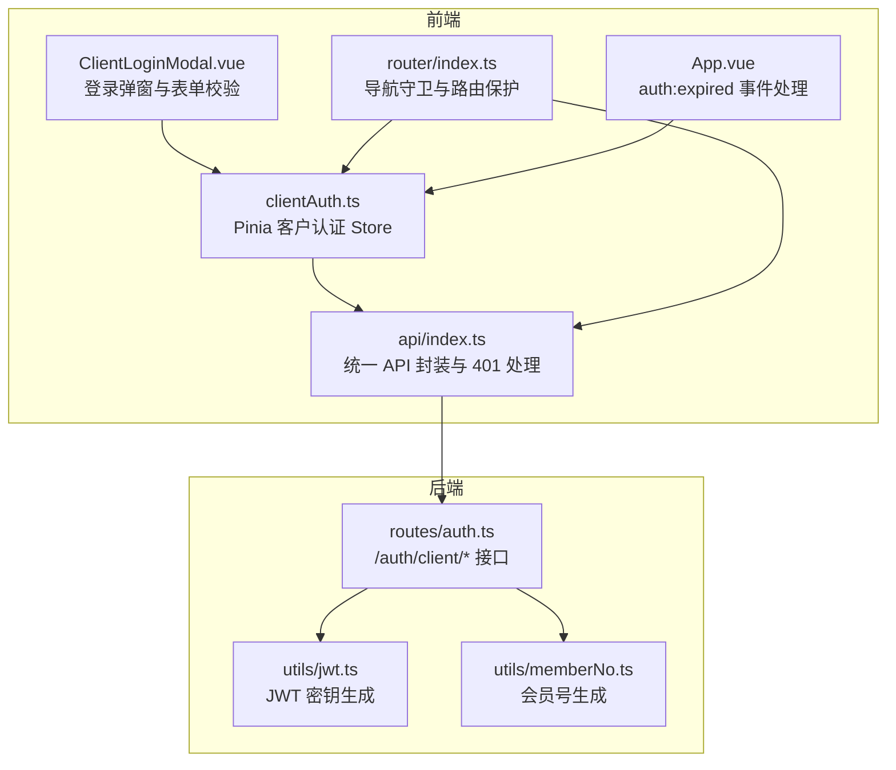
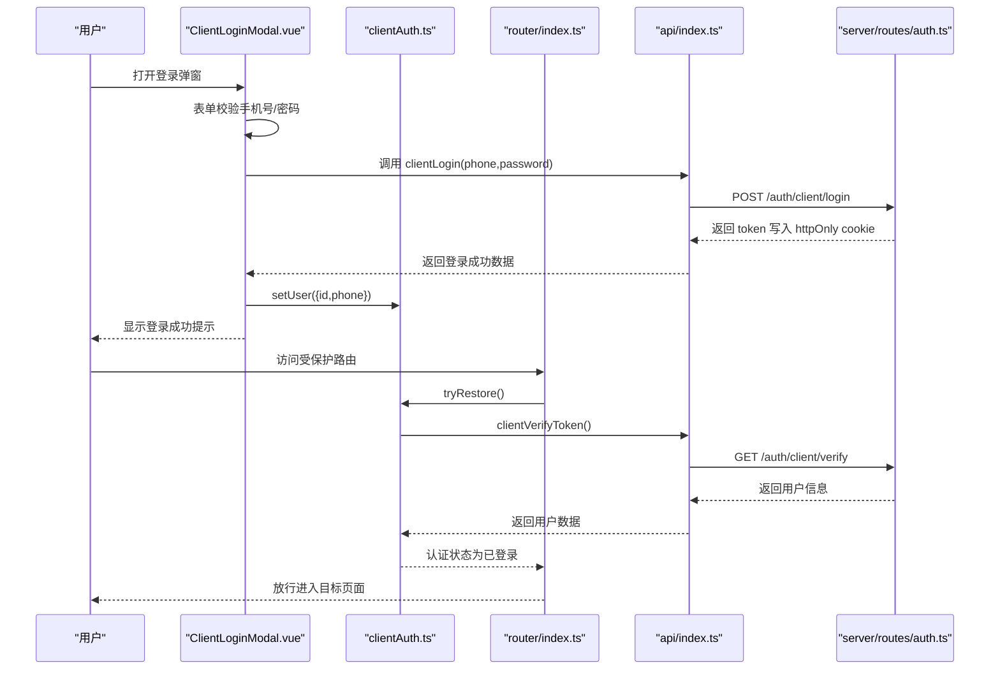
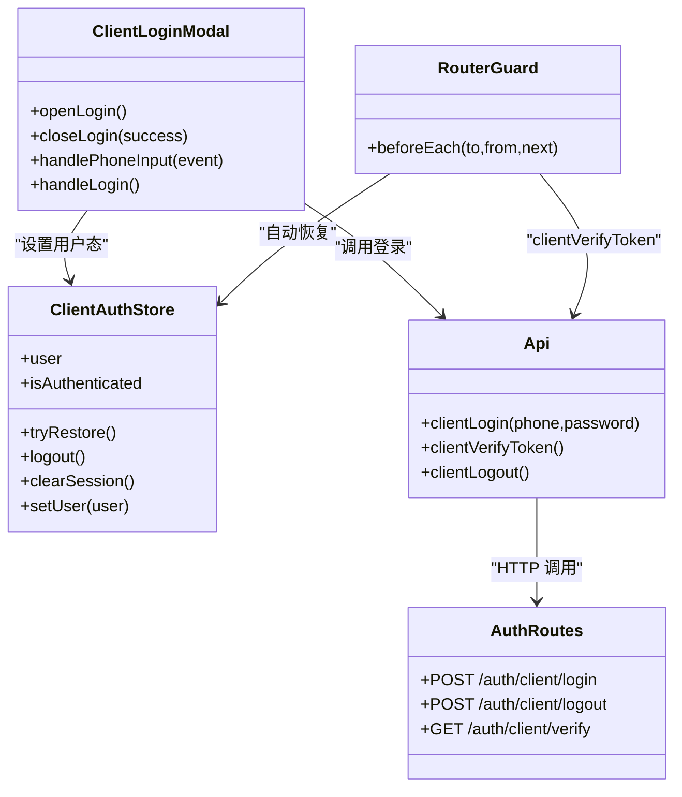

# 客户认证

<cite>
**本文引用的文件列表**
- [src/client/components/ClientLoginModal.vue](file://src/client/components/ClientLoginModal.vue)
- [src/stores/clientAuth.ts](file://src/stores/clientAuth.ts)
- [src/router/index.ts](file://src/router/index.ts)
- [src/api/index.ts](file://src/api/index.ts)
- [src/App.vue](file://src/App.vue)
- [server/src/routes/auth.ts](file://server/src/routes/auth.ts)
- [server/src/utils/jwt.ts](file://server/src/utils/jwt.ts)
- [server/src/utils/memberNo.ts](file://server/src/utils/memberNo.ts)
- [src/stores/auth.ts](file://src/stores/auth.ts)
</cite>

## 目录
1. [简介](#简介)
2. [项目结构与角色定位](#项目结构与角色定位)
3. [核心组件](#核心组件)
4. [架构总览](#架构总览)
5. [详细组件分析](#详细组件分析)
6. [依赖关系分析](#依赖关系分析)
7. [性能与可用性考量](#性能与可用性考量)
8. [故障排查指南](#故障排查指南)
9. [结论](#结论)

## 简介
本文件面向 RLMS 客户端（顾客）认证子系统，聚焦“客户登录弹窗”“表单校验”“会话管理”“认证状态持久化与自动恢复”“安全令牌管理”“全局登录状态与路由保护”“权限控制”等主题，结合前端 Pinia Store、Vue Router 导航守卫、自研 API 封装以及后端基于 httpOnly Cookie 的 JWT 认证，给出可操作的实现原理、流程图解与最佳实践建议，帮助开发者快速理解并维护该认证体系。

## 项目结构与角色定位
- 前端负责：
  - 客户登录弹窗组件与表单校验
  - 客户认证状态 Store（Pinia）
  - 路由守卫中的登录拦截与自动恢复
  - 统一 API 封装与 401 会话过期事件处理
- 后端负责：
  - 客户登录/登出/令牌验证接口
  - 基于 httpOnly Cookie 的 JWT 存储与校验
  - 登录速率限制与安全策略

图表来源
- [src/client/components/ClientLoginModal.vue:1-351](file://src/client/components/ClientLoginModal.vue#L1-L351)
- [src/stores/clientAuth.ts:1-87](file://src/stores/clientAuth.ts#L1-L87)
- [src/router/index.ts:1-317](file://src/router/index.ts#L1-L317)
- [src/api/index.ts:1-608](file://src/api/index.ts#L1-L608)
- [src/App.vue:1-113](file://src/App.vue#L1-L113)
- [server/src/routes/auth.ts:1-405](file://server/src/routes/auth.ts#L1-L405)
- [server/src/utils/jwt.ts:1-27](file://server/src/utils/jwt.ts#L1-L27)
- [server/src/utils/memberNo.ts:1-19](file://server/src/utils/memberNo.ts#L1-L19)

章节来源
- [src/client/components/ClientLoginModal.vue:1-351](file://src/client/components/ClientLoginModal.vue#L1-L351)
- [src/stores/clientAuth.ts:1-87](file://src/stores/clientAuth.ts#L1-L87)
- [src/router/index.ts:1-317](file://src/router/index.ts#L1-L317)
- [src/api/index.ts:1-608](file://src/api/index.ts#L1-L608)
- [src/App.vue:1-113](file://src/App.vue#L1-L113)
- [server/src/routes/auth.ts:1-405](file://server/src/routes/auth.ts#L1-L405)
- [server/src/utils/jwt.ts:1-27](file://server/src/utils/jwt.ts#L1-L27)
- [server/src/utils/memberNo.ts:1-19](file://server/src/utils/memberNo.ts#L1-L19)

## 核心组件
- 客户登录弹窗组件：负责输入收集、前端校验、调用登录 API、设置 Store 用户态、展示提示与错误信息。
- 客户认证 Store：保存用户信息、认证状态、显示名与手机号后四位、支持自动恢复与登出。
- 路由守卫：对需要客户认证的路由进行拦截，尝试自动恢复，必要时触发登录弹窗。
- 统一 API 封装：封装 fetch、超时、401 会话过期事件、JSON 校验与错误包装。
- 后端认证接口：客户登录/登出/令牌验证，基于 httpOnly Cookie 存储 JWT，带速率限制与安全属性。

章节来源
- [src/client/components/ClientLoginModal.vue:1-351](file://src/client/components/ClientLoginModal.vue#L1-L351)
- [src/stores/clientAuth.ts:1-87](file://src/stores/clientAuth.ts#L1-L87)
- [src/router/index.ts:1-317](file://src/router/index.ts#L1-L317)
- [src/api/index.ts:1-608](file://src/api/index.ts#L1-L608)
- [server/src/routes/auth.ts:1-405](file://server/src/routes/auth.ts#L1-L405)

## 架构总览
下图展示了“客户认证”的端到端流程：从前端登录弹窗到后端接口，再到前端 Store 与路由守卫的协同。

图表来源
- [src/client/components/ClientLoginModal.vue:47-88](file://src/client/components/ClientLoginModal.vue#L47-L88)
- [src/stores/clientAuth.ts:38-54](file://src/stores/clientAuth.ts#L38-L54)
- [src/router/index.ts:207-247](file://src/router/index.ts#L207-L247)
- [src/api/index.ts:271-286](file://src/api/index.ts#L271-L286)
- [server/src/routes/auth.ts:182-294](file://server/src/routes/auth.ts#L182-L294)

## 详细组件分析

### 客户登录弹窗组件（ClientLoginModal.vue）
- 功能要点
  - 输入框：手机号（自动过滤非数字、最多11位）、密码（最少6位）、显示/隐藏密码切换。
  - 表单校验：必填项、手机号格式、密码长度。
  - 登录流程：调用 API 登录，成功后设置 Store 用户态，显示成功提示，关闭弹窗并触发成功事件。
  - 取消行为：关闭弹窗并触发取消事件，供路由守卫处理。
- 交互细节
  - 使用 Teleport 将模态挂载到 body，避免层级问题。
  - 通过自定义事件与路由守卫协作，实现“需要登录时弹窗”的解耦。
- 错误处理
  - 捕获异常并提取后端错误消息，展示给用户；最终统一收尾 loading 状态。

章节来源
- [src/client/components/ClientLoginModal.vue:1-351](file://src/client/components/ClientLoginModal.vue#L1-L351)

### 客户认证 Store（clientAuth.ts）
- 状态与计算属性
  - user：当前客户信息（id、phone）。
  - isAuthenticated：是否已登录。
  - isInitialized：是否完成过一次“自动恢复”尝试。
  - phoneLast4、displayName：基于 phone 的展示辅助。
- 关键方法
  - tryRestore：通过调用 clientVerifyToken 验证 cookie 中的 token，成功则设置用户态并标记初始化。
  - logout：调用后端登出接口，清空本地用户态。
  - clearSession：仅清空本地状态（不请求后端）。
  - setUser：设置用户态并更新计算属性。
- 自动恢复机制
  - 首次访问受保护路由时，若未登录且未初始化，则尝试恢复；成功则放行，失败则触发登录弹窗。

章节来源
- [src/stores/clientAuth.ts:1-87](file://src/stores/clientAuth.ts#L1-L87)

### 路由守卫与权限控制（router/index.ts）
- 客户路由保护
  - 对 meta.requiresClientAuth 的路由，在进入前先检查 isAuthenticated。
  - 若未登录，尝试 clientAuthStore.tryRestore。
  - 若仍失败，通过自定义事件触发登录弹窗；等待登录成功或取消，分别放行或回退首页。
- 管理员路由保护
  - 对 meta.requiresAuth 的路由，检查管理员认证状态；失败时调用后端 verify 接口恢复，或重定向至登录页。
- 文档标题与滚动行为
  - 动态设置页面标题。
  - 恢复滚动位置或回到顶部。

章节来源
- [src/router/index.ts:201-277](file://src/router/index.ts#L201-L277)

### 统一 API 封装与 401 处理（api/index.ts）
- 通用能力
  - 统一封装 fetch，支持超时、AbortSignal、credentials: include。
  - JSON 响应校验与错误包装（ApiError）。
  - 401 时触发全局 auth:expired 自定义事件，便于 App.vue 统一处理。
- 客户端认证相关接口
  - clientLogin、clientVerifyToken、clientLogout：对应后端 /auth/client/*。
- 缓存策略
  - 前端内存缓存（stale-while-revalidate），提升弱网体验。

章节来源
- [src/api/index.ts:1-608](file://src/api/index.ts#L1-L608)

### 后端认证接口与安全（server/src/routes/auth.ts）
- 接口职责
  - 客户登录：校验手机号/密码，支持自动注册（唯一用户名生成），签发 JWT 并写入 httpOnly cookie。
  - 客户登出：清除 httpOnly cookie。
  - 客户令牌验证：从 cookie 读取 token，校验用户是否存在，返回用户信息。
- 安全措施
  - httpOnly Cookie（防 XSS）、secure（生产环境）、sameSite、maxAge。
  - 登录速率限制（IP 维度）。
  - 密码哈希（bcrypt）。
- 令牌与密钥
  - JWT 密钥在开发与生产环境下采用不同策略，确保安全与可用性平衡。

章节来源
- [server/src/routes/auth.ts:1-405](file://server/src/routes/auth.ts#L1-L405)
- [server/src/utils/jwt.ts:1-27](file://server/src/utils/jwt.ts#L1-L27)
- [server/src/utils/memberNo.ts:1-19](file://server/src/utils/memberNo.ts#L1-L19)

### 全局会话过期处理（App.vue + api/index.ts）
- 当后端返回 401 或非 JSON 响应时，api 封装会触发 auth:expired 事件。
- App.vue 监听该事件，区分管理员路径与客户路径：
  - 管理员路径：清空管理员 Store，跳转登录页。
  - 客户路径：清空客户 Store，触发登录弹窗，提示“登录已过期”。

章节来源
- [src/App.vue:16-39](file://src/App.vue#L16-L39)
- [src/api/index.ts:94-114](file://src/api/index.ts#L94-L114)

## 依赖关系分析

图表来源
- [src/client/components/ClientLoginModal.vue:1-351](file://src/client/components/ClientLoginModal.vue#L1-L351)
- [src/stores/clientAuth.ts:1-87](file://src/stores/clientAuth.ts#L1-L87)
- [src/router/index.ts:201-277](file://src/router/index.ts#L201-L277)
- [src/api/index.ts:271-286](file://src/api/index.ts#L271-L286)
- [server/src/routes/auth.ts:182-294](file://server/src/routes/auth.ts#L182-L294)

章节来源
- [src/client/components/ClientLoginModal.vue:1-351](file://src/client/components/ClientLoginModal.vue#L1-L351)
- [src/stores/clientAuth.ts:1-87](file://src/stores/clientAuth.ts#L1-L87)
- [src/router/index.ts:1-317](file://src/router/index.ts#L1-L317)
- [src/api/index.ts:1-608](file://src/api/index.ts#L1-L608)
- [server/src/routes/auth.ts:1-405](file://server/src/routes/auth.ts#L1-L405)

## 性能与可用性考量
- 弱网体验
  - 前端对部分数据使用内存缓存（stale-while-revalidate），减少重复请求。
- 路由预取
  - 首屏与关键路由组件预加载，降低首屏与跳转延迟。
- 登录弹窗
  - 仅在需要时弹出，避免不必要的 DOM 与事件监听。
- 会话保活（管理员侧）
  - 管理员 Store 提供会话保活定时器，定期验证 token，提前感知过期并提示。

章节来源
- [src/api/index.ts:17-34](file://src/api/index.ts#L17-L34)
- [src/router/index.ts:23-40](file://src/router/index.ts#L23-L40)
- [src/stores/auth.ts:37-55](file://src/stores/auth.ts#L37-L55)

## 故障排查指南
- 登录失败
  - 检查手机号格式与密码长度是否满足前端校验。
  - 查看后端日志与返回的错误信息，确认是否触发速率限制或用户不存在。
- 自动恢复失败
  - 确认浏览器已携带 httpOnly Cookie；检查后端 /auth/client/verify 是否返回 401。
  - 确认 clientAuthStore.tryRestore 已被调用。
- 401 会话过期
  - 检查 api 封装是否触发 auth:expired 事件。
  - 确认 App.vue 是否正确处理管理员与客户路径分支。
- 登出后仍可访问
  - 确认后端 /auth/client/logout 是否清除 Cookie。
  - 确认前端 Store 是否清空用户态。

章节来源
- [src/client/components/ClientLoginModal.vue:47-88](file://src/client/components/ClientLoginModal.vue#L47-L88)
- [src/stores/clientAuth.ts:38-66](file://src/stores/clientAuth.ts#L38-L66)
- [src/api/index.ts:94-114](file://src/api/index.ts#L94-L114)
- [src/App.vue:16-39](file://src/App.vue#L16-L39)
- [server/src/routes/auth.ts:296-305](file://server/src/routes/auth.ts#L296-L305)

## 结论
RLRMS 的客户认证以“httpOnly Cookie + JWT”为核心，结合前端登录弹窗、Pinia Store、Vue Router 导航守卫与统一 API 封装，实现了“表单校验—登录—会话管理—自动恢复—路由保护—权限控制”的完整闭环。该设计兼顾了用户体验（弱网缓存、预取、弹窗触发）、安全（Cookie 防 XSS、速率限制、密钥策略）与可维护性（模块化、事件驱动）。建议在后续迭代中持续关注：
- 登录弹窗的可访问性与国际化文案。
- 会话保活策略与用户提示的时机优化。
- 客户端 Store 的持久化（如 IndexedDB）以增强跨会话恢复能力（当前为 Cookie 驱动）。