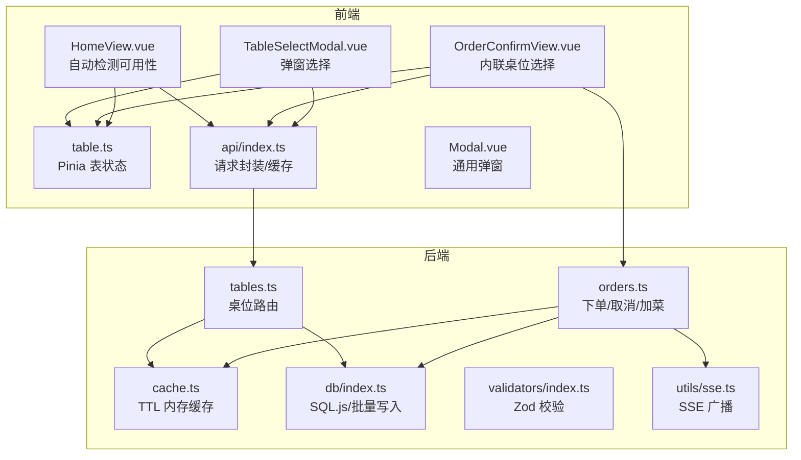
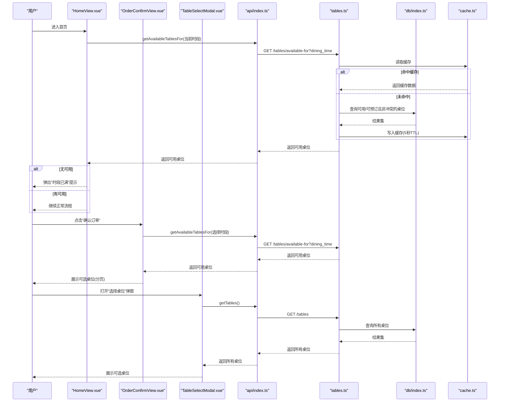
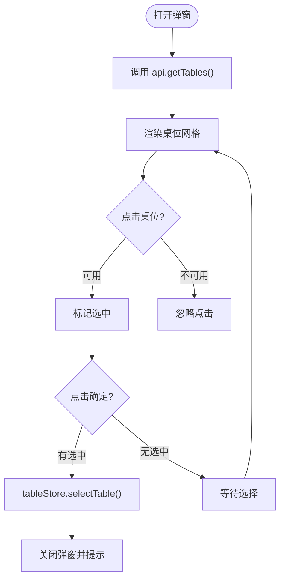
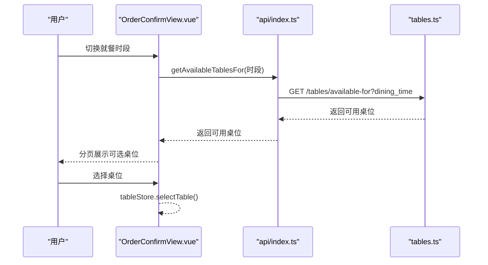
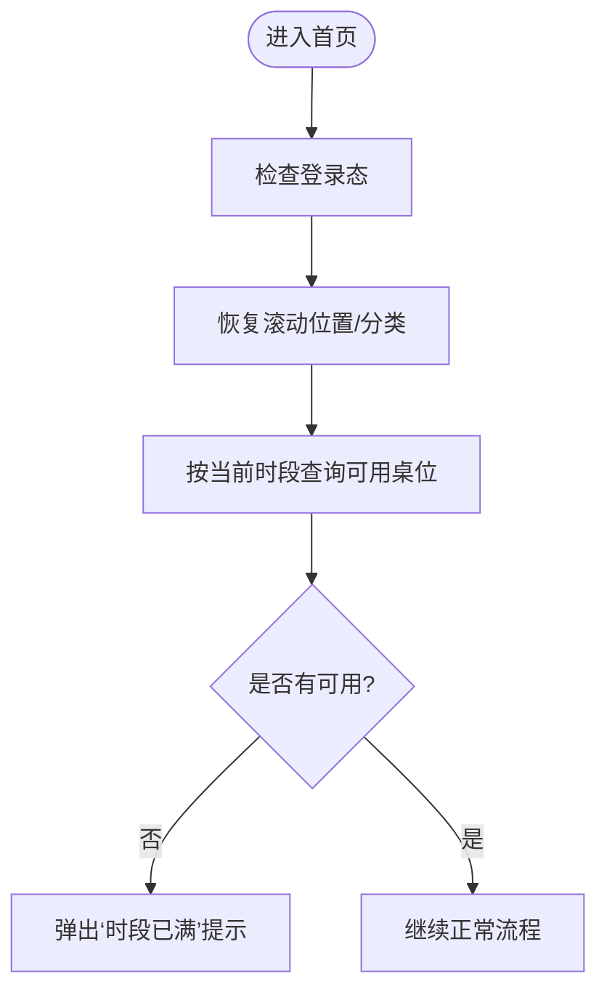
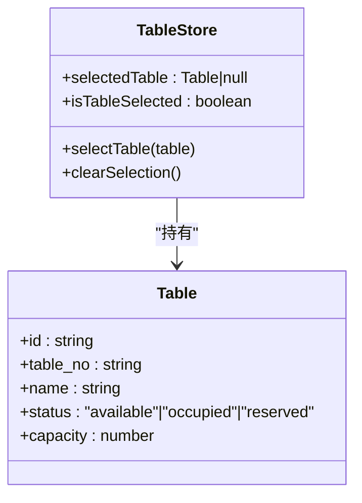
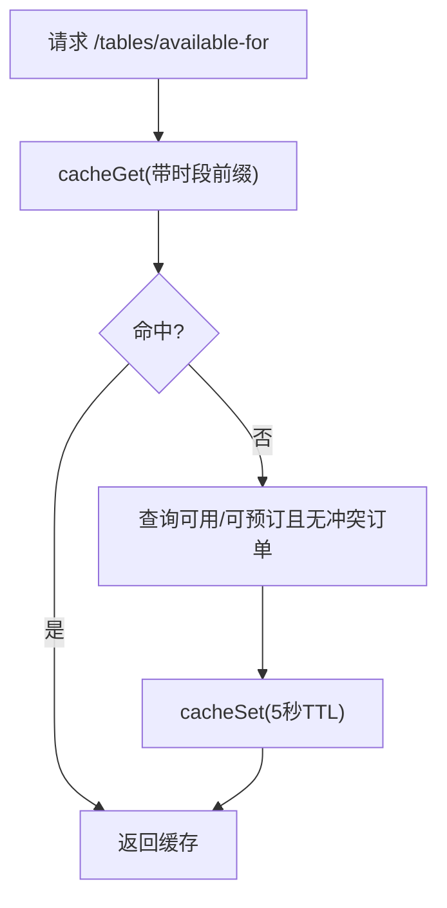
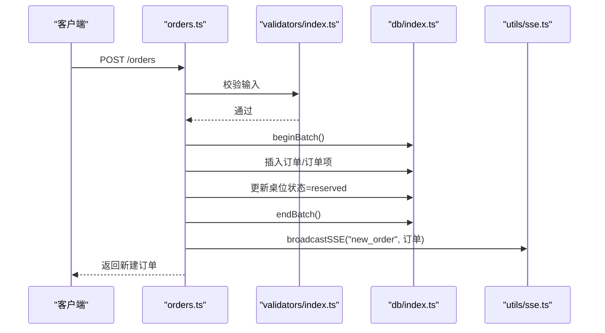
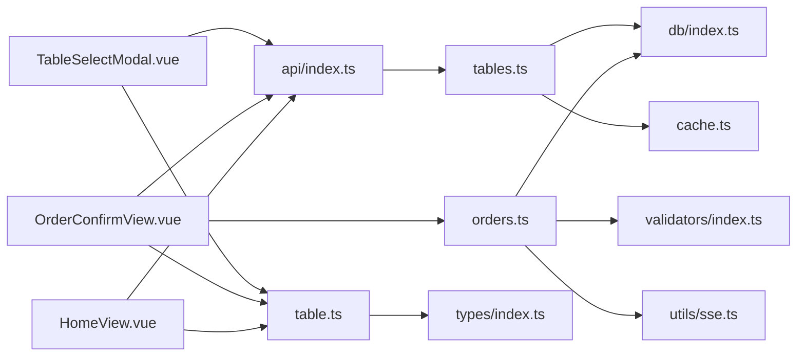

# 桌位选择

<cite>
**本文引用的文件**
- [TableSelectModal.vue](file://src/client/components/TableSelectModal.vue)
- [table.ts](file://src/stores/table.ts)
- [api/index.ts](file://src/api/index.ts)
- [types/index.ts](file://src/types/index.ts)
- [Modal.vue](file://src/shared/components/Modal.vue)
- [HomeView.vue](file://src/client/views/HomeView.vue)
- [OrderConfirmView.vue](file://src/client/views/OrderConfirmView.vue)
- [tables.ts](file://server/src/routes/tables.ts)
- [orders.ts](file://server/src/routes/orders.ts)
- [cache.ts](file://server/src/utils/cache.ts)
- [db/index.ts](file://server/src/db/index.ts)
- [validators/index.ts](file://server/src/validators/index.ts)
- [utils/sse.ts](file://server/src/utils/sse.ts)
</cite>

## 目录
1. [简介](#简介)
2. [项目结构](#项目结构)
3. [核心组件](#核心组件)
4. [架构总览](#架构总览)
5. [详细组件分析](#详细组件分析)
6. [依赖关系分析](#依赖关系分析)
7. [性能考量](#性能考量)
8. [故障排查指南](#故障排查指南)
9. [结论](#结论)

## 简介
本章节聚焦 RLRMS 餐厅管理系统中的“桌位选择”功能，覆盖从前端交互到后端数据一致性的完整链路。重点包括：
- 可用桌位展示与状态筛选
- 时间段判断与动态刷新
- 桌位满座时的提示机制与替代方案
- 实时状态更新、并发控制与数据一致性保障
- 用户体验优化、异常处理与业务逻辑实现建议

## 项目结构
围绕“桌位选择”的关键文件分布如下：
- 前端交互层：桌位选择弹窗组件、订单确认页内联选择、首页自动检测
- 状态管理：Pinia 表存储
- API 层：统一请求封装与缓存策略
- 后端路由：桌位查询、可用性计算、缓存键管理
- 数据库与事务：SQL.js、批量写入与去抖落盘
- 校验与事件：Zod 参数校验、SSE 广播

**图表来源**
- [HomeView.vue](file://src/client/views/HomeView.vue)
- [OrderConfirmView.vue](file://src/client/views/OrderConfirmView.vue)
- [TableSelectModal.vue](file://src/client/components/TableSelectModal.vue)
- [table.ts](file://src/stores/table.ts)
- [api/index.ts](file://src/api/index.ts)
- [Modal.vue](file://src/shared/components/Modal.vue)
- [tables.ts](file://server/src/routes/tables.ts)
- [orders.ts](file://server/src/routes/orders.ts)
- [cache.ts](file://server/src/utils/cache.ts)
- [db/index.ts](file://server/src/db/index.ts)
- [validators/index.ts](file://server/src/validators/index.ts)
- [utils/sse.ts](file://server/src/utils/sse.ts)

**章节来源**
- [HomeView.vue](file://src/client/views/HomeView.vue)
- [OrderConfirmView.vue](file://src/client/views/OrderConfirmView.vue)
- [TableSelectModal.vue](file://src/client/components/TableSelectModal.vue)
- [table.ts](file://src/stores/table.ts)
- [api/index.ts](file://src/api/index.ts)
- [Modal.vue](file://src/shared/components/Modal.vue)
- [tables.ts](file://server/src/routes/tables.ts)
- [orders.ts](file://server/src/routes/orders.ts)
- [cache.ts](file://server/src/utils/cache.ts)
- [db/index.ts](file://server/src/db/index.ts)
- [validators/index.ts](file://server/src/validators/index.ts)
- [utils/sse.ts](file://server/src/utils/sse.ts)

## 核心组件
- 桌位选择弹窗组件：负责渲染可用桌位、状态图标与容量信息，支持单选与确认提交。
- Pinia 表状态存储：集中管理当前选中的桌位，供多处视图共享。
- API 封装：提供统一请求方法与前端缓存策略，减少重复请求与提升响应速度。
- 订单确认页内联选择：根据就餐时间段动态拉取可用桌位，支持分页浏览。
- 首页自动检测：进入首页时按当前时段查询可用桌位，若无可用则弹出提示。

**章节来源**
- [TableSelectModal.vue](file://src/client/components/TableSelectModal.vue)
- [table.ts](file://src/stores/table.ts)
- [api/index.ts](file://src/api/index.ts)
- [OrderConfirmView.vue](file://src/client/views/OrderConfirmView.vue)
- [HomeView.vue](file://src/client/views/HomeView.vue)

## 架构总览
“桌位选择”涉及前后端协作的关键流程如下：

**图表来源**
- [HomeView.vue](file://src/client/views/HomeView.vue)
- [OrderConfirmView.vue](file://src/client/views/OrderConfirmView.vue)
- [TableSelectModal.vue](file://src/client/components/TableSelectModal.vue)
- [api/index.ts](file://src/api/index.ts)
- [tables.ts](file://server/src/routes/tables.ts)
- [db/index.ts](file://server/src/db/index.ts)
- [cache.ts](file://server/src/utils/cache.ts)

## 详细组件分析

### 组件一：TableSelectModal.vue（桌位选择弹窗）
- 功能要点
  - 拉取所有桌位并渲染网格卡片
  - 根据状态显示不同图标与颜色
  - 仅允许选择“可预订/可用”状态的桌位
  - 选中后通过 Pinia store 保存并关闭弹窗
- 关键交互
  - 点击桌位卡片进行选择
  - 点击“确定”提交选中结果
- 错误处理
  - 拉取失败时通过全局 Toast 提示
- 样式与无障碍
  - 禁用不可选状态卡片
  - 选中态高亮边框与背景色

**图表来源**
- [TableSelectModal.vue](file://src/client/components/TableSelectModal.vue)
- [api/index.ts](file://src/api/index.ts)
- [table.ts](file://src/stores/table.ts)

**章节来源**
- [TableSelectModal.vue](file://src/client/components/TableSelectModal.vue)
- [table.ts](file://src/stores/table.ts)
- [api/index.ts](file://src/api/index.ts)
- [Modal.vue](file://src/shared/components/Modal.vue)

### 组件二：OrderConfirmView.vue（订单确认页内联选择）
- 功能要点
  - 根据当前时间自动选择就餐时段
  - 按时段拉取可用桌位并分页展示
  - 支持切换时段并重载可用桌位
  - 选中后通过 Pinia store 保存
- 业务逻辑
  - 若为“加菜模式”，无需选择桌位
  - 提交订单时携带 table_id（如存在）
- 错误处理
  - 拉取失败时清空可用列表并记录日志
  - 提交失败时提示并保持界面稳定

**图表来源**
- [OrderConfirmView.vue](file://src/client/views/OrderConfirmView.vue)
- [api/index.ts](file://src/api/index.ts)
- [tables.ts](file://server/src/routes/tables.ts)

**章节来源**
- [OrderConfirmView.vue](file://src/client/views/OrderConfirmView.vue)
- [api/index.ts](file://src/api/index.ts)
- [tables.ts](file://server/src/routes/tables.ts)

### 组件三：HomeView.vue（首页自动检测）
- 功能要点
  - 首次进入首页时，按当前时段查询可用桌位
  - 若无可用，则弹出“时段已满”提示
  - 从其他页面返回时不重复弹窗
- 交互细节
  - 使用 sessionStorage 恢复滚动位置与分类
  - 与登录态、活跃订单检测协同工作

**图表来源**
- [HomeView.vue](file://src/client/views/HomeView.vue)
- [api/index.ts](file://src/api/index.ts)

**章节来源**
- [HomeView.vue](file://src/client/views/HomeView.vue)
- [api/index.ts](file://src/api/index.ts)

### 组件四：Pinia 表状态存储（table.ts）
- 功能要点
  - 统一保存当前选中的桌位
  - 提供 isTableSelected 计算属性
  - 提供 clearSelection 清空选中
- 与组件协作
  - 由弹窗与内联选择组件调用 selectTable
  - 在提交订单前作为必填项校验

**图表来源**
- [table.ts](file://src/stores/table.ts)
- [types/index.ts](file://src/types/index.ts)

**章节来源**
- [table.ts](file://src/stores/table.ts)
- [types/index.ts](file://src/types/index.ts)

### 组件五：后端路由与可用性计算（tables.ts）
- 接口能力
  - 获取所有桌位
  - 获取指定就餐时段的可用桌位
  - 获取可用桌位（不考虑时段）
  - 按 ID 获取桌位
- 可用性规则
  - status='available' 的桌位始终可用
  - status='reserved' 的桌位若无与目标时段冲突的“待处理/已确认”订单，则视为可用
- 缓存策略
  - 使用内存缓存，键带前缀区分时段
  - 默认 5 秒 TTL，降低数据库压力
- 缓存失效
  - 下单/取消/加菜成功后主动失效相关缓存键

**图表来源**
- [tables.ts](file://server/src/routes/tables.ts)
- [cache.ts](file://server/src/utils/cache.ts)

**章节来源**
- [tables.ts](file://server/src/routes/tables.ts)
- [cache.ts](file://server/src/utils/cache.ts)

### 组件六：下单流程与并发控制（orders.ts + db/index.ts + validators/index.ts）
- 下单前置校验
  - Zod 校验请求体
  - 校验桌位存在与状态
  - 校验同一桌位无“待处理/已确认”订单
- 并发与一致性
  - 使用 beginBatch/endBatch 包裹批量写入
  - 事务内插入订单、订单项、更新桌位状态
  - 写入后失效相关缓存键，保证后续查询一致性
- 异常处理
  - 参数校验失败返回 400
  - 服务端异常返回 500
  - SSE 广播新订单事件，便于管理端实时感知

**图表来源**
- [orders.ts](file://server/src/routes/orders.ts)
- [validators/index.ts](file://server/src/validators/index.ts)
- [db/index.ts](file://server/src/db/index.ts)
- [utils/sse.ts](file://server/src/utils/sse.ts)

**章节来源**
- [orders.ts](file://server/src/routes/orders.ts)
- [validators/index.ts](file://server/src/validators/index.ts)
- [db/index.ts](file://server/src/db/index.ts)
- [utils/sse.ts](file://server/src/utils/sse.ts)

## 依赖关系分析
- 前端依赖
  - TableSelectModal.vue 依赖 api.getTables() 与 table.ts
  - OrderConfirmView.vue 依赖 api.getAvailableTablesFor() 与 table.ts
  - HomeView.vue 依赖 api.getAvailableTablesFor() 与 table.ts
- 后端依赖
  - tables.ts 依赖 db/index.ts 与 cache.ts
  - orders.ts 依赖 db/index.ts、validators/index.ts、utils/sse.ts
- 类型定义
  - types/index.ts 中的 Table 接口贯穿前后端

**图表来源**
- [TableSelectModal.vue](file://src/client/components/TableSelectModal.vue)
- [OrderConfirmView.vue](file://src/client/views/OrderConfirmView.vue)
- [HomeView.vue](file://src/client/views/HomeView.vue)
- [api/index.ts](file://src/api/index.ts)
- [tables.ts](file://server/src/routes/tables.ts)
- [orders.ts](file://server/src/routes/orders.ts)
- [db/index.ts](file://server/src/db/index.ts)
- [cache.ts](file://server/src/utils/cache.ts)
- [validators/index.ts](file://server/src/validators/index.ts)
- [utils/sse.ts](file://server/src/utils/sse.ts)
- [table.ts](file://src/stores/table.ts)
- [types/index.ts](file://src/types/index.ts)

**章节来源**
- [TableSelectModal.vue](file://src/client/components/TableSelectModal.vue)
- [OrderConfirmView.vue](file://src/client/views/OrderConfirmView.vue)
- [HomeView.vue](file://src/client/views/HomeView.vue)
- [api/index.ts](file://src/api/index.ts)
- [tables.ts](file://server/src/routes/tables.ts)
- [orders.ts](file://server/src/routes/orders.ts)
- [db/index.ts](file://server/src/db/index.ts)
- [cache.ts](file://server/src/utils/cache.ts)
- [validators/index.ts](file://server/src/validators/index.ts)
- [utils/sse.ts](file://server/src/utils/sse.ts)
- [table.ts](file://src/stores/table.ts)
- [types/index.ts](file://src/types/index.ts)

## 性能考量
- 前端缓存
  - api/index.ts 内置前端缓存（stale-while-revalidate），30 秒 TTL，降低重复请求与网络抖动影响
- 后端缓存
  - tables.ts 对“按时段可用”结果使用内存缓存，默认 5 秒，显著降低查询压力
- 批量写入与落盘
  - db/index.ts 使用批量事务与去抖落盘，减少磁盘 IO 次数
- 分页与懒加载
  - 订单确认页对可用桌位分页展示，避免一次性渲染过多元素

[本节为通用性能建议，不直接分析具体文件，故无“章节来源”]

## 故障排查指南
- 桌位显示异常
  - 检查后端 tables.ts 的可用性规则是否正确（status 与冲突订单）
  - 确认缓存是否过期（TTL 5 秒），必要时手动触发缓存失效
- 下单失败
  - 校验请求体是否满足 validators/index.ts 的约束
  - 检查是否存在“待处理/已确认”订单占用同一桌位
- 实时状态不同步
  - 确认 orders.ts 是否在成功路径失效了相关缓存键
  - 检查 SSE 广播是否正常（utils/sse.ts）
- 前端卡顿
  - 检查前端缓存命中情况与分页策略
  - 评估批量写入是否导致主线程阻塞（db/index.ts 的去抖机制）

**章节来源**
- [tables.ts](file://server/src/routes/tables.ts)
- [orders.ts](file://server/src/routes/orders.ts)
- [validators/index.ts](file://server/src/validators/index.ts)
- [utils/sse.ts](file://server/src/utils/sse.ts)
- [db/index.ts](file://server/src/db/index.ts)
- [api/index.ts](file://src/api/index.ts)

## 结论
“桌位选择”功能通过前后端协同实现了高效、可靠的用户体验：
- 前端以弹窗与内联方式提供直观选择，结合 Pinia 状态统一与 API 缓存提升流畅度
- 后端以可用性规则与内存缓存保障查询性能，配合批量事务与缓存失效维持数据一致性
- 首页自动检测与“时段已满”提示帮助用户快速做出替代决策
- 下单流程的参数校验、并发控制与 SSE 广播进一步增强了系统健壮性与可观测性