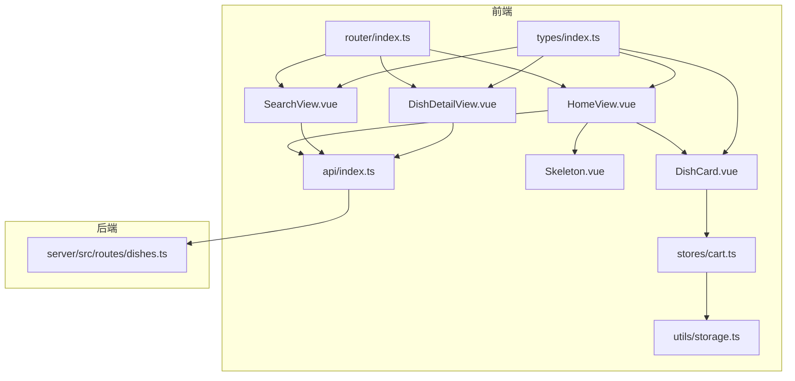
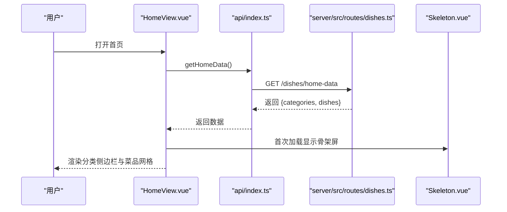
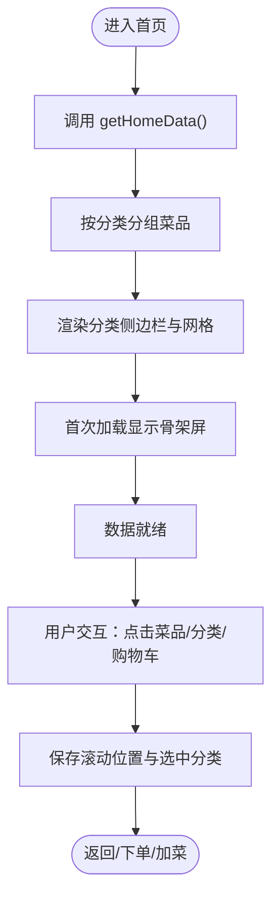
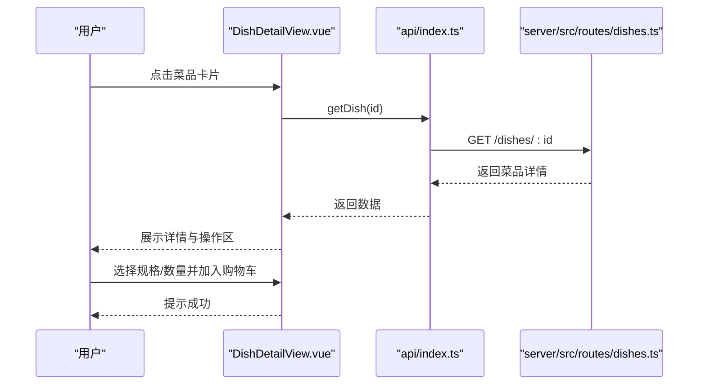
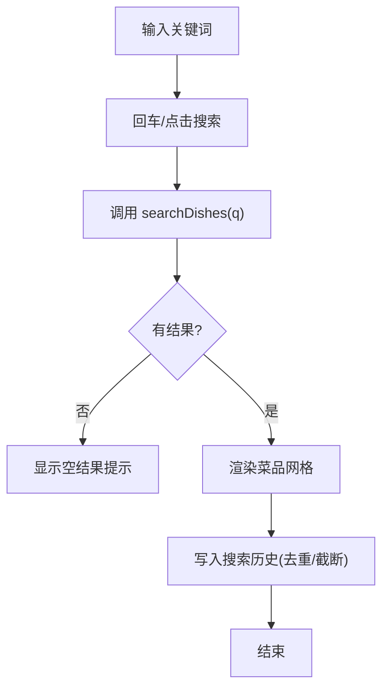
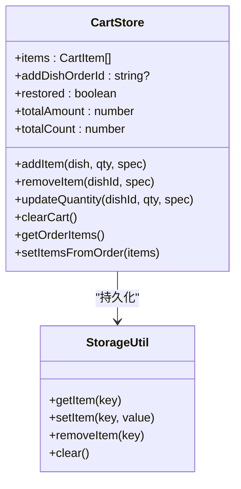
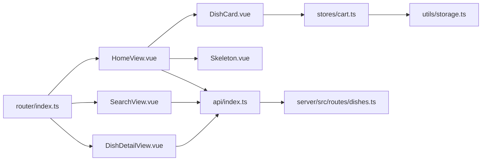

# 菜品浏览与搜索

<cite>
**本文引用的文件列表**
- [HomeView.vue](file://src/client/views/HomeView.vue)
- [SearchView.vue](file://src/client/views/SearchView.vue)
- [DishDetailView.vue](file://src/client/views/DishDetailView.vue)
- [DishCard.vue](file://src/client/components/DishCard.vue)
- [Skeleton.vue](file://src/shared/components/Skeleton.vue)
- [api/index.ts](file://src/api/index.ts)
- [types/index.ts](file://src/types/index.ts)
- [stores/cart.ts](file://src/stores/cart.ts)
- [utils/storage.ts](file://src/utils/storage.ts)
- [router/index.ts](file://src/router/index.ts)
- [server/src/routes/dishes.ts](file://server/src/routes/dishes.ts)
</cite>

## 目录
1. [引言](#引言)
2. [项目结构](#项目结构)
3. [核心组件](#核心组件)
4. [架构总览](#架构总览)
5. [详细组件分析](#详细组件分析)
6. [依赖关系分析](#依赖关系分析)
7. [性能考量](#性能考量)
8. [故障排查指南](#故障排查指南)
9. [结论](#结论)
10. [附录](#附录)

## 引言
本文件面向RLRMS餐厅管理系统中的“菜品浏览与搜索”功能，围绕首页菜品展示、分类导航、菜品网格布局、骨架屏加载、菜品详情查看、搜索功能（含实时搜索、搜索历史）、以及数据流与性能优化策略进行系统性说明。目标是帮助开发者快速理解前端视图层、状态管理、API封装、缓存策略与用户体验设计之间的协作关系，并提供可操作的使用场景与排障建议。

## 项目结构
该功能涉及的前端模块主要位于 src/client 与 src/shared，后端路由位于 server/src/routes。核心文件职责如下：
- 视图层：HomeView.vue（首页）、SearchView.vue（搜索页）、DishDetailView.vue（菜品详情）
- 组件层：DishCard.vue（菜品卡片）、Skeleton.vue（骨架屏）
- 状态与存储：stores/cart.ts（购物车）、utils/storage.ts（IndexedDB持久化）
- API封装：api/index.ts（统一请求与缓存）
- 类型定义：types/index.ts（Dish、Category、Order等）
- 路由：router/index.ts（客户端路由与预加载策略）
- 后端接口：server/src/routes/dishes.ts（菜品聚合、搜索、详情）

图表来源
- [HomeView.vue:1-934](file://src/client/views/HomeView.vue#L1-L934)
- [SearchView.vue:1-359](file://src/client/views/SearchView.vue#L1-L359)
- [DishDetailView.vue:1-428](file://src/client/views/DishDetailView.vue#L1-L428)
- [DishCard.vue:1-372](file://src/client/components/DishCard.vue#L1-L372)
- [Skeleton.vue:1-139](file://src/shared/components/Skeleton.vue#L1-L139)
- [api/index.ts:1-608](file://src/api/index.ts#L1-L608)
- [stores/cart.ts:1-183](file://src/stores/cart.ts#L1-L183)
- [utils/storage.ts:1-109](file://src/utils/storage.ts#L1-L109)
- [router/index.ts:1-317](file://src/router/index.ts#L1-L317)
- [server/src/routes/dishes.ts:1-216](file://server/src/routes/dishes.ts#L1-L216)

章节来源
- [HomeView.vue:1-934](file://src/client/views/HomeView.vue#L1-L934)
- [SearchView.vue:1-359](file://src/client/views/SearchView.vue#L1-L359)
- [DishDetailView.vue:1-428](file://src/client/views/DishDetailView.vue#L1-L428)
- [DishCard.vue:1-372](file://src/client/components/DishCard.vue#L1-L372)
- [Skeleton.vue:1-139](file://src/shared/components/Skeleton.vue#L1-L139)
- [api/index.ts:1-608](file://src/api/index.ts#L1-L608)
- [stores/cart.ts:1-183](file://src/stores/cart.ts#L1-L183)
- [utils/storage.ts:1-109](file://src/utils/storage.ts#L1-L109)
- [router/index.ts:1-317](file://src/router/index.ts#L1-L317)
- [server/src/routes/dishes.ts:1-216](file://server/src/routes/dishes.ts#L1-L216)

## 核心组件
- 首页 HomeView：负责拉取首页数据、分组菜品、渲染分类侧边栏与菜品网格、骨架屏、购物车面板、登录与桌位检测、加菜模式轮询等。
- 搜索页 SearchView：负责输入框、实时搜索、搜索历史、结果展示与点击跳转。
- 菜品详情 DishDetailView：负责菜品详情加载、规格选择、数量控制、加入购物车反馈。
- 菜品卡片 DishCard：负责单个菜品的展示、图片懒加载与占位、规格选择、数量控制、加入购物车。
- 骨架屏 Skeleton：通用占位组件，支持多种变体与动画。
- API封装 api：统一请求、超时与401处理、前端内存缓存（stale-while-revalidate）。
- 购物车 stores/cart：本地持久化（IndexedDB）、计算总价与总数、加菜模式订单ID关联。
- 存储 utils/storage：IndexedDB读写封装。
- 路由 router：客户端路由、导航守卫、关键路由预加载。
- 类型定义 types：Dish、Category、Order 等接口定义。
- 后端 dishes 路由：首页聚合数据、菜品搜索、详情查询、分类列表。

章节来源
- [HomeView.vue:1-934](file://src/client/views/HomeView.vue#L1-L934)
- [SearchView.vue:1-359](file://src/client/views/SearchView.vue#L1-L359)
- [DishDetailView.vue:1-428](file://src/client/views/DishDetailView.vue#L1-L428)
- [DishCard.vue:1-372](file://src/client/components/DishCard.vue#L1-L372)
- [Skeleton.vue:1-139](file://src/shared/components/Skeleton.vue#L1-L139)
- [api/index.ts:1-608](file://src/api/index.ts#L1-L608)
- [stores/cart.ts:1-183](file://src/stores/cart.ts#L1-L183)
- [utils/storage.ts:1-109](file://src/utils/storage.ts#L1-L109)
- [router/index.ts:1-317](file://src/router/index.ts#L1-L317)
- [server/src/routes/dishes.ts:1-216](file://server/src/routes/dishes.ts#L1-L216)

## 架构总览
整体采用“前端视图层 + 状态管理 + API封装 + 后端路由”的分层设计。首页通过合并接口一次性获取分类与菜品，减少网络往返；搜索页通过查询参数实时检索；菜品详情页按ID获取完整信息；购物车状态通过Pinia集中管理并通过IndexedDB持久化。

图表来源
- [HomeView.vue:68-89](file://src/client/views/HomeView.vue#L68-L89)
- [api/index.ts:128-148](file://src/api/index.ts#L128-L148)
- [server/src/routes/dishes.ts:67-117](file://server/src/routes/dishes.ts#L67-L117)
- [Skeleton.vue:1-139](file://src/shared/components/Skeleton.vue#L1-L139)

## 详细组件分析

### 首页菜品展示与交互
- 分类导航：根据可见分类生成侧边栏按钮，点击滚动至对应分区；支持“其他”分类汇总无分类菜品。
- 菜品网格：按分类分组渲染，使用两列网格布局；每个菜品卡片包含图片、名称、价格、标签与数量控件。
- 骨架屏：首次加载时显示骨架屏，提升感知速度与流畅度。
- 购物车面板：底部固定展开，支持清空、增删改数量、一键下单或“修改订单”。
- 用户体验增强：离开页面时保存滚动位置与选中分类；返回时恢复；登录态检测与恢复；活跃订单检测与加菜模式轮询。

图表来源
- [HomeView.vue:33-66](file://src/client/views/HomeView.vue#L33-L66)
- [HomeView.vue:121-134](file://src/client/views/HomeView.vue#L121-L134)
- [HomeView.vue:143-159](file://src/client/views/HomeView.vue#L143-L159)
- [HomeView.vue:280-433](file://src/client/views/HomeView.vue#L280-L433)

章节来源
- [HomeView.vue:1-934](file://src/client/views/HomeView.vue#L1-L934)

### 菜品详情查看
- 数据加载：根据路由参数获取菜品详情，支持描述、标签、规格等字段。
- 规格与数量：若存在规格，弹出规格选择与数量控件；否则直接加入购物车。
- 数量联动：当购物车中已有同款菜品且有规格时，更新数量需先选择规格；清零则批量移除。
- 交互反馈：加入购物车后提示成功；底部固定操作区适配移动端。

图表来源
- [DishDetailView.vue:38-50](file://src/client/views/DishDetailView.vue#L38-L50)
- [api/index.ts:156-158](file://src/api/index.ts#L156-L158)
- [server/src/routes/dishes.ts:176-215](file://server/src/routes/dishes.ts#L176-L215)

章节来源
- [DishDetailView.vue:1-428](file://src/client/views/DishDetailView.vue#L1-L428)

### 搜索功能
- 实时搜索：输入框绑定回车事件触发搜索；搜索结果以网格展示；空结果提示。
- 搜索历史：本地存储最多10条历史记录；支持清空与逐条删除；点击历史项自动填充并执行搜索。
- 结果处理：每次搜索成功后写入历史；失败时全局提示。

图表来源
- [SearchView.vue:54-69](file://src/client/views/SearchView.vue#L54-L69)
- [SearchView.vue:25-37](file://src/client/views/SearchView.vue#L25-L37)
- [api/index.ts:160-162](file://src/api/index.ts#L160-L162)

章节来源
- [SearchView.vue:1-359](file://src/client/views/SearchView.vue#L1-L359)
- [api/index.ts:160-162](file://src/api/index.ts#L160-L162)

### 购物车与加菜模式
- 状态管理：Pinia集中管理购物车，计算总价与总数；支持单项增删改。
- 持久化：通过IndexedDB持久化购物车与加菜订单ID，应用重启后恢复。
- 加菜模式：检测活跃订单，自动同步购物车；轮询订单状态，完成后清空并刷新首页数据。

图表来源
- [stores/cart.ts:9-182](file://src/stores/cart.ts#L9-L182)
- [utils/storage.ts:42-91](file://src/utils/storage.ts#L42-L91)

章节来源
- [stores/cart.ts:1-183](file://src/stores/cart.ts#L1-L183)
- [utils/storage.ts:1-109](file://src/utils/storage.ts#L1-L109)

### 骨架屏加载效果
- 通用组件：支持 text、circle、rect、card 四种变体，可配置宽高与圆角，带闪烁动画。
- 首页骨架：在首页首次加载时显示，模拟菜品网格与标题加载过程，显著改善感知性能。

章节来源
- [Skeleton.vue:1-139](file://src/shared/components/Skeleton.vue#L1-L139)
- [HomeView.vue:310-328](file://src/client/views/HomeView.vue#L310-L328)

## 依赖关系分析
- 组件耦合：HomeView 依赖 DishCard、Skeleton、QuantityControl、ConfirmDialog 等；SearchView 依赖 DishCard、ConfirmDialog；DishDetailView 依赖 QuantityControl、Modal。
- 状态依赖：DishCard 与 DishDetailView 均依赖购物车状态；购物车依赖 IndexedDB 存储。
- API依赖：所有页面通过 api 封装访问后端；api 内置缓存与超时控制。
- 路由依赖：router 控制页面切换与预加载；导航守卫处理登录态校验。

图表来源
- [HomeView.vue:1-934](file://src/client/views/HomeView.vue#L1-L934)
- [SearchView.vue:1-359](file://src/client/views/SearchView.vue#L1-L359)
- [DishDetailView.vue:1-428](file://src/client/views/DishDetailView.vue#L1-L428)
- [DishCard.vue:1-372](file://src/client/components/DishCard.vue#L1-L372)
- [stores/cart.ts:1-183](file://src/stores/cart.ts#L1-L183)
- [utils/storage.ts:1-109](file://src/utils/storage.ts#L1-L109)
- [router/index.ts:1-317](file://src/router/index.ts#L1-L317)
- [api/index.ts:1-608](file://src/api/index.ts#L1-L608)
- [server/src/routes/dishes.ts:1-216](file://server/src/routes/dishes.ts#L1-L216)

章节来源
- [HomeView.vue:1-934](file://src/client/views/HomeView.vue#L1-L934)
- [SearchView.vue:1-359](file://src/client/views/SearchView.vue#L1-L359)
- [DishDetailView.vue:1-428](file://src/client/views/DishDetailView.vue#L1-L428)
- [DishCard.vue:1-372](file://src/client/components/DishCard.vue#L1-L372)
- [stores/cart.ts:1-183](file://src/stores/cart.ts#L1-L183)
- [utils/storage.ts:1-109](file://src/utils/storage.ts#L1-L109)
- [router/index.ts:1-317](file://src/router/index.ts#L1-L317)
- [api/index.ts:1-608](file://src/api/index.ts#L1-L608)
- [server/src/routes/dishes.ts:1-216](file://server/src/routes/dishes.ts#L1-L216)

## 性能考量
- 首页数据合并：通过合并接口一次性返回分类与菜品，减少网络往返与首屏时间。
- 前端缓存：api 封装内置内存缓存（stale-while-revalidate），命中即返回，后台静默刷新，降低重复请求成本。
- 骨架屏：在数据加载期间提供视觉反馈，显著提升感知性能。
- 图片懒加载：菜品卡片对图片使用懒加载与占位，避免阻塞渲染。
- IndexedDB持久化：购物车与加菜订单ID持久化，避免刷新丢失，提升连续性体验。
- 路由预加载：关键路由在空闲时预加载，缩短后续导航延迟。
- 轮询优化：加菜模式订单状态轮询周期为5秒，避免过于频繁的请求。

章节来源
- [api/index.ts:128-148](file://src/api/index.ts#L128-L148)
- [HomeView.vue:68-89](file://src/client/views/HomeView.vue#L68-L89)
- [DishCard.vue:99-109](file://src/client/components/DishCard.vue#L99-L109)
- [stores/cart.ts:113-164](file://src/stores/cart.ts#L113-L164)
- [router/index.ts:23-40](file://src/router/index.ts#L23-L40)

## 故障排查指南
- 首页数据加载失败
  - 现象：toast提示“加载数据失败”，骨架屏长时间不消失。
  - 排查：检查网络请求与后端 /dishes/home-data 接口；确认缓存是否异常；查看控制台错误。
  - 相关代码段
    - [HomeView.vue:68-89](file://src/client/views/HomeView.vue#L68-L89)
    - [api/index.ts:128-148](file://src/api/index.ts#L128-L148)
    - [server/src/routes/dishes.ts:67-117](file://server/src/routes/dishes.ts#L67-L117)

- 搜索失败
  - 现象：搜索无结果或报错提示。
  - 排查：确认查询参数 q 是否为空；检查 /dishes/search/query 接口；查看本地历史是否被清空。
  - 相关代码段
    - [SearchView.vue:54-69](file://src/client/views/SearchView.vue#L54-L69)
    - [api/index.ts:160-162](file://src/api/index.ts#L160-L162)
    - [server/src/routes/dishes.ts:121-157](file://server/src/routes/dishes.ts#L121-L157)

- 购物车持久化异常
  - 现象：刷新后购物车丢失或加菜订单ID未恢复。
  - 排查：检查 IndexedDB 是否可用；确认 storage.ts 的读写逻辑；观察 Pinia store 的 restored 标记。
  - 相关代码段
    - [utils/storage.ts:42-91](file://src/utils/storage.ts#L42-L91)
    - [stores/cart.ts:133-167](file://src/stores/cart.ts#L133-L167)

- 订单轮询问题
  - 现象：加菜模式下订单状态未更新或重复轮询。
  - 排查：确认 addDishOrderId 是否正确设置；检查轮询定时器生命周期；验证 /orders/:id 接口返回。
  - 相关代码段
    - [HomeView.vue:164-184](file://src/client/views/HomeView.vue#L164-L184)
    - [api/index.ts:212-214](file://src/api/index.ts#L212-L214)

## 结论
本功能通过“合并接口 + 前端缓存 + 骨架屏 + 路由预加载 + IndexedDB持久化 + 轮询优化”构建了高效、顺滑的菜品浏览与搜索体验。首页与搜索页分别针对不同场景优化：前者强调首屏性能与连续性，后者强调即时反馈与历史记忆。配合购物车状态管理与加菜模式，系统在复杂交互下仍保持稳定与一致的用户体验。

## 附录
- 使用场景建议
  - 首页：建议在弱网环境下优先使用合并接口，结合骨架屏与缓存策略，保证首屏体验。
  - 搜索：建议限制搜索历史长度与去重策略，避免历史污染；对空查询进行短路处理。
  - 购物车：建议在移动端使用底部固定面板，规格选择与数量控件尽量靠近；对规格商品的加购行为进行明确提示。
  - 加菜模式：建议在订单状态变化时及时清理轮询定时器，避免资源泄漏。