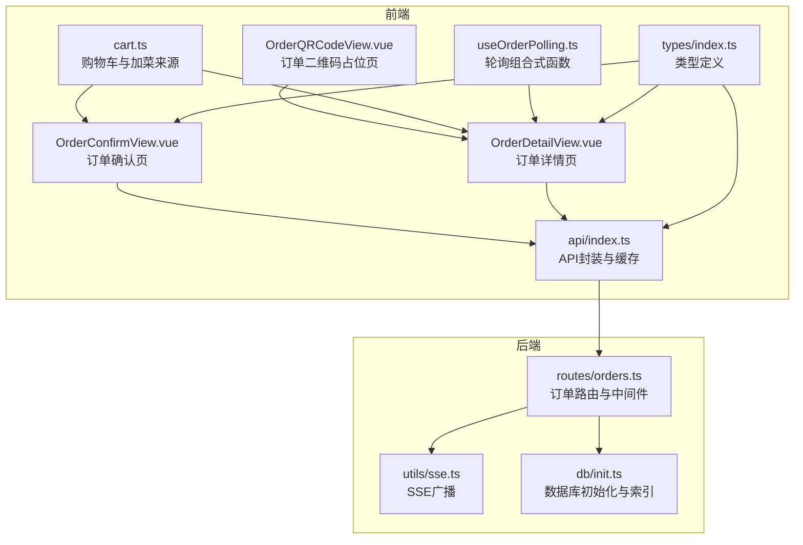
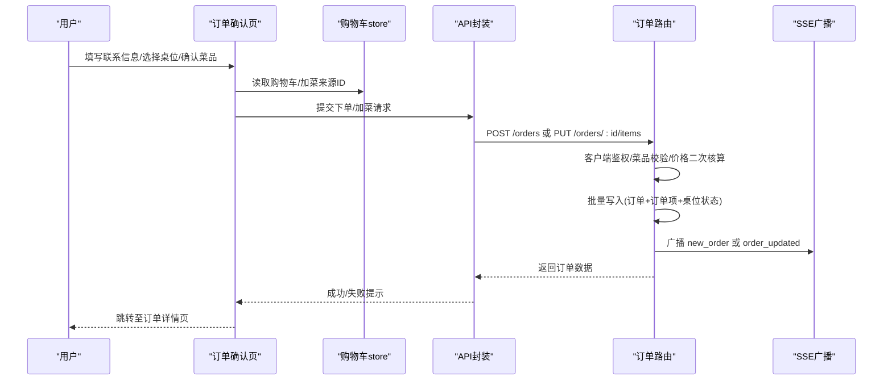
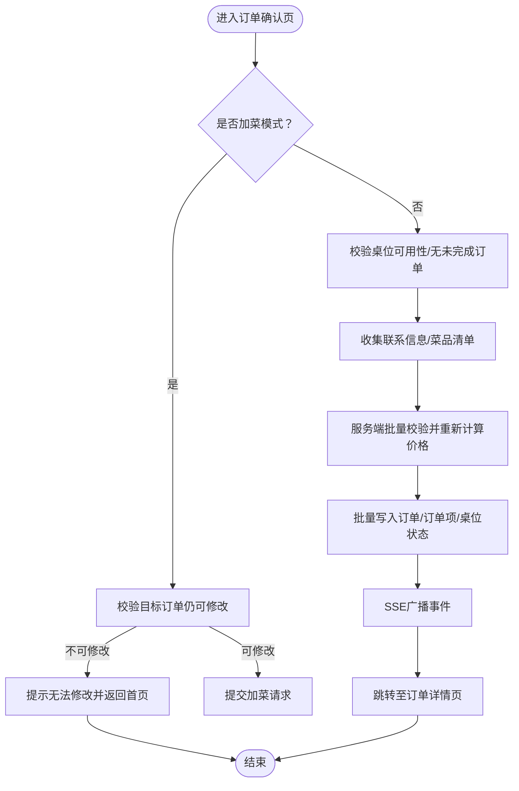
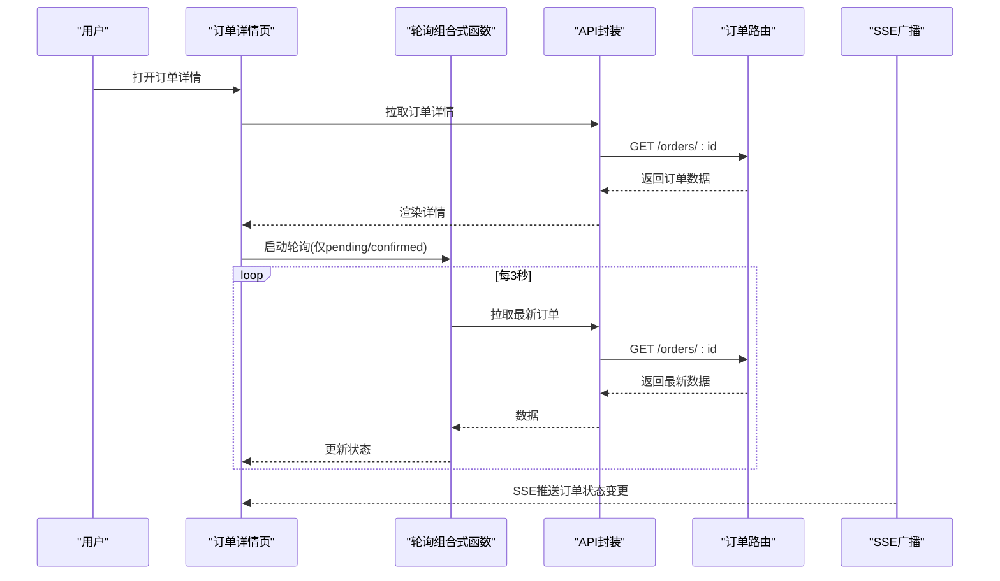
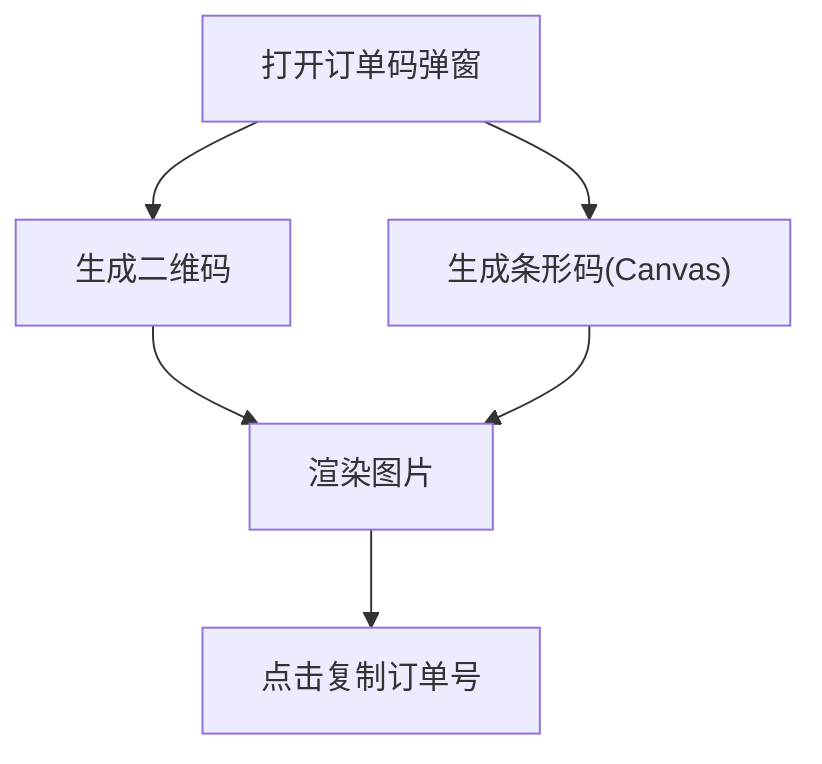
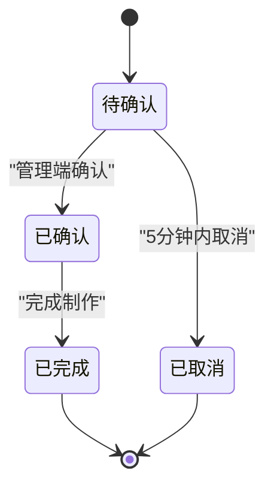
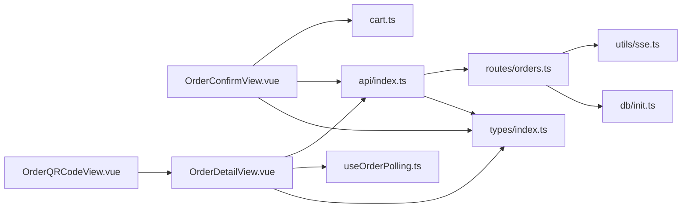
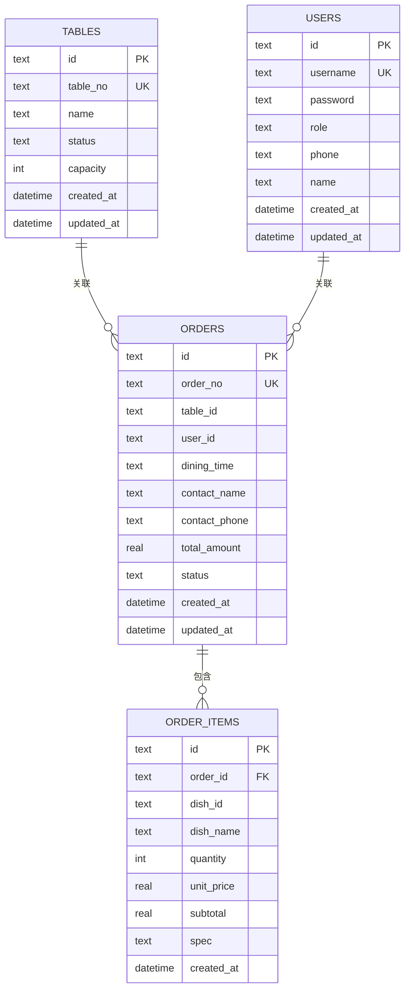

# 订单流程

<cite>
**本文引用的文件**
- [server/src/routes/orders.ts](file://server/src/routes/orders.ts)
- [src/client/views/OrderConfirmView.vue](file://src/client/views/OrderConfirmView.vue)
- [src/client/views/OrderDetailView.vue](file://src/client/views/OrderDetailView.vue)
- [src/client/views/OrderQRCodeView.vue](file://src/client/views/OrderQRCodeView.vue)
- [src/stores/cart.ts](file://src/stores/cart.ts)
- [src/shared/composables/useOrderPolling.ts](file://src/shared/composables/useOrderPolling.ts)
- [server/src/utils/sse.ts](file://server/src/utils/sse.ts)
- [src/types/index.ts](file://src/types/index.ts)
- [src/api/index.ts](file://src/api/index.ts)
- [server/src/db/init.ts](file://server/src/db/init.ts)
</cite>

## 目录
1. [简介](#简介)
2. [项目结构](#项目结构)
3. [核心组件](#核心组件)
4. [架构总览](#架构总览)
5. [详细组件分析](#详细组件分析)
6. [依赖关系分析](#依赖关系分析)
7. [性能考量](#性能考量)
8. [故障排查指南](#故障排查指南)
9. [结论](#结论)
10. [附录](#附录)

## 简介
本文件面向RLRMS餐厅管理系统中的“订单流程”功能，系统性阐述从“订单确认”到“订单详情查看、状态跟踪、二维码验证”的完整闭环。文档覆盖以下要点：
- 订单确认流程：订单信息核对、支付处理、订单提交
- 订单详情查看与状态跟踪：轮询与实时推送、状态颜色与文案映射
- 二维码与条形码：订单号生成、展示与复制
- 订单状态流转机制：pending → confirmed → completed；支持加菜与5分钟内取消
- 安全性与完整性：客户端令牌校验、服务端价格二次核算、批量事务写入
- 用户体验优化：进度提示、自动填充、分页与折叠、离线持久化

## 项目结构
订单流程涉及前后端协作的关键模块如下：
- 前端视图层：订单确认页、订单详情页、订单二维码占位页
- 前端状态层：购物车与加菜来源订单ID的持久化
- 前端工具层：轮询组合式函数、API封装与缓存策略
- 后端路由层：订单相关REST接口与客户端鉴权中间件
- 后端推送层：服务器推送事件（SSE）广播
- 数据模型层：类型定义与数据库初始化脚本

**图表来源**
- [src/client/views/OrderConfirmView.vue:1-991](file://src/client/views/OrderConfirmView.vue#L1-L991)
- [src/client/views/OrderDetailView.vue:1-672](file://src/client/views/OrderDetailView.vue#L1-L672)
- [src/client/views/OrderQRCodeView.vue:1-18](file://src/client/views/OrderQRCodeView.vue#L1-L18)
- [src/stores/cart.ts:1-183](file://src/stores/cart.ts#L1-L183)
- [src/shared/composables/useOrderPolling.ts:1-74](file://src/shared/composables/useOrderPolling.ts#L1-L74)
- [src/api/index.ts:1-608](file://src/api/index.ts#L1-L608)
- [server/src/routes/orders.ts:1-552](file://server/src/routes/orders.ts#L1-L552)
- [server/src/utils/sse.ts:1-59](file://server/src/utils/sse.ts#L1-L59)
- [server/src/db/init.ts:1-204](file://server/src/db/init.ts#L1-L204)
- [src/types/index.ts:1-133](file://src/types/index.ts#L1-L133)

**章节来源**
- [src/client/views/OrderConfirmView.vue:1-991](file://src/client/views/OrderConfirmView.vue#L1-L991)
- [src/client/views/OrderDetailView.vue:1-672](file://src/client/views/OrderDetailView.vue#L1-L672)
- [src/client/views/OrderQRCodeView.vue:1-18](file://src/client/views/OrderQRCodeView.vue#L1-L18)
- [src/stores/cart.ts:1-183](file://src/stores/cart.ts#L1-L183)
- [src/shared/composables/useOrderPolling.ts:1-74](file://src/shared/composables/useOrderPolling.ts#L1-L74)
- [src/api/index.ts:1-608](file://src/api/index.ts#L1-L608)
- [server/src/routes/orders.ts:1-552](file://server/src/routes/orders.ts#L1-L552)
- [server/src/utils/sse.ts:1-59](file://server/src/utils/sse.ts#L1-L59)
- [server/src/db/init.ts:1-204](file://server/src/db/init.ts#L1-L204)
- [src/types/index.ts:1-133](file://src/types/index.ts#L1-L133)

## 核心组件
- 订单确认页（OrderConfirmView.vue）
  - 功能：就餐时段选择、桌位选择与分页、菜品清单与数量控制、联系人信息输入、下单/加菜提交、进度提示
  - 关键点：加菜模式通过购物车中的加菜来源订单ID判断；提交前校验订单是否仍处于可修改状态
- 订单详情页（OrderDetailView.vue）
  - 功能：订单状态展示与颜色映射、菜品列表折叠/展开、联系信息、取消按钮、加菜入口、二维码/条形码弹窗、轮询刷新
  - 关键点：仅pending/confirmed状态允许加菜；5分钟内可取消；轮询间隔3秒，页面隐藏时停止
- 订单二维码页（OrderQRCodeView.vue）
  - 功能：占位跳转至订单详情页，便于扫码直达
- 购物车（cart.ts）
  - 功能：菜品增删改、数量更新、总价与总数计算、加菜来源订单ID持久化、IndexedDB恢复
  - 关键点：显式保存与防抖兜底；加菜来源ID用于区分“正常下单”与“修改订单”
- 轮询组合式函数（useOrderPolling.ts）
  - 功能：通用轮询逻辑，支持可见性切换、自定义间隔、新订单检测回调
- API封装（api/index.ts）
  - 功能：统一请求、超时与信号合并、401处理、JSON响应校验、缓存策略（stale-while-revalidate）
- 订单路由（orders.ts）
  - 功能：客户端鉴权、下单、加菜、取消、验证订单存在性、SSE广播
- SSE工具（utils/sse.ts）
  - 功能：客户端连接管理、事件广播、在线客户端计数
- 类型定义（types/index.ts）
  - 功能：Order/OrderItem/Dish/Table/User等类型声明
- 数据库初始化（db/init.ts）
  - 功能：orders/order_items表结构与索引、默认设置与迁移

**章节来源**
- [src/client/views/OrderConfirmView.vue:1-991](file://src/client/views/OrderConfirmView.vue#L1-L991)
- [src/client/views/OrderDetailView.vue:1-672](file://src/client/views/OrderDetailView.vue#L1-L672)
- [src/client/views/OrderQRCodeView.vue:1-18](file://src/client/views/OrderQRCodeView.vue#L1-L18)
- [src/stores/cart.ts:1-183](file://src/stores/cart.ts#L1-L183)
- [src/shared/composables/useOrderPolling.ts:1-74](file://src/shared/composables/useOrderPolling.ts#L1-L74)
- [src/api/index.ts:1-608](file://src/api/index.ts#L1-L608)
- [server/src/routes/orders.ts:1-552](file://server/src/routes/orders.ts#L1-L552)
- [server/src/utils/sse.ts:1-59](file://server/src/utils/sse.ts#L1-L59)
- [src/types/index.ts:1-133](file://src/types/index.ts#L1-L133)
- [server/src/db/init.ts:1-204](file://server/src/db/init.ts#L1-L204)

## 架构总览
订单流程采用“前端视图 + 状态 + API封装 + 后端路由 + SSE推送”的分层设计，确保状态一致性与实时性。

**图表来源**
- [src/client/views/OrderConfirmView.vue:177-241](file://src/client/views/OrderConfirmView.vue#L177-L241)
- [src/stores/cart.ts:77-87](file://src/stores/cart.ts#L77-L87)
- [src/api/index.ts:186-243](file://src/api/index.ts#L186-L243)
- [server/src/routes/orders.ts:193-353](file://server/src/routes/orders.ts#L193-L353)
- [server/src/utils/sse.ts:37-51](file://server/src/utils/sse.ts#L37-L51)

## 详细组件分析

### 订单确认流程（下单/加菜）
- 输入校验与安全
  - 客户端鉴权中间件要求携带client_token Cookie并验证用户存在
  - 服务端批量校验菜品存在性与售卖状态，使用数据库价格重新计算，防止篡改
- 下单流程
  - 若提供桌位：检查桌位状态与是否存在未完成订单
  - 生成唯一订单号与UUID，批量写入订单、订单项与桌位状态
  - 写入完成后通过SSE广播new_order事件
- 加菜流程
  - 仅pending/confirmed状态允许加菜
  - 先删除旧项，再插入新项，最后更新总金额并重置状态为pending
  - 广播order_updated事件，type为add_items

**图表来源**
- [server/src/routes/orders.ts:193-353](file://server/src/routes/orders.ts#L193-L353)
- [server/src/routes/orders.ts:420-552](file://server/src/routes/orders.ts#L420-L552)
- [src/client/views/OrderConfirmView.vue:177-241](file://src/client/views/OrderConfirmView.vue#L177-L241)
- [src/stores/cart.ts:77-87](file://src/stores/cart.ts#L77-L87)

**章节来源**
- [server/src/routes/orders.ts:193-353](file://server/src/routes/orders.ts#L193-L353)
- [server/src/routes/orders.ts:420-552](file://server/src/routes/orders.ts#L420-L552)
- [src/client/views/OrderConfirmView.vue:177-241](file://src/client/views/OrderConfirmView.vue#L177-L241)
- [src/stores/cart.ts:77-87](file://src/stores/cart.ts#L77-L87)

### 订单详情查看与状态跟踪
- 状态展示
  - pending：等待商家确认
  - confirmed：已确认
  - completed：已完成
  - cancelled：已取消
  - 颜色与文案映射由计算属性提供
- 轮询刷新
  - 仅当状态为pending/confirmed时启动轮询，间隔3秒
  - 页面隐藏时停止轮询，显示时恢复
  - 若状态变为非活跃则停止轮询
- 取消与加菜
  - 仅pending且下单时间在5分钟内可取消
  - 仅pending/confirmed可加菜
- 二维码/条形码
  - 弹窗生成二维码与条形码，支持点击复制订单号

**图表来源**
- [src/client/views/OrderDetailView.vue:77-140](file://src/client/views/OrderDetailView.vue#L77-L140)
- [src/shared/composables/useOrderPolling.ts:19-47](file://src/shared/composables/useOrderPolling.ts#L19-L47)
- [src/api/index.ts:212-214](file://src/api/index.ts#L212-L214)
- [server/src/utils/sse.ts:37-51](file://server/src/utils/sse.ts#L37-L51)

**章节来源**
- [src/client/views/OrderDetailView.vue:50-75](file://src/client/views/OrderDetailView.vue#L50-L75)
- [src/client/views/OrderDetailView.vue:97-140](file://src/client/views/OrderDetailView.vue#L97-L140)
- [src/client/views/OrderDetailView.vue:151-171](file://src/client/views/OrderDetailView.vue#L151-L171)
- [src/shared/composables/useOrderPolling.ts:1-74](file://src/shared/composables/useOrderPolling.ts#L1-L74)
- [src/api/index.ts:212-214](file://src/api/index.ts#L212-L214)
- [server/src/utils/sse.ts:1-59](file://server/src/utils/sse.ts#L1-L59)

### 二维码验证与订单码展示
- 订单二维码/条形码生成
  - 在弹窗打开时生成二维码与条形码，使用Canvas绘制条形码
- 订单号复制
  - 点击订单号区域复制到剪贴板
- 二维码占位页
  - 占位路由直接重定向到订单详情页，便于扫码直达

**图表来源**
- [src/client/views/OrderDetailView.vue:196-226](file://src/client/views/OrderDetailView.vue#L196-L226)
- [src/client/views/OrderQRCodeView.vue:9-12](file://src/client/views/OrderQRCodeView.vue#L9-L12)

**章节来源**
- [src/client/views/OrderDetailView.vue:196-226](file://src/client/views/OrderDetailView.vue#L196-L226)
- [src/client/views/OrderQRCodeView.vue:1-18](file://src/client/views/OrderQRCodeView.vue#L1-L18)

### 订单状态流转机制
- 初始状态：pending（等待确认）
- 确认：管理端将状态更新为confirmed
- 完成：管理端将状态更新为completed
- 取消：5分钟内且状态为pending可取消，同时释放桌位（如适用）

**图表来源**
- [server/src/routes/orders.ts:355-418](file://server/src/routes/orders.ts#L355-L418)
- [src/types/index.ts:92-97](file://src/types/index.ts#L92-L97)

**章节来源**
- [server/src/routes/orders.ts:355-418](file://server/src/routes/orders.ts#L355-L418)
- [src/types/index.ts:92-97](file://src/types/index.ts#L92-L97)

### 实时更新与用户通知
- SSE广播
  - 新订单创建与订单更新均通过SSE广播事件，前端监听并即时更新
- 前端监听
  - 订单详情页在活跃状态下轮询，同时接收SSE事件，确保状态同步
- 401处理
  - API封装统一处理401，触发全局会话过期事件，引导重新登录

**章节来源**
- [server/src/utils/sse.ts:37-51](file://server/src/utils/sse.ts#L37-L51)
- [src/client/views/OrderDetailView.vue:97-140](file://src/client/views/OrderDetailView.vue#L97-L140)
- [src/api/index.ts:94-114](file://src/api/index.ts#L94-L114)

## 依赖关系分析
- 前端依赖
  - 视图层依赖状态层（Pinia）、API封装、类型定义
  - 订单详情页依赖轮询组合式函数与二维码库
- 后端依赖
  - 订单路由依赖数据库访问、SSE工具、JWT与Zod校验器
  - 数据库初始化脚本定义表结构与索引，支撑订单状态与查询性能

**图表来源**
- [src/client/views/OrderConfirmView.vue:1-991](file://src/client/views/OrderConfirmView.vue#L1-L991)
- [src/client/views/OrderDetailView.vue:1-672](file://src/client/views/OrderDetailView.vue#L1-L672)
- [src/client/views/OrderQRCodeView.vue:1-18](file://src/client/views/OrderQRCodeView.vue#L1-L18)
- [src/stores/cart.ts:1-183](file://src/stores/cart.ts#L1-L183)
- [src/shared/composables/useOrderPolling.ts:1-74](file://src/shared/composables/useOrderPolling.ts#L1-L74)
- [src/api/index.ts:1-608](file://src/api/index.ts#L1-L608)
- [server/src/routes/orders.ts:1-552](file://server/src/routes/orders.ts#L1-L552)
- [server/src/utils/sse.ts:1-59](file://server/src/utils/sse.ts#L1-L59)
- [server/src/db/init.ts:1-204](file://server/src/db/init.ts#L1-L204)
- [src/types/index.ts:1-133](file://src/types/index.ts#L1-L133)

**章节来源**
- [src/client/views/OrderConfirmView.vue:1-991](file://src/client/views/OrderConfirmView.vue#L1-L991)
- [src/client/views/OrderDetailView.vue:1-672](file://src/client/views/OrderDetailView.vue#L1-L672)
- [src/client/views/OrderQRCodeView.vue:1-18](file://src/client/views/OrderQRCodeView.vue#L1-L18)
- [src/stores/cart.ts:1-183](file://src/stores/cart.ts#L1-L183)
- [src/shared/composables/useOrderPolling.ts:1-74](file://src/shared/composables/useOrderPolling.ts#L1-L74)
- [src/api/index.ts:1-608](file://src/api/index.ts#L1-L608)
- [server/src/routes/orders.ts:1-552](file://server/src/routes/orders.ts#L1-L552)
- [server/src/utils/sse.ts:1-59](file://server/src/utils/sse.ts#L1-L59)
- [server/src/db/init.ts:1-204](file://server/src/db/init.ts#L1-L204)
- [src/types/index.ts:1-133](file://src/types/index.ts#L1-L133)

## 性能考量
- 批量查询与N+1避免
  - 订单列表一次性拉取所有订单项并按订单ID分组，避免多次查询
- 批量写入
  - 下单/加菜使用beginBatch/endBatch包裹，减少磁盘写入次数
- 索引优化
  - 订单表常用字段建立索引，提升查询性能
- 前端缓存
  - API层采用stale-while-revalidate策略，降低网络压力
- 轮询节流
  - 页面隐藏时停止轮询，减少资源消耗

**章节来源**
- [server/src/routes/orders.ts:96-130](file://server/src/routes/orders.ts#L96-L130)
- [server/src/db/init.ts:124-137](file://server/src/db/init.ts#L124-L137)
- [src/api/index.ts:17-34](file://src/api/index.ts#L17-L34)
- [src/client/views/OrderDetailView.vue:130-140](file://src/client/views/OrderDetailView.vue#L130-L140)

## 故障排查指南
- 401会话过期
  - API封装检测到401时触发全局事件，建议引导用户重新登录
- 订单不存在/被移除
  - 订单详情页在轮询或首次加载时若返回404，显示“订单不存在”，并提供返回首页
- 取消失败
  - 仅pending且5分钟内可取消；若手机号不匹配或状态不符，返回明确错误
- 加菜失败
  - 仅pending/confirmed可加菜；菜品必须在售且存在；服务端重新核算价格
- SSE连接异常
  - 广播时遍历客户端副本，异常时移除断连客户端，保持广播稳定性

**章节来源**
- [src/api/index.ts:94-114](file://src/api/index.ts#L94-L114)
- [src/client/views/OrderDetailView.vue:84-95](file://src/client/views/OrderDetailView.vue#L84-L95)
- [server/src/routes/orders.ts:355-418](file://server/src/routes/orders.ts#L355-L418)
- [server/src/routes/orders.ts:420-552](file://server/src/routes/orders.ts#L420-L552)
- [server/src/utils/sse.ts:37-51](file://server/src/utils/sse.ts#L37-L51)

## 结论
RLRMS的订单流程通过“前端确认 + 后端鉴权与校验 + 批量事务 + SSE实时推送”的组合，实现了高可靠性与良好用户体验。下单与加菜均进行服务端价格二次核算与状态约束，确保数据一致性；前端通过轮询与SSE双重保障状态实时更新；二维码与条形码增强扫码核销体验。建议在生产环境持续关注索引维护、SSE连接健康度与前端缓存策略的平衡。

## 附录
- 数据模型概览（订单与订单项）

**图表来源**
- [server/src/db/init.ts:64-95](file://server/src/db/init.ts#L64-L95)
- [src/types/index.ts:82-97](file://src/types/index.ts#L82-L97)