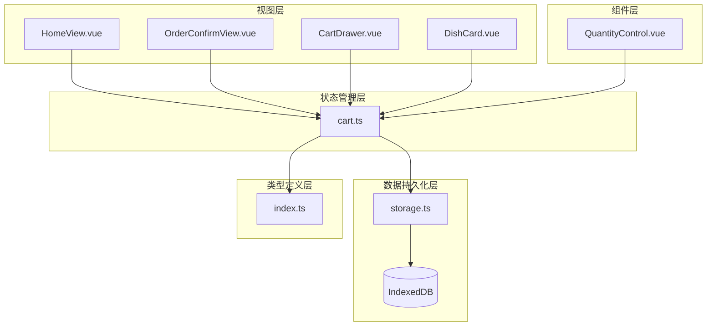
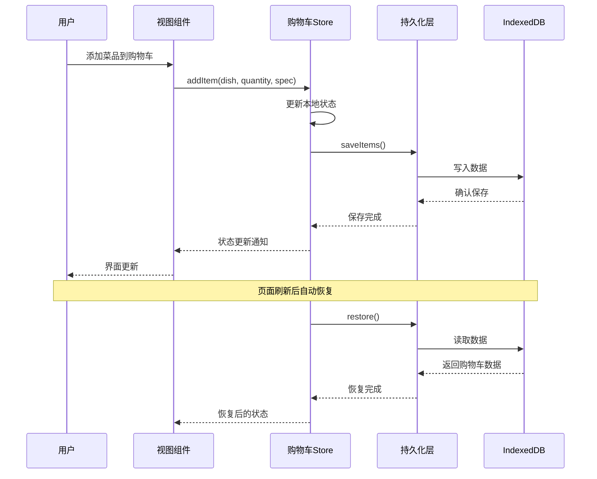
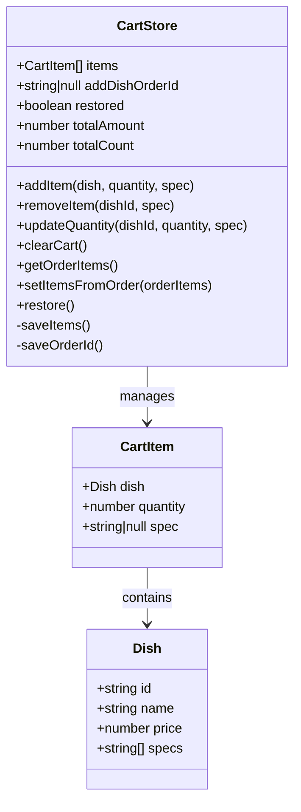
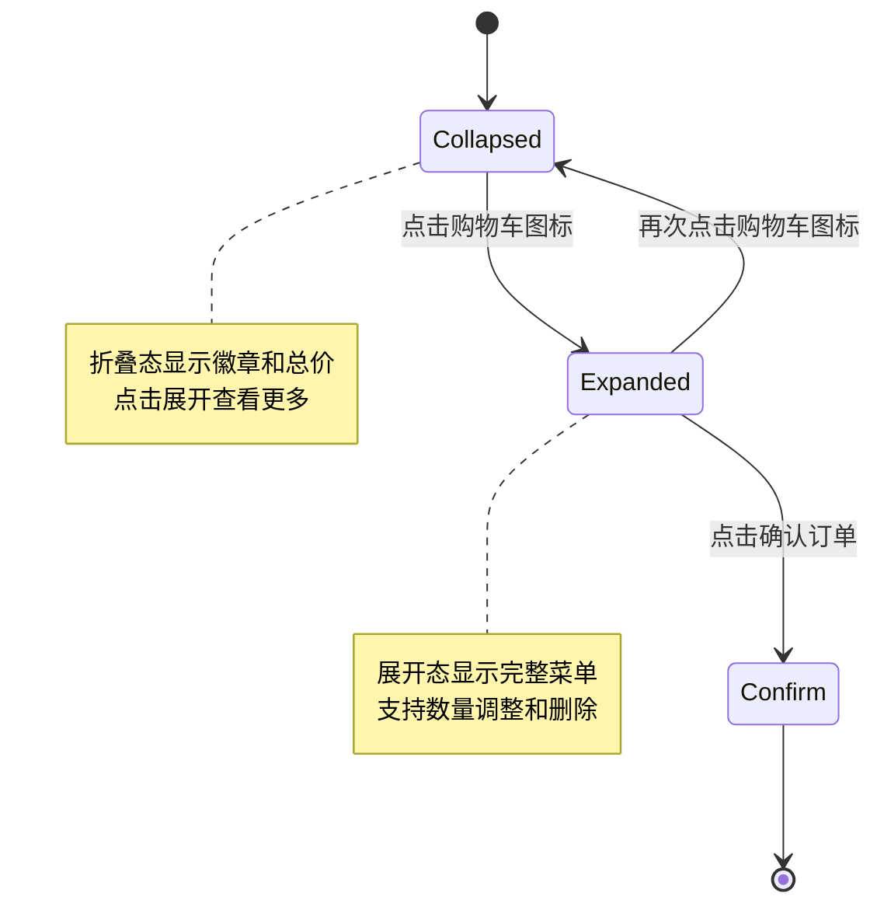
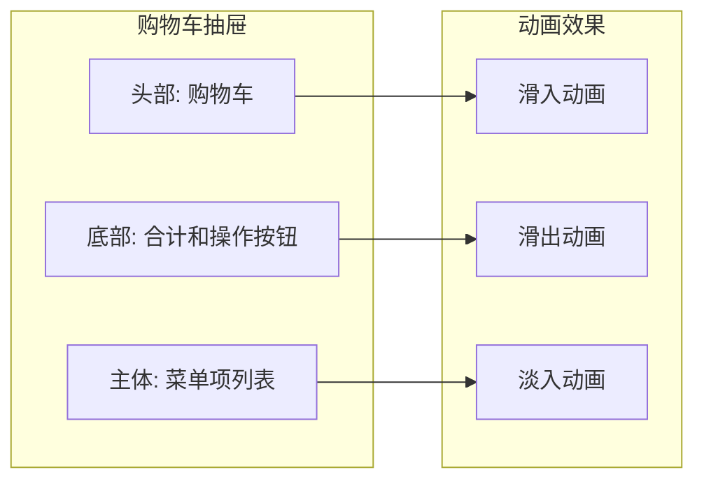
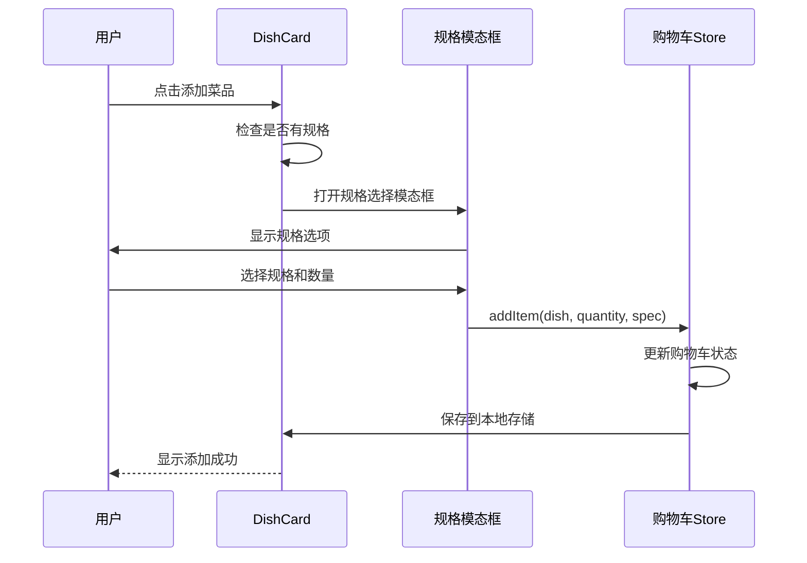
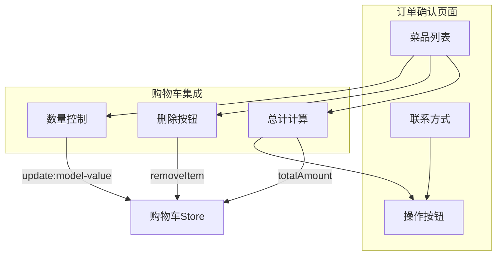
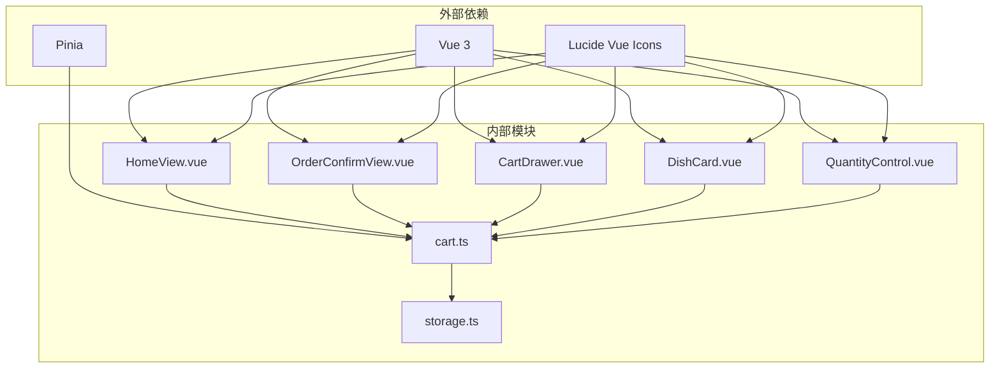
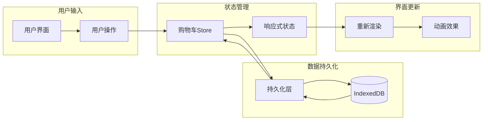

# 购物车管理

<cite>
**本文档引用的文件**
- [cart.ts](file://src/stores/cart.ts)
- [storage.ts](file://src/utils/storage.ts)
- [HomeView.vue](file://src/client/views/HomeView.vue)
- [CartDrawer.vue](file://src/client/components/CartDrawer.vue)
- [DishCard.vue](file://src/client/components/DishCard.vue)
- [QuantityControl.vue](file://src/shared/components/QuantityControl.vue)
- [OrderConfirmView.vue](file://src/client/views/OrderConfirmView.vue)
- [index.ts](file://src/types/index.ts)
</cite>

## 目录
1. [简介](#简介)
2. [项目结构](#项目结构)
3. [核心组件](#核心组件)
4. [架构概览](#架构概览)
5. [详细组件分析](#详细组件分析)
6. [依赖关系分析](#依赖关系分析)
7. [性能考虑](#性能考虑)
8. [故障排除指南](#故障排除指南)
9. [结论](#结论)

## 简介

RLRMS餐厅管理系统的购物车管理功能是一个完整的前端状态管理系统，负责处理菜品的添加、数量修改、规格选择、删除等操作。该系统采用Pinia状态管理库，结合IndexedDB进行本地持久化存储，提供了流畅的用户体验和可靠的数据一致性保障。

系统的核心特性包括：
- 实时状态管理：通过Vue响应式系统实现购物车状态的实时更新
- 持久化存储：使用IndexedDB确保购物车数据在页面刷新后不丢失
- 动画效果：提供丰富的过渡动画和交互反馈
- 规格支持：支持带规格的菜品（如不同口味、份量等）
- 订单集成：与订单系统无缝集成，支持加菜模式

## 项目结构

购物车功能涉及多个层次的组件和模块，形成了清晰的分层架构：



**图表来源**
- [cart.ts:1-183](file://src/stores/cart.ts#L1-L183)
- [HomeView.vue:1-934](file://src/client/views/HomeView.vue#L1-L934)
- [OrderConfirmView.vue:1-991](file://src/client/views/OrderConfirmView.vue#L1-L991)

**章节来源**
- [cart.ts:1-183](file://src/stores/cart.ts#L1-L183)
- [HomeView.vue:1-934](file://src/client/views/HomeView.vue#L1-L934)

## 核心组件

### Pinia购物车Store

购物车的核心是基于Pinia的状态管理器，提供了完整的CRUD操作和数据持久化功能。

#### 关键功能
- **状态管理**：维护购物车项目列表、总金额、总数量等状态
- **数据持久化**：自动保存和恢复购物车数据
- **规格支持**：处理带规格的菜品组合
- **订单集成**：支持从现有订单恢复购物车状态

#### 数据结构
```typescript
interface CartItem {
  dish: Dish
  quantity: number
  spec: string | null
}

interface Dish {
  id: string
  name: string
  price: number
  specs: string[]
  // ... 其他字段
}
```

**章节来源**
- [cart.ts:9-183](file://src/stores/cart.ts#L9-L183)
- [index.ts:110-115](file://src/types/index.ts#L110-L115)

### 数量控制组件

QuantityControl组件提供了直观的数量调整界面，包含动画效果和交互反馈。

#### 特性
- **数字弹跳动画**：数量变化时的视觉反馈
- **波纹点击效果**：按钮点击的水波纹动画
- **范围限制**：最小值和最大值的限制
- **尺寸适配**：支持不同的尺寸规格

**章节来源**
- [QuantityControl.vue:1-212](file://src/shared/components/QuantityControl.vue#L1-L212)

## 架构概览

购物车系统的整体架构采用了分层设计，确保了良好的可维护性和扩展性：



**图表来源**
- [cart.ts:113-150](file://src/stores/cart.ts#L113-L150)
- [storage.ts:42-91](file://src/utils/storage.ts#L42-L91)

## 详细组件分析

### 购物车Store实现

#### 状态管理机制

购物车Store使用Vue的响应式系统来管理状态，提供了以下核心功能：



**图表来源**
- [cart.ts:9-183](file://src/stores/cart.ts#L9-L183)
- [index.ts:110-115](file://src/types/index.ts#L110-L115)

#### 数据持久化策略

系统采用了双重持久化策略确保数据安全：

1. **即时保存**：每次状态变更时立即保存到IndexedDB
2. **防抖兜底**：使用100ms防抖确保批量操作的性能
3. **懒加载初始化**：数据库连接采用懒加载模式

#### 状态同步机制

```mermaid
flowchart TD
Start([状态变更]) --> CheckRestored{"store.restored?"}
CheckRestored --> |否| Skip[跳过保存]
CheckRestored --> |是| Debounce[启动100ms防抖]
Debounce --> Save[saveItems()]
Save --> Serialize[序列化数据]
Serialize --> Write[写入IndexedDB]
Write --> Complete[保存完成]
Skip --> End([结束])
Complete --> End
```

**图表来源**
- [cart.ts:152-158](file://src/stores/cart.ts#L152-L158)

**章节来源**
- [cart.ts:113-158](file://src/stores/cart.ts#L113-L158)

### 视图组件实现

#### 主页购物车栏

主页的购物车栏提供了折叠展开的交互体验：



**图表来源**
- [HomeView.vue:350-406](file://src/client/views/HomeView.vue#L350-L406)

#### 购物车抽屉

独立的购物车抽屉提供了更完整的购物车管理界面：



**图表来源**
- [CartDrawer.vue:24-79](file://src/client/components/CartDrawer.vue#L24-L79)

**章节来源**
- [HomeView.vue:350-406](file://src/client/views/HomeView.vue#L350-L406)
- [CartDrawer.vue:24-79](file://src/client/components/CartDrawer.vue#L24-L79)

### 规格选择功能

对于带规格的菜品，系统提供了完整的规格选择流程：



**图表来源**
- [DishCard.vue:49-84](file://src/client/components/DishCard.vue#L49-L84)

**章节来源**
- [DishCard.vue:49-84](file://src/client/components/DishCard.vue#L49-L84)

### 订单确认流程

在订单确认页面，购物车功能与订单系统深度集成：



**图表来源**
- [OrderConfirmView.vue:324-371](file://src/client/views/OrderConfirmView.vue#L324-L371)

**章节来源**
- [OrderConfirmView.vue:324-371](file://src/client/views/OrderConfirmView.vue#L324-L371)

## 依赖关系分析

购物车系统的依赖关系清晰明确，遵循了单一职责原则：



**图表来源**
- [cart.ts:1-5](file://src/stores/cart.ts#L1-L5)
- [HomeView.vue:1-15](file://src/client/views/HomeView.vue#L1-L15)

**章节来源**
- [cart.ts:1-5](file://src/stores/cart.ts#L1-L5)

### 数据流分析

购物车系统中的数据流向体现了单向数据流的设计原则：



**图表来源**
- [cart.ts:152-158](file://src/stores/cart.ts#L152-L158)

**章节来源**
- [cart.ts:152-158](file://src/stores/cart.ts#L152-L158)

## 性能考虑

### 优化策略

购物车系统采用了多种性能优化策略：

#### 1. 防抖机制
- 使用100ms防抖减少频繁的数据库写入操作
- 批量操作时避免重复保存

#### 2. 懒加载初始化
- IndexedDB连接采用懒加载模式
- 避免不必要的初始化开销

#### 3. 响应式优化
- 使用computed属性避免重复计算
- 精确的状态更新减少不必要的重渲染

#### 4. 动画性能
- CSS动画优于JavaScript动画
- 使用transform和opacity属性确保硬件加速

### 最佳实践建议

#### 状态管理
- 避免在购物车Store中存储大型对象
- 使用扁平化数据结构
- 定期清理无效状态

#### 性能监控
- 监控购物车操作的响应时间
- 分析数据库读写性能
- 优化大量数据场景下的渲染

#### 用户体验
- 提供加载状态指示
- 实现快速的用户反馈
- 保持界面响应性

## 故障排除指南

### 常见问题及解决方案

#### 1. 购物车数据丢失
**症状**：页面刷新后购物车内容消失
**原因**：IndexedDB不可用或存储权限问题
**解决方案**：
- 检查浏览器兼容性
- 确认IndexedDB权限设置
- 实现降级策略（localStorage备用）

#### 2. 状态不同步
**症状**：界面显示与实际状态不符
**原因**：异步操作竞态条件
**解决方案**：
- 使用store.restored标志确保初始化完成
- 实现适当的等待机制
- 检查watcher的触发时机

#### 3. 动画卡顿
**症状**：购物车动画执行不流畅
**原因**：过度的DOM操作或复杂动画
**解决方案**：
- 减少动画层级
- 使用CSS硬件加速属性
- 优化动画持续时间和缓动函数

#### 4. 规格选择异常
**症状**：带规格菜品添加失败
**原因**：规格参数传递错误
**解决方案**：
- 验证规格参数格式
- 实现规格有效性检查
- 提供清晰的错误提示

**章节来源**
- [cart.ts:133-150](file://src/stores/cart.ts#L133-L150)
- [storage.ts:11-40](file://src/utils/storage.ts#L11-L40)

### 调试技巧

#### 开发者工具使用
- 使用Vue DevTools监控状态变化
- 检查Pinia Store的Action调用
- 监控IndexedDB的读写操作

#### 日志记录
- 记录关键操作的时间戳
- 跟踪状态变更的触发源
- 监控性能指标

#### 测试策略
- 单元测试覆盖核心业务逻辑
- 集成测试验证端到端流程
- 性能测试评估系统负载能力

## 结论

RLRMS餐厅管理系统的购物车管理功能展现了现代前端开发的最佳实践。通过合理的架构设计、完善的持久化策略和优秀的用户体验设计，系统实现了功能完整性与性能优化的平衡。

### 核心优势

1. **可靠性**：基于Pinia的状态管理和IndexedDB持久化确保了数据的安全性和一致性
2. **性能**：防抖机制、懒加载和硬件加速动画提供了流畅的用户体验
3. **可扩展性**：清晰的模块划分和接口设计便于功能扩展和维护
4. **用户体验**：丰富的动画效果和直观的操作界面提升了用户满意度

### 发展方向

未来可以考虑的功能增强：
- 支持购物车分享和同步
- 实现购物车模板功能
- 增强离线模式支持
- 优化移动端交互体验

该购物车系统为餐厅管理系统的用户交互提供了坚实的基础，为后续的功能扩展奠定了良好的技术基础。