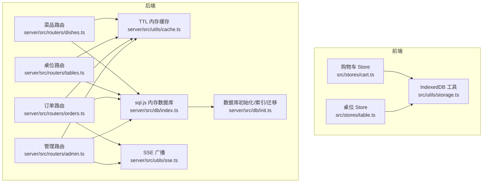
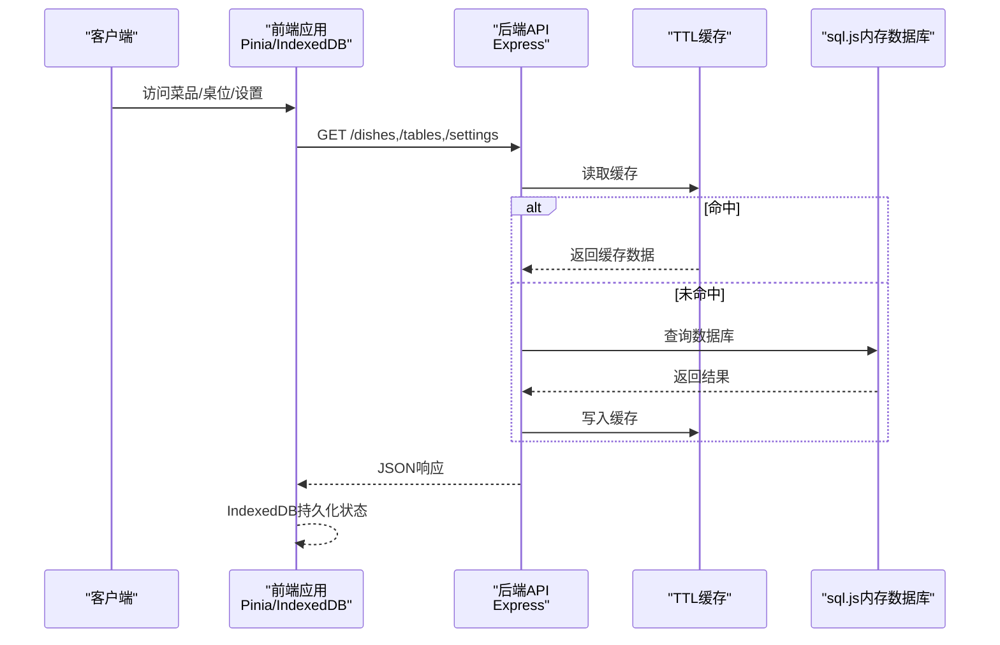
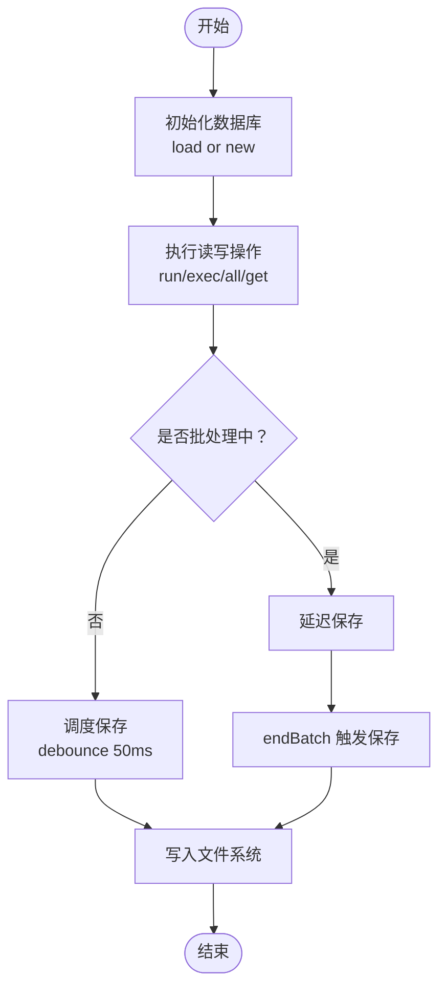
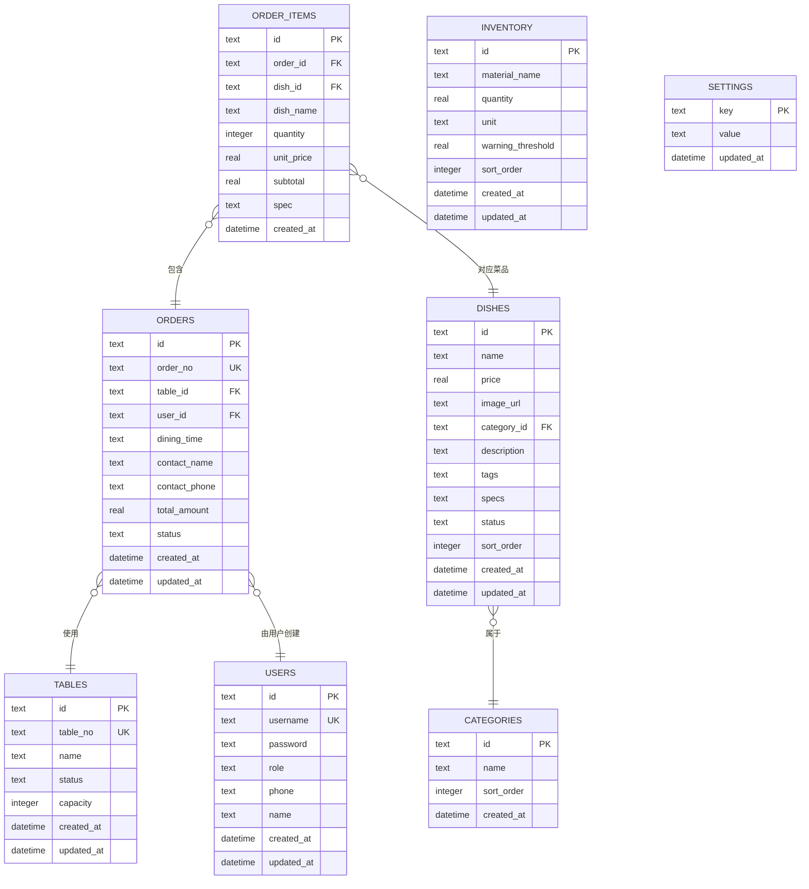
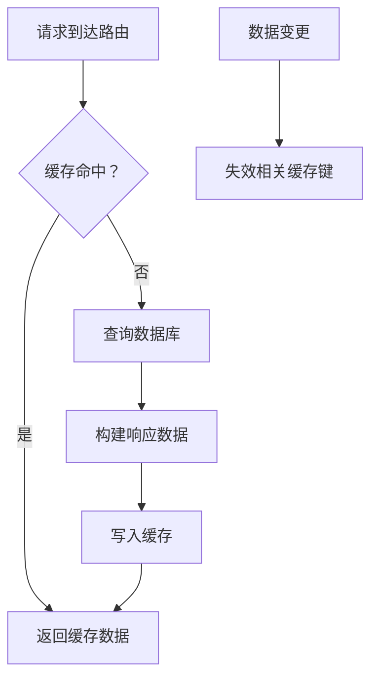
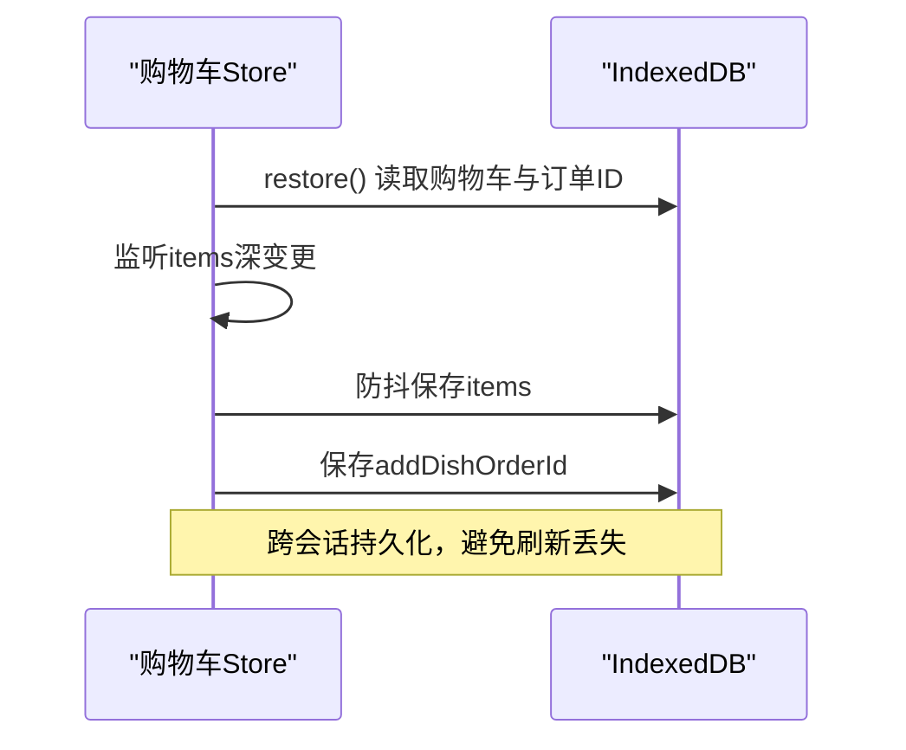
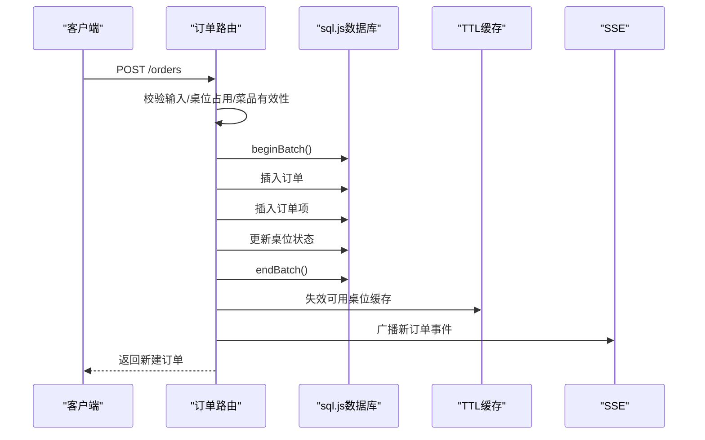
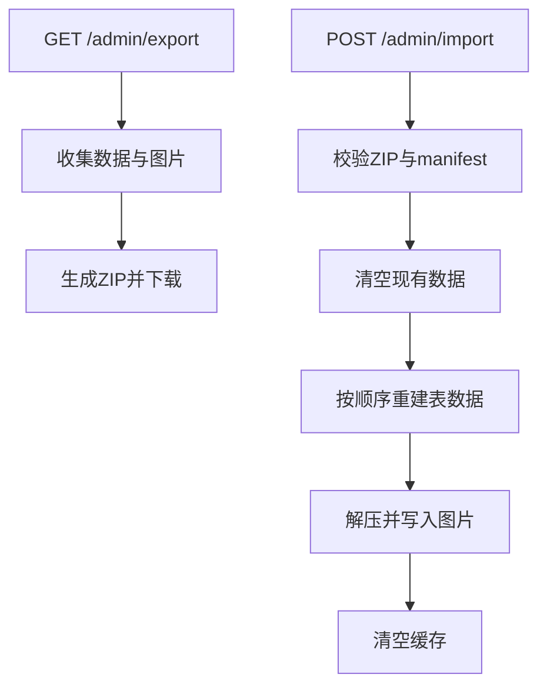
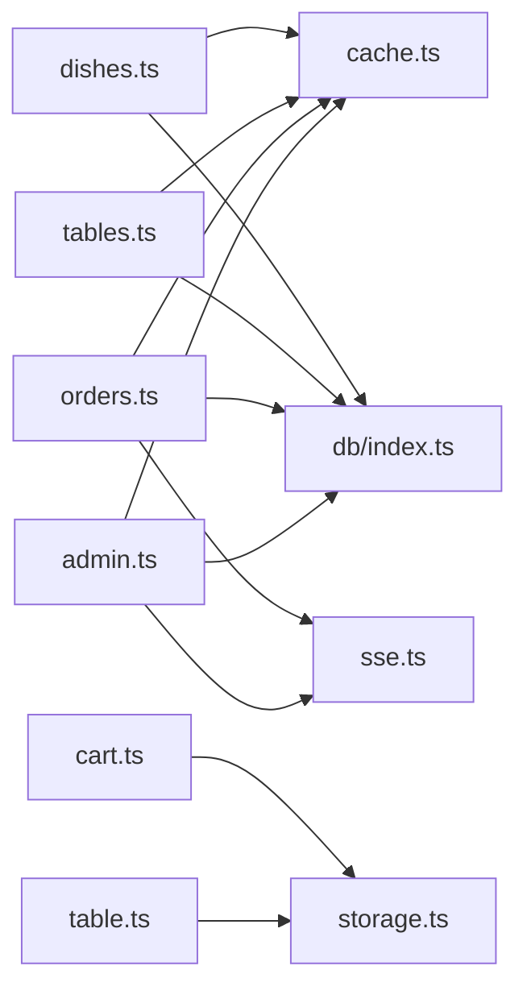

# 数据管理功能

<cite>
**本文引用的文件**
- [server/src/db/index.ts](file://server/src/db/index.ts)
- [server/src/db/init.ts](file://server/src/db/init.ts)
- [server/src/utils/cache.ts](file://server/src/utils/cache.ts)
- [server/src/routers/dishes.ts](file://server/src/routers/dishes.ts)
- [server/src/routers/tables.ts](file://server/src/routers/tables.ts)
- [server/src/routers/orders.ts](file://server/src/routers/orders.ts)
- [server/src/routers/admin.ts](file://server/src/routers/admin.ts)
- [server/src/utils/sse.ts](file://server/src/utils/sse.ts)
- [server/src/utils/format.ts](file://server/src/utils/format.ts)
- [server/src/validators/index.ts](file://server/src/validators/index.ts)
- [src/utils/storage.ts](file://src/utils/storage.ts)
- [src/stores/cart.ts](file://src/stores/cart.ts)
- [src/stores/table.ts](file://src/stores/table.ts)
</cite>

## 目录
1. [简介](#简介)
2. [项目结构](#项目结构)
3. [核心组件](#核心组件)
4. [架构总览](#架构总览)
5. [详细组件分析](#详细组件分析)
6. [依赖分析](#依赖分析)
7. [性能考虑](#性能考虑)
8. [故障排查指南](#故障排查指南)
9. [结论](#结论)
10. [附录](#附录)

## 简介
本文件面向RLRMS餐厅管理系统，系统性梳理其数据管理能力，覆盖后端SQLite内存数据库、缓存策略、数据同步与备份恢复、前端IndexedDB本地存储与Pinia状态持久化、以及数据一致性与异常恢复机制。文档同时给出架构图、流程图与最佳实践建议，帮助开发者与运维人员高效理解与维护系统。

## 项目结构
系统采用前后端分离的模块化组织方式：
- 后端（Node.js + Express）：通过sql.js在内存中运行SQLite，提供REST API；内置TTL内存缓存；支持SSE实时推送；提供导入/导出、重置数据库等管理工具。
- 前端（Vue 3 + Pinia）：使用IndexedDB进行本地持久化，配合Pinia store实现购物车、桌位选择等状态的跨会话保持。

图表来源
- [server/src/db/index.ts:1-156](file://server/src/db/index.ts#L1-L156)
- [server/src/db/init.ts:1-204](file://server/src/db/init.ts#L1-L204)
- [server/src/utils/cache.ts:1-73](file://server/src/utils/cache.ts#L1-L73)
- [server/src/utils/sse.ts:1-59](file://server/src/utils/sse.ts#L1-L59)
- [server/src/routers/dishes.ts:1-216](file://server/src/routers/dishes.ts#L1-L216)
- [server/src/routers/tables.ts:1-93](file://server/src/routers/tables.ts#L1-L93)
- [server/src/routers/orders.ts:1-552](file://server/src/routers/orders.ts#L1-L552)
- [server/src/routers/admin.ts:1-1887](file://server/src/routers/admin.ts#L1-L1887)
- [src/utils/storage.ts:1-109](file://src/utils/storage.ts#L1-L109)
- [src/stores/cart.ts:1-183](file://src/stores/cart.ts#L1-L183)
- [src/stores/table.ts:1-25](file://src/stores/table.ts#L1-L25)

章节来源
- [server/src/db/index.ts:1-156](file://server/src/db/index.ts#L1-L156)
- [server/src/db/init.ts:1-204](file://server/src/db/init.ts#L1-L204)
- [server/src/utils/cache.ts:1-73](file://server/src/utils/cache.ts#L1-L73)
- [server/src/utils/sse.ts:1-59](file://server/src/utils/sse.ts#L1-L59)
- [server/src/routers/dishes.ts:1-216](file://server/src/routers/dishes.ts#L1-L216)
- [server/src/routers/tables.ts:1-93](file://server/src/routers/tables.ts#L1-L93)
- [server/src/routers/orders.ts:1-552](file://server/src/routers/orders.ts#L1-L552)
- [server/src/routers/admin.ts:1-1887](file://server/src/routers/admin.ts#L1-L1887)
- [src/utils/storage.ts:1-109](file://src/utils/storage.ts#L1-L109)
- [src/stores/cart.ts:1-183](file://src/stores/cart.ts#L1-L183)
- [src/stores/table.ts:1-25](file://src/stores/table.ts#L1-L25)

## 核心组件
- 内存数据库与批量写入
  - 使用sql.js在内存中运行SQLite，提供初始化、查询、批量写入、事务批处理与文件落盘能力。
  - 通过防抖定时器合并多次写入，降低磁盘IO压力；提供beginBatch/endBatch在复杂写入场景中一次性落盘。
- TTL内存缓存
  - 提供基于Map的简单TTL缓存，支持按键、前缀失效与全量清空；菜品、桌位、设置等热点数据使用缓存加速。
- SSE实时推送
  - 订单状态变更、新增订单等事件通过SSE推送给管理端，实现低延迟数据同步。
- 前端本地存储
  - IndexedDB封装提供getItem/setItem/removeItem/clear；Pinia购物车store在初始化时从IndexedDB恢复，并持续持久化变更。
- 数据导入/导出与重置
  - 支持ZIP打包导出业务数据与图片资源；导入时按外键顺序重建数据并清理缓存；提供数据库重置与调试查询端点。

章节来源
- [server/src/db/index.ts:1-156](file://server/src/db/index.ts#L1-L156)
- [server/src/utils/cache.ts:1-73](file://server/src/utils/cache.ts#L1-L73)
- [server/src/utils/sse.ts:1-59](file://server/src/utils/sse.ts#L1-L59)
- [src/utils/storage.ts:1-109](file://src/utils/storage.ts#L1-L109)
- [src/stores/cart.ts:1-183](file://src/stores/cart.ts#L1-L183)
- [server/src/routers/admin.ts:1358-1782](file://server/src/routers/admin.ts#L1358-L1782)

## 架构总览
系统数据流自上而下分为三层：前端状态层（IndexedDB/Pinia）、后端API层（Express路由）、数据持久层（sql.js内存数据库）。缓存层贯穿API层，SSE负责事件广播。

图表来源
- [server/src/routers/dishes.ts:24-65](file://server/src/routers/dishes.ts#L24-L65)
- [server/src/routers/tables.ts:24-76](file://server/src/routers/tables.ts#L24-L76)
- [server/src/utils/cache.ts:1-73](file://server/src/utils/cache.ts#L1-L73)
- [src/stores/cart.ts:132-150](file://src/stores/cart.ts#L132-L150)
- [src/utils/storage.ts:1-109](file://src/utils/storage.ts#L1-L109)

## 详细组件分析

### 数据库与持久化（sql.js + 文件落盘）
- 初始化与文件落盘
  - 首次启动尝试从文件加载数据库，若不存在则创建空库；提供saveDatabase与flushSave确保关键路径及时落盘。
- 批量写入与事务
  - runBatch/ beginBatch/endBatch在多语句写入时合并落盘，减少IO；exec/run在修改数据后调度保存。
- 数据库生命周期
  - 通过initDatabase/getDb暴露统一实例；未初始化访问会抛出明确错误。

图表来源
- [server/src/db/index.ts:76-98](file://server/src/db/index.ts#L76-L98)
- [server/src/db/index.ts:63-73](file://server/src/db/index.ts#L63-L73)
- [server/src/db/index.ts:37-44](file://server/src/db/index.ts#L37-L44)
- [server/src/db/index.ts:23-34](file://server/src/db/index.ts#L23-L34)

章节来源
- [server/src/db/index.ts:1-156](file://server/src/db/index.ts#L1-L156)

### 数据库初始化、索引与迁移
- 表结构与索引
  - 用户、桌位、分类、菜品、订单、订单项、库存、设置等表；为订单、菜品、用户、桌位等高频查询建立索引。
- 默认数据与幂等迁移
  - 若无管理员用户则创建默认admin；若无设置则填充默认键值；对历史客户用户名迁移为数字会员号；对历史订单补填user_id。
- 版本演进
  - 通过ALTER添加新列并兼容旧版本。

图表来源
- [server/src/db/init.ts:11-122](file://server/src/db/init.ts#L11-L122)
- [server/src/db/init.ts:124-137](file://server/src/db/init.ts#L124-L137)
- [server/src/db/init.ts:167-197](file://server/src/db/init.ts#L167-L197)

章节来源
- [server/src/db/init.ts:1-204](file://server/src/db/init.ts#L1-L204)

### 缓存策略与失效机制
- TTL内存缓存
  - 默认TTL 30秒；提供cacheGet/cacheSet/cacheInvalidate/cacheInvalidatePrefix/cacheClear。
- 路由级缓存
  - 菜品列表、首页聚合数据、分类、桌位可用性等接口均使用缓存；变更数据时主动失效相关键。
- 缓存键规范
  - 使用CACHE_KEYS集中管理，便于维护与前缀失效。

图表来源
- [server/src/utils/cache.ts:1-73](file://server/src/utils/cache.ts#L1-L73)
- [server/src/routers/dishes.ts:24-65](file://server/src/routers/dishes.ts#L24-L65)
- [server/src/routers/tables.ts:24-76](file://server/src/routers/tables.ts#L24-L76)
- [server/src/routers/admin.ts:398-449](file://server/src/routers/admin.ts#L398-L449)

章节来源
- [server/src/utils/cache.ts:1-73](file://server/src/utils/cache.ts#L1-L73)
- [server/src/routers/dishes.ts:1-216](file://server/src/routers/dishes.ts#L1-L216)
- [server/src/routers/tables.ts:1-93](file://server/src/routers/tables.ts#L1-L93)
- [server/src/routers/admin.ts:1-1887](file://server/src/routers/admin.ts#L1-L1887)

### 前端本地存储与状态持久化
- IndexedDB封装
  - openDB懒加载；提供getItem/setItem/removeItem/clear；onupgradeneeded自动建库建表。
- Pinia购物车持久化
  - 初始化时从IndexedDB恢复；watch深度监听items与addDishOrderId，防抖100ms持久化；显式序列化toRaw确保纯对象写入。
- 桌位选择
  - 简单store保存选中桌位，便于UI交互。

图表来源
- [src/stores/cart.ts:132-167](file://src/stores/cart.ts#L132-L167)
- [src/stores/cart.ts:113-130](file://src/stores/cart.ts#L113-L130)
- [src/utils/storage.ts:11-40](file://src/utils/storage.ts#L11-L40)
- [src/utils/storage.ts:42-91](file://src/utils/storage.ts#L42-L91)

章节来源
- [src/utils/storage.ts:1-109](file://src/utils/storage.ts#L1-L109)
- [src/stores/cart.ts:1-183](file://src/stores/cart.ts#L1-L183)
- [src/stores/table.ts:1-25](file://src/stores/table.ts#L1-L25)

### 订单流程与数据一致性
- 客户端下单
  - 客户端鉴权cookie校验；服务端批量验证菜品与价格，防止篡改；批量写入订单+订单项+桌位状态更新；SSE广播新订单。
- 取消与加菜
  - 5分钟内可取消；取消时释放桌位；加菜时删除旧项并插入新项，重算金额并重置状态为pending。
- 服务端校验
  - 使用Zod Schema严格校验输入；对桌位占用、菜品状态、手机号匹配等进行强约束。

图表来源
- [server/src/routers/orders.ts:194-353](file://server/src/routers/orders.ts#L194-L353)
- [server/src/routers/orders.ts:300-318](file://server/src/routers/orders.ts#L300-L318)
- [server/src/routers/orders.ts:320-343](file://server/src/routers/orders.ts#L320-L343)
- [server/src/utils/cache.ts:64-72](file://server/src/utils/cache.ts#L64-L72)

章节来源
- [server/src/routers/orders.ts:1-552](file://server/src/routers/orders.ts#L1-L552)
- [server/src/validators/index.ts:6-19](file://server/src/validators/index.ts#L6-L19)
- [server/src/utils/format.ts:1-12](file://server/src/utils/format.ts#L1-L12)

### 管理端数据导入/导出与重置
- 导出
  - 收集订单、桌位、菜品、分类、库存、设置与图片资源，生成带manifest的ZIP包。
- 导入
  - 校验ZIP结构与manifest；按外键顺序重建数据；导入图片资源；导入完成后清空缓存。
- 重置
  - 清空业务表并重建默认设置与管理员密码；清理图片资源；清空缓存。

图表来源
- [server/src/routers/admin.ts:1686-1782](file://server/src/routers/admin.ts#L1686-L1782)
- [server/src/routers/admin.ts:1428-1677](file://server/src/routers/admin.ts#L1428-L1677)
- [server/src/routers/admin.ts:1183-1242](file://server/src/routers/admin.ts#L1183-L1242)

章节来源
- [server/src/routers/admin.ts:1358-1782](file://server/src/routers/admin.ts#L1358-L1782)
- [server/src/routers/admin.ts:1183-1242](file://server/src/routers/admin.ts#L1183-L1242)

### 数据一致性与异常恢复
- 一致性保障
  - 批量写入使用beginBatch/endBatch包裹，确保原子性；SSE事件广播保证管理端实时可见；缓存失效策略避免脏读。
- 异常恢复
  - flushSave在关键路径强制落盘；IndexedDB初始化失败时清理缓存以便重试；调试查询端点对危险SQL进行黑名单过滤。
- 备份与恢复
  - 定期导出ZIP备份；导入时幂等重建；重置端点快速恢复默认状态。

章节来源
- [server/src/db/index.ts:47-60](file://server/src/db/index.ts#L47-L60)
- [server/src/db/index.ts:149-156](file://server/src/db/index.ts#L149-L156)
- [src/utils/storage.ts:18-37](file://src/utils/storage.ts#L18-L37)
- [server/src/routers/admin.ts:1789-1845](file://server/src/routers/admin.ts#L1789-L1845)

## 依赖分析
- 组件耦合
  - 路由层依赖数据库与缓存；管理端同时依赖SSE与文件系统；前端store依赖IndexedDB工具。
- 外部依赖
  - sql.js、bcrypt、uuid、sharp、adm-zip、archiver、zod等。
- 循环依赖
  - 当前模块间通过函数导出与路径引用避免循环；注意路由与工具模块的职责边界。

图表来源
- [server/src/routers/dishes.ts:1-5](file://server/src/routers/dishes.ts#L1-L5)
- [server/src/routers/tables.ts:1-5](file://server/src/routers/tables.ts#L1-L5)
- [server/src/routers/orders.ts:1-10](file://server/src/routers/orders.ts#L1-L10)
- [server/src/routers/admin.ts:1-17](file://server/src/routers/admin.ts#L1-L17)
- [server/src/utils/cache.ts:1-73](file://server/src/utils/cache.ts#L1-L73)
- [server/src/utils/sse.ts:1-59](file://server/src/utils/sse.ts#L1-L59)
- [server/src/db/index.ts:1-10](file://server/src/db/index.ts#L1-L10)
- [src/stores/cart.ts:1-7](file://src/stores/cart.ts#L1-L7)
- [src/utils/storage.ts:1-4](file://src/utils/storage.ts#L1-L4)

章节来源
- [server/src/routers/dishes.ts:1-216](file://server/src/routers/dishes.ts#L1-L216)
- [server/src/routers/tables.ts:1-93](file://server/src/routers/tables.ts#L1-L93)
- [server/src/routers/orders.ts:1-552](file://server/src/routers/orders.ts#L1-L552)
- [server/src/routers/admin.ts:1-1887](file://server/src/routers/admin.ts#L1-L1887)
- [server/src/utils/cache.ts:1-73](file://server/src/utils/cache.ts#L1-L73)
- [server/src/utils/sse.ts:1-59](file://server/src/utils/sse.ts#L1-L59)
- [server/src/db/index.ts:1-156](file://server/src/db/index.ts#L1-L156)
- [src/stores/cart.ts:1-183](file://src/stores/cart.ts#L1-L183)
- [src/utils/storage.ts:1-109](file://src/utils/storage.ts#L1-L109)

## 性能考虑
- 写入优化
  - 批量写入与防抖保存显著降低磁盘IO；建议在高频写入场景（如订单批量导入）使用beginBatch/endBatch。
- 查询优化
  - 为高频查询字段建立索引；使用IN子句批量查询订单项，避免N+1问题。
- 缓存策略
  - 热点数据（菜品列表、首页聚合、桌位可用性）使用TTL缓存；合理设置TTL避免过期与过热。
- 前端持久化
  - IndexedDB懒加载与防抖保存兼顾性能与可靠性；建议在store初始化阶段并行恢复多项数据。

## 故障排查指南
- 数据库未初始化
  - 现象：访问数据库时报“未初始化”错误。
  - 处理：确保先调用初始化函数；检查数据目录权限。
- 缓存脏读
  - 现象：更新后读到旧数据。
  - 处理：确认变更端正确调用缓存失效；检查缓存键前缀是否一致。
- SSE连接异常
  - 现象：管理端未收到事件。
  - 处理：检查SSE心跳与客户端断开清理逻辑；确认路由正确设置响应头。
- 导入失败
  - 现象：导入ZIP报结构错误或数据不一致。
  - 处理：核对manifest与data目录结构；检查外键顺序与数据格式；必要时重置数据库后重试。
- 前端状态丢失
  - 现象：刷新后购物车为空。
  - 处理：确认IndexedDB可用；检查restore流程与watch持久化逻辑。

章节来源
- [server/src/db/index.ts:93-98](file://server/src/db/index.ts#L93-L98)
- [server/src/utils/sse.ts:13-32](file://server/src/utils/sse.ts#L13-L32)
- [server/src/routers/admin.ts:1438-1442](file://server/src/routers/admin.ts#L1438-L1442)
- [src/stores/cart.ts:132-150](file://src/stores/cart.ts#L132-L150)

## 结论
RLRMS通过sql.js内存数据库、TTL缓存、SSE实时推送与IndexedDB本地存储，构建了轻量、可靠且易维护的数据管理方案。批量写入与缓存失效策略有效平衡了性能与一致性；导入/导出与重置能力为运维提供了便利。建议在生产环境中结合定期导出与监控告警，进一步完善数据治理。

## 附录
- 关键配置与常量
  - 缓存默认TTL：30秒；桌位可用性缓存TTL：5秒；设置缓存TTL：60秒。
  - 数据目录：server/data；图片资源目录：public/sources。
- 建议实践
  - 在高并发写入场景使用批量接口；为关键查询增加索引；定期导出备份并验证恢复流程；对调试端点限制访问范围。