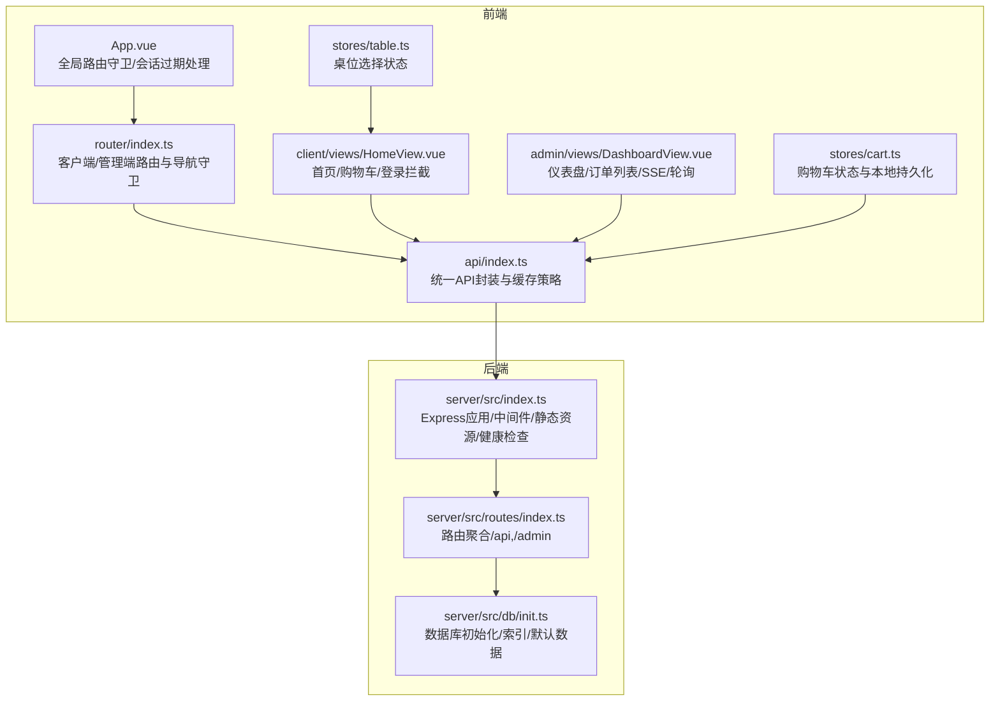
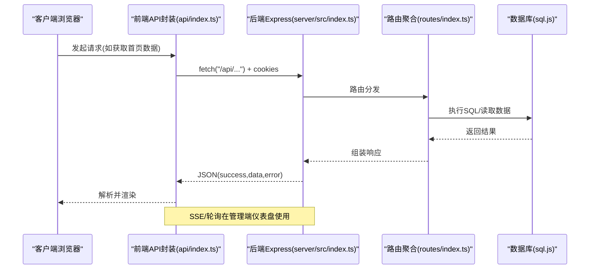
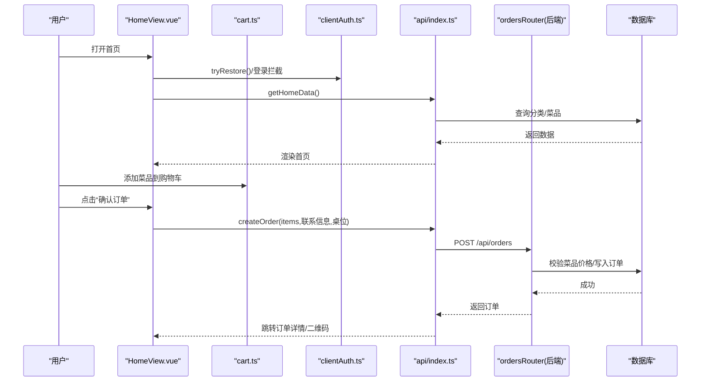
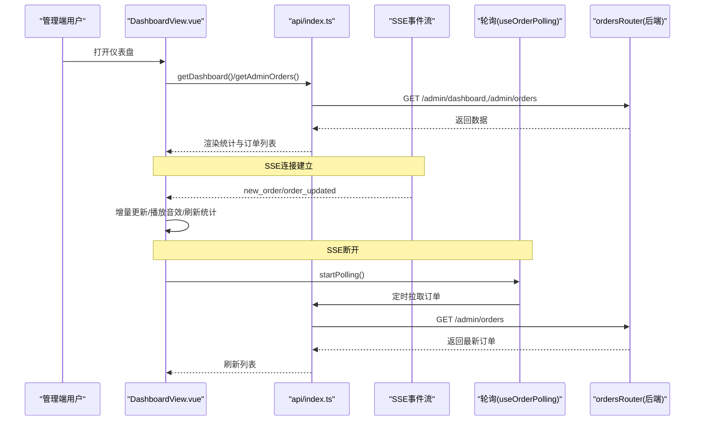
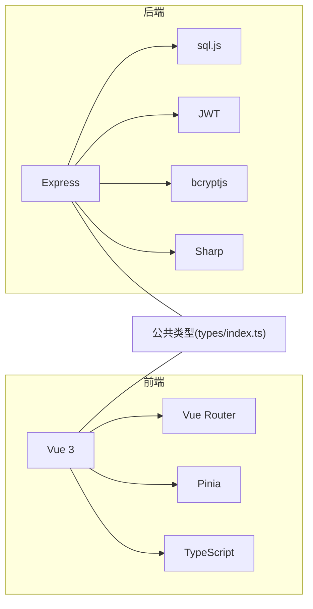

# 核心功能

<cite>
**本文引用的文件**
- [README.md](file://README.md)
- [App.vue](file://src/App.vue)
- [main.ts](file://src/main.ts)
- [router/index.ts](file://src/router/index.ts)
- [stores/cart.ts](file://src/stores/cart.ts)
- [stores/table.ts](file://src/stores/table.ts)
- [client/views/HomeView.vue](file://src/client/views/HomeView.vue)
- [admin/views/DashboardView.vue](file://src/admin/views/DashboardView.vue)
- [api/index.ts](file://src/api/index.ts)
- [routes/index.ts](file://server/src/routes/index.ts)
- [db/init.ts](file://server/src/db/init.ts)
- [types/index.ts](file://src/types/index.ts)
- [shared/composables/useOrderPolling.ts](file://src/shared/composables/useOrderPolling.ts)
</cite>

## 目录
1. [简介](#简介)
2. [项目结构](#项目结构)
3. [核心组件](#核心组件)
4. [架构总览](#架构总览)
5. [详细组件分析](#详细组件分析)
6. [依赖分析](#依赖分析)
7. [性能考虑](#性能考虑)
8. [故障排查指南](#故障排查指南)
9. [结论](#结论)
10. [附录](#附录)

## 简介
本系统为“红灯笼食府”餐厅管理系统，采用前后端分离架构，分为顾客端（C端）与管理端（B端）。系统围绕“自助点餐—订单管理—实时协作—库存联动”的业务闭环展开，提供从菜品浏览、购物车、下单、订单查询到管理端桌位、菜品、订单、库存的全链路能力。系统强调易用性（直观的界面与交互）、稳定性（强一致的下单校验与缓存策略）与扩展性（模块化路由与API、可插拔的SSE/轮询推送）。

## 项目结构
- 前端（Vue 3 + Vite + TypeScript + Pinia + Vue Router）
  - 客户端模块：首页、菜品详情、搜索、订单确认、订单详情/二维码、全部订单、设置等
  - 管理端模块：登录、仪表盘、桌位管理、菜单管理、订单管理、库存管理、用户管理、系统设置、调试工具等
  - 共享模块：通用组件、组合式函数（如订单轮询）、状态管理（Pinia）
- 后端（Node.js + Express + sql.js + JWT）
  - 路由聚合：公开API（菜品/桌位/订单/认证）与管理端API（仪表盘/表单/数据导入导出等）
  - 数据层：SQLite（sql.js）持久化，初始化脚本创建核心表与索引，并填充默认数据
  - 安全与中间件：CORS、压缩、Cookie解析、安全响应头、健康检查、错误处理

**图表来源**
- [App.vue:1-113](file://src/App.vue#L1-L113)
- [router/index.ts:1-317](file://src/router/index.ts#L1-L317)
- [api/index.ts:1-608](file://src/api/index.ts#L1-L608)
- [stores/cart.ts:1-183](file://src/stores/cart.ts#L1-L183)
- [stores/table.ts:1-25](file://src/stores/table.ts#L1-L25)
- [client/views/HomeView.vue:1-867](file://src/client/views/HomeView.vue#L1-L867)
- [admin/views/DashboardView.vue:1-1452](file://src/admin/views/DashboardView.vue#L1-L1452)
- [server/src/index.ts:1-176](file://server/src/index.ts#L1-L176)
- [server/src/routes/index.ts:1-18](file://server/src/routes/index.ts#L1-L18)
- [server/src/db/init.ts:1-204](file://server/src/db/init.ts#L1-L204)

**章节来源**
- [README.md:61-174](file://README.md#L61-L174)
- [server/src/index.ts:34-143](file://server/src/index.ts#L34-L143)
- [server/src/routes/index.ts:1-18](file://server/src/routes/index.ts#L1-L18)

## 核心组件
- 路由与导航守卫
  - 客户端路由：首页、菜品详情、搜索、订单确认、订单详情/二维码、全部订单、设置等，部分页面需要客户端登录态
  - 管理端路由：登录、仪表盘、桌位/菜单/订单/库存/用户/设置、调试工具等，受管理员登录态保护
  - 导航守卫：自动注入标题、登录态校验、登录弹窗触发、登录取消回退
- API封装与缓存
  - 统一返回结构、401会话过期事件派发、超时与信号合并、JSON响应校验
  - 内存缓存（stale-while-revalidate）：首页数据与分类列表缓存，降低带宽与首屏延迟
- 状态管理
  - 购物车：本地IndexedDB持久化、去代理化序列化、防抖落盘、下单前数据映射
  - 桌位：简单选择状态，配合首页可用桌位提示
- 数据模型
  - 用户、桌位、分类、菜品、订单、订单项、库存、仪表盘统计、联系卡等
- 后端路由与数据库
  - 路由聚合：公开API与管理端API分组
  - 初始化：创建核心表、索引、默认管理员与系统设置、幂等迁移与回填

**章节来源**
- [router/index.ts:42-177](file://src/router/index.ts#L42-L177)
- [router/index.ts:201-277](file://src/router/index.ts#L201-L277)
- [api/index.ts:54-127](file://src/api/index.ts#L54-L127)
- [api/index.ts:128-608](file://src/api/index.ts#L128-L608)
- [stores/cart.ts:9-183](file://src/stores/cart.ts#L9-L183)
- [stores/table.ts:5-25](file://src/stores/table.ts#L5-L25)
- [types/index.ts:1-133](file://src/types/index.ts#L1-L133)
- [server/src/routes/index.ts:1-18](file://server/src/routes/index.ts#L1-L18)
- [server/src/db/init.ts:5-204](file://server/src/db/init.ts#L5-L204)

## 架构总览
系统采用“前端SPA + 后端REST API + SSE/轮询”的混合实时推送架构。前端通过统一API封装调用后端接口，后端基于Express提供REST服务，使用sql.js进行SQLite持久化。管理端仪表盘优先使用SSE接收实时事件，断线时自动降级为轮询，保障高可用。

**图表来源**
- [api/index.ts:54-127](file://src/api/index.ts#L54-L127)
- [server/src/index.ts:88-140](file://server/src/index.ts#L88-L140)
- [server/src/routes/index.ts:1-18](file://server/src/routes/index.ts#L1-L18)
- [server/src/db/init.ts:124-138](file://server/src/db/init.ts#L124-L138)

## 详细组件分析

### 顾客端自助点餐流程
- 关键页面与交互
  - 首页：分类聚合、菜品网格、侧边栏目录、骨架屏、购物车抽屉、清空确认、确认下单按钮
  - 菜品详情：规格/标签选择、加入购物车、返回首页
  - 搜索：关键词查询、历史记录管理
  - 订单确认：选择桌位、填写联系人与电话、提交订单
  - 订单详情/二维码：查看状态、复制订单号、条形码/二维码
  - 全部订单：登录后可见的历史订单列表
- 登录与会话
  - 首次进入首页自动触发客户端登录态校验，未登录则弹出登录模态框
  - 会话过期时派发全局事件，前端区分管理端与客户端路径做不同处理
- 购物车与下单
  - 购物车状态持久化至IndexedDB，下单前将购物车映射为订单项数组
  - 订单创建时服务端重新校验价格，防止客户端篡改金额

**图表来源**
- [client/views/HomeView.vue:68-89](file://src/client/views/HomeView.vue#L68-L89)
- [client/views/HomeView.vue:104-110](file://src/client/views/HomeView.vue#L104-L110)
- [stores/cart.ts:78-87](file://src/stores/cart.ts#L78-L87)
- [api/index.ts:186-243](file://src/api/index.ts#L186-L243)
- [server/src/routes/index.ts:4-5](file://server/src/routes/index.ts#L4-L5)
- [server/src/db/init.ts:64-95](file://server/src/db/init.ts#L64-L95)

**章节来源**
- [client/views/HomeView.vue:1-867](file://src/client/views/HomeView.vue#L1-L867)
- [stores/cart.ts:1-183](file://src/stores/cart.ts#L1-L183)
- [api/index.ts:128-243](file://src/api/index.ts#L128-L243)
- [App.vue:16-39](file://src/App.vue#L16-L39)

### 管理端订单管理与实时推送
- 仪表盘与订单列表
  - 今日订单数、今日收入、待处理订单、可用桌位等指标
  - 订单列表支持按状态/日期筛选、订单号模糊搜索、批量清空已完成/已取消订单
- 实时推送（SSE）
  - 新订单事件：增量插入到列表顶部，播放音效并提示
  - 订单状态变更事件：按订单ID更新状态，同步更新选中详情
  - 断线重连：定时重连，未连接时启用轮询降级
- 订单轮询
  - 可见性变化自动启停轮询，避免后台浪费
  - 与SSE互斥，SSE连接时停止轮询

**图表来源**
- [admin/views/DashboardView.vue:144-183](file://src/admin/views/DashboardView.vue#L144-L183)
- [admin/views/DashboardView.vue:308-446](file://src/admin/views/DashboardView.vue#L308-L446)
- [shared/composables/useOrderPolling.ts:10-74](file://src/shared/composables/useOrderPolling.ts#L10-L74)
- [api/index.ts:288-397](file://src/api/index.ts#L288-L397)
- [server/src/routes/index.ts:6-6](file://server/src/routes/index.ts#L6-L6)

**章节来源**
- [admin/views/DashboardView.vue:1-1452](file://src/admin/views/DashboardView.vue#L1-L1452)
- [shared/composables/useOrderPolling.ts:1-74](file://src/shared/composables/useOrderPolling.ts#L1-L74)
- [api/index.ts:288-477](file://src/api/index.ts#L288-L477)

### 桌位管理与菜品管理
- 桌位管理
  - 获取全部桌位（含当前订单信息）、创建/更新/删除桌位
  - 删除限制：存在未完成订单时禁止删除
- 菜品管理
  - 获取菜品列表、创建/更新/删除菜品
  - 分类管理：创建/更新/删除分类，支持批量排序
  - 图片上传：WebP压缩、大小限制、删除防护
- 库存管理
  - 原材料库存监控、预警阈值、入库/出库记录、批量排序
- 用户管理与系统设置
  - 用户增删改查、重置密码、系统设置（店铺信息、通知配置）

**章节来源**
- [api/index.ts:293-322](file://src/api/index.ts#L293-L322)
- [api/index.ts:324-377](file://src/api/index.ts#L324-L377)
- [api/index.ts:399-428](file://src/api/index.ts#L399-L428)
- [api/index.ts:434-457](file://src/api/index.ts#L434-L457)
- [api/index.ts:430-432](file://src/api/index.ts#L430-L432)

### 订单处理与搜索功能
- 订单处理
  - 获取指定手机号订单列表、订单详情、取消订单（5分钟内，需手机号验证）
  - 管理端：按状态/日期筛选、更新订单状态、订单号模糊搜索
- 搜索功能
  - 顾客端：菜品关键词搜索、历史记录管理
  - 管理端：订单号模糊搜索、实时结果展示

**章节来源**
- [api/index.ts:186-243](file://src/api/index.ts#L186-L243)
- [api/index.ts:379-397](file://src/api/index.ts#L379-L397)
- [api/index.ts:160-162](file://src/api/index.ts#L160-L162)

### 权限控制机制与用户体验设计
- 权限控制
  - 客户端路由：对需要登录的页面进行拦截，触发登录弹窗；登录成功后放行
  - 管理端路由：登录态校验失败重定向至登录页，携带redirect参数
  - 会话过期：统一派发auth:expired事件，区分管理端与客户端路径做不同处理
  - 认证接口：JWT Cookie（httpOnly）+ 密码加密存储
- 用户体验
  - 骨架屏与预加载：首页/管理首页关键路由预取，减少白屏
  - 交互反馈：Toast提示、确认对话框、清空购物车确认
  - 桌位提示：首次进入首页根据时段查询可用桌位，若无座则弹窗提示

**章节来源**
- [router/index.ts:201-277](file://src/router/index.ts#L201-L277)
- [App.vue:16-39](file://src/App.vue#L16-L39)
- [client/views/HomeView.vue:169-210](file://src/client/views/HomeView.vue#L169-L210)
- [README.md:565-577](file://README.md#L565-L577)

## 依赖分析
- 前端依赖
  - Vue 3 + Vite + TypeScript：现代开发体验与高性能构建
  - Pinia：轻量状态管理，与Composition API契合
  - Vue Router：路由与导航守卫
  - 组件库：Lucide Vue Next图标、共享组件（确认弹窗、加载、数量控制等）
- 后端依赖
  - Express：Web框架
  - sql.js：嵌入式SQLite，适合中小型餐厅部署
  - JWT：认证令牌
  - bcryptjs：密码加密
  - Sharp：图片压缩与格式转换
  - Multer/AdmZip/Archiver：文件上传与数据导入导出
- 数据模型依赖
  - 前后端类型一致，统一在types/index.ts中定义，确保API契约清晰

**图表来源**
- [README.md:29-60](file://README.md#L29-L60)
- [types/index.ts:1-133](file://src/types/index.ts#L1-L133)

**章节来源**
- [README.md:29-60](file://README.md#L29-L60)
- [types/index.ts:1-133](file://src/types/index.ts#L1-L133)

## 性能考虑
- 前端性能
  - 内存缓存：首页数据与分类列表采用stale-while-revalidate，降低带宽与首屏延迟
  - 预加载：关键路由组件预取，提升页面切换流畅度
  - 骨架屏：长列表与异步数据加载时提供占位，改善感知性能
- 后端性能
  - 索引优化：为订单、菜品、用户、桌位等常用查询字段建立索引
  - 压缩与静态资源：Gzip压缩、静态资源长期缓存
  - SSE与轮询：SSE优先，断线自动轮询，避免频繁全量刷新
- 存储与一致性
  - 购物车本地持久化，下单前服务端重新校价，确保金额一致
  - 数据库批处理与幂等迁移，避免重复执行

**章节来源**
- [api/index.ts:9-34](file://src/api/index.ts#L9-L34)
- [router/index.ts:23-40](file://src/router/index.ts#L23-L40)
- [server/src/db/init.ts:124-137](file://server/src/db/init.ts#L124-L137)
- [server/src/index.ts:46-56](file://server/src/index.ts#L46-L56)

## 故障排查指南
- 会话过期
  - 现象：401未授权，前端派发auth:expired事件
  - 处理：管理端重定向登录页；客户端弹出登录模态框
- SSE断线
  - 现象：订单推送停止
  - 处理：自动重连定时器触发重连；未连接时启用轮询
- 订单创建失败
  - 现象：金额异常或菜品不存在
  - 处理：服务端重新校验价格与库存，返回具体错误
- 数据导入/导出
  - 现象：ZIP导入失败或文件名乱码
  - 处理：检查ZIP结构与编码，确保UTF-8文件名处理

**章节来源**
- [App.vue:16-39](file://src/App.vue#L16-L39)
- [admin/views/DashboardView.vue:375-391](file://src/admin/views/DashboardView.vue#L375-L391)
- [api/index.ts:83-114](file://src/api/index.ts#L83-L114)
- [api/index.ts:509-549](file://src/api/index.ts#L509-L549)

## 结论
本系统以“自助点餐—订单管理—实时协作—库存联动”为核心，结合前端缓存与后端索引优化，实现了高效稳定的业务闭环。管理端通过SSE/轮询实现实时推送，兼顾可用性与性能；前端通过骨架屏、预加载与本地持久化提升用户体验。系统在安全性、可维护性与扩展性方面均有良好设计，适合中小餐厅快速落地与持续演进。

## 附录
- 默认管理员账号：用户名admin，密码admin123（首次登录建议立即修改）
- 端口与代理：后端默认端口3000，前端开发模式下通过Vite代理转发
- 部署：支持PM2、Nginx/Apache反代、Docker多阶段构建与健康检查

**章节来源**
- [README.md:485-491](file://README.md#L485-L491)
- [README.md:500-508](file://README.md#L500-L508)
- [README.md:510-564](file://README.md#L510-L564)