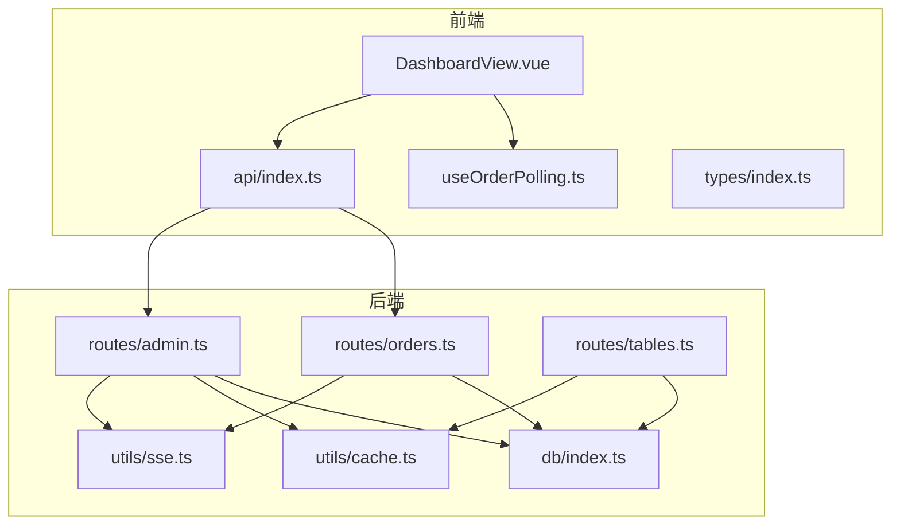
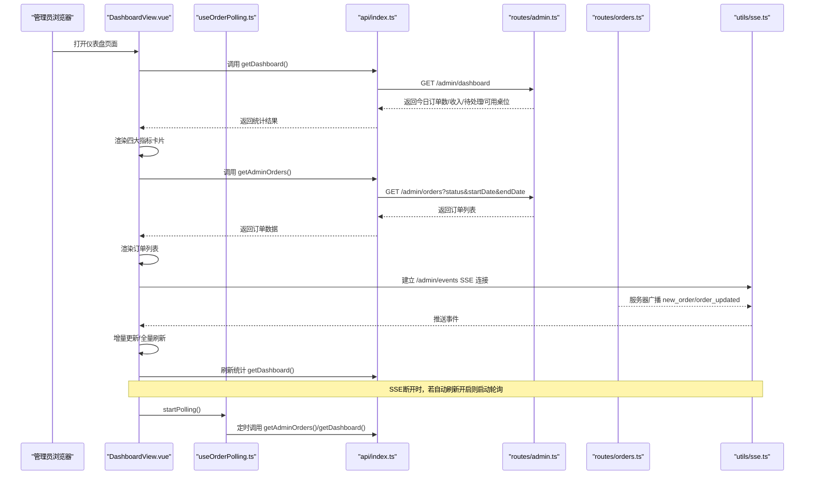
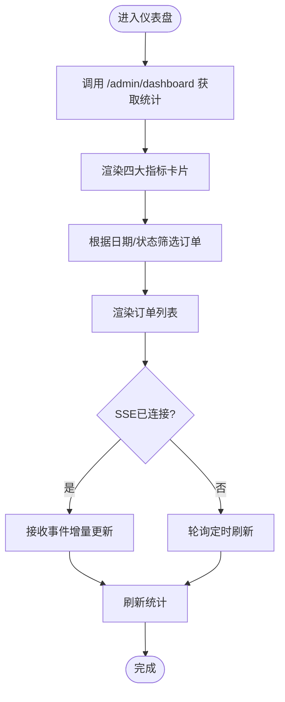
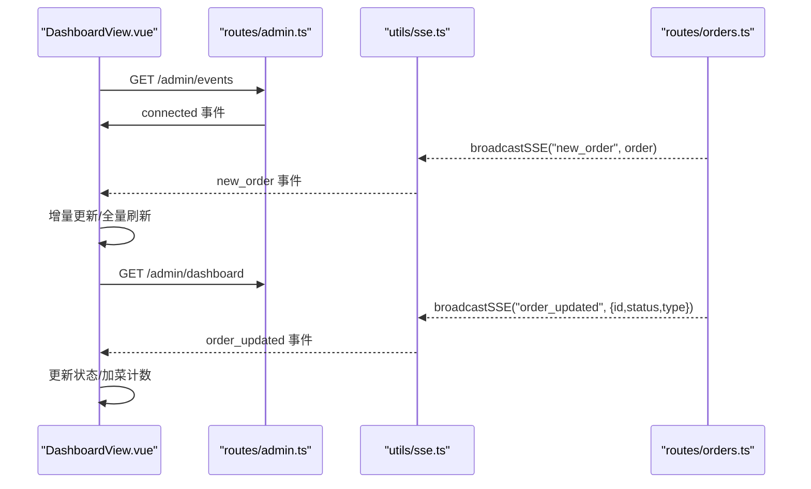
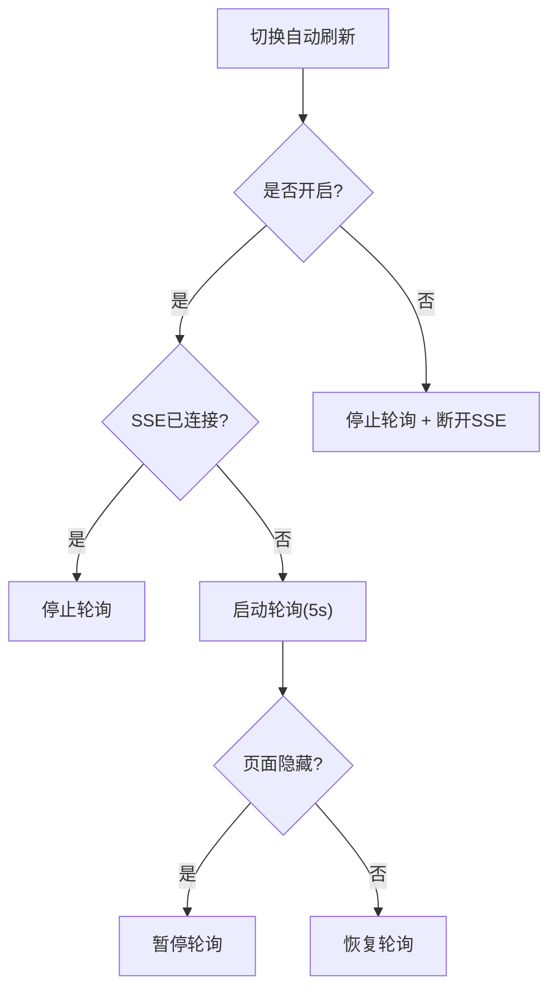
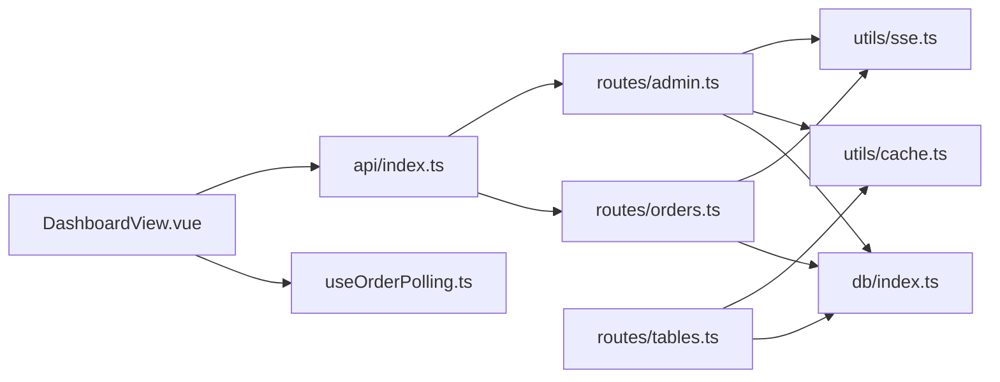

# 仪表盘概览

<cite>
**本文档引用的文件**
- [DashboardView.vue](file://src/admin/views/DashboardView.vue)
- [useOrderPolling.ts](file://src/shared/composables/useOrderPolling.ts)
- [api/index.ts](file://src/api/index.ts)
- [admin.ts](file://server/src/routes/admin.ts)
- [orders.ts](file://server/src/routes/orders.ts)
- [sse.ts](file://server/src/utils/sse.ts)
- [tables.ts](file://server/src/routes/tables.ts)
- [cache.ts](file://server/src/utils/cache.ts)
- [index.ts](file://server/src/db/index.ts)
- [index.ts](file://src/types/index.ts)
</cite>

## 目录
1. [简介](#简介)
2. [项目结构](#项目结构)
3. [核心组件](#核心组件)
4. [架构总览](#架构总览)
5. [详细组件分析](#详细组件分析)
6. [依赖关系分析](#依赖关系分析)
7. [性能考量](#性能考量)
8. [故障排查指南](#故障排查指南)
9. [结论](#结论)
10. [附录](#附录)

## 简介
本文件面向RLRMS餐厅管理系统的“仪表盘概览”功能，系统性阐述以下内容：
- 仪表盘核心指标：今日订单数、今日收入、待处理订单数、可用桌位数的计算逻辑与展示方式
- 实时订单推送机制（SSE）：连接管理、断线重连、事件监听与增量更新策略
- 自动刷新机制：轮询降级方案与性能优化
- 仪表盘界面操作指南：帮助管理员快速掌握运营监控方法

## 项目结构
仪表盘概览功能主要由前端视图层、API封装层、后端路由与工具模块协同实现，核心文件分布如下：
- 前端视图与交互：src/admin/views/DashboardView.vue
- 轮询组合式函数：src/shared/composables/useOrderPolling.ts
- 前端API封装：src/api/index.ts
- 后端仪表盘与事件流：server/src/routes/admin.ts
- 订单事件广播：server/src/routes/orders.ts
- SSE客户端管理：server/src/utils/sse.ts
- 桌位可用性查询与缓存：server/src/routes/tables.ts、server/src/utils/cache.ts
- 数据库访问与批量写入：server/src/db/index.ts
- 类型定义：src/types/index.ts

图表来源
- [DashboardView.vue:1-800](file://src/admin/views/DashboardView.vue#L1-L800)
- [useOrderPolling.ts:1-74](file://src/shared/composables/useOrderPolling.ts#L1-L74)
- [api/index.ts:1-608](file://src/api/index.ts#L1-L608)
- [admin.ts:133-219](file://server/src/routes/admin.ts#L133-L219)
- [orders.ts:342-343](file://server/src/routes/orders.ts#L342-L343)
- [sse.ts:1-59](file://server/src/utils/sse.ts#L1-L59)
- [tables.ts:57-76](file://server/src/routes/tables.ts#L57-L76)
- [cache.ts:63-73](file://server/src/utils/cache.ts#L63-L73)
- [index.ts:75-98](file://server/src/db/index.ts#L75-L98)

章节来源
- [DashboardView.vue:1-800](file://src/admin/views/DashboardView.vue#L1-L800)
- [admin.ts:133-219](file://server/src/routes/admin.ts#L133-L219)

## 核心组件
- 仪表盘视图组件：负责渲染四大核心指标卡片、订单列表、过滤与搜索、自动刷新开关、新增订单提示等
- 轮询组合式函数：封装定时轮询、可见性切换、增量检测等通用逻辑
- API封装：统一请求、超时控制、401处理、前端缓存策略
- SSE事件流：管理连接生命周期、心跳保活、断线重连、事件分发
- 后端仪表盘路由：一次性聚合统计查询，返回今日订单数、今日收入、待处理订单数、可用桌位数及最近订单
- 订单事件路由：创建订单、取消订单、加菜等场景触发SSE广播
- 桌位可用性路由与缓存：提供可用桌位查询与短期缓存，降低查询压力

章节来源
- [DashboardView.vue:144-183](file://src/admin/views/DashboardView.vue#L144-L183)
- [useOrderPolling.ts:10-74](file://src/shared/composables/useOrderPolling.ts#L10-L74)
- [api/index.ts:288-291](file://src/api/index.ts#L288-L291)
- [admin.ts:133-162](file://server/src/routes/admin.ts#L133-L162)
- [orders.ts:342-343](file://server/src/routes/orders.ts#L342-L343)
- [tables.ts:57-76](file://server/src/routes/tables.ts#L57-L76)

## 架构总览
仪表盘概览采用“前端SSE优先 + 轮询降级”的双通道刷新策略：
- SSE通道：管理端登录后建立持久连接，服务器主动推送新订单与状态变更事件，前端进行增量更新，显著降低延迟与带宽消耗
- 轮询通道：当SSE断开或未连接时，前端通过轮询定期拉取最新数据，保证可用性
- 自动刷新开关：管理员可一键开启/关闭自动刷新，系统根据状态自动选择SSE或轮询

图表来源
- [DashboardView.vue:302-446](file://src/admin/views/DashboardView.vue#L302-L446)
- [useOrderPolling.ts:19-31](file://src/shared/composables/useOrderPolling.ts#L19-L31)
- [api/index.ts:288-386](file://src/api/index.ts#L288-L386)
- [admin.ts:133-162](file://server/src/routes/admin.ts#L133-L162)
- [orders.ts:342-343](file://server/src/routes/orders.ts#L342-L343)
- [sse.ts:15-51](file://server/src/utils/sse.ts#L15-L51)

## 详细组件分析

### 1) 仪表盘核心指标计算与展示
- 指标定义与类型
  - 今日订单数：当日创建且状态为已完成的订单数量
  - 今日收入：当日创建且状态为已完成的订单总金额
  - 待处理订单数：状态为待处理的订单数量
  - 可用桌位数：状态为可用的桌位数量
  - 最近订单：按创建时间倒序的最近10条订单

- 计算逻辑
  - 后端一次性聚合查询，减少多次往返与复杂联表
  - 使用SQLite日期函数对本地时间进行过滤，确保按本地日切分
  - 对今日收入使用聚合求和并过滤状态

- 展示方式
  - 四大指标卡片分别渲染图标、数值与标签
  - 骨架屏提升首次加载体验
  - 支持“清空已完成/已取消订单”操作，仅移除对应状态订单并刷新统计

图表来源
- [admin.ts:164-219](file://server/src/routes/admin.ts#L164-L219)
- [DashboardView.vue:144-183](file://src/admin/views/DashboardView.vue#L144-L183)

章节来源
- [admin.ts:164-219](file://server/src/routes/admin.ts#L164-L219)
- [DashboardView.vue:502-544](file://src/admin/views/DashboardView.vue#L502-L544)

### 2) 实时订单推送机制（SSE）
- 连接管理
  - 前端通过GET /api/admin/events建立SSE连接，携带凭据
  - 后端设置标准SSE响应头，发送连接确认事件
  - 心跳保活：每30秒发送心跳消息，维持连接活性

- 断线重连
  - 前端监听SSE错误回调，标记断开并关闭连接
  - 若自动刷新开启且未处于轮询状态，则启动轮询作为降级
  - 定时器延时重连，避免频繁重建

- 事件监听与增量更新
  - new_order事件：解析新订单，若无筛选条件则插入列表头部；否则全量刷新
  - order_updated事件：按ID定位订单，更新状态；若为加菜事件则累加计数并提示
  - SSE连接成功后停止轮询，避免重复刷新

- 广播机制
  - 订单创建/取消/加菜等操作触发服务器广播
  - 广播遍历客户端集合，向每个可写客户端发送事件

图表来源
- [DashboardView.vue:302-391](file://src/admin/views/DashboardView.vue#L302-L391)
- [admin.ts:133-162](file://server/src/routes/admin.ts#L133-L162)
- [orders.ts:342-343](file://server/src/routes/orders.ts#L342-L343)
- [sse.ts:15-51](file://server/src/utils/sse.ts#L15-L51)

章节来源
- [DashboardView.vue:302-391](file://src/admin/views/DashboardView.vue#L302-L391)
- [admin.ts:133-162](file://server/src/routes/admin.ts#L133-L162)
- [orders.ts:342-343](file://server/src/routes/orders.ts#L342-L343)
- [sse.ts:15-51](file://server/src/utils/sse.ts#L15-L51)

### 3) 自动刷新与轮询降级
- 自动刷新开关
  - 前端提供“订单接受中/已暂停”按钮，切换自动刷新状态
  - 开启时若SSE未连接则启动轮询；关闭时停止轮询并断开SSE

- 轮询实现
  - 组合式函数封装定时器、可见性切换、增量检测
  - 默认轮询间隔5秒，可通过配置调整
  - 当SSE连接成功后停止轮询，避免重复刷新

- 性能优化
  - 前端请求超时控制与AbortSignal合并，避免长时间挂起
  - SSE断线时启用轮询，保证可用性
  - 订单列表在有筛选条件时全量刷新，无筛选时增量插入，兼顾准确性与性能

图表来源
- [DashboardView.vue:414-446](file://src/admin/views/DashboardView.vue#L414-L446)
- [useOrderPolling.ts:19-47](file://src/shared/composables/useOrderPolling.ts#L19-L47)
- [api/index.ts:54-114](file://src/api/index.ts#L54-L114)

章节来源
- [DashboardView.vue:414-446](file://src/admin/views/DashboardView.vue#L414-L446)
- [useOrderPolling.ts:10-74](file://src/shared/composables/useOrderPolling.ts#L10-L74)
- [api/index.ts:54-114](file://src/api/index.ts#L54-L114)

### 4) 订单列表与搜索
- 订单列表
  - 支持按日期范围（今天/昨天/本周/本月/全部）与状态筛选
  - 骨架屏提升加载体验
  - 提供“清空已完成/已取消订单”功能，仅移除对应状态订单并刷新统计

- 订单查询
  - 支持按订单号模糊搜索，防抖延迟300ms
  - 搜索结果为空时显示占位提示

- 状态更新
  - 支持从待处理到已确认、从已确认到已完成、从待处理到已取消
  - 更新后同步刷新统计与选中订单状态

章节来源
- [DashboardView.vue:40-82](file://src/admin/views/DashboardView.vue#L40-L82)
- [DashboardView.vue:162-183](file://src/admin/views/DashboardView.vue#L162-L183)
- [DashboardView.vue:185-208](file://src/admin/views/DashboardView.vue#L185-L208)
- [DashboardView.vue:546-688](file://src/admin/views/DashboardView.vue#L546-L688)

### 5) 桌位可用性与缓存
- 可用桌位查询
  - 提供“当前可用”与“指定就餐时间可用”两种查询
  - 使用短期缓存（5秒TTL）降低查询压力

- 缓存失效
  - 订单状态变更、桌位状态更新等操作触发缓存失效
  - 保证数据一致性与查询性能

章节来源
- [tables.ts:57-76](file://server/src/routes/tables.ts#L57-L76)
- [cache.ts:63-73](file://server/src/utils/cache.ts#L63-L73)

## 依赖关系分析
- 前端依赖
  - DashboardView.vue依赖API封装、轮询组合式函数、类型定义
  - API封装统一处理请求、超时与401事件，提供仪表盘与订单查询接口
  - 轮询组合式函数提供跨组件复用的定时刷新能力

- 后端依赖
  - admin路由提供仪表盘聚合查询与SSE事件流
  - orders路由在订单创建/取消/加菜时触发SSE广播
  - sse工具模块维护客户端连接与广播
  - tables路由与cache工具模块提供可用桌位查询与缓存

图表来源
- [DashboardView.vue:1-800](file://src/admin/views/DashboardView.vue#L1-L800)
- [api/index.ts:288-386](file://src/api/index.ts#L288-L386)
- [admin.ts:133-219](file://server/src/routes/admin.ts#L133-L219)
- [orders.ts:342-343](file://server/src/routes/orders.ts#L342-L343)
- [sse.ts:15-51](file://server/src/utils/sse.ts#L15-L51)
- [tables.ts:57-76](file://server/src/routes/tables.ts#L57-L76)
- [cache.ts:63-73](file://server/src/utils/cache.ts#L63-L73)
- [index.ts:75-98](file://server/src/db/index.ts#L75-L98)

章节来源
- [DashboardView.vue:1-800](file://src/admin/views/DashboardView.vue#L1-L800)
- [api/index.ts:288-386](file://src/api/index.ts#L288-L386)
- [admin.ts:133-219](file://server/src/routes/admin.ts#L133-L219)
- [orders.ts:342-343](file://server/src/routes/orders.ts#L342-L343)
- [sse.ts:15-51](file://server/src/utils/sse.ts#L15-L51)
- [tables.ts:57-76](file://server/src/routes/tables.ts#L57-L76)
- [cache.ts:63-73](file://server/src/utils/cache.ts#L63-L73)
- [index.ts:75-98](file://server/src/db/index.ts#L75-L98)

## 性能考量
- SSE优先策略
  - 服务器主动推送，前端即时更新，显著降低延迟与带宽消耗
  - 断线时自动降级为轮询，保证可用性

- 轮询优化
  - 默认5秒间隔，页面隐藏时暂停轮询，恢复时继续
  - 增量检测：轮询时比较订单数量变化，仅在新增时提示

- 请求与缓存
  - 前端请求超时控制与AbortSignal合并，避免长时间挂起
  - 仪表盘统计与可用桌位查询使用短期缓存，减少数据库压力

- 数据库写入优化
  - 批量事务写入，保存前去抖合并，降低磁盘IO

章节来源
- [useOrderPolling.ts:19-47](file://src/shared/composables/useOrderPolling.ts#L19-L47)
- [api/index.ts:54-114](file://src/api/index.ts#L54-L114)
- [tables.ts:57-76](file://server/src/routes/tables.ts#L57-L76)
- [index.ts:46-60](file://server/src/db/index.ts#L46-L60)

## 故障排查指南
- SSE连接失败
  - 检查管理端登录状态与Cookie传递
  - 观察浏览器网络面板SSE连接状态与心跳消息
  - 若断开，确认自动刷新开关状态与断线重连定时器

- 轮询未生效
  - 确认自动刷新开关处于开启状态
  - 检查页面可见性与轮询暂停/恢复逻辑

- 订单未及时更新
  - 检查订单创建/取消/加菜接口是否正确触发广播
  - 确认SSE客户端集合未被异常移除

- 统计数据不准确
  - 检查仪表盘聚合查询的日期过滤逻辑
  - 确认缓存键与失效策略是否正确

章节来源
- [DashboardView.vue:375-391](file://src/admin/views/DashboardView.vue#L375-L391)
- [admin.ts:133-162](file://server/src/routes/admin.ts#L133-L162)
- [orders.ts:342-343](file://server/src/routes/orders.ts#L342-L343)
- [sse.ts:27-32](file://server/src/utils/sse.ts#L27-L32)

## 结论
仪表盘概览通过“SSE优先 + 轮询降级”的双通道刷新策略，在保证低延迟与高实时性的前提下，兼顾了可用性与性能。核心指标计算采用一次性聚合查询，配合短期缓存与批量写入优化，确保系统在高并发场景下的稳定运行。管理员可通过直观的界面快速掌握餐厅运营状况，并通过自动刷新与事件推送获得最佳的监控体验。

## 附录
- 操作指南
  - 登录管理端后打开“概览”页面
  - 查看四大指标卡片：今日订单数、今日收入、待处理订单数、可用桌位数
  - 使用日期与状态筛选器查看不同维度的订单
  - 点击“订单查询”输入订单号进行模糊搜索
  - 点击“清空已完成/已取消订单”清理历史数据
  - 点击右上角“订单接受中/已暂停”按钮切换自动刷新状态

章节来源
- [DashboardView.vue:463-770](file://src/admin/views/DashboardView.vue#L463-L770)