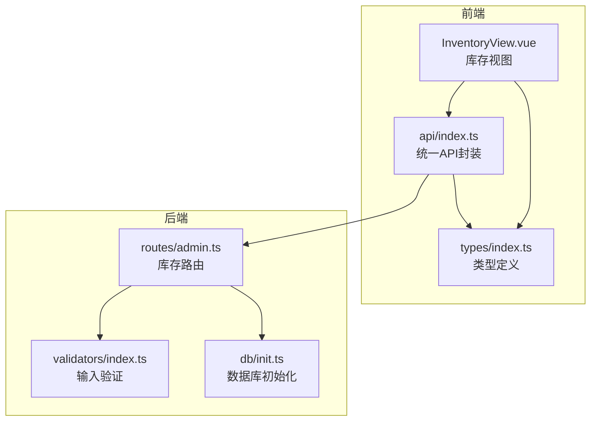
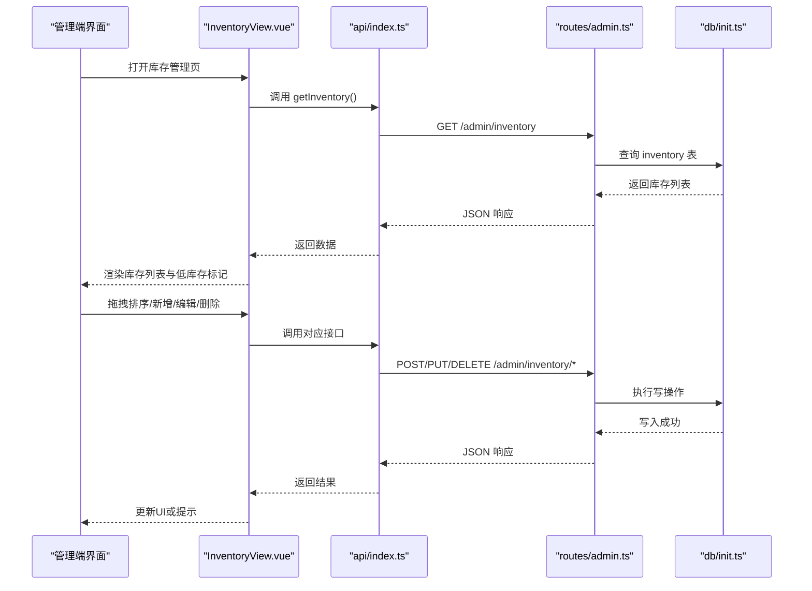
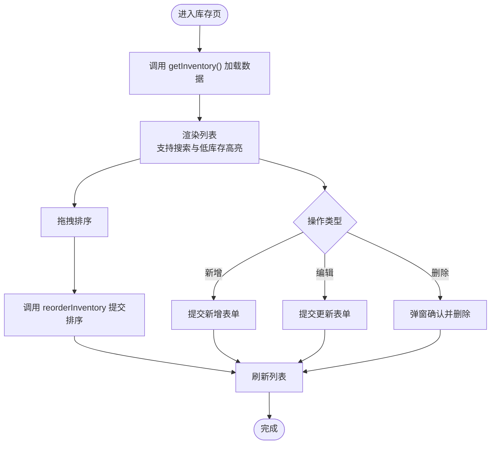
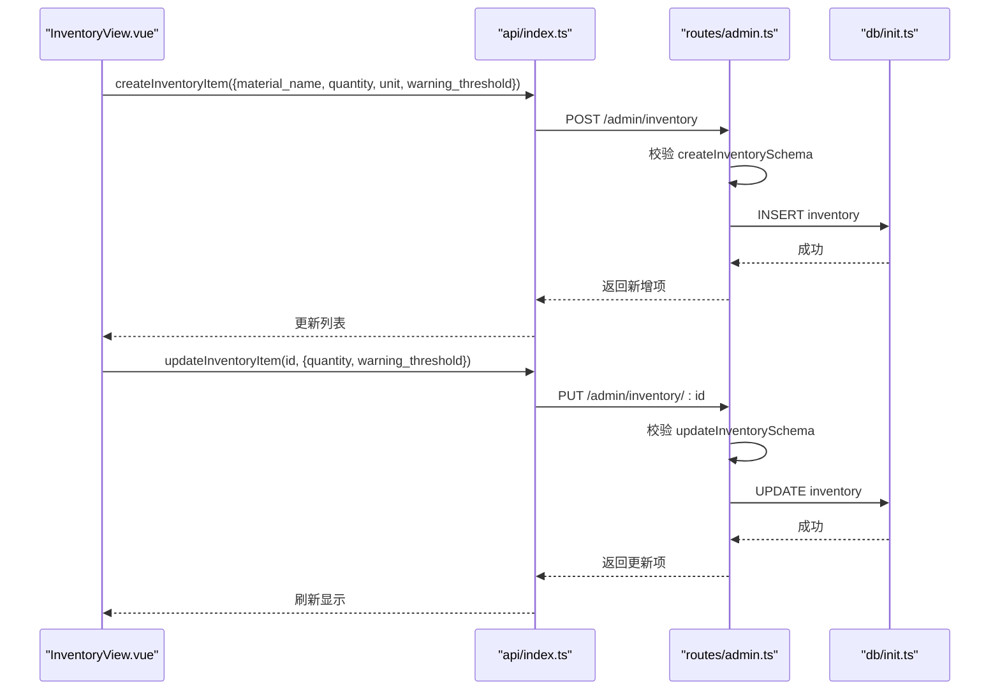
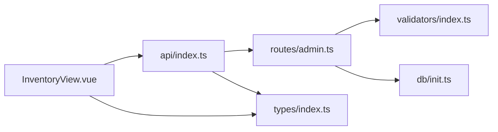

# 库存管理

<cite>
**本文引用的文件**
- [InventoryView.vue](file://src/admin/views/InventoryView.vue)
- [api/index.ts](file://src/api/index.ts)
- [types/index.ts](file://src/types/index.ts)
- [routes/admin.ts](file://server/src/routes/admin.ts)
- [validators/index.ts](file://server/src/validators/index.ts)
- [db/init.ts](file://server/src/db/init.ts)
- [README.md](file://README.md)
</cite>

## 目录
1. [简介](#简介)
2. [项目结构](#项目结构)
3. [核心组件](#核心组件)
4. [架构总览](#架构总览)
5. [详细组件分析](#详细组件分析)
6. [依赖关系分析](#依赖关系分析)
7. [性能考量](#性能考量)
8. [故障排查指南](#故障排查指南)
9. [结论](#结论)
10. [附录](#附录)

## 简介
本文件面向RLRMS餐厅管理系统中的库存管理功能，系统性梳理了库存的入库、出库、盘点与预警管理能力，并结合现有实现说明库存数量控制、保质期管理与损耗统计机制的现状与扩展建议。同时，解释库存与菜品制作的关系、库存不足时的自动提醒机制，提供最佳实践（安全库存设置、采购计划制定、库存成本控制策略），并给出库存报表生成、库存分析图表与异常处理流程的指导。

## 项目结构
- 前端管理端库存页面负责展示与维护库存物料，支持新增、编辑、删除、拖拽排序与低库存标记。
- API层提供库存数据接口，前端通过统一API模块调用后端路由。
- 后端路由对库存进行增删改查与排序，配合数据库初始化脚本建立库存表结构。
- 类型定义明确库存数据模型，验证器确保输入合法性。

**图表来源**
- [InventoryView.vue:1-134](file://src/admin/views/InventoryView.vue#L1-L134)
- [api/index.ts:399-416](file://src/api/index.ts#L399-L416)
- [types/index.ts:99-108](file://src/types/index.ts#L99-L108)
- [routes/admin.ts:886-991](file://server/src/routes/admin.ts#L886-L991)
- [validators/index.ts:53-64](file://server/src/validators/index.ts#L53-L64)
- [db/init.ts:111-122](file://server/src/db/init.ts#L111-L122)

**章节来源**
- [InventoryView.vue:1-134](file://src/admin/views/InventoryView.vue#L1-L134)
- [api/index.ts:399-416](file://src/api/index.ts#L399-L416)
- [types/index.ts:99-108](file://src/types/index.ts#L99-L108)
- [routes/admin.ts:886-991](file://server/src/routes/admin.ts#L886-L991)
- [validators/index.ts:53-64](file://server/src/validators/index.ts#L53-L64)
- [db/init.ts:111-122](file://server/src/db/init.ts#L111-L122)

## 核心组件
- 库存视图组件（InventoryView.vue）
  - 功能：加载库存列表、搜索过滤、拖拽排序、新增/编辑/删除、低库存高亮与提示。
  - 关键逻辑：调用API获取/更新库存；根据预警阈值判断低库存；保存排序顺序。
- 统一API封装（api/index.ts）
  - 提供 getInventory、createInventoryItem、updateInventoryItem 等方法，封装HTTP请求。
- 类型定义（types/index.ts）
  - 定义 InventoryItem 接口，包含物料名称、数量、单位、预警阈值等字段。
- 后端库存路由（routes/admin.ts）
  - 提供 /admin/inventory 的增删改查与排序接口；使用验证器校验输入。
- 输入验证（validators/index.ts）
  - createInventorySchema、updateInventorySchema 确保字段合法。
- 数据库初始化（db/init.ts）
  - 创建 inventory 表，包含 id、material_name、quantity、unit、warning_threshold、sort_order 等字段。

**章节来源**
- [InventoryView.vue:1-134](file://src/admin/views/InventoryView.vue#L1-L134)
- [api/index.ts:399-416](file://src/api/index.ts#L399-L416)
- [types/index.ts:99-108](file://src/types/index.ts#L99-L108)
- [routes/admin.ts:886-991](file://server/src/routes/admin.ts#L886-L991)
- [validators/index.ts:53-64](file://server/src/validators/index.ts#L53-L64)
- [db/init.ts:111-122](file://server/src/db/init.ts#L111-L122)

## 架构总览
库存管理采用前后端分离架构：前端负责UI与交互，后端提供REST风格接口，数据库持久化库存数据。验证器贯穿于输入阶段，保证数据一致性与安全性。

**图表来源**
- [InventoryView.vue:52-133](file://src/admin/views/InventoryView.vue#L52-L133)
- [api/index.ts:399-416](file://src/api/index.ts#L399-L416)
- [routes/admin.ts:886-991](file://server/src/routes/admin.ts#L886-L991)
- [db/init.ts:111-122](file://server/src/db/init.ts#L111-L122)

## 详细组件分析

### 库存视图组件（InventoryView.vue）
- 数据加载与搜索
  - 通过 API 获取库存列表，支持关键词搜索并实时过滤。
- 拖拽排序
  - 将当前列表转换为排序数组，调用 reorderInventory 接口批量更新 sort_order。
- 新增/编辑
  - 新增时提交 material_name、quantity、unit、warning_threshold；
  - 编辑时仅更新 quantity 与 warning_threshold。
- 删除
  - 弹窗确认后调用删除接口，刷新列表。
- 低库存提醒
  - 当前数量小于等于预警阈值时，行样式高亮并显示警告图标。

**图表来源**
- [InventoryView.vue:35-133](file://src/admin/views/InventoryView.vue#L35-L133)

**章节来源**
- [InventoryView.vue:1-134](file://src/admin/views/InventoryView.vue#L1-L134)

### 统一API封装（api/index.ts）
- 提供 getInventory、createInventoryItem、updateInventoryItem 等方法，封装请求路径与参数序列化。
- 与后端路由一一对应，便于前端调用与错误处理。

**章节来源**
- [api/index.ts:399-416](file://src/api/index.ts#L399-L416)

### 类型定义（types/index.ts）
- InventoryItem 字段：id、material_name、quantity、unit、warning_threshold、created_at、updated_at。
- 作为前后端契约，确保数据结构一致。

**章节来源**
- [types/index.ts:99-108](file://src/types/index.ts#L99-L108)

### 后端库存路由（routes/admin.ts）
- 新增库存：校验 createInventorySchema，检查物料名称唯一性，插入记录并返回新项。
- 排序更新：接收 orders 数组，批量更新 sort_order。
- 更新库存：校验 updateInventorySchema，支持更新 quantity 与 warning_threshold。
- 删除库存：按 id 删除，返回成功消息。
- 全部路由均进行鉴权与参数校验，保证安全性与稳定性。

**图表来源**
- [routes/admin.ts:886-991](file://server/src/routes/admin.ts#L886-L991)
- [validators/index.ts:53-64](file://server/src/validators/index.ts#L53-L64)
- [db/init.ts:111-122](file://server/src/db/init.ts#L111-L122)

**章节来源**
- [routes/admin.ts:886-991](file://server/src/routes/admin.ts#L886-L991)
- [validators/index.ts:53-64](file://server/src/validators/index.ts#L53-L64)

### 数据模型与验证器
- 数据模型（README.md）
  - 库存（Inventory）包含 id、material_name、quantity、unit、warning_threshold、sort_order、created_at/updated_at。
- 输入验证（validators/index.ts）
  - createInventorySchema：校验物料名称、数量、单位、可选预警阈值。
  - updateInventorySchema：校验数量非负、预警阈值非负（可选）。

**章节来源**
- [README.md:470-477](file://README.md#L470-L477)
- [validators/index.ts:53-64](file://server/src/validators/index.ts#L53-L64)

## 依赖关系分析
- 前端依赖
  - InventoryView.vue 依赖 api/index.ts 进行网络请求，依赖 types/index.ts 进行类型约束。
- 后端依赖
  - routes/admin.ts 依赖 validators/index.ts 进行输入校验，依赖 db/init.ts 进行数据库操作。
- 数据库依赖
  - inventory 表结构定义于 db/init.ts，包含 quantity 与 warning_threshold 字段，支撑预警逻辑。

**图表来源**
- [InventoryView.vue:1-134](file://src/admin/views/InventoryView.vue#L1-L134)
- [api/index.ts:399-416](file://src/api/index.ts#L399-L416)
- [routes/admin.ts:886-991](file://server/src/routes/admin.ts#L886-L991)
- [validators/index.ts:53-64](file://server/src/validators/index.ts#L53-L64)
- [db/init.ts:111-122](file://server/src/db/init.ts#L111-L122)
- [types/index.ts:99-108](file://src/types/index.ts#L99-L108)

**章节来源**
- [InventoryView.vue:1-134](file://src/admin/views/InventoryView.vue#L1-L134)
- [api/index.ts:399-416](file://src/api/index.ts#L399-L416)
- [routes/admin.ts:886-991](file://server/src/routes/admin.ts#L886-L991)
- [validators/index.ts:53-64](file://server/src/validators/index.ts#L53-L64)
- [db/init.ts:111-122](file://server/src/db/init.ts#L111-L122)
- [types/index.ts:99-108](file://src/types/index.ts#L99-L108)

## 性能考量
- 前端
  - 列表渲染采用虚拟滚动与懒加载（若后续扩展），避免大量DOM节点带来的卡顿。
  - 搜索过滤在内存中进行，建议在数据量较大时引入服务端分页与模糊索引。
- 后端
  - 批量排序使用事务批处理，减少多次往返；建议对 sort_order 建立索引以提升排序与查询性能。
  - 输入验证使用 Zod，解析与校验开销较小，建议保持在中间层执行，避免重复校验。
- 数据库
  - inventory 表已包含 sort_order 字段，便于排序；建议为 material_name 建唯一索引，保障唯一性约束与查询效率。

[本节为通用性能建议，不直接分析具体文件]

## 故障排查指南
- 常见问题与定位
  - 新增失败：检查 createInventorySchema 校验是否通过，确认物料名称唯一性。
  - 更新失败：检查 updateInventorySchema，确保 quantity 与 warning_threshold 非负。
  - 排序失败：确认 orders 参数格式正确且为数组。
  - 删除失败：确认 id 格式有效且存在。
- 日志与提示
  - 前端在调用失败时通过 toast 提示错误信息；后端捕获异常并返回标准错误响应。
- 建议流程
  - 增加接口超时与重试机制；
  - 对关键操作（新增/更新/删除）增加幂等性设计；
  - 在生产环境启用更详细的日志与告警。

**章节来源**
- [routes/admin.ts:886-991](file://server/src/routes/admin.ts#L886-L991)
- [validators/index.ts:53-64](file://server/src/validators/index.ts#L53-L64)
- [InventoryView.vue:52-133](file://src/admin/views/InventoryView.vue#L52-L133)

## 结论
当前系统已具备完整的库存基础能力：物料新增、编辑、删除、排序与低库存预警。通过类型定义与验证器确保数据一致性，后端路由提供稳定接口。为进一步完善库存管理，建议补充保质期与损耗统计、出入库流水、安全库存与采购计划联动、库存报表与可视化分析等功能模块。

[本节为总结性内容，不直接分析具体文件]

## 附录

### 库存与菜品制作的关系
- 现状
  - 库存表包含 quantity 与 warning_threshold，用于数量控制与预警。
  - 菜品详情页支持规格选择与数量控制，但未直接关联库存扣减逻辑。
- 建议
  - 在下单环节引入库存校验与扣减，当某菜品所需原料不足时阻断下单或提示替代方案。
  - 建立“菜品-原料”映射表，实现按菜品规格自动计算所需原料数量。

[本节为概念性建议，不直接分析具体文件]

### 库存不足自动提醒
- 现状
  - 前端通过 isLowStock(item) 判断并高亮显示，辅助人工关注。
- 建议
  - 后端在库存更新后触发规则引擎，向管理端推送SSE通知；
  - 支持邮件/短信告警，设定不同阈值级别（黄色预警/红色紧急）。

[本节为概念性建议，不直接分析具体文件]

### 库存报表与分析图表
- 报表建议
  - 库存余额表：按物料汇总当前结余与单位；
  - 库存周转率：基于期初期末结余与耗用量计算；
  - 趋势分析：按日/周/月展示库存变化。
- 可视化建议
  - 使用柱状图展示Top N低库存物料；
  - 使用折线图展示关键物料库存趋势；
  - 使用仪表盘展示整体库存健康度。

[本节为概念性建议，不直接分析具体文件]

### 库存异常处理流程
- 流程建议
  - 异常检测：定时任务扫描低库存与过期风险；
  - 自动预警：SSE推送+邮件/短信；
  - 人工干预：生成补货工单，跟踪到货与验收；
  - 回归监控：到货后恢复正常阈值，持续观察。

[本节为概念性建议，不直接分析具体文件]