# 桌位管理

<cite>
**本文档引用的文件**
- [server/src/routes/tables.ts](file://server/src/routes/tables.ts)
- [server/src/routes/admin.ts](file://server/src/routes/admin.ts)
- [server/src/db/index.ts](file://server/src/db/index.ts)
- [server/src/db/init.ts](file://server/src/db/init.ts)
- [src/admin/views/TablesView.vue](file://src/admin/views/TablesView.vue)
- [src/api/index.ts](file://src/api/index.ts)
- [src/stores/table.ts](file://src/stores/table.ts)
- [src/client/components/TableSelectModal.vue](file://src/client/components/TableSelectModal.vue)
- [src/types/index.ts](file://src/types/index.ts)
</cite>

## 目录
1. [简介](#简介)
2. [项目结构](#项目结构)
3. [核心组件](#核心组件)
4. [架构概览](#架构概览)
5. [详细组件分析](#详细组件分析)
6. [依赖关系分析](#依赖关系分析)
7. [性能考虑](#性能考虑)
8. [故障排除指南](#故障排除指南)
9. [结论](#结论)
10. [附录](#附录)

## 简介

RLRMS餐厅管理系统中的桌位管理功能是一个完整的桌面餐厅管理系统的核心组成部分。该功能提供了全面的桌位生命周期管理能力，包括桌位的创建、编辑、删除和状态管理。系统支持三种基本状态：可用（available）、已预订（reserved）和占用中（occupied），并通过智能的缓存机制和实时状态同步确保数据的一致性和用户体验的流畅性。

本系统采用前后端分离架构，前端使用Vue.js构建响应式的管理界面，后端基于Express.js提供RESTful API服务，数据库采用SQLite通过sql.js实现本地持久化存储。所有数据操作都经过严格的验证和错误处理，确保系统的稳定性和可靠性。

## 项目结构

桌位管理功能在项目中的组织结构如下：

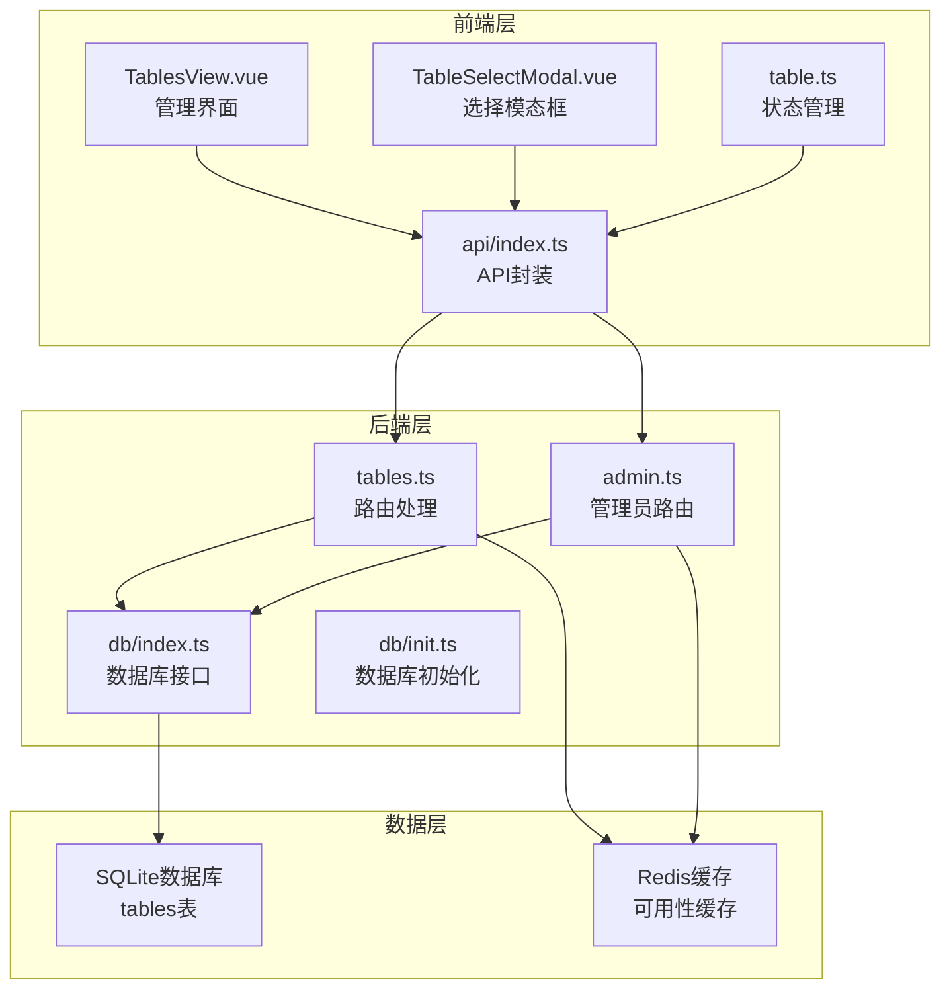

**图表来源**
- [src/admin/views/TablesView.vue:1-484](file://src/admin/views/TablesView.vue#L1-L484)
- [server/src/routes/tables.ts:1-93](file://server/src/routes/tables.ts#L1-L93)
- [server/src/db/index.ts:1-156](file://server/src/db/index.ts#L1-L156)

**章节来源**
- [src/admin/views/TablesView.vue:1-484](file://src/admin/views/TablesView.vue#L1-L484)
- [server/src/routes/tables.ts:1-93](file://server/src/routes/tables.ts#L1-L93)
- [server/src/db/index.ts:1-156](file://server/src/db/index.ts#L1-L156)

## 核心组件

### 数据模型定义

桌位数据模型是整个系统的基础，定义了桌位的基本属性和约束条件：

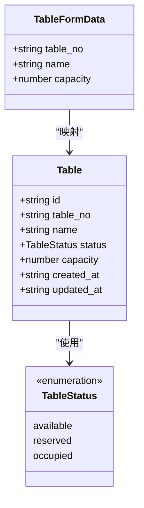

**图表来源**
- [src/types/index.ts:34-43](file://src/types/index.ts#L34-L43)

### 状态管理组件

系统使用Pinia进行全局状态管理，提供桌位选择的响应式状态：

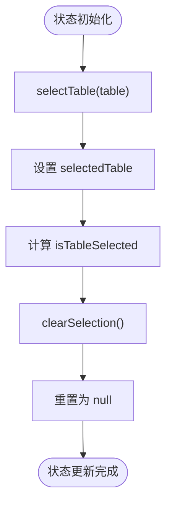

**图表来源**
- [src/stores/table.ts:5-24](file://src/stores/table.ts#L5-L24)

**章节来源**
- [src/types/index.ts:34-43](file://src/types/index.ts#L34-L43)
- [src/stores/table.ts:1-25](file://src/stores/table.ts#L1-L25)

## 架构概览

桌位管理系统的整体架构采用分层设计，确保各层职责清晰、耦合度低：

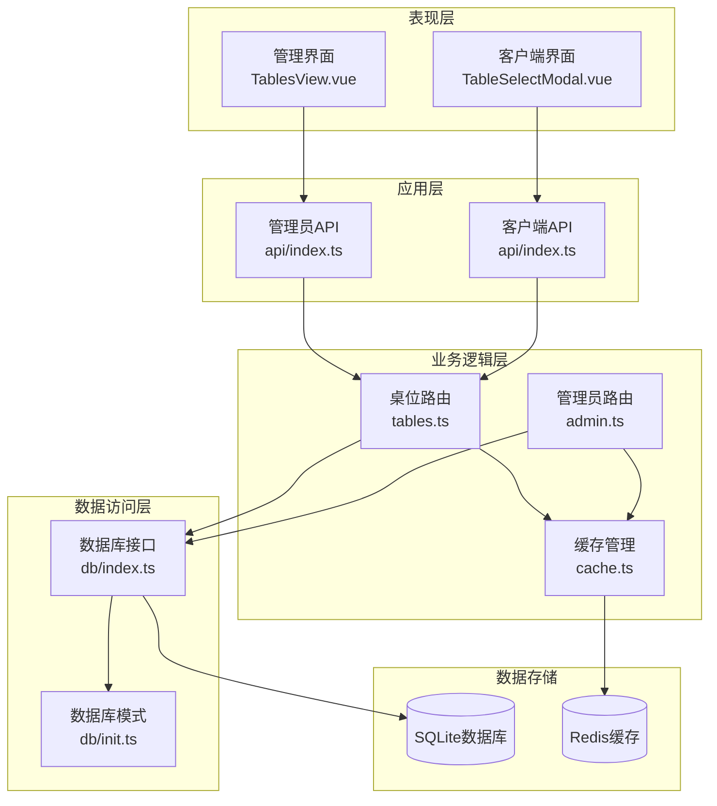

**图表来源**
- [src/admin/views/TablesView.vue:1-484](file://src/admin/views/TablesView.vue#L1-L484)
- [src/api/index.ts:128-322](file://src/api/index.ts#L128-L322)
- [server/src/routes/tables.ts:1-93](file://server/src/routes/tables.ts#L1-L93)
- [server/src/db/index.ts:1-156](file://server/src/db/index.ts#L1-L156)

## 详细组件分析

### 管理界面组件

管理界面提供了完整的桌位管理功能，包括增删改查和状态切换：

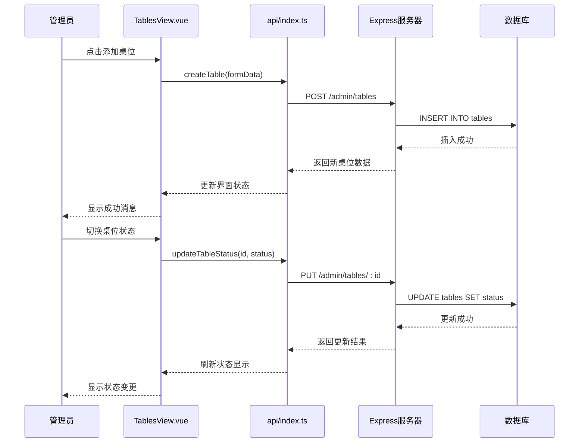

**图表来源**
- [src/admin/views/TablesView.vue:90-162](file://src/admin/views/TablesView.vue#L90-L162)
- [src/api/index.ts:297-322](file://src/api/index.ts#L297-L322)
- [server/src/routes/admin.ts:238-271](file://server/src/routes/admin.ts#L238-L271)

#### 关键功能特性

1. **实时状态更新**：界面支持即时的状态切换，用户可以看到状态变更的即时反馈
2. **搜索过滤**：支持按桌位编号和名称进行搜索过滤
3. **批量操作**：通过下拉菜单快速切换多个桌位状态
4. **响应式设计**：适配不同屏幕尺寸的设备

**章节来源**
- [src/admin/views/TablesView.vue:144-162](file://src/admin/views/TablesView.vue#L144-L162)
- [src/api/index.ts:297-322](file://src/api/index.ts#L297-L322)

### 客户端选择组件

客户端提供了直观的桌位选择界面，支持快速浏览和选择可用桌位：

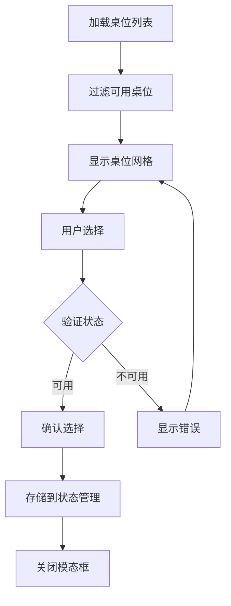

**图表来源**
- [src/client/components/TableSelectModal.vue:26-82](file://src/client/components/TableSelectModal.vue#L26-L82)

#### 用户交互流程

1. **状态指示**：使用不同颜色和图标表示桌位状态
2. **选择限制**：仅允许选择状态为"可用"的桌位
3. **视觉反馈**：提供选中状态的视觉提示
4. **确认机制**：通过确认按钮确保用户意图明确

**章节来源**
- [src/client/components/TableSelectModal.vue:1-231](file://src/client/components/TableSelectModal.vue#L1-L231)

### 后端API接口

后端提供了完整的RESTful API，支持多种查询场景：

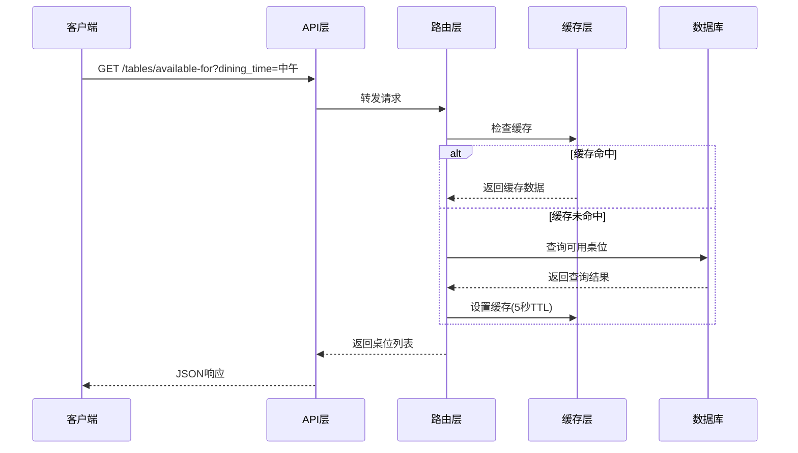

**图表来源**
- [server/src/routes/tables.ts:24-55](file://server/src/routes/tables.ts#L24-L55)

#### 接口规范

系统提供了以下主要接口：

| 接口 | 方法 | 参数 | 功能描述 |
|------|------|------|----------|
| `/tables` | GET | 无 | 获取所有桌位列表 |
| `/tables/available` | GET | 无 | 获取可用桌位列表 |
| `/tables/available-for` | GET | `dining_time` | 获取指定就餐时间的可用桌位 |
| `/admin/tables` | POST | 桌位数据 | 创建新桌位 |
| `/admin/tables/:id` | PUT | 桌位ID, 状态/数据 | 更新桌位信息或状态 |
| `/admin/tables/:id` | DELETE | 桌位ID | 删除桌位 |

**章节来源**
- [server/src/routes/tables.ts:13-93](file://server/src/routes/tables.ts#L13-L93)
- [src/api/index.ts:173-184](file://src/api/index.ts#L173-L184)

### 数据库设计

系统使用SQLite作为数据存储，采用规范化的设计确保数据完整性：

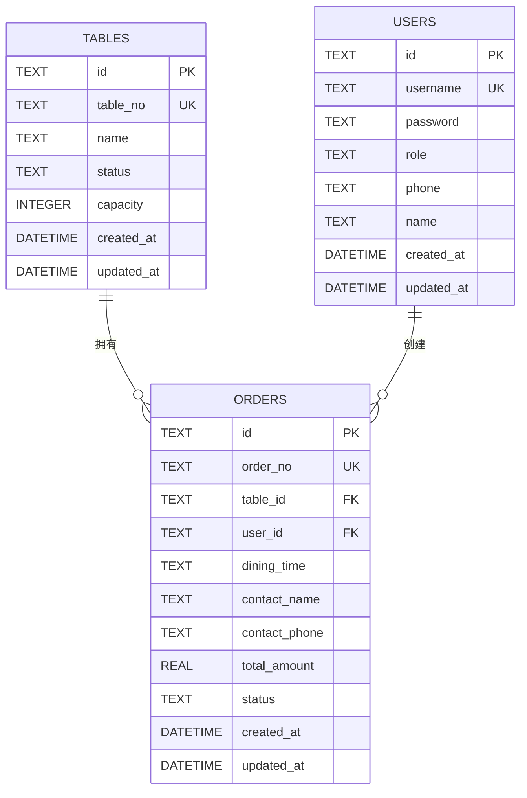

**图表来源**
- [server/src/db/init.ts:25-79](file://server/src/db/init.ts#L25-L79)

#### 索引优化

为了提升查询性能，系统建立了以下关键索引：

- `idx_tables_status`: 加速按状态查询
- `idx_orders_status`: 加速按订单状态查询
- `idx_orders_table_id`: 加速按桌位查询订单
- `idx_orders_user_id`: 加速按用户查询订单

**章节来源**
- [server/src/db/init.ts:124-136](file://server/src/db/init.ts#L124-L136)

## 依赖关系分析

桌位管理功能的依赖关系体现了清晰的分层架构：

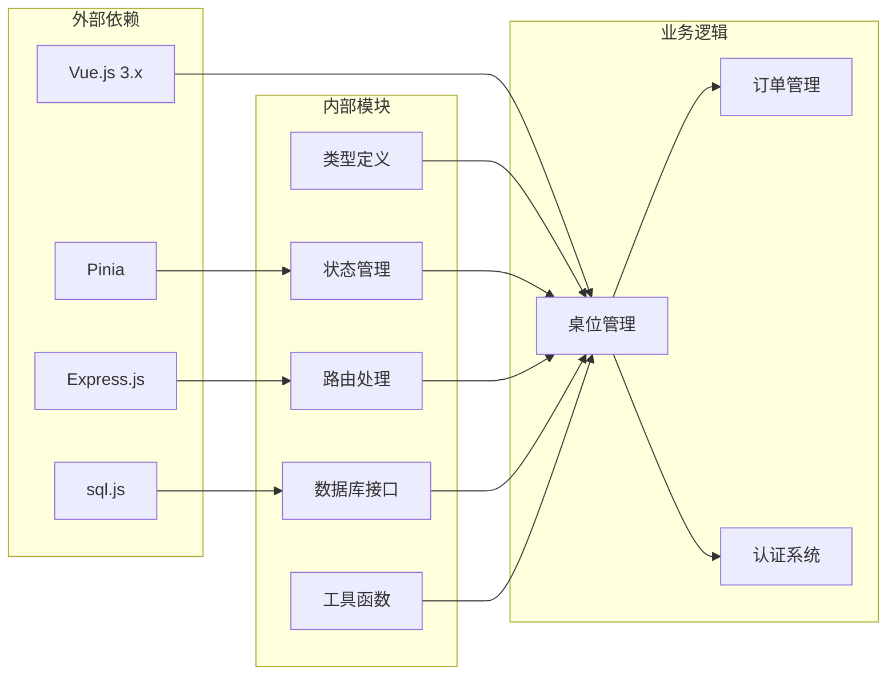

**图表来源**
- [src/types/index.ts:1-133](file://src/types/index.ts#L1-L133)
- [src/stores/table.ts:1-25](file://src/stores/table.ts#L1-L25)
- [server/src/db/index.ts:1-156](file://server/src/db/index.ts#L1-L156)

### 组件间通信

系统采用多种方式实现组件间的通信：

1. **父子组件通信**：通过props和emits传递数据和事件
2. **状态管理**：使用Pinia进行跨组件状态共享
3. **API调用**：统一的API封装层处理HTTP请求
4. **事件总线**：通过自定义事件实现松耦合通信

**章节来源**
- [src/admin/views/TablesView.vue:15-272](file://src/admin/views/TablesView.vue#L15-L272)
- [src/client/components/TableSelectModal.vue:15-82](file://src/client/components/TableSelectModal.vue#L15-L82)

## 性能考虑

### 缓存策略

系统实现了多层次的缓存机制来提升性能：

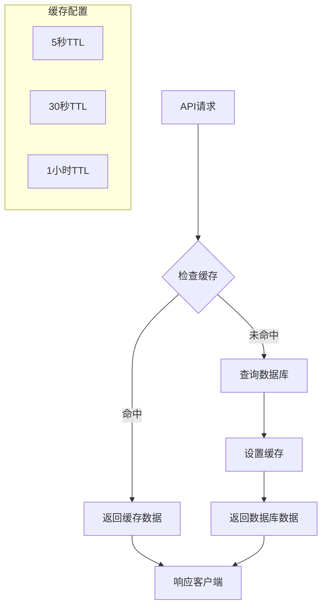

**图表来源**
- [server/src/routes/tables.ts:32-50](file://server/src/routes/tables.ts#L32-L50)

#### 缓存策略详情

1. **可用桌位缓存**：5秒TTL，用于频繁查询的场景
2. **按时间段查询缓存**：5秒TTL，针对特定就餐时间的查询
3. **前端内存缓存**：30秒TTL，减少重复请求

### 数据库优化

1. **批量操作**：使用事务批量执行数据库操作
2. **延迟保存**：通过防抖机制合并多次写操作
3. **索引优化**：为常用查询字段建立索引
4. **连接池管理**：合理管理数据库连接资源

**章节来源**
- [server/src/db/index.ts:36-60](file://server/src/db/index.ts#L36-L60)
- [server/src/db/index.ts:127-147](file://server/src/db/index.ts#L127-L147)

## 故障排除指南

### 常见问题及解决方案

#### 桌位状态异常

**问题现象**：桌位状态显示不正确或更新失败

**诊断步骤**：
1. 检查网络连接和API响应状态
2. 验证桌位ID的有效性
3. 确认数据库连接状态
4. 查看服务器日志中的错误信息

**解决方案**：
1. 重新加载页面刷新状态
2. 检查缓存是否过期
3. 重启应用服务
4. 清除浏览器缓存

#### 数据同步问题

**问题现象**：不同客户端看到不同的桌位状态

**诊断方法**：
1. 检查Redis缓存服务状态
2. 验证WebSocket连接
3. 确认事件广播机制

**处理方案**：
1. 实施强制缓存刷新
2. 使用事件驱动的实时更新
3. 增加重试机制

**章节来源**
- [src/admin/views/TablesView.vue:144-162](file://src/admin/views/TablesView.vue#L144-L162)
- [server/src/routes/tables.ts:8-11](file://server/src/routes/tables.ts#L8-L11)

### 错误处理机制

系统实现了完善的错误处理机制：

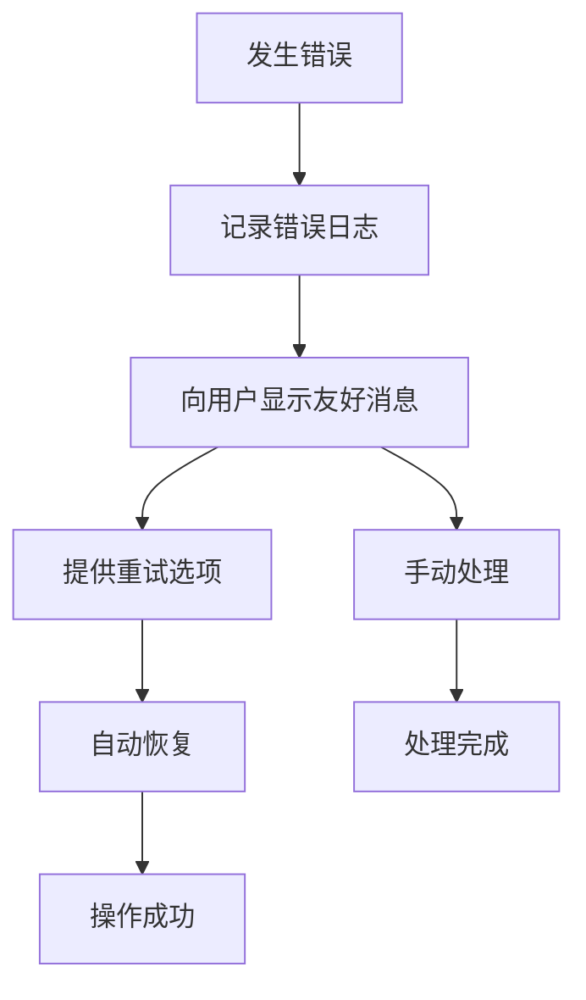

**图表来源**
- [src/admin/views/TablesView.vue:107-111](file://src/admin/views/TablesView.vue#L107-L111)

## 结论

RLRMS餐厅管理系统的桌位管理功能展现了现代Web应用的最佳实践。通过清晰的分层架构、完善的缓存策略和健壮的错误处理机制，系统能够高效地管理餐厅的桌位资源。

### 主要优势

1. **用户体验优秀**：直观的界面设计和实时的状态反馈
2. **性能表现优异**：多级缓存和数据库优化确保响应速度
3. **扩展性强**：模块化的架构便于功能扩展和维护
4. **可靠性高**：完善的错误处理和数据一致性保障

### 技术亮点

- **前后端分离**：采用现代化的开发模式
- **响应式设计**：适配多种设备和屏幕尺寸
- **实时同步**：通过事件机制实现实时状态更新
- **数据安全**：严格的输入验证和权限控制

该系统为餐厅管理提供了完整的技术解决方案，能够有效提升餐厅运营效率和服务质量。

## 附录

### 最佳实践建议

#### 桌位布局设计指南

1. **功能区域划分**
   - 入口区域：设置明显的引导标识
   - 餐饮区域：根据座位容量合理分布
   - 私密区域：提供包间和VIP座位
   - 通道宽度：确保至少1.2米的通行空间

2. **座位容量规划**
   - 小桌（2-4人）：适合情侣和朋友聚餐
   - 中桌（6-8人）：适合家庭和小型聚会
   - 大桌（10人以上）：适合团体活动和商务宴请

3. **特殊需求配置**
   - 无障碍座位：靠近入口和卫生间
   - 儿童座位：配备儿童椅和安全设施
   - 禁烟区域：独立的无烟座位区

#### 高峰时段调度策略

1. **提前预估**
   - 基于历史数据分析高峰时段
   - 预留额外座位应对突发需求
   - 准备临时座位解决方案

2. **动态调整**
   - 实时监控座位使用率
   - 灵活调整座位分配策略
   - 优化座位周转效率

3. **应急预案**
   - 准备备用座位方案
   - 建立座位协调机制
   - 提供替代用餐区域

#### 批量管理功能

系统支持以下批量操作：

- **批量状态更新**：一次性更新多个桌位状态
- **批量删除保护**：检查并阻止有活跃订单的桌位删除
- **批量导入导出**：支持CSV格式的批量数据处理
- **智能排序**：根据使用频率和位置优化座位排列

这些功能确保了餐厅管理者能够高效地维护和优化桌位资源配置，提升整体运营效率。