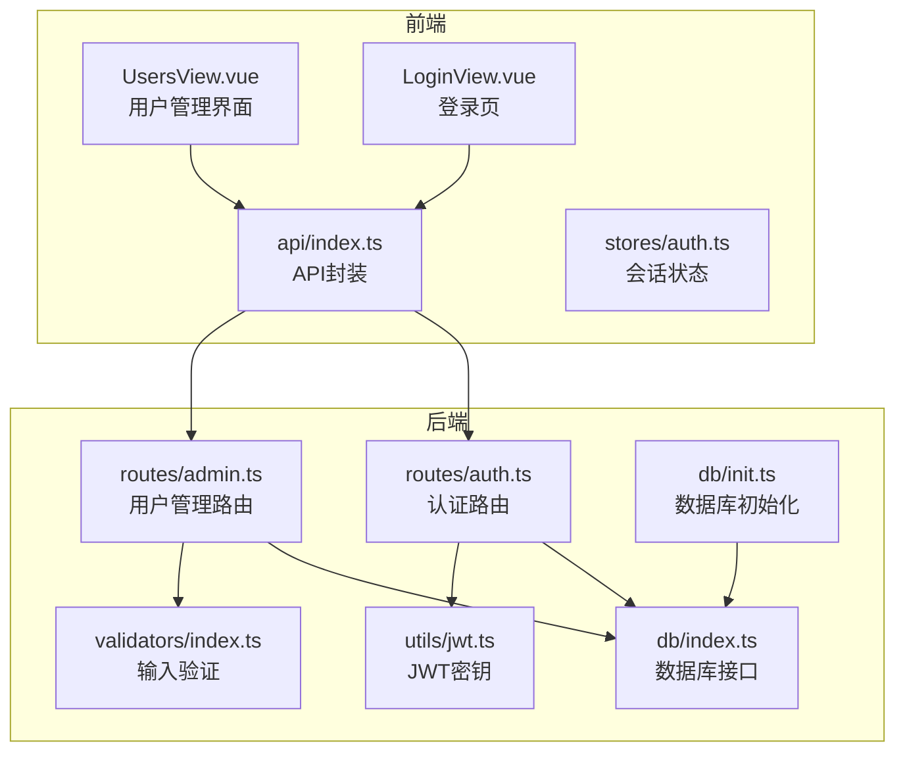
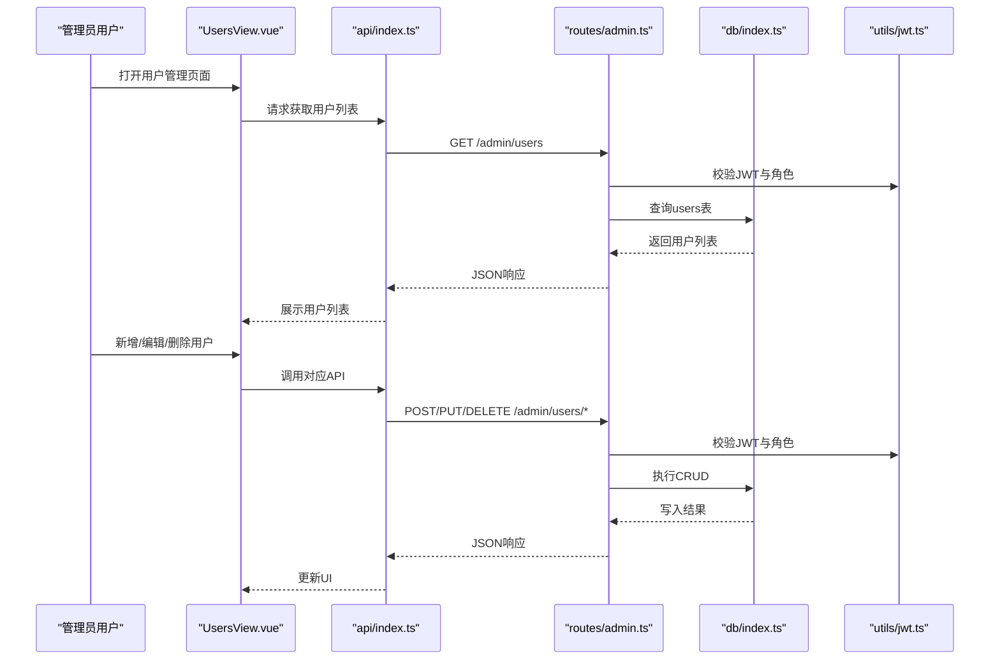
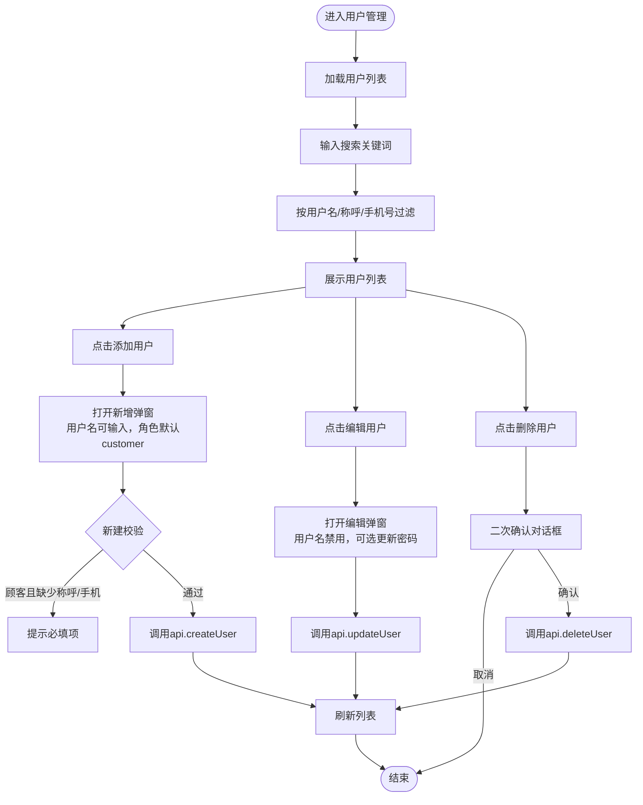
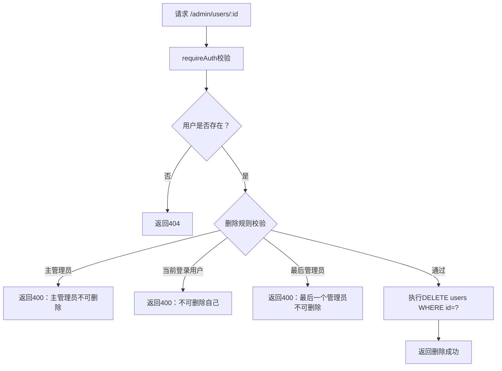
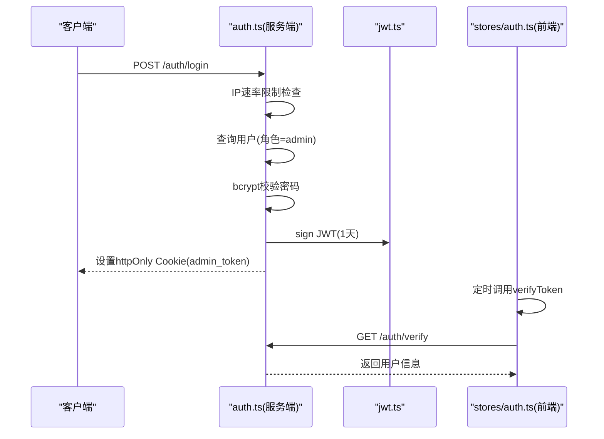
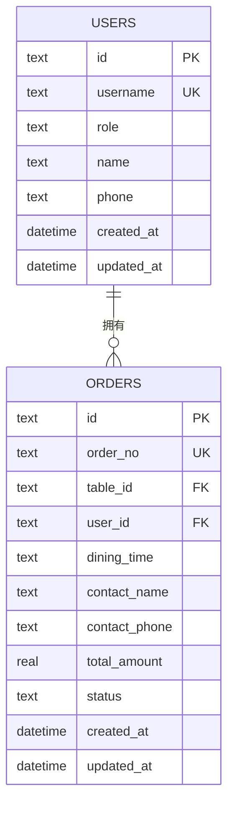
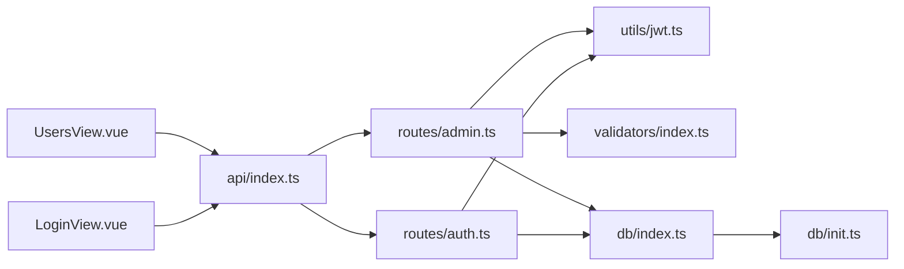

# 用户管理

<cite>
**本文引用的文件**
- [UsersView.vue](file://src/admin/views/UsersView.vue)
- [admin.ts](file://server/src/routes/admin.ts)
- [auth.ts](file://server/src/routes/auth.ts)
- [jwt.ts](file://server/src/utils/jwt.ts)
- [auth.ts（前端存储）](file://src/stores/auth.ts)
- [index.ts（API封装）](file://src/api/index.ts)
- [index.ts（类型定义）](file://src/types/index.ts)
- [index.ts（数据库初始化）](file://server/src/db/init.ts)
- [index.ts（数据库接口）](file://server/src/db/index.ts)
- [index.ts（验证器）](file://server/src/validators/index.ts)
- [LoginView.vue](file://src/admin/views/LoginView.vue)
</cite>

## 目录
1. [简介](#简介)
2. [项目结构](#项目结构)
3. [核心组件](#核心组件)
4. [架构总览](#架构总览)
5. [详细组件分析](#详细组件分析)
6. [依赖关系分析](#依赖关系分析)
7. [性能考量](#性能考量)
8. [故障排查指南](#故障排查指南)
9. [结论](#结论)
10. [附录](#附录)

## 简介
本文件面向RLRMS餐厅管理系统中的“用户管理”功能，系统性阐述管理员账户的创建、编辑、删除与权限管理，覆盖用户角色分配、权限控制与安全策略，以及登录审计、操作日志与账户安全保护机制。文档同时提供最佳实践建议，包括权限最小化原则、定期安全审查与用户培训指南，并强调用户数据隐私保护、访问控制与合规性要求。

## 项目结构
用户管理功能主要分布在以下层次：
- 前端管理界面：用户列表展示、新增/编辑/删除弹窗、搜索过滤
- 前端API封装：统一请求、鉴权、错误处理与缓存
- 后端路由：用户CRUD、鉴权中间件、业务规则校验
- 数据库层：SQLite（sql.js）持久化、索引优化、默认数据初始化
- 安全工具：JWT密钥管理、登录速率限制、密码哈希

图表来源
- [UsersView.vue:1-553](file://src/admin/views/UsersView.vue#L1-L553)
- [index.ts（API封装）:1-608](file://src/api/index.ts#L1-L608)
- [auth.ts（前端存储）:1-128](file://src/stores/auth.ts#L1-L128)
- [LoginView.vue:1-300](file://src/admin/views/LoginView.vue#L1-L300)
- [admin.ts:993-1141](file://server/src/routes/admin.ts#L993-L1141)
- [auth.ts:65-144](file://server/src/routes/auth.ts#L65-L144)
- [jwt.ts:1-27](file://server/src/utils/jwt.ts#L1-L27)
- [index.ts（验证器）:95-109](file://server/src/validators/index.ts#L95-L109)
- [index.ts（数据库初始化）:1-219](file://server/src/db/init.ts#L1-L219)
- [index.ts（数据库接口）:1-156](file://server/src/db/index.ts#L1-L156)

章节来源
- [UsersView.vue:1-553](file://src/admin/views/UsersView.vue#L1-L553)
- [index.ts（API封装）:1-608](file://src/api/index.ts#L1-L608)
- [auth.ts（前端存储）:1-128](file://src/stores/auth.ts#L1-L128)
- [LoginView.vue:1-300](file://src/admin/views/LoginView.vue#L1-L300)
- [admin.ts:993-1141](file://server/src/routes/admin.ts#L993-L1141)
- [auth.ts:65-144](file://server/src/routes/auth.ts#L65-L144)
- [jwt.ts:1-27](file://server/src/utils/jwt.ts#L1-L27)
- [index.ts（验证器）:95-109](file://server/src/validators/index.ts#L95-L109)
- [index.ts（数据库初始化）:1-219](file://server/src/db/init.ts#L1-L219)
- [index.ts（数据库接口）:1-156](file://server/src/db/index.ts#L1-L156)

## 核心组件
- 用户管理界面（UsersView.vue）
  - 列表展示、搜索过滤、新增/编辑/删除弹窗、日期格式化
  - 前端校验：新建顾客时称呼与手机号必填；编辑时密码留空表示不修改
- API封装（api/index.ts）
  - 统一请求、超时与信号合并、401自动触发会话过期事件、前端缓存策略
  - 提供用户管理相关接口：获取、创建、更新、删除
- 后端用户管理路由（routes/admin.ts）
  - 鉴权中间件：requireAuth（仅admin可用），JWT解码与角色校验
  - 用户CRUD：列表、创建、更新、删除；删除前业务规则校验（主管理员不可删、不可删当前登录用户、最后一管理员保护）
  - 输入验证：Zod schema（createUserSchema、updateUserSchema）
- 认证与会话（routes/auth.ts + utils/jwt.ts）
  - 登录：IP级登录速率限制、bcrypt密码校验、JWT签发、httpOnly Cookie设置
  - 会话保活：前端store定时验证token，过期触发全局事件
- 数据模型与数据库（types/index.ts + db/init.ts + db/index.ts）
  - 用户实体：id、username、role、name、phone、created_at、updated_at
  - 数据库初始化：users表、索引、默认admin账户、迁移与回填
  - 数据库接口：sql.js封装、批量写入、防抖保存

章节来源
- [UsersView.vue:1-553](file://src/admin/views/UsersView.vue#L1-L553)
- [index.ts（API封装）:434-457](file://src/api/index.ts#L434-L457)
- [admin.ts:993-1141](file://server/src/routes/admin.ts#L993-L1141)
- [auth.ts:65-144](file://server/src/routes/auth.ts#L65-L144)
- [jwt.ts:1-27](file://server/src/utils/jwt.ts#L1-L27)
- [index.ts（类型定义）:18-27](file://src/types/index.ts#L18-L27)
- [index.ts（数据库初始化）:11-22](file://server/src/db/init.ts#L11-L22)
- [index.ts（数据库接口）:100-140](file://server/src/db/index.ts#L100-L140)

## 架构总览
用户管理采用前后端分离架构，前端通过API封装调用后端REST接口，后端路由负责鉴权与业务校验，数据库层提供持久化能力。

图表来源
- [UsersView.vue:40-124](file://src/admin/views/UsersView.vue#L40-L124)
- [index.ts（API封装）:434-457](file://src/api/index.ts#L434-L457)
- [admin.ts:995-1141](file://server/src/routes/admin.ts#L995-L1141)
- [index.ts（数据库接口）:100-140](file://server/src/db/index.ts#L100-L140)
- [jwt.ts:1-27](file://server/src/utils/jwt.ts#L1-L27)

## 详细组件分析

### 用户管理界面（UsersView.vue）
- 功能要点
  - 列表加载与搜索过滤：支持按用户名、称呼、手机号过滤
  - 新增/编辑弹窗：用户名在新增时不可更改；编辑时密码留空表示不修改
  - 删除确认：二次确认对话框
  - 日期格式化：本地化显示created_at
- 前端校验
  - 新建顾客：称呼与手机号必填
  - 编辑用户：可选择性更新role/name/phone/phone/password
- 交互流程
  - 打开新增弹窗：清空表单，role默认customer
  - 打开编辑弹窗：填充当前用户信息，禁用用户名
  - 保存：根据editingUser判断新增或更新，调用api封装方法
  - 删除：调用api.deleteUser，刷新列表

图表来源
- [UsersView.vue:40-144](file://src/admin/views/UsersView.vue#L40-L144)

章节来源
- [UsersView.vue:1-553](file://src/admin/views/UsersView.vue#L1-L553)

### 后端用户管理路由（routes/admin.ts）
- 鉴权中间件
  - requireAuth：从Cookie读取admin_token，验证JWT，校验role=admin
- 用户CRUD
  - GET /admin/users：查询所有用户，按创建时间升序
  - POST /admin/users：创建用户，Zod校验、用户名唯一性、bcrypt加密密码
  - PUT /admin/users/:id：更新用户，支持role/name/phone/password（密码可选）
  - DELETE /admin/users/:id：删除用户，业务规则校验
- 业务规则校验（删除）
  - 主管理员不可删除
  - 不可删除当前登录用户
  - 不可删除最后一个管理员账户
- 输入验证
  - createUserSchema：用户名、密码长度、角色枚举、可选name/phone
  - updateUserSchema：同上，字段可选

图表来源
- [admin.ts:1106-1141](file://server/src/routes/admin.ts#L1106-L1141)
- [index.ts（验证器）:95-109](file://server/src/validators/index.ts#L95-L109)

章节来源
- [admin.ts:993-1141](file://server/src/routes/admin.ts#L993-L1141)
- [index.ts（验证器）:95-109](file://server/src/validators/index.ts#L95-L109)

### 认证与会话（routes/auth.ts + utils/jwt.ts + stores/auth.ts）
- 登录流程
  - IP级登录速率限制（15分钟窗口最多5次）
  - 校验用户名与角色为admin
  - bcrypt比对密码
  - 签发JWT（1天有效期），设置httpOnly Cookie
- 会话保活
  - 前端store定时调用verifyToken，若401则触发全局auth:expired事件
  - 会话过期阈值：24小时，即将过期阈值30分钟
- JWT密钥
  - 开发环境：基于主机与用户名派生固定密钥
  - 生产环境：随机密钥或可通过环境变量指定

图表来源
- [auth.ts:65-144](file://server/src/routes/auth.ts#L65-L144)
- [jwt.ts:1-27](file://server/src/utils/jwt.ts#L1-L27)
- [auth.ts（前端存储）:37-55](file://src/stores/auth.ts#L37-L55)

章节来源
- [auth.ts:65-144](file://server/src/routes/auth.ts#L65-L144)
- [jwt.ts:1-27](file://server/src/utils/jwt.ts#L1-L27)
- [auth.ts（前端存储）:1-128](file://src/stores/auth.ts#L1-L128)

### 数据模型与数据库（types/index.ts + db/init.ts + db/index.ts）
- 用户实体
  - id、username（唯一）、role（admin/customer）、name、phone、created_at、updated_at
- 数据库初始化
  - users表、索引（orders、dishes、tables、users）
  - 初始化默认admin用户（如不存在）
  - 迁移历史customer用户名为数字会员号
  - 回填历史订单user_id
- 数据库接口
  - get、all、run、exec等SQL封装
  - 批量写入beginBatch/endBatch与防抖保存saveDatabase

图表来源
- [index.ts（类型定义）:18-27](file://src/types/index.ts#L18-L27)
- [index.ts（数据库初始化）:11-22](file://server/src/db/init.ts#L11-L22)
- [index.ts（数据库初始化）:63-79](file://server/src/db/init.ts#L63-L79)

章节来源
- [index.ts（类型定义）:18-27](file://src/types/index.ts#L18-L27)
- [index.ts（数据库初始化）:1-219](file://server/src/db/init.ts#L1-L219)
- [index.ts（数据库接口）:1-156](file://server/src/db/index.ts#L1-L156)

## 依赖关系分析
- 前端依赖
  - UsersView.vue依赖api封装进行CRUD
  - LoginView.vue依赖api.login与auth store
  - auth store依赖api.verifyToken进行会话保活
- 后端依赖
  - admin路由依赖requireAuth中间件、JWT工具、Zod验证器、数据库接口
  - auth路由依赖JWT工具、bcrypt、数据库接口
- 数据库依赖
  - db/index.ts提供统一SQL接口，db/init.ts负责表结构与默认数据

图表来源
- [UsersView.vue:1-553](file://src/admin/views/UsersView.vue#L1-L553)
- [LoginView.vue:1-300](file://src/admin/views/LoginView.vue#L1-L300)
- [index.ts（API封装）:1-608](file://src/api/index.ts#L1-L608)
- [admin.ts:1-18](file://server/src/routes/admin.ts#L1-L18)
- [auth.ts:1-17](file://server/src/routes/auth.ts#L1-L17)
- [jwt.ts:1-27](file://server/src/utils/jwt.ts#L1-L27)
- [index.ts（验证器）:1-123](file://server/src/validators/index.ts#L1-L123)
- [index.ts（数据库接口）:1-156](file://server/src/db/index.ts#L1-L156)
- [index.ts（数据库初始化）:1-219](file://server/src/db/init.ts#L1-L219)

章节来源
- [index.ts（API封装）:1-608](file://src/api/index.ts#L1-L608)
- [admin.ts:1-18](file://server/src/routes/admin.ts#L1-L18)
- [auth.ts:1-17](file://server/src/routes/auth.ts#L1-L17)
- [jwt.ts:1-27](file://server/src/utils/jwt.ts#L1-L27)
- [index.ts（验证器）:1-123](file://server/src/validators/index.ts#L1-L123)
- [index.ts（数据库接口）:1-156](file://server/src/db/index.ts#L1-L156)
- [index.ts（数据库初始化）:1-219](file://server/src/db/init.ts#L1-L219)

## 性能考量
- 前端缓存
  - api封装采用stale-while-revalidate策略，30秒TTL，降低重复请求
- 数据库写入
  - 批量写入beginBatch/endBatch与saveDatabase防抖，减少磁盘IO
- 查询优化
  - users表建立索引（phone、role），提升查询与JOIN性能
- 会话保活
  - 前端5分钟验证一次token，避免频繁请求

章节来源
- [index.ts（API封装）:9-34](file://src/api/index.ts#L9-L34)
- [index.ts（数据库接口）:46-73](file://server/src/db/index.ts#L46-L73)
- [index.ts（数据库初始化）:138-152](file://server/src/db/init.ts#L138-L152)
- [auth.ts（前端存储）:37-55](file://src/stores/auth.ts#L37-L55)

## 故障排查指南
- 登录失败
  - 检查用户名/密码是否正确；确认IP速率限制是否触发
  - 确认用户角色为admin
- 会话过期
  - 前端会监听auth:expired事件并提示重新登录
  - 检查Cookie是否被浏览器阻止或跨域问题
- 用户删除失败
  - 确认不是主管理员账户
  - 确认不是当前登录用户
  - 确认删除后仍有至少一名管理员
- 密码修改
  - 确认旧密码正确，新密码长度符合要求（6-128字符）

章节来源
- [auth.ts:65-144](file://server/src/routes/auth.ts#L65-L144)
- [auth.ts（前端存储）:41-54](file://src/stores/auth.ts#L41-L54)
- [admin.ts:1106-1141](file://server/src/routes/admin.ts#L1106-L1141)
- [auth.ts:346-405](file://server/src/routes/auth.ts#L346-L405)

## 结论
RLRMS的用户管理功能通过严格的前后端协作实现了完善的管理员账户生命周期管理。前端提供直观的用户界面与输入校验，后端通过JWT鉴权、Zod验证与业务规则保障安全性与一致性。数据库层面的索引与批量写入提升了性能。建议在生产环境中强化日志审计与合规性检查，持续进行安全审查与用户培训，确保系统长期稳定运行。

## 附录
- 最佳实践
  - 权限最小化：仅授予必要角色与操作权限
  - 定期安全审查：检查用户权限、登录日志、异常行为
  - 用户培训：规范密码策略、双因素认证（建议）、安全意识教育
  - 隐私保护：遵循最小化收集原则，明确数据用途与保留期限
  - 合规性：满足《网络安全法》与《个人信息保护法》要求，建立数据处理清单与用户权利响应机制