# 管理功能模块

<cite>
**本文档引用的文件**
- [README.md](file://README.md)
- [LayoutView.vue](file://src/admin/views/LayoutView.vue)
- [LoginView.vue](file://src/admin/views/LoginView.vue)
- [DashboardView.vue](file://src/admin/views/DashboardView.vue)
- [DishesView.vue](file://src/admin/views/DishesView.vue)
- [TablesView.vue](file://src/admin/views/TablesView.vue)
- [InventoryView.vue](file://src/admin/views/InventoryView.vue)
- [UsersView.vue](file://src/admin/views/UsersView.vue)
- [SettingsView.vue](file://src/admin/views/SettingsView.vue)
- [OrdersView.vue](file://src/admin/views/OrdersView.vue)
- [index.ts](file://src/api/index.ts)
- [auth.ts](file://src/stores/auth.ts)
- [index.ts](file://server/src/index.ts)
- [admin.ts](file://server/src/routes/admin.ts)
- [jwt.ts](file://server/src/utils/jwt.ts)
</cite>

## 目录
1. [项目概述](#项目概述)
2. [系统架构](#系统架构)
3. [管理员认证与权限](#管理员认证与权限)
4. [仪表盘概览](#仪表盘概览)
5. [菜品管理](#菜品管理)
6. [桌位管理](#桌位管理)
7. [订单管理](#订单管理)
8. [库存管理](#库存管理)
9. [用户管理](#用户管理)
10. [系统设置](#系统设置)
11. [实时推送机制](#实时推送机制)
12. [数据安全与防护](#数据安全与防护)
13. [使用指南与最佳实践](#使用指南与最佳实践)
14. [故障排除](#故障排除)
15. [总结](#总结)

## 项目概述

红灯笼食府管理系统是一个基于 Vue 3 + Node.js + SQLite 的餐饮企业管理解决方案。系统采用前后端分离架构，包含顾客端（C端）和管理端（B端）两大模块。

### 核心特性
- **实时订单管理**：支持实时订单推送和状态变更通知
- **多维度数据统计**：提供详细的经营数据分析
- **灵活的权限控制**：基于角色的访问控制机制
- **数据安全保障**：多重安全防护措施
- **移动端适配**：完整的响应式设计

**章节来源**
- [README.md: 21-266:21-266](file://README.md#L21-L266)

## 系统架构

系统采用现代化的前后端分离架构，结合了多种技术栈的优势：

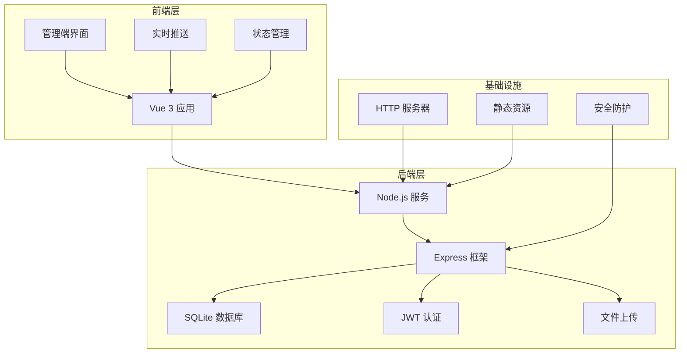

**图表来源**
- [index.ts:34-143](file://server/src/index.ts#L34-L143)
- [admin.ts:107-131](file://server/src/routes/admin.ts#L107-L131)

### 技术栈
- **前端**：Vue 3.5 + TypeScript + Pinia + Vite
- **后端**：Node.js + Express + sql.js (SQLite)
- **数据库**：SQLite (sql.js 实现)
- **认证**：JWT (JSON Web Token)
- **文件处理**：Sharp 图片处理 + Multer 文件上传

**章节来源**
- [README.md: 29-59:29-59](file://README.md#L29-L59)

## 管理员认证与权限

### 认证机制

系统采用基于 JWT 的认证机制，确保管理员认证的安全性和可靠性：

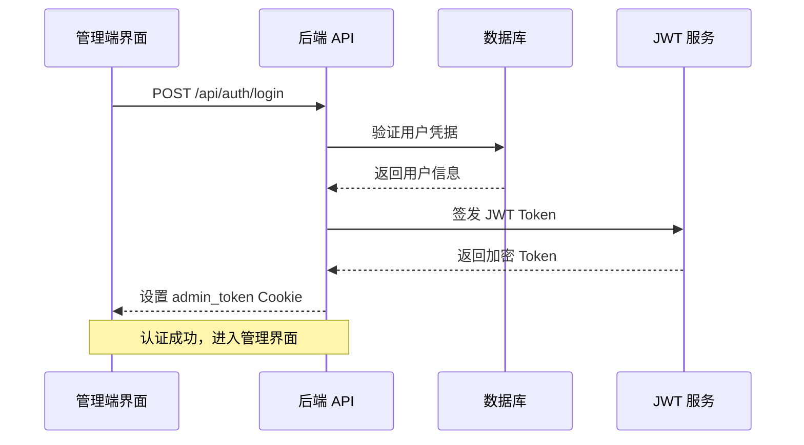

**图表来源**
- [admin.ts:116-131](file://server/src/routes/admin.ts#L116-L131)
- [jwt.ts:1-27](file://server/src/utils/jwt.ts#L1-L27)

### 权限控制策略

系统实现了严格的权限控制机制：

| 功能模块 | 访问权限 | 操作权限 | 安全措施 |
|---------|---------|---------|---------|
| 仪表盘 | 管理员 | 查看统计 | JWT 验证 |
| 菜品管理 | 管理员 | 增删改查 | 参数验证 |
| 桌位管理 | 管理员 | 增删改查 | 状态约束 |
| 订单管理 | 管理员 | 状态更新 | 事务处理 |
| 库存管理 | 管理员 | 增删改查 | 预警机制 |
| 用户管理 | 管理员 | 增删改查 | 最低权限 |
| 系统设置 | 管理员 | 配置修改 | 二次确认 |

### 会话管理

系统采用智能的会话管理机制：

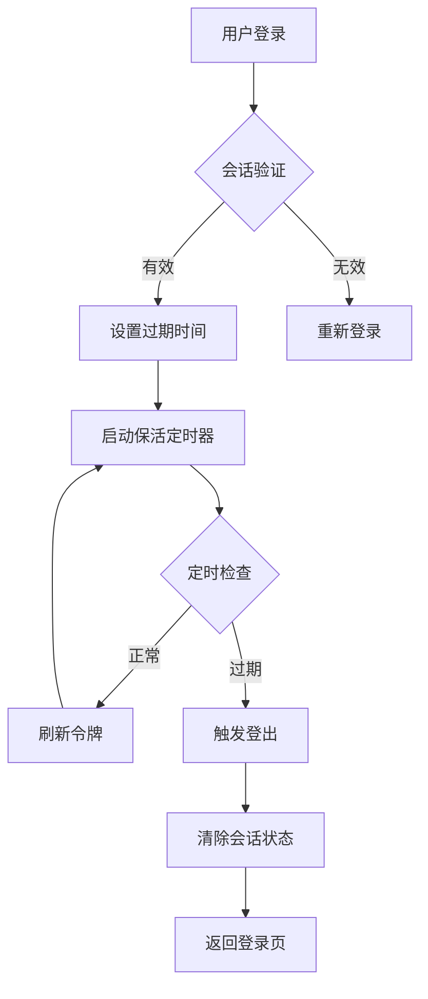

**图表来源**
- [auth.ts:37-55](file://src/stores/auth.ts#L37-L55)
- [auth.ts:71-85](file://src/stores/auth.ts#L71-L85)

**章节来源**
- [admin.ts:116-131](file://server/src/routes/admin.ts#L116-L131)
- [auth.ts:15-127](file://src/stores/auth.ts#L15-L127)

## 仪表盘概览

### 数据统计面板

仪表盘提供了全面的经营数据分析：

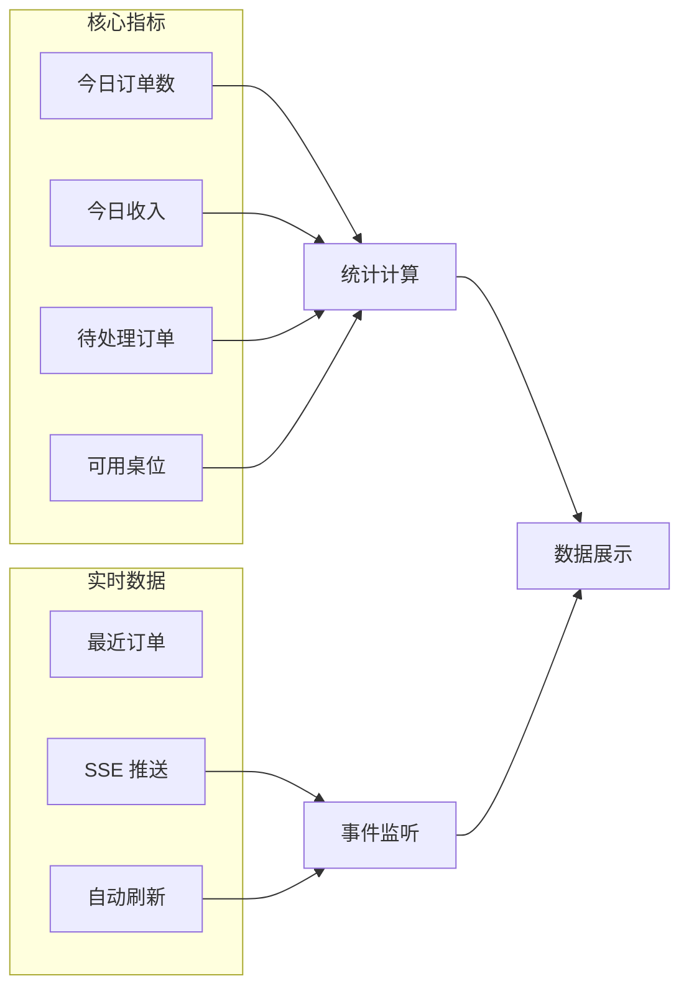

**图表来源**
- [DashboardView.vue:144-160](file://src/admin/views/DashboardView.vue#L144-L160)
- [DashboardView.vue:308-391](file://src/admin/views/DashboardView.vue#L308-L391)

### 订单管理功能

仪表盘集成了完整的订单管理能力：

| 功能特性 | 描述 | 实现方式 |
|---------|------|---------|
| 订单筛选 | 支持按状态、日期筛选 | URL 参数查询 |
| 实时更新 | SSE 实时推送订单状态 | EventSource 连接 |
| 批量操作 | 支持批量状态更新 | 前端状态缓存 |
| 搜索功能 | 支持订单号模糊搜索 | API 模糊匹配 |
| 清理功能 | 支持清理已完成订单 | 批量删除操作 |

**章节来源**
- [DashboardView.vue:1-800](file://src/admin/views/DashboardView.vue#L1-L800)

## 菜品管理

### 菜品生命周期管理

系统提供了完整的菜品管理功能：

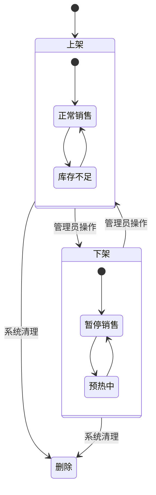

**图表来源**
- [DishesView.vue:69-84](file://src/admin/views/DishesView.vue#L69-L84)
- [DishesView.vue:185-207](file://src/admin/views/DishesView.vue#L185-L207)

### 菜品数据模型

| 字段名称 | 类型 | 描述 | 约束 |
|---------|------|------|------|
| id | string | 菜品唯一标识 | UUID |
| name | string | 菜品名称 | 非空，唯一 |
| price | number | 菜品价格 | 数值，>=0 |
| category_id | string | 分类标识 | 外键关联 |
| description | string | 菜品描述 | 可选 |
| tags | string[] | 标签数组 | JSON 序列化 |
| specs | string[] | 规格数组 | JSON 序列化 |
| status | enum | 销售状态 | on_sale/off_sale |
| sort_order | number | 排序权重 | 整数 |
| image_url | string | 图片地址 | 可选 |

### 分类管理

系统支持灵活的菜品分类管理：

| 功能 | 描述 | 实现细节 |
|------|------|---------|
| 分类创建 | 支持动态创建分类 | 名称唯一性验证 |
| 分类删除 | 支持删除空分类 | 约束检查 |
| 分类排序 | 支持拖拽排序 | 数据库排序字段 |
| 分类重命名 | 支持批量重命名 | 批量更新操作 |

**章节来源**
- [DishesView.vue:1-800](file://src/admin/views/DishesView.vue#L1-L800)
- [admin.ts:341-546](file://server/src/routes/admin.ts#L341-L546)

## 桌位管理

### 桌位状态管理

系统提供完整的桌位管理功能：

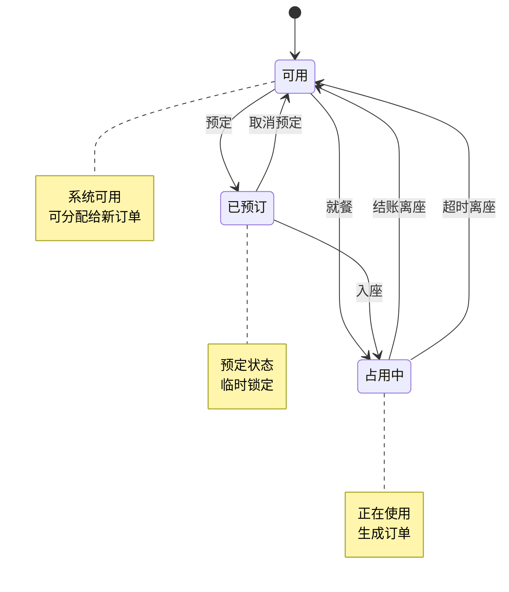

**图表来源**
- [TablesView.vue:144-162](file://src/admin/views/TablesView.vue#L144-L162)
- [admin.ts:223-337](file://server/src/routes/admin.ts#L223-L337)

### 桌位数据模型

| 字段名称 | 类型 | 描述 | 约束 |
|---------|------|------|------|
| id | string | 桌位唯一标识 | UUID |
| table_no | string | 桌位编号 | 非空，唯一 |
| name | string | 桌位名称 | 非空，唯一 |
| capacity | number | 容纳人数 | 整数，>=1 |
| status | enum | 桌位状态 | available/reserved/occupied |
| created_at | datetime | 创建时间 | 自动记录 |
| updated_at | datetime | 更新时间 | 自动更新 |

### 桌位操作流程

系统支持多种桌位操作场景：

1. **新增桌位**：验证编号唯一性 → 创建桌位记录 → 缓存失效
2. **更新状态**：验证状态合法性 → 更新状态字段 → 缓存失效
3. **删除桌位**：检查订单约束 → 删除桌位记录 → 缓存失效
4. **批量排序**：验证排序数据 → 批量更新排序字段 → 缓存失效

**章节来源**
- [TablesView.vue:1-484](file://src/admin/views/TablesView.vue#L1-L484)
- [admin.ts:223-337](file://server/src/routes/admin.ts#L223-L337)

## 订单管理

### 订单状态流转

系统实现了完整的订单状态管理：

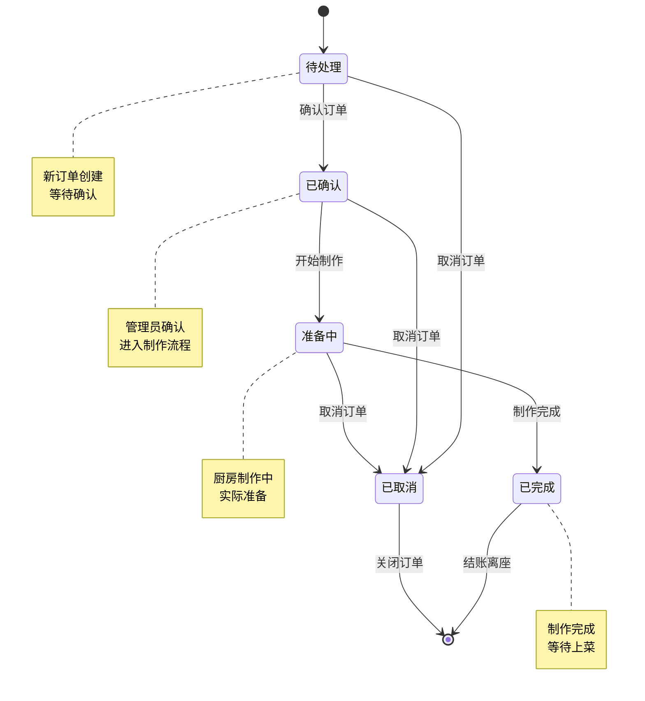

**图表来源**
- [DashboardView.vue:215-241](file://src/admin/views/DashboardView.vue#L215-L241)
- [admin.ts:795-800](file://server/src/routes/admin.ts#L795-L800)

### 订单数据模型

| 字段名称 | 类型 | 描述 | 约束 |
|---------|------|------|------|
| id | string | 订单唯一标识 | UUID |
| order_no | string | 订单编号 | RL+日期+随机码 |
| table_id | string | 桌位标识 | 外键关联 |
| dining_time | enum | 就餐时段 | 中午/晚上/null |
| contact_name | string | 联系人姓名 | 可选 |
| contact_phone | string | 联系电话 | 可选 |
| total_amount | number | 订单总金额 | 数值，>=0 |
| status | enum | 订单状态 | 待处理/已确认/准备中/已完成/已取消 |
| items | OrderItem[] | 订单明细 | JSON 数组 |
| created_at | datetime | 创建时间 | 自动记录 |
| updated_at | datetime | 更新时间 | 自动更新 |

### 订单操作流程

系统支持完整的订单操作流程：

1. **订单查询**：支持按状态、日期范围查询 → 批量获取订单详情 → 预加载订单明细
2. **状态更新**：验证状态转换合法性 → 更新订单状态 → 实时推送状态变更
3. **订单搜索**：支持订单号模糊搜索 → 返回匹配订单列表 → 展示订单详情
4. **批量清理**：过滤已完成/已取消订单 → 执行批量删除 → 更新统计信息

**章节来源**
- [DashboardView.vue:162-183](file://src/admin/views/DashboardView.vue#L162-L183)
- [admin.ts:643-793](file://server/src/routes/admin.ts#L643-L793)

## 库存管理

### 库存监控机制

系统提供了完善的库存管理功能：

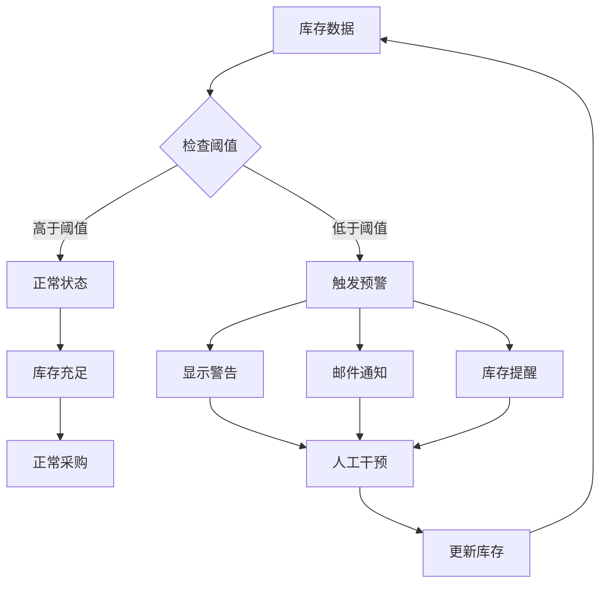

**图表来源**
- [InventoryView.vue:127-129](file://src/admin/views/InventoryView.vue#L127-L129)
- [InventoryView.vue:35-50](file://src/admin/views/InventoryView.vue#L35-L50)

### 库存数据模型

| 字段名称 | 类型 | 描述 | 约束 |
|---------|------|------|------|
| id | string | 库存唯一标识 | UUID |
| material_name | string | 物料名称 | 非空，唯一 |
| quantity | number | 库存数量 | 数值，>=0 |
| unit | string | 计量单位 | 非空 |
| warning_threshold | number | 预警阈值 | 数值，>=0 |
| sort_order | number | 排序权重 | 整数 |
| created_at | datetime | 创建时间 | 自动记录 |
| updated_at | datetime | 更新时间 | 自动更新 |

### 库存操作功能

系统支持多种库存操作场景：

1. **物料入库**：验证物料唯一性 → 创建库存记录 → 更新库存数量
2. **物料出库**：检查库存充足性 → 更新库存数量 → 记录出库明细
3. **库存调整**：支持手动调整库存数量 → 更新预警状态 → 实时刷新界面
4. **预警管理**：设置库存预警阈值 → 监控库存变化 → 触发预警通知

**章节来源**
- [InventoryView.vue:1-507](file://src/admin/views/InventoryView.vue#L1-L507)
- [admin.ts:641-793](file://server/src/routes/admin.ts#L641-L793)

## 用户管理

### 用户权限体系

系统实现了灵活的用户管理机制：

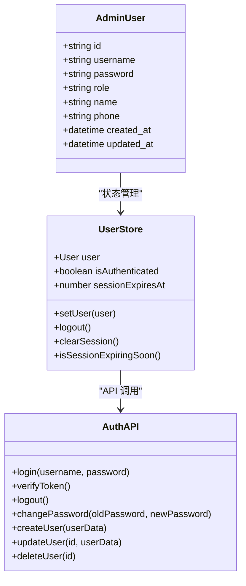

**图表来源**
- [UsersView.vue:1-553](file://src/admin/views/UsersView.vue#L1-L553)
- [auth.ts:15-127](file://src/stores/auth.ts#L15-L127)

### 用户数据模型

| 字段名称 | 类型 | 描述 | 约束 |
|---------|------|------|------|
| id | string | 用户唯一标识 | UUID |
| username | string | 用户名 | 非空，唯一 |
| password | string | 密码 | 加密存储 |
| role | enum | 用户角色 | admin/customer |
| name | string | 姓名 | 可选 |
| phone | string | 电话号码 | 可选 |
| created_at | datetime | 创建时间 | 自动记录 |
| updated_at | datetime | 更新时间 | 自动更新 |

### 用户管理功能

系统提供了完整的用户管理功能：

1. **用户创建**：验证用户名唯一性 → 创建用户记录 → 设置默认权限
2. **用户更新**：支持密码修改 → 角色变更 → 基本信息更新
3. **用户删除**：检查删除约束 → 删除用户记录 → 禁止删除主管理员
4. **权限控制**：基于角色的权限验证 → 访问控制列表 → 安全审计

**章节来源**
- [UsersView.vue:1-553](file://src/admin/views/UsersView.vue#L1-L553)
- [admin.ts:795-800](file://server/src/routes/admin.ts#L795-L800)

## 系统设置

### 系统配置管理

系统提供了全面的配置管理功能：

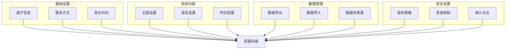

**图表来源**
- [SettingsView.vue:1-907](file://src/admin/views/SettingsView.vue#L1-L907)

### 配置数据模型

| 配置项 | 类型 | 描述 | 默认值 |
|-------|------|------|--------|
| restaurant_name | string | 餐厅名称 | "" |
| restaurant_phone | string | 联系电话 | "" |
| restaurant_address | string | 餐厅地址 | "" |
| business_hours | string | 营业时间 | "" |
| theme_mode | string | 主题模式 | "system" |
| language | string | 系统语言 | "zh-CN" |
| timezone | string | 时区设置 | "Asia/Shanghai" |

### 数据管理功能

系统支持多种数据管理操作：

1. **数据导出**：生成完整数据备份 → ZIP 压缩打包 → 安全传输
2. **数据导入**：ZIP 文件解析 → 数据验证 → 安全导入
3. **数据库重置**：二次确认机制 → 完全数据清除 → 系统初始化
4. **配置恢复**：默认配置加载 → 系统状态重置 → 安全验证

**章节来源**
- [SettingsView.vue:1-907](file://src/admin/views/SettingsView.vue#L1-L907)
- [admin.ts:795-800](file://server/src/routes/admin.ts#L795-L800)

## 实时推送机制

### SSE 实时推送

系统采用了 Server-Sent Events (SSE) 实现实时推送功能：

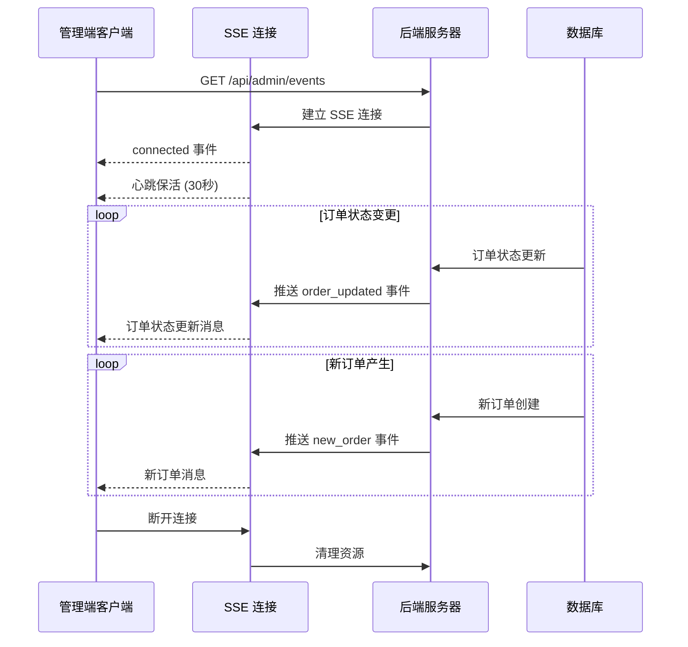

**图表来源**
- [DashboardView.vue:308-391](file://src/admin/views/DashboardView.vue#L308-L391)
- [admin.ts:134-162](file://server/src/routes/admin.ts#L134-L162)

### 推送事件类型

系统支持多种推送事件类型：

| 事件类型 | 触发条件 | 数据格式 | 处理逻辑 |
|---------|---------|---------|---------|
| connected | SSE 连接建立 | { clientId: string } | 初始化客户端状态 |
| heartbeat | 心跳保活 | 无 | 维持连接活跃 |
| new_order | 新订单创建 | Order 对象 | 插入订单列表顶部 |
| order_updated | 订单状态变更 | { id: string, status: string } | 更新对应订单状态 |
| add_items | 加菜请求 | { id: string, type: 'add_items' } | 增加加菜计数 |

### 降级机制

系统实现了完善的降级机制：

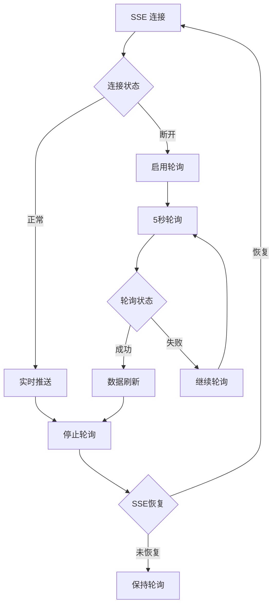

**图表来源**
- [DashboardView.vue:414-446](file://src/admin/views/DashboardView.vue#L414-L446)

**章节来源**
- [DashboardView.vue:302-446](file://src/admin/views/DashboardView.vue#L302-L446)
- [admin.ts:134-162](file://server/src/routes/admin.ts#L134-L162)

## 数据安全与防护

### 安全防护措施

系统实施了多层次的安全防护措施：

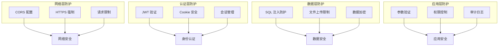

**图表来源**
- [index.ts:38-67](file://server/src/index.ts#L38-L67)
- [admin.ts:116-131](file://server/src/routes/admin.ts#L116-L131)

### 安全配置

系统的关键安全配置：

| 安全措施 | 实现方式 | 防护效果 |
|---------|---------|---------|
| CORS 配置 | 仅允许指定域名 | 防止跨域攻击 |
| Cookie 安全 | httpOnly + Secure | 防止 XSS 攻击 |
| JWT 密钥 | 动态生成 + 环境变量 | 防止令牌伪造 |
| 文件上传 | 类型限制 + 大小限制 | 防止恶意文件上传 |
| SQL 防护 | 参数化查询 + 输入验证 | 防止 SQL 注入 |
| 权限控制 | 角色验证 + 路由守卫 | 防止越权访问 |

### 审计日志

系统记录关键操作的审计日志：

| 操作类型 | 记录内容 | 存储位置 | 保留期限 |
|---------|---------|---------|---------|
| 用户登录 | 用户名、IP、时间 | 日志文件 | 30天 |
| 数据修改 | 操作类型、数据变更 | 审计表 | 90天 |
| 系统配置 | 配置变更、操作人 | 审计表 | 180天 |
| 异常事件 | 错误代码、堆栈信息 | 错误日志 | 7天 |

**章节来源**
- [index.ts:38-67](file://server/src/index.ts#L38-L67)
- [admin.ts:116-131](file://server/src/routes/admin.ts#L116-L131)
- [README.md: 565-578:565-578](file://README.md#L565-L578)

## 使用指南与最佳实践

### 管理员登录流程

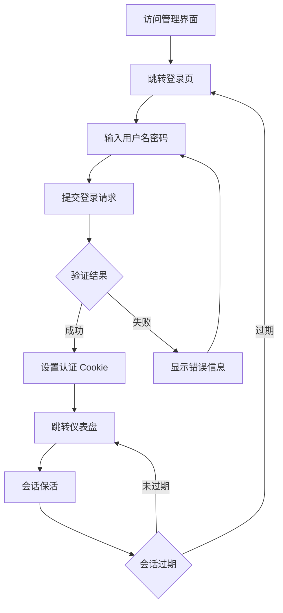

**图表来源**
- [LoginView.vue:20-42](file://src/admin/views/LoginView.vue#L20-L42)
- [auth.ts:37-55](file://src/stores/auth.ts#L37-L55)

### 日常运营最佳实践

#### 菜品管理
- **定期维护**：每周检查菜品状态，及时上下架
- **价格管理**：建立价格调整流程，确保价格准确性
- **图片优化**：使用标准尺寸图片，提升加载速度
- **分类整理**：定期优化分类结构，保持清晰有序

#### 桌位管理
- **状态同步**：实时更新桌位状态，避免重复预订
- **容量规划**：根据餐厅容量合理设置桌位数量
- **特殊需求**：为VIP桌位预留特殊标识
- **清洁消毒**：建立桌位清洁消毒流程

#### 订单管理
- **响应时效**：新订单应在1-2分钟内响应
- **状态更新**：及时更新订单状态，保持信息准确
- **异常处理**：建立异常订单处理流程
- **客户沟通**：保持与客户的良好沟通

#### 库存管理
- **定期盘点**：建立定期库存盘点制度
- **预警机制**：设置合理的库存预警阈值
- **供应商管理**：维护稳定的供应商关系
- **损耗控制**：监控食材损耗，控制成本

#### 用户管理
- **权限分配**：根据职责合理分配系统权限
- **培训指导**：定期对员工进行系统使用培训
- **账号安全**：定期更换密码，启用双重验证
- **访问审计**：监控用户操作行为

### 性能优化建议

#### 前端性能
- **懒加载**：对大型组件使用懒加载
- **缓存策略**：合理使用浏览器缓存
- **图片优化**：压缩图片大小，使用 WebP 格式
- **组件复用**：提高组件复用率，减少重复渲染

#### 后端性能
- **数据库索引**：为常用查询字段建立索引
- **查询优化**：避免 N+1 查询问题
- **缓存机制**：合理使用缓存减少数据库压力
- **并发处理**：优化高并发场景下的处理能力

**章节来源**
- [LoginView.vue:1-300](file://src/admin/views/LoginView.vue#L1-L300)
- [auth.ts:15-127](file://src/stores/auth.ts#L15-L127)

## 故障排除

### 常见问题诊断

#### 登录问题
| 问题现象 | 可能原因 | 解决方案 |
|---------|---------|---------|
| 登录失败 | 用户名密码错误 | 检查凭据正确性 |
| 会话过期 | 令牌失效 | 重新登录系统 |
| 权限不足 | 角色权限不够 | 联系管理员提升权限 |
| 登录频繁 | IP 限制触发 | 等待限制解除或联系管理员 |

#### 数据同步问题
| 问题现象 | 可能原因 | 解决方案 |
|---------|---------|---------|
| 数据不同步 | 网络延迟 | 刷新页面或等待同步 |
| 实时推送失败 | SSE 连接中断 | 检查网络连接或重启推送 |
| 订单状态异常 | 系统延迟 | 手动刷新或联系技术支持 |
| 图片加载失败 | 文件损坏 | 重新上传或检查存储空间 |

#### 性能问题
| 问题现象 | 可能原因 | 解决方案 |
|---------|---------|---------|
| 页面加载慢 | 数据量过大 | 优化查询或增加索引 |
| 操作响应慢 | 服务器负载高 | 检查服务器状态或扩容 |
| 实时推送卡顿 | 网络带宽不足 | 优化网络配置或升级带宽 |
| 内存占用高 | 缓存过多 | 清理缓存或调整缓存策略 |

### 系统监控

#### 关键指标监控
- **系统状态**：数据库连接状态、服务运行状态
- **性能指标**：响应时间、吞吐量、错误率
- **资源使用**：CPU、内存、磁盘、网络使用情况
- **业务指标**：订单量、用户活跃度、销售额

#### 告警机制
- **系统告警**：服务异常、资源不足、数据库问题
- **业务告警**：订单异常、库存预警、支付失败
- **安全告警**：登录异常、权限变更、数据泄露
- **性能告警**：响应超时、吞吐量下降、资源瓶颈

### 故障恢复

#### 数据恢复
1. **备份检查**：定期检查数据备份完整性
2. **恢复测试**：定期进行数据恢复演练
3. **灾难恢复**：制定详细的灾难恢复计划
4. **业务连续性**：确保关键业务的连续运行

#### 系统修复
1. **问题定位**：通过日志和监控快速定位问题
2. **紧急修复**：实施临时修复措施稳定系统
3. **永久解决**：开发永久性解决方案
4. **验证测试**：确保修复效果并防止问题复发

**章节来源**
- [DashboardView.vue:375-390](file://src/admin/views/DashboardView.vue#L375-L390)
- [admin.ts:134-162](file://server/src/routes/admin.ts#L134-L162)

## 总结

红灯笼食府管理系统是一个功能完善、安全可靠的餐饮企业管理解决方案。系统通过现代化的技术架构和严格的安全防护，为企业提供了高效的管理工具。

### 核心优势

1. **功能完整**：涵盖餐厅管理的所有核心功能
2. **安全可靠**：多层次的安全防护机制
3. **实时性强**：基于 SSE 的实时推送功能
4. **易于使用**：直观的管理界面和操作流程
5. **扩展性强**：模块化的架构设计便于功能扩展

### 技术特色

- **前后端分离**：采用现代 Web 技术栈
- **实时通信**：基于 Server-Sent Events 的实时推送
- **数据驱动**：基于 SQLite 的轻量级数据库
- **响应式设计**：支持多终端访问
- **国际化支持**：支持多语言界面

### 发展前景

系统具备良好的扩展性和适应性，能够随着企业的发展而不断演进。通过持续的功能优化和技术升级，系统将继续为企业提供优质的管理服务。

**章节来源**
- [README.md: 21-266:21-266](file://README.md#L21-L266)