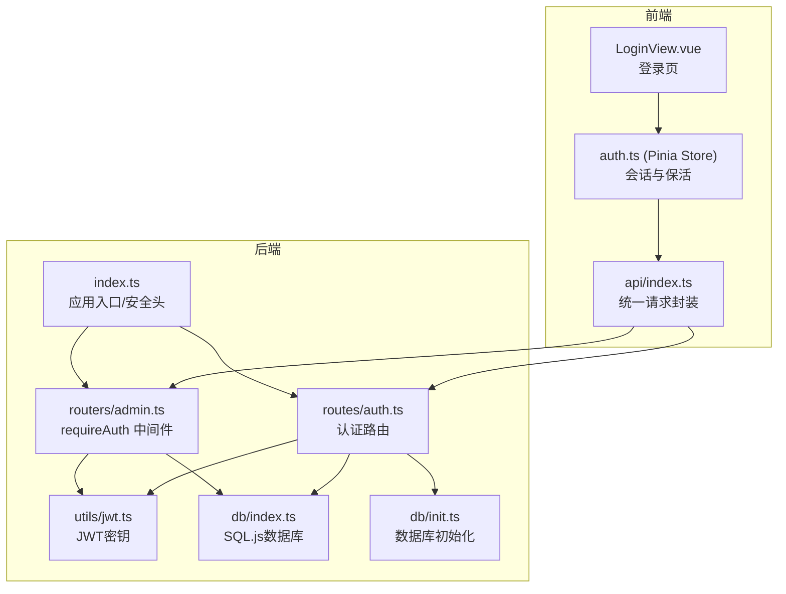
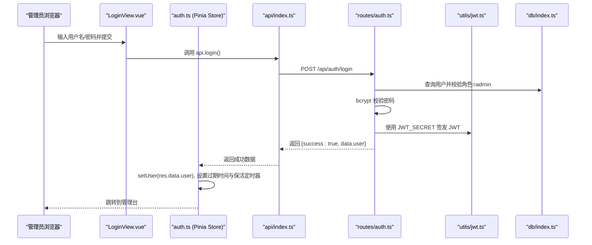
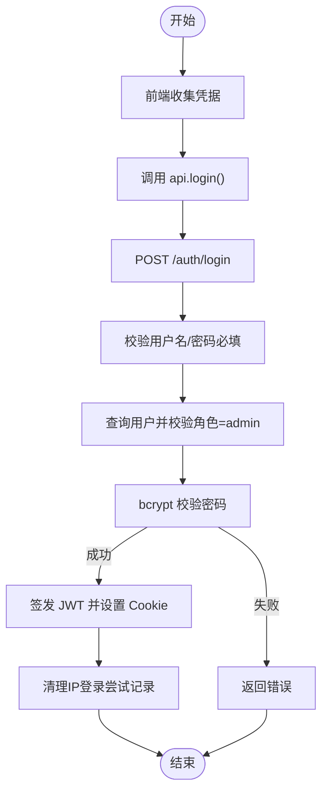
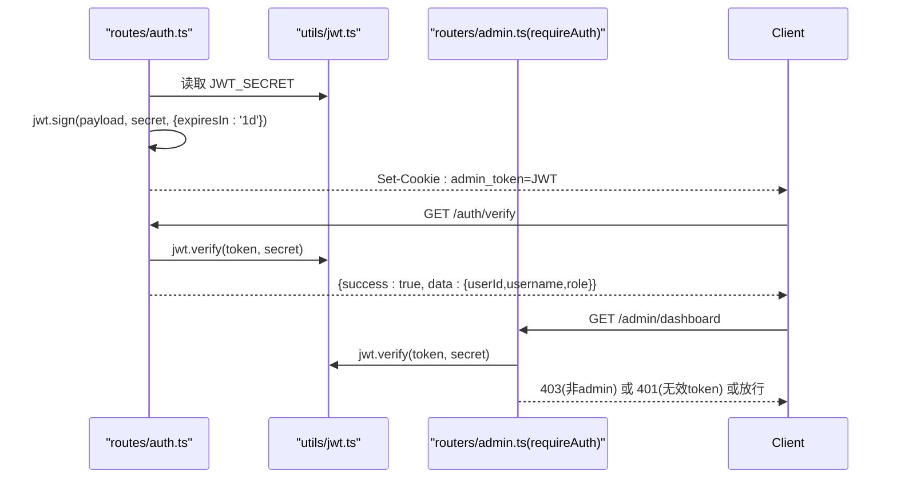
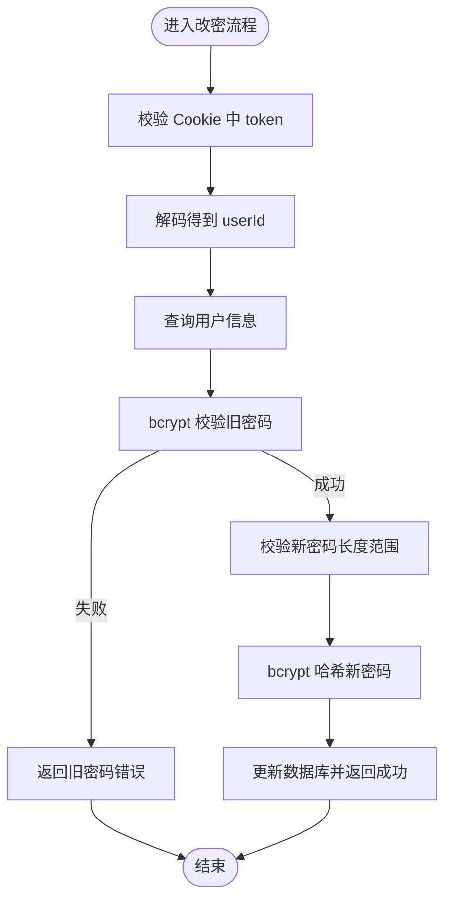
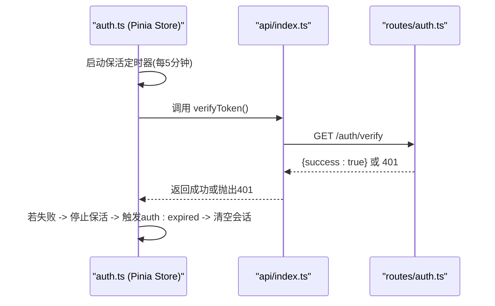
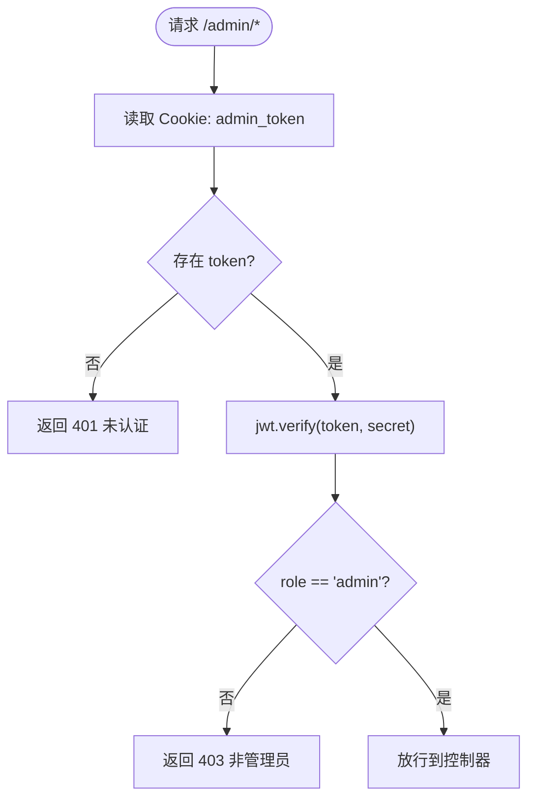
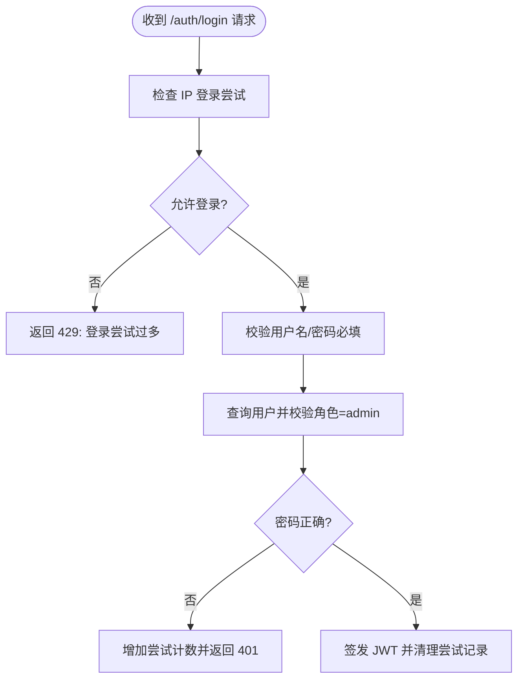
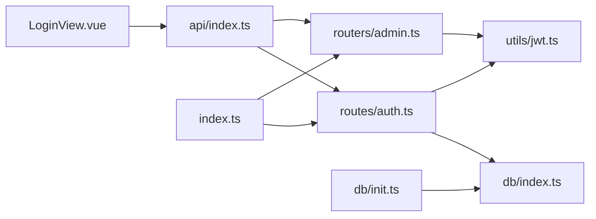

# 管理员认证

<cite>
**本文引用的文件**
- [server/src/routes/auth.ts](file://server/src/routes/auth.ts)
- [server/src/utils/jwt.ts](file://server/src/utils/jwt.ts)
- [src/stores/auth.ts](file://src/stores/auth.ts)
- [server/src/db/index.ts](file://server/src/db/index.ts)
- [src/admin/views/LoginView.vue](file://src/admin/views/LoginView.vue)
- [src/api/index.ts](file://src/api/index.ts)
- [server/src/routers/admin.ts](file://server/src/routers/admin.ts)
- [server/src/index.ts](file://server/src/index.ts)
- [server/src/db/init.ts](file://server/src/db/init.ts)
- [server/src/routers/index.ts](file://server/src/routers/index.ts)
</cite>

## 目录
1. [简介](#简介)
2. [项目结构](#项目结构)
3. [核心组件](#核心组件)
4. [架构总览](#架构总览)
5. [详细组件分析](#详细组件分析)
6. [依赖关系分析](#依赖关系分析)
7. [性能考量](#性能考量)
8. [故障排查指南](#故障排查指南)
9. [结论](#结论)
10. [附录](#附录)

## 简介
本文件面向RLRMS餐厅管理系统中的“管理员认证”能力，围绕以下目标展开：管理员认证登录流程、JWT令牌生成与验证、密码加密存储、会话管理与自动登出、权限验证中间件与路由守卫、访问控制策略、以及认证安全最佳实践（含密码策略、多因素认证建议、安全审计）。文档同时覆盖登录失败处理、账户锁定机制与安全事件响应流程。

## 项目结构
认证相关能力横跨前端与后端，主要分布如下：
- 前端
  - 登录页面：管理员认证入口
  - 认证状态管理：Pinia Store 维护用户会话与保活
  - API 层：统一请求封装，处理 401 会话过期事件
- 后端
  - 认证路由：登录、登出、令牌校验、改密
  - 权限中间件：Admin 路由守卫
  - JWT 工具：密钥生成与环境适配
  - 数据库：用户表结构与初始化脚本

**图表来源**
- [src/admin/views/LoginView.vue](file://src/admin/views/LoginView.vue)
- [src/stores/auth.ts](file://src/stores/auth.ts)
- [src/api/index.ts](file://src/api/index.ts)
- [server/src/routes/auth.ts](file://server/src/routes/auth.ts)
- [server/src/routers/admin.ts](file://server/src/routers/admin.ts)
- [server/src/utils/jwt.ts](file://server/src/utils/jwt.ts)
- [server/src/db/index.ts](file://server/src/db/index.ts)
- [server/src/db/init.ts](file://server/src/db/init.ts)
- [server/src/index.ts](file://server/src/index.ts)

**章节来源**
- [server/src/routes/auth.ts](file://server/src/routes/auth.ts)
- [server/src/routers/admin.ts](file://server/src/routers/admin.ts)
- [server/src/utils/jwt.ts](file://server/src/utils/jwt.ts)
- [src/stores/auth.ts](file://src/stores/auth.ts)
- [src/api/index.ts](file://src/api/index.ts)
- [server/src/db/index.ts](file://server/src/db/index.ts)
- [server/src/db/init.ts](file://server/src/db/init.ts)
- [server/src/index.ts](file://server/src/index.ts)

## 核心组件
- 管理员登录与会话
  - 前端登录页提交凭据，调用统一 API；登录成功后 Pinia Store 设置用户信息并启动会话保活定时器
  - 后端认证路由接收用户名/密码，校验用户角色为 admin，使用 bcrypt 校验密码，签发带角色的 JWT，通过 httpOnly Cookie 返回
- JWT 令牌管理
  - 密钥在开发与生产环境采用不同策略；生产环境支持显式 JWT_SECRET 环境变量
  - 前端请求携带 Cookie，后端中间件解析并校验 JWT，仅允许 admin 角色访问 /admin 下资源
- 密码加密与存储
  - 用户首次初始化时创建默认 admin 账号，密码经 bcrypt 加盐哈希存储
  - 修改密码接口对新密码长度进行约束，并使用 bcrypt 更新存储
- 会话保活与自动登出
  - 前端按固定周期调用后端 /auth/verify，若失败则触发自定义事件，清空本地会话并提示重新登录
  - 后端 /auth/logout 清除 Cookie；客户端侧也提供 clearSession 方法
- 登录失败与账户锁定
  - 基于 IP 的登录尝试计数与窗口控制，超过阈值在窗口期内拒绝登录
- 权限验证与路由守卫
  - requireAuth 中间件读取 Cookie 中的 admin_token，解码后校验角色为 admin，否则返回 401/403
  - /admin 下所有受保护路由均需通过该中间件

**章节来源**
- [src/admin/views/LoginView.vue](file://src/admin/views/LoginView.vue)
- [src/stores/auth.ts](file://src/stores/auth.ts)
- [src/api/index.ts](file://src/api/index.ts)
- [server/src/routes/auth.ts](file://server/src/routes/auth.ts)
- [server/src/routers/admin.ts](file://server/src/routers/admin.ts)
- [server/src/utils/jwt.ts](file://server/src/utils/jwt.ts)
- [server/src/db/init.ts](file://server/src/db/init.ts)

## 架构总览
认证与权限控制的整体交互如下：

**图表来源**
- [src/admin/views/LoginView.vue](file://src/admin/views/LoginView.vue)
- [src/api/index.ts](file://src/api/index.ts)
- [server/src/routes/auth.ts](file://server/src/routes/auth.ts)
- [server/src/utils/jwt.ts](file://server/src/utils/jwt.ts)
- [server/src/db/index.ts](file://server/src/db/index.ts)

**章节来源**
- [src/admin/views/LoginView.vue](file://src/admin/views/LoginView.vue)
- [src/api/index.ts](file://src/api/index.ts)
- [server/src/routes/auth.ts](file://server/src/routes/auth.ts)

## 详细组件分析

### 管理员登录流程与会话管理
- 前端
  - 登录页收集用户名/密码，调用 api.login，成功后将用户信息写入 Pinia Store，并设置会话过期时间（24小时）
  - 启动保活定时器，每 5 分钟调用 /auth/verify 校验令牌有效性；失败则触发自定义事件，清空会话并提示重新登录
- 后端
  - /auth/login 接收用户名/密码，校验必填；查询用户并限定角色为 admin；bcrypt 校验密码；签发 1 天有效期 JWT，设置 httpOnly Cookie
  - 登录成功后清理该 IP 的登录尝试记录，避免误伤后续登录

**图表来源**
- [server/src/routes/auth.ts](file://server/src/routes/auth.ts)
- [src/admin/views/LoginView.vue](file://src/admin/views/LoginView.vue)
- [src/stores/auth.ts](file://src/stores/auth.ts)

**章节来源**
- [src/admin/views/LoginView.vue](file://src/admin/views/LoginView.vue)
- [src/stores/auth.ts](file://src/stores/auth.ts)
- [server/src/routes/auth.ts](file://server/src/routes/auth.ts)

### JWT 令牌生成与验证机制
- 密钥生成策略
  - 开发环境：基于主机与用户名派生固定密钥，便于热重载不丢失 token
  - 生产环境：优先使用 JWT_SECRET 环境变量；若未设置，则随机生成动态密钥（每次启动不同）
- 令牌签发与解析
  - 登录成功后签发包含 userId、username、role 的 JWT，设置 Cookie（httpOnly、secure、sameSite、maxAge）
  - /auth/verify 从 Cookie 读取 token，使用相同密钥验证；失败返回 401
  - /admin 下各路由通过 requireAuth 中间件读取 Cookie，验证角色为 admin

**图表来源**
- [server/src/routes/auth.ts](file://server/src/routes/auth.ts)
- [server/src/routers/admin.ts](file://server/src/routers/admin.ts)
- [server/src/utils/jwt.ts](file://server/src/utils/jwt.ts)

**章节来源**
- [server/src/utils/jwt.ts](file://server/src/utils/jwt.ts)
- [server/src/routes/auth.ts](file://server/src/routes/auth.ts)
- [server/src/routers/admin.ts](file://server/src/routers/admin.ts)

### 密码加密存储与改密流程
- 存储策略
  - 用户密码使用 bcrypt 进行加盐哈希存储；初始化时默认 admin 账号密码经 bcrypt 哈希
- 改密流程
  - 前端调用 /auth/password，携带旧密码与新密码
  - 后端先校验 Cookie 中的 token，解码得到 userId；查询用户并使用 bcrypt 校验旧密码
  - 新密码长度最小 6 位、最大 128 位；通过后使用 bcrypt 哈希更新并返回成功

**图表来源**
- [server/src/routes/auth.ts](file://server/src/routes/auth.ts)
- [server/src/db/index.ts](file://server/src/db/index.ts)

**章节来源**
- [server/src/routes/auth.ts](file://server/src/routes/auth.ts)
- [server/src/db/init.ts](file://server/src/db/init.ts)

### 会话管理与自动登出
- 保活策略
  - 前端 Store 在用户登录后设置 sessionExpiresAt（24 小时），每 5 分钟调用 /auth/verify
  - 若验证失败，停止保活定时器，触发自定义事件，清空本地会话状态
- 登出流程
  - 前端调用 api.logout，后端清除 admin_token Cookie；前端 Store 清空会话
  - /auth/verify 对于客户端 token 的校验还额外检查用户是否仍存在于数据库，若不存在则清除客户端 Cookie 并返回 401

**图表来源**
- [src/stores/auth.ts](file://src/stores/auth.ts)
- [src/api/index.ts](file://src/api/index.ts)
- [server/src/routes/auth.ts](file://server/src/routes/auth.ts)

**章节来源**
- [src/stores/auth.ts](file://src/stores/auth.ts)
- [src/api/index.ts](file://src/api/index.ts)
- [server/src/routes/auth.ts](file://server/src/routes/auth.ts)

### 权限验证中间件与路由守卫
- requireAuth 中间件
  - 从 Cookie 读取 admin_token；若缺失返回 401
  - 使用 JWT_SECRET 验证 token；角色非 admin 返回 403
  - 校验通过后放行至后续处理器
- 受保护路由
  - /admin/* 下所有路由均需通过 requireAuth；例如 /admin/dashboard、/admin/tables、/admin/dishes 等

**图表来源**
- [server/src/routers/admin.ts](file://server/src/routers/admin.ts)
- [server/src/utils/jwt.ts](file://server/src/utils/jwt.ts)

**章节来源**
- [server/src/routers/admin.ts](file://server/src/routers/admin.ts)

### 登录失败处理与账户锁定机制
- IP 级登录速率限制
  - 维护 Map 记录每个 IP 的尝试次数与最后尝试时间
  - 窗口期为 15 分钟；超过最大尝试次数（默认 5 次）在窗口期内拒绝登录
  - 登录成功后清理该 IP 的尝试记录
- 错误响应
  - 参数缺失返回 400
  - 用户名/密码错误或角色不符返回 401
  - 超过尝试次数返回 429（请稍后再试）

**图表来源**
- [server/src/routes/auth.ts](file://server/src/routes/auth.ts)

**章节来源**
- [server/src/routes/auth.ts](file://server/src/routes/auth.ts)

### 安全审计与访问控制策略
- 安全响应头
  - X-Content-Type-Options: nosniff
  - X-Frame-Options: DENY
  - X-XSS-Protection: 1; mode=block
  - Referrer-Policy: strict-origin-when-cross-origin
- CORS 与 Cookie 安全
  - 生产环境启用 CORS，credentials: true
  - Cookie 设置 httpOnly、secure（生产）、sameSite: lax、maxAge: 1 天
- 访问控制
  - 所有 /admin 资源仅允许 admin 角色访问
  - /auth/verify 与 /auth/logout 仅限已登录用户访问

**章节来源**
- [server/src/index.ts](file://server/src/index.ts)
- [server/src/routes/auth.ts](file://server/src/routes/auth.ts)
- [server/src/routers/admin.ts](file://server/src/routers/admin.ts)

## 依赖关系分析
- 前端依赖
  - LoginView.vue 依赖 api.login 与 Pinia Store
  - api/index.ts 统一封装请求、处理 401 事件、携带 credentials: 'include'
  - auth.ts Store 负责会话状态、保活定时器与过期事件
- 后端依赖
  - routes/auth.ts 依赖 db/index.ts 查询用户、bcrypt 校验密码、jsonwebtoken 签发/校验
  - routers/admin.ts 依赖 utils/jwt.ts 读取密钥、requireAuth 中间件
  - db/init.ts 负责用户表初始化与默认 admin 账号创建

**图表来源**
- [src/admin/views/LoginView.vue](file://src/admin/views/LoginView.vue)
- [src/api/index.ts](file://src/api/index.ts)
- [server/src/routes/auth.ts](file://server/src/routes/auth.ts)
- [server/src/routers/admin.ts](file://server/src/routers/admin.ts)
- [server/src/utils/jwt.ts](file://server/src/utils/jwt.ts)
- [server/src/db/index.ts](file://server/src/db/index.ts)
- [server/src/db/init.ts](file://server/src/db/init.ts)
- [server/src/index.ts](file://server/src/index.ts)

**章节来源**
- [server/src/routers/index.ts](file://server/src/routers/index.ts)
- [server/src/index.ts](file://server/src/index.ts)

## 性能考量
- 令牌保活频率
  - 前端每 5 分钟调用一次 /auth/verify，平衡保活与网络开销
- 数据库写入优化
  - db/index.ts 使用 debounced save 与批量事务，减少磁盘写入频率
- 缓存与索引
  - db/init.ts 创建常用字段索引，加速查询
- 压缩与静态资源
  - 生产环境启用压缩与静态资源缓存策略，降低传输成本

**章节来源**
- [src/stores/auth.ts](file://src/stores/auth.ts)
- [server/src/db/index.ts](file://server/src/db/index.ts)
- [server/src/db/init.ts](file://server/src/db/init.ts)
- [server/src/index.ts](file://server/src/index.ts)

## 故障排查指南
- 登录失败
  - 检查用户名/密码是否为空；确认用户角色为 admin；查看后端日志
  - 若短时间内多次失败，确认是否触发 IP 速率限制
- 会话过期
  - 前端 401 时会触发 auth:expired 自定义事件；检查 Store 是否清空会话
  - 确认 Cookie 是否正确携带 admin_token；生产环境需 HTTPS
- 密码改密失败
  - 确认旧密码正确；新密码长度符合要求；检查后端错误日志
- 管理员路由 401/403
  - 确认 token 有效且角色为 admin；检查中间件是否正确挂载

**章节来源**
- [src/api/index.ts](file://src/api/index.ts)
- [src/stores/auth.ts](file://src/stores/auth.ts)
- [server/src/routes/auth.ts](file://server/src/routes/auth.ts)
- [server/src/routers/admin.ts](file://server/src/routers/admin.ts)

## 结论
本认证体系以 bcrypt 密码哈希、JWT 令牌与 httpOnly Cookie 为核心，结合 IP 级登录速率限制、前端会话保活与自动登出、严格的路由守卫与安全响应头，提供了较为完整的管理员认证与访问控制方案。建议在生产环境中明确设置 JWT_SECRET，配合多因素认证与审计日志进一步强化安全。

## 附录

### 认证安全最佳实践
- 密码策略
  - 强制最小长度与复杂度；定期轮换；禁止明文存储
- 多因素认证（MFA）
  - 建议引入短信/邮件验证码或 TOTP；登录后颁发短期会话令牌
- 安全审计
  - 记录登录/登出、改密、路由访问等关键事件；异常行为触发告警
- 会话安全
  - 使用 httpOnly、secure、sameSite Cookie；短生命周期令牌；服务端注销时清除令牌

### 登录失败与账户锁定机制
- IP 级速率限制：15 分钟窗口内最多 5 次尝试
- 登录成功后清理尝试记录
- 失败场景：参数缺失（400）、凭据错误（401）、超限（429）

### 安全事件响应流程
- 检测到异常登录尝试或 401 频发
  - 暂停相关 IP 的登录尝试（可扩展）
  - 通知管理员并记录审计日志
  - 强制用户改密并撤销受影响会话