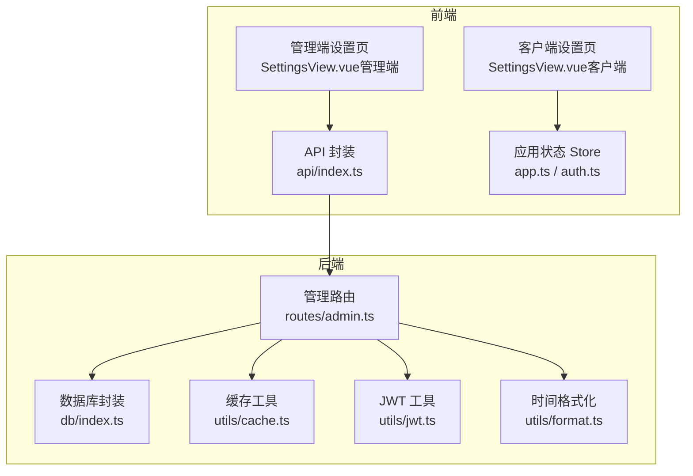
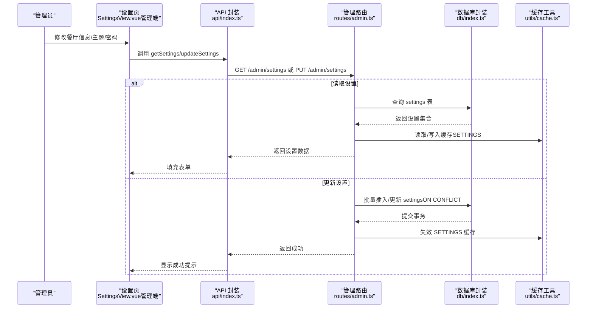
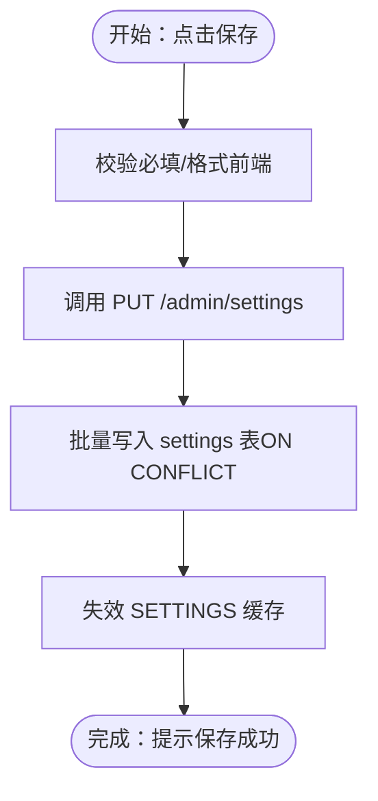
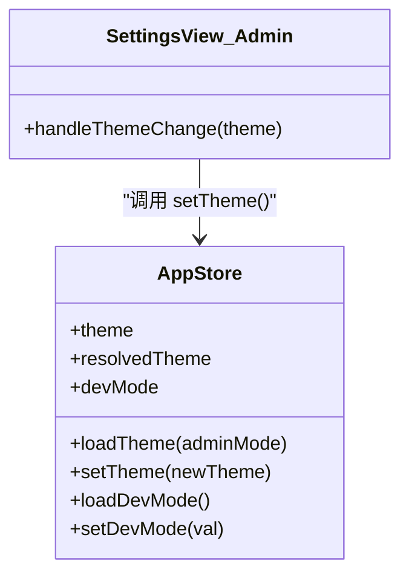
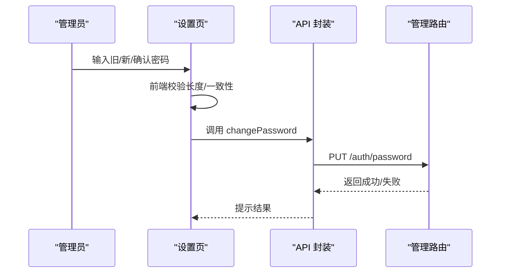
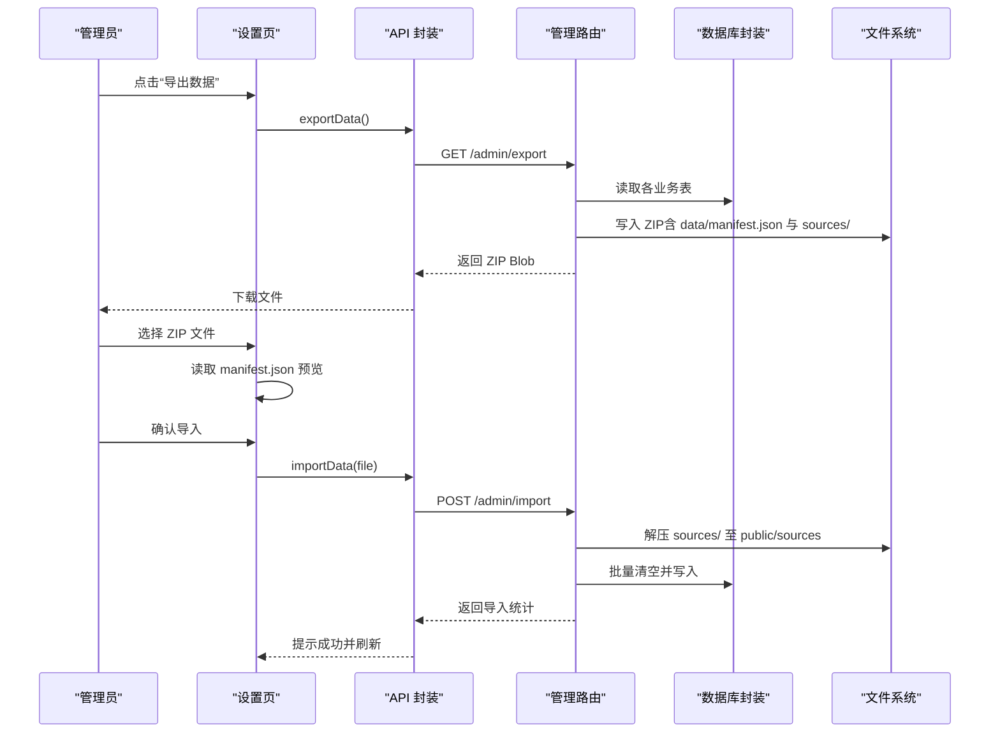
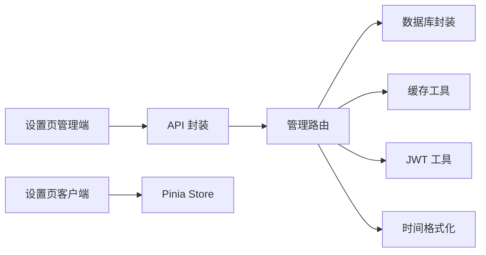

# 系统设置

<cite>
**本文引用的文件**
- [SettingsView.vue（管理端）](file://src/admin/views/SettingsView.vue)
- [SettingsView.vue（客户端）](file://src/client/views/SettingsView.vue)
- [api/index.ts](file://src/api/index.ts)
- [admin.ts（路由）](file://server/src/routes/admin.ts)
- [db/index.ts](file://server/src/db/index.ts)
- [cache.ts（缓存）](file://server/src/utils/cache.ts)
- [jwt.ts（JWT）](file://server/src/utils/jwt.ts)
- [format.ts（时间格式化）](file://server/src/utils/format.ts)
- [app.ts（Pinia Store）](file://src/stores/app.ts)
- [auth.ts（Pinia Store）](file://src/stores/auth.ts)
- [index.ts（入口）](file://server/src/index.ts)
</cite>

## 目录
1. [简介](#简介)
2. [项目结构](#项目结构)
3. [核心组件](#核心组件)
4. [架构总览](#架构总览)
5. [详细组件分析](#详细组件分析)
6. [依赖关系分析](#依赖关系分析)
7. [性能考量](#性能考量)
8. [故障排查指南](#故障排查指南)
9. [结论](#结论)
10. [附录](#附录)

## 简介
本章节面向 RL RMS 餐厅管理系统中的“系统设置”能力，围绕管理端设置界面展开，覆盖以下主题：
- 餐厅基本信息配置（名称、电话、地址、营业时间）
- 外观设置（主题模式：浅色/深色/系统）
- 账号设置（修改密码）
- 关于信息（版本与技术栈）
- 数据管理（导出/导入 ZIP 备份、恢复默认设置）
- 系统参数调整机制、配置项验证规则与生效策略
- 系统备份与恢复、数据迁移与版本升级管理流程
- 最佳实践（配置模板、变更审批流程、故障恢复预案）
- 性能优化、安全配置与合规性建议

## 项目结构
系统设置功能主要由前端设置页面与后端管理路由共同实现，并通过 API 层进行交互；数据库采用 SQLite（通过 sql.js 在 Node.js 环境运行），并提供缓存与鉴权支持。

图示来源
- [SettingsView.vue（管理端）](file://src/admin/views/SettingsView.vue)
- [SettingsView.vue（客户端）](file://src/client/views/SettingsView.vue)
- [api/index.ts](file://src/api/index.ts)
- [admin.ts（路由）](file://server/src/routes/admin.ts)
- [db/index.ts](file://server/src/db/index.ts)
- [cache.ts（缓存）](file://server/src/utils/cache.ts)
- [jwt.ts（JWT）](file://server/src/utils/jwt.ts)
- [format.ts（时间格式化）](file://server/src/utils/format.ts)

章节来源
- [SettingsView.vue（管理端）:1-907](file://src/admin/views/SettingsView.vue#L1-L907)
- [SettingsView.vue（客户端）:1-351](file://src/client/views/SettingsView.vue#L1-L351)
- [api/index.ts:1-608](file://src/api/index.ts#L1-L608)
- [admin.ts（路由）:1143-1200](file://server/src/routes/admin.ts#L1143-L1200)
- [db/index.ts:1-156](file://server/src/db/index.ts#L1-L156)
- [cache.ts（缓存）:1-73](file://server/src/utils/cache.ts#L1-L73)
- [jwt.ts（JWT）:1-27](file://server/src/utils/jwt.ts#L1-L27)
- [format.ts（时间格式化）:1-12](file://server/src/utils/format.ts#L1-L12)

## 核心组件
- 管理端设置页：提供餐厅信息、外观设置、账号设置、关于信息、数据管理与恢复默认设置入口。
- 客户端设置页：提供主题切换、关于信息、清除缓存等轻量设置。
- API 封装：统一请求、超时、401 处理、缓存策略与下载触发。
- 管理路由：提供设置读取/更新、导出/导入、重置数据库等接口。
- 数据库封装：负责 SQLite 初始化、读写、批量事务与防抖落盘。
- 缓存工具：提供 TTL 内存缓存与键空间失效控制。
- JWT 工具：开发/生产环境密钥派生策略。
- 时间格式化：统一时间输出格式。

章节来源
- [SettingsView.vue（管理端）:1-907](file://src/admin/views/SettingsView.vue#L1-L907)
- [SettingsView.vue（客户端）:1-351](file://src/client/views/SettingsView.vue#L1-L351)
- [api/index.ts:1-608](file://src/api/index.ts#L1-L608)
- [admin.ts（路由）:1143-1200](file://server/src/routes/admin.ts#L1143-L1200)
- [db/index.ts:1-156](file://server/src/db/index.ts#L1-L156)
- [cache.ts（缓存）:1-73](file://server/src/utils/cache.ts#L1-L73)
- [jwt.ts（JWT）:1-27](file://server/src/utils/jwt.ts#L1-L27)
- [format.ts（时间格式化）:1-12](file://server/src/utils/format.ts#L1-L12)

## 架构总览
系统设置的前后端交互遵循“前端表单 -> API 封装 -> 管理路由 -> 数据库封装”的链路；设置项存储于 settings 表，读取时带 TTL 缓存，写入时批量事务并失效对应缓存键。

图示来源
- [SettingsView.vue（管理端）:75-104](file://src/admin/views/SettingsView.vue#L75-L104)
- [api/index.ts:430-464](file://src/api/index.ts#L430-L464)
- [admin.ts（路由）:1145-1179](file://server/src/routes/admin.ts#L1145-L1179)
- [db/index.ts:101-109](file://server/src/db/index.ts#L101-L109)
- [cache.ts（缓存）:18-43](file://server/src/utils/cache.ts#L18-L43)

## 详细组件分析

### 餐厅信息配置
- 可配置字段：餐厅名称、联系电话、餐厅地址、营业时间。
- 前端行为：表单双向绑定，点击保存后调用更新接口。
- 后端行为：接收键值对，逐项插入/更新 settings 表，使用 ON CONFLICT 做幂等更新；更新后失效 SETTINGS 缓存。
- 生效策略：立即生效，无需重启；前端下次拉取设置时读取最新值。

图示来源
- [SettingsView.vue（管理端）:75-104](file://src/admin/views/SettingsView.vue#L75-L104)
- [api/index.ts:459-464](file://src/api/index.ts#L459-L464)
- [admin.ts（路由）:1164-1179](file://server/src/routes/admin.ts#L1164-L1179)

章节来源
- [SettingsView.vue（管理端）:231-279](file://src/admin/views/SettingsView.vue#L231-L279)
- [admin.ts（路由）:1145-1179](file://server/src/routes/admin.ts#L1145-L1179)

### 外观设置（主题模式）
- 支持：浅色、深色、系统（跟随系统）。
- 前端：Pinia Store 统一维护 theme/resolvedTheme，持久化到 IndexedDB；监听系统主题变化自动同步。
- 生效策略：即时生效，无需刷新页面。

图示来源
- [app.ts（Pinia Store）:14-121](file://src/stores/app.ts#L14-L121)
- [SettingsView.vue（管理端）:106-108](file://src/admin/views/SettingsView.vue#L106-L108)

章节来源
- [SettingsView.vue（管理端）:281-317](file://src/admin/views/SettingsView.vue#L281-L317)
- [app.ts（Pinia Store）:14-121](file://src/stores/app.ts#L14-L121)

### 账号设置（修改密码）
- 前端行为：打开模态框，输入旧密码、新密码与确认密码；前端校验两次密码一致、长度≥6。
- 后端行为：校验旧密码正确后，使用 bcrypt 哈希新密码并更新用户记录。
- 生效策略：立即生效；前端提示成功并清空表单。

图示来源
- [SettingsView.vue（管理端）:110-133](file://src/admin/views/SettingsView.vue#L110-L133)
- [api/index.ts:263-268](file://src/api/index.ts#L263-L268)
- [admin.ts（路由）:1181-1200](file://server/src/routes/admin.ts#L1181-L1200)

章节来源
- [SettingsView.vue（管理端）:319-328](file://src/admin/views/SettingsView.vue#L319-L328)
- [api/index.ts:263-268](file://src/api/index.ts#L263-L268)

### 关于信息
- 管理端：展示系统版本与技术栈。
- 客户端：展示应用名称与版本信息。
- 生效策略：静态展示，无需额外逻辑。

章节来源
- [SettingsView.vue（管理端）:330-339](file://src/admin/views/SettingsView.vue#L330-L339)
- [SettingsView.vue（客户端）:101-138](file://src/client/views/SettingsView.vue#L101-L138)

### 数据管理（导出/导入/恢复默认）
- 导出：后端收集订单、桌位、菜品、分类、库存、设置与图片资源，打包为 ZIP 并触发下载。
- 导入：前端选择 ZIP，读取 data/manifest.json 预览版本与统计数据，确认后上传导入；后端校验结构并批量清空/写入。
- 恢复默认：二次确认（confirm: 'RESET'），清空业务表并重置状态。

图示来源
- [SettingsView.vue（管理端）:155-224](file://src/admin/views/SettingsView.vue#L155-L224)
- [api/index.ts:509-595](file://src/api/index.ts#L509-L595)
- [admin.ts（路由）:1686-1782](file://server/src/routes/admin.ts#L1686-L1782)

章节来源
- [SettingsView.vue（管理端）:341-356](file://src/admin/views/SettingsView.vue#L341-L356)
- [api/index.ts:509-595](file://src/api/index.ts#L509-L595)
- [admin.ts（路由）:1686-1782](file://server/src/routes/admin.ts#L1686-L1782)

### 系统参数调整机制、验证规则与生效策略
- 调整机制：前端表单 -> API 封装 -> 管理路由 -> 数据库封装。
- 验证规则：
  - 餐厅信息：前端简单校验（长度/格式），后端按需可扩展。
  - 导入：校验 ZIP 结构与 data/manifest.json 存在性。
  - 导出：生成标准 ZIP，包含 manifest.json 与资源目录。
  - 恢复默认：二次确认（confirm: 'RESET'）。
- 生效策略：设置项即时生效；导出/导入为一次性操作；恢复默认为高危操作，需谨慎。

章节来源
- [SettingsView.vue（管理端）:110-133](file://src/admin/views/SettingsView.vue#L110-L133)
- [api/index.ts:509-595](file://src/api/index.ts#L509-L595)
- [admin.ts（路由）:1183-1192](file://server/src/routes/admin.ts#L1183-L1192)

### 备份与恢复、数据迁移与版本升级管理
- 备份：导出 ZIP，包含业务数据与图片资源，便于离线归档与跨环境迁移。
- 恢复：导入 ZIP，覆盖当前数据；注意不可逆。
- 迁移：通过导入 ZIP 实现跨实例迁移；建议先导出当前环境备份。
- 版本升级：升级前务必导出现有数据；升级后根据需要导入历史备份或增量数据。

章节来源
- [admin.ts（路由）:1686-1782](file://server/src/routes/admin.ts#L1686-L1782)
- [api/index.ts:509-595](file://src/api/index.ts#L509-L595)

### 最佳实践
- 配置模板：建立标准的 settings 键清单与默认值，便于初始化与审计。
- 变更审批流程：对关键设置（如营业时间、支付方式）引入审批流或双人复核。
- 故障恢复预案：定期导出备份；导入前预览 manifest.json；恢复默认前做好业务停机窗口与数据确认。
- 性能优化：利用缓存键（SETTINGS）降低重复读取；批量事务减少落盘次数。
- 安全配置：生产环境设置 JWT_SECRET；限制危险 SQL 操作；严格文件类型与大小限制。

章节来源
- [cache.ts（缓存）:64-73](file://server/src/utils/cache.ts#L64-L73)
- [db/index.ts:47-73](file://server/src/db/index.ts#L47-L73)
- [jwt.ts（JWT）:20-26](file://server/src/utils/jwt.ts#L20-L26)
- [admin.ts（路由）:1786-1804](file://server/src/routes/admin.ts#L1786-L1804)

## 依赖关系分析
- 前端设置页依赖 API 封装与 Pinia Store；管理端还依赖后端设置路由。
- API 封装依赖统一的请求与错误处理、超时与 401 处理。
- 管理路由依赖数据库封装、缓存工具、JWT 工具与时间格式化。
- 数据库封装依赖 sql.js 初始化与文件系统持久化。

图示来源
- [SettingsView.vue（管理端）:1-907](file://src/admin/views/SettingsView.vue#L1-L907)
- [SettingsView.vue（客户端）:1-351](file://src/client/views/SettingsView.vue#L1-L351)
- [api/index.ts:1-608](file://src/api/index.ts#L1-L608)
- [admin.ts（路由）:1143-1200](file://server/src/routes/admin.ts#L1143-L1200)
- [db/index.ts:1-156](file://server/src/db/index.ts#L1-L156)
- [cache.ts（缓存）:1-73](file://server/src/utils/cache.ts#L1-L73)
- [jwt.ts（JWT）:1-27](file://server/src/utils/jwt.ts#L1-L27)
- [format.ts（时间格式化）:1-12](file://server/src/utils/format.ts#L1-L12)

章节来源
- [index.ts（入口）:1-200](file://server/src/index.ts#L1-L200)

## 性能考量
- 缓存策略：设置项使用 TTL 缓存（SETTINGS），降低数据库压力；更新后失效缓存，保证一致性。
- 批量事务：导入/批量更新使用 beginBatch/endBatch，合并多次写入，减少落盘次数。
- 防抖落盘：数据库写入采用防抖策略，合并短时间内多次变更。
- 前端缓存：API 层采用 stale-while-revalidate，提升首屏与切换性能。

章节来源
- [cache.ts（缓存）:18-43](file://server/src/utils/cache.ts#L18-L43)
- [db/index.ts:37-60](file://server/src/db/index.ts#L37-L60)
- [api/index.ts:17-34](file://src/api/index.ts#L17-L34)

## 故障排查指南
- 会话过期：API 封装对 401 做统一处理并触发全局事件，引导重新登录。
- 导入失败：检查 ZIP 结构与 data/manifest.json 是否存在；查看后端日志定位具体异常。
- 导出失败：确认后端响应头与内容类型；检查磁盘空间与权限。
- 设置不生效：确认缓存是否被正确失效；检查网络请求状态与后端返回。
- JWT 密钥问题：生产环境需设置 JWT_SECRET；开发环境密钥基于机器特征派生。

章节来源
- [api/index.ts:94-114](file://src/api/index.ts#L94-L114)
- [admin.ts（路由）:1686-1782](file://server/src/routes/admin.ts#L1686-L1782)
- [jwt.ts（JWT）:20-26](file://server/src/utils/jwt.ts#L20-L26)

## 结论
系统设置模块通过清晰的前后端职责划分与完善的缓存/事务机制，实现了餐厅信息、外观、账号、数据管理等核心能力。配合严格的导入/导出与恢复默认流程，满足备份、迁移与应急恢复需求。建议在生产环境中强化安全与合规配置，并建立标准化的变更与审批流程，确保系统稳定与数据安全。

## 附录
- 配置模板建议
  - settings 键：restaurant_name、restaurant_phone、restaurant_address、business_hours 等。
  - 默认值：提供初始化脚本或 UI 引导。
- 变更审批流程
  - 关键设置变更需双人复核；变更前导出备份；变更后验证生效。
- 故障恢复预案
  - 定期自动导出；导入前预览；恢复默认前停机公告与数据确认。
- 性能优化清单
  - 启用缓存与批量事务；合理设置 TTL；避免频繁读取敏感设置。
- 安全与合规
  - 生产环境设置 JWT_SECRET；限制文件类型与大小；禁用危险 SQL 操作；审计日志记录关键变更。