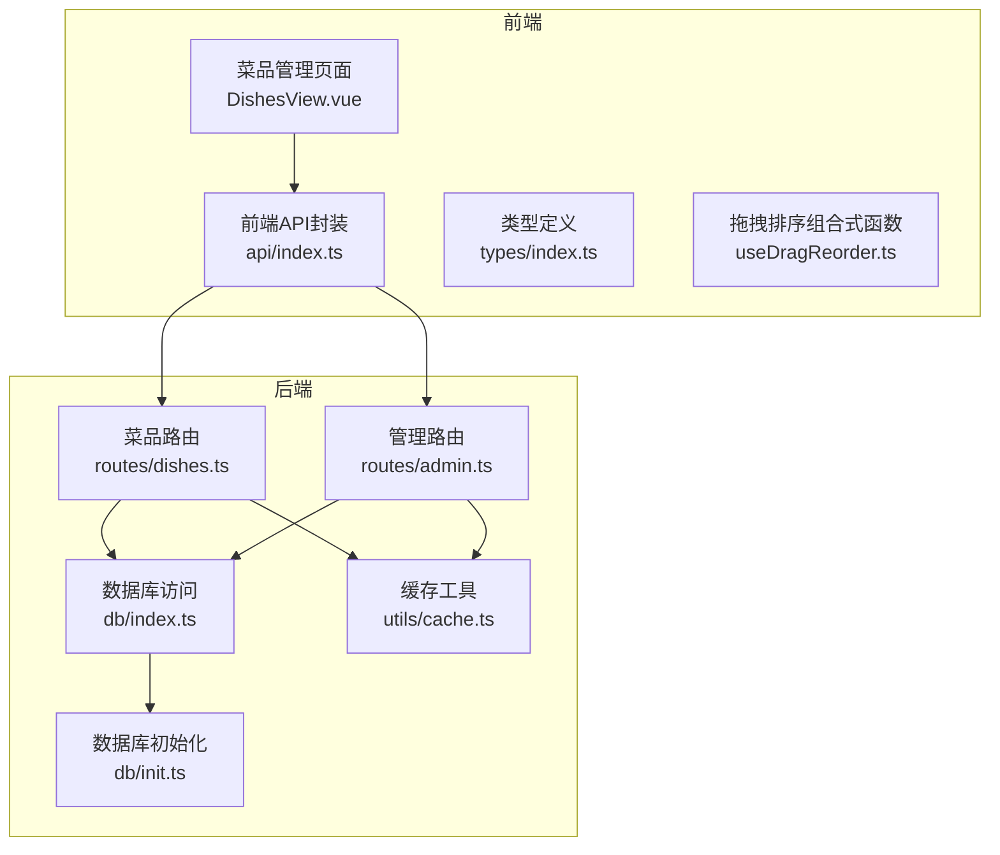
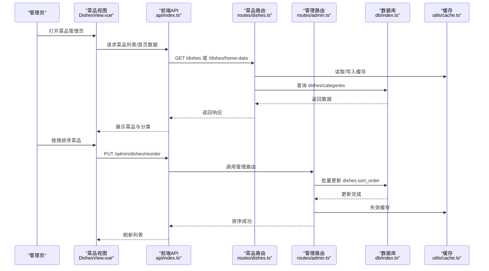
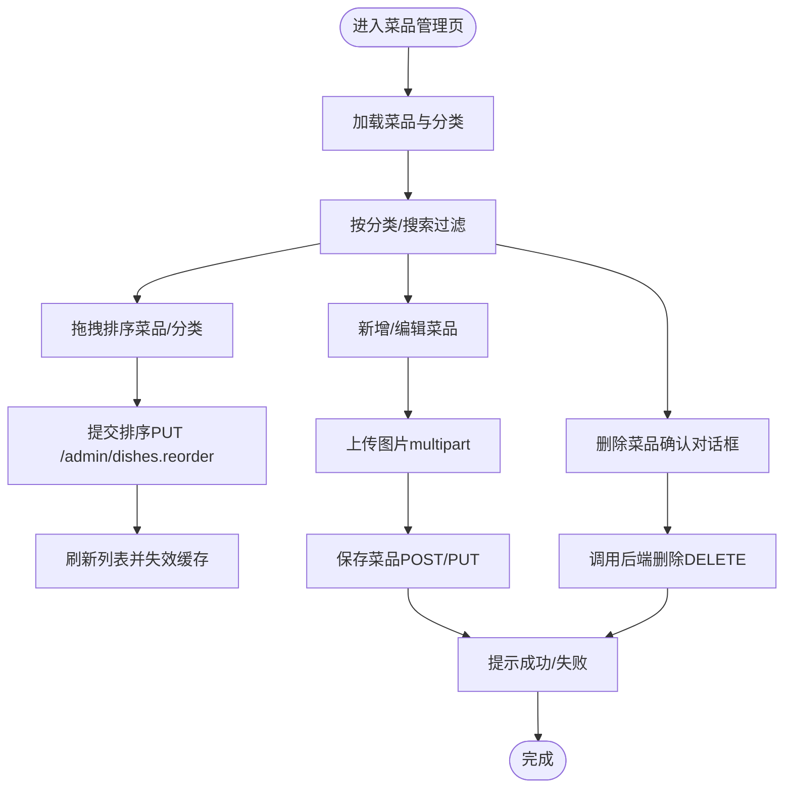
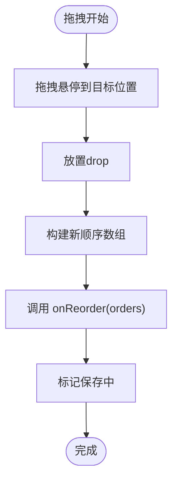
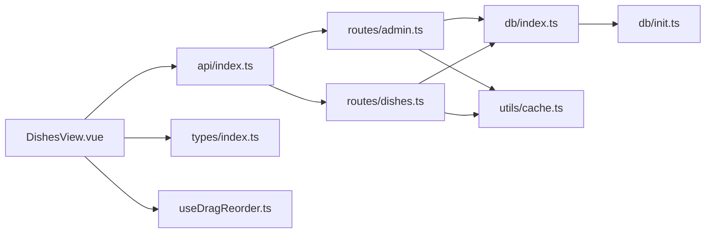

# 菜品管理

<cite>
**本文引用的文件**
- [server/src/routes/dishes.ts](file://server/src/routes/dishes.ts)
- [server/src/routes/admin.ts](file://server/src/routes/admin.ts)
- [server/src/db/index.ts](file://server/src/db/index.ts)
- [server/src/db/init.ts](file://server/src/db/init.ts)
- [server/src/utils/cache.ts](file://server/src/utils/cache.ts)
- [src/admin/views/DishesView.vue](file://src/admin/views/DishesView.vue)
- [src/shared/composables/useDragReorder.ts](file://src/shared/composables/useDragReorder.ts)
- [src/api/index.ts](file://src/api/index.ts)
- [src/types/index.ts](file://src/types/index.ts)
- [src/admin/views/InventoryView.vue](file://src/admin/views/InventoryView.vue)
- [README.md](file://README.md)
</cite>

## 目录
1. [简介](#简介)
2. [项目结构](#项目结构)
3. [核心组件](#核心组件)
4. [架构总览](#架构总览)
5. [详细组件分析](#详细组件分析)
6. [依赖关系分析](#依赖关系分析)
7. [性能考量](#性能考量)
8. [故障排查指南](#故障排查指南)
9. [结论](#结论)
10. [附录](#附录)

## 简介
本文件面向RLRMS餐厅管理系统中的“菜品管理”功能，系统性梳理菜品的增删改查、图片上传、价格设置、分类管理、状态管理（上架/下架）、库存控制、排序机制（拖拽与数据库更新）、最佳实践与批量操作能力。文档既覆盖前端界面与交互，也深入到后端接口、数据库与缓存策略，帮助开发者与运营人员高效理解与维护菜品数据的全生命周期。

## 项目结构
菜品管理涉及前后端协作：
- 前端（Vue 3 + Pinia）：菜品列表、分类、排序、图片上传、新增/编辑/删除、搜索与筛选。
- 后端（Express + SQL.js）：菜品与分类的CRUD、排序批量更新、图片删除去重、缓存失效与查询优化。
- 数据层：SQLite（SQL.js）嵌入式数据库，包含 dishes、categories、orders、order_items、inventory、settings 等表。

图表来源
- [src/admin/views/DishesView.vue:1-120](file://src/admin/views/DishesView.vue#L1-L120)
- [src/api/index.ts:128-377](file://src/api/index.ts#L128-L377)
- [server/src/routes/dishes.ts:1-117](file://server/src/routes/dishes.ts#L1-L117)
- [server/src/routes/admin.ts:339-546](file://server/src/routes/admin.ts#L339-L546)
- [server/src/db/index.ts:1-156](file://server/src/db/index.ts#L1-L156)
- [server/src/db/init.ts:45-137](file://server/src/db/init.ts#L45-L137)
- [server/src/utils/cache.ts:1-73](file://server/src/utils/cache.ts#L1-L73)

章节来源
- [src/admin/views/DishesView.vue:1-120](file://src/admin/views/DishesView.vue#L1-L120)
- [src/api/index.ts:128-377](file://src/api/index.ts#L128-L377)
- [server/src/routes/dishes.ts:1-117](file://server/src/routes/dishes.ts#L1-L117)
- [server/src/routes/admin.ts:339-546](file://server/src/routes/admin.ts#L339-L546)
- [server/src/db/index.ts:1-156](file://server/src/db/index.ts#L1-L156)
- [server/src/db/init.ts:45-137](file://server/src/db/init.ts#L45-L137)
- [server/src/utils/cache.ts:1-73](file://server/src/utils/cache.ts#L1-L73)

## 核心组件
- 前端菜品视图：负责菜品列表展示、分类筛选、搜索、拖拽排序、图片上传、新增/编辑/删除、标签与规格管理。
- 前端API封装：统一请求、超时与401处理、前端内存缓存（stale-while-revalidate）。
- 后端菜品路由：提供菜品列表、首页聚合数据、搜索、分类列表；公开缓存失效函数。
- 后端管理路由：提供菜品与分类的CRUD、批量排序、图片删除去重、缓存失效。
- 数据库与缓存：SQL.js嵌入式数据库，批量写入防抖、索引优化、缓存TTL与失效策略。
- 拖拽排序组合式函数：通用拖拽排序逻辑，支持保存状态与错误回滚。

章节来源
- [src/admin/views/DishesView.vue:1-120](file://src/admin/views/DishesView.vue#L1-L120)
- [src/api/index.ts:128-377](file://src/api/index.ts#L128-L377)
- [server/src/routes/dishes.ts:1-117](file://server/src/routes/dishes.ts#L1-L117)
- [server/src/routes/admin.ts:339-546](file://server/src/routes/admin.ts#L339-L546)
- [server/src/db/index.ts:1-156](file://server/src/db/index.ts#L1-L156)
- [server/src/utils/cache.ts:1-73](file://server/src/utils/cache.ts#L1-L73)
- [src/shared/composables/useDragReorder.ts:1-109](file://src/shared/composables/useDragReorder.ts#L1-L109)

## 架构总览
菜品管理的端到端流程如下：
- 前端通过API封装发起请求，后端路由根据权限校验后执行数据库操作。
- 数据库采用SQL.js，支持批量写入与防抖保存，减少磁盘IO。
- 列表与首页数据使用内存缓存与TTL，结合缓存失效策略保证一致性。
- 拖拽排序在前端即时更新UI，提交时批量更新数据库并失效相关缓存。

图表来源
- [src/admin/views/DishesView.vue:69-101](file://src/admin/views/DishesView.vue#L69-L101)
- [src/api/index.ts:348-353](file://src/api/index.ts#L348-L353)
- [server/src/routes/dishes.ts:25-117](file://server/src/routes/dishes.ts#L25-L117)
- [server/src/routes/admin.ts:433-454](file://server/src/routes/admin.ts#L433-L454)
- [server/src/db/index.ts:47-73](file://server/src/db/index.ts#L47-L73)
- [server/src/utils/cache.ts:41-54](file://server/src/utils/cache.ts#L41-L54)

## 详细组件分析

### 前端：菜品管理页面（DishesView.vue）
- 功能要点
  - 列表展示：菜品名称、分类、标签、价格、状态、图片占位。
  - 分类管理：拖拽排序分类、添加/删除分类（保留“其他”分类限制）。
  - 搜索与筛选：按分类与名称过滤。
  - 图片上传：选择文件触发上传，支持预览与移除。
  - 新增/编辑：表单字段含名称、价格、分类、状态、描述、标签、规格。
  - 删除确认：删除菜品前弹窗确认。
  - 拖拽排序：基于vuedraggable，支持分类与菜品两套排序逻辑。
- 关键交互
  - onDishesDragEnd/onCategoriesDragEnd：计算新顺序，调用API批量更新。
  - handleSave：新增或更新菜品，成功后toast提示并刷新列表。
  - handleImageUpload：multipart上传至后端，返回URL写入表单。
  - handleDelete：本地先移除，再调用后端删除，失败则回滚。

图表来源
- [src/admin/views/DishesView.vue:69-101](file://src/admin/views/DishesView.vue#L69-L101)
- [src/admin/views/DishesView.vue:162-179](file://src/admin/views/DishesView.vue#L162-L179)
- [src/admin/views/DishesView.vue:185-207](file://src/admin/views/DishesView.vue#L185-L207)
- [src/admin/views/DishesView.vue:209-237](file://src/admin/views/DishesView.vue#L209-L237)

章节来源
- [src/admin/views/DishesView.vue:1-120](file://src/admin/views/DishesView.vue#L1-L120)
- [src/admin/views/DishesView.vue:123-237](file://src/admin/views/DishesView.vue#L123-L237)
- [src/admin/views/DishesView.vue:239-308](file://src/admin/views/DishesView.vue#L239-L308)
- [src/admin/views/DishesView.vue:329-331](file://src/admin/views/DishesView.vue#L329-L331)

### 前端：拖拽排序组合式函数（useDragReorder.ts）
- 功能要点
  - 统一的拖拽排序逻辑，支持拖拽开始/结束、悬停高亮、放置落点。
  - 生成新的排序数组，调用传入的onReorder回调进行持久化。
  - 提供isSaving状态，避免重复提交。
- 适用范围
  - 可复用到菜品排序、分类排序、库存排序等场景。

图表来源
- [src/shared/composables/useDragReorder.ts:13-109](file://src/shared/composables/useDragReorder.ts#L13-L109)

章节来源
- [src/shared/composables/useDragReorder.ts:1-109](file://src/shared/composables/useDragReorder.ts#L1-L109)

### 前端：API封装（api/index.ts）
- 功能要点
  - 统一封装fetch请求，内置超时、信号合并、401处理与全局事件派发。
  - 前端内存缓存（stale-while-revalidate），提升列表与首页加载速度。
  - 暴露菜品相关方法：获取列表、详情、搜索、分类、排序、图片上传/删除等。
- 错误处理
  - 非JSON响应拦截，401触发全局认证过期事件，统一抛出ApiError。

章节来源
- [src/api/index.ts:54-114](file://src/api/index.ts#L54-L114)
- [src/api/index.ts:128-377](file://src/api/index.ts#L128-L377)
- [src/api/index.ts:479-496](file://src/api/index.ts#L479-L496)

### 后端：菜品路由（routes/dishes.ts）
- 功能要点
  - GET /dishes：按分类过滤，返回最小字段列表，带缓存。
  - GET /dishes/home-data：一次性返回分类与菜品聚合数据，带缓存。
  - GET /dishes/search/query：菜品名称模糊搜索，带缓存。
  - GET /dishes/categories/all：分类列表，带缓存。
  - GET /dishes/:id：按ID获取菜品详情。
  - 导出缓存失效函数，供管理路由在数据变更时调用。
- JSON解析安全
  - safeJsonParse：对tags/specs进行安全解析，异常时返回默认值。

章节来源
- [server/src/routes/dishes.ts:25-117](file://server/src/routes/dishes.ts#L25-L117)
- [server/src/routes/dishes.ts:176-215](file://server/src/routes/dishes.ts#L176-L215)
- [server/src/routes/dishes.ts:8-12](file://server/src/routes/dishes.ts#L8-L12)

### 后端：管理路由（routes/admin.ts）
- 菜品管理
  - GET /admin/dishes：返回完整菜品列表（含分类名、tags/specs解析）。
  - POST /admin/dishes：创建菜品，参数校验、名称唯一性检查、插入数据库、缓存失效。
  - PUT /admin/dishes/:id：更新菜品，支持图片变更检测与旧图删除（去重）。
  - DELETE /admin/dishes/:id：删除菜品，若存在图片且未被其他菜品使用则删除文件。
  - PUT /admin/dishes/reorder：批量更新菜品排序，使用beginBatch/endBatch合并事务，失效相关缓存。
- 分类管理
  - GET /admin/categories：分类列表。
  - POST /admin/categories：创建分类，名称唯一性与“其他”保留限制。
  - DELETE /admin/categories/:id：删除分类，需确保无菜品关联。
  - PUT /admin/categories/reorder：批量更新分类排序。
- 图片处理
  - deleteDishImageIfUnused：仅当图片未被其他菜品使用时才删除文件，避免误删。

章节来源
- [server/src/routes/admin.ts:341-372](file://server/src/routes/admin.ts#L341-L372)
- [server/src/routes/admin.ts:374-429](file://server/src/routes/admin.ts#L374-L429)
- [server/src/routes/admin.ts:456-520](file://server/src/routes/admin.ts#L456-L520)
- [server/src/routes/admin.ts:522-546](file://server/src/routes/admin.ts#L522-L546)
- [server/src/routes/admin.ts:618-639](file://server/src/routes/admin.ts#L618-L639)
- [server/src/routes/admin.ts:46-82](file://server/src/routes/admin.ts#L46-L82)

### 数据库与缓存（db/index.ts、db/init.ts、utils/cache.ts）
- 数据库
  - SQL.js嵌入式数据库，支持批量写入beginBatch/endBatch，防抖保存saveDatabase。
  - 初始化脚本创建核心表（dishes、categories、orders、order_items、inventory、settings）与索引。
  - 索引覆盖：订单状态、联系人电话、桌位状态、菜品分类与状态、排序字段等。
- 缓存
  - 内存TTL缓存，提供cacheGet/cacheSet/cacheInvalidate/cacheInvalidatePrefix/cacheClear。
  - 缓存键：categories、dishes:home-data、dishes:list、dishes:search:* 等。
  - 失效策略：菜品/分类/首页数据变更时主动失效相关缓存。

章节来源
- [server/src/db/index.ts:47-73](file://server/src/db/index.ts#L47-L73)
- [server/src/db/index.ts:101-140](file://server/src/db/index.ts#L101-L140)
- [server/src/db/init.ts:45-137](file://server/src/db/init.ts#L45-L137)
- [server/src/utils/cache.ts:18-54](file://server/src/utils/cache.ts#L18-L54)

### 类型定义（types/index.ts）
- Dish：菜品字段包含id、name、price、image_url、category_id、description、tags、specs、status、sort_order、created_at、updated_at。
- Category：分类字段包含id、name、sort_order、created_at。
- InventoryItem：库存字段包含id、material_name、quantity、unit、warning_threshold、sort_order、created_at、updated_at。

章节来源
- [src/types/index.ts:54-68](file://src/types/index.ts#L54-L68)
- [src/types/index.ts:46-51](file://src/types/index.ts#L46-L51)
- [src/types/index.ts:99-108](file://src/types/index.ts#L99-L108)

### 库存控制与预警（InventoryView.vue）
- 功能要点
  - 展示库存物料、数量、单位、预警阈值。
  - 拖拽排序库存项，支持新增/编辑/删除。
  - 低库存高亮显示（数量≤预警阈值）。
- 与菜品的关系
  - 菜品规格（specs）可作为不同规格的变体，库存控制建议与菜品规格解耦，库存关注的是原料而非成品规格。

章节来源
- [src/admin/views/InventoryView.vue:1-134](file://src/admin/views/InventoryView.vue#L1-L134)
- [src/admin/views/InventoryView.vue:176-214](file://src/admin/views/InventoryView.vue#L176-L214)
- [src/admin/views/InventoryView.vue:27-129](file://src/admin/views/InventoryView.vue#L27-L129)

## 依赖关系分析
- 前端依赖
  - DishesView.vue依赖api封装与类型定义；使用vuedraggable实现拖拽；使用Toast/Modal/ConfirmDialog等组件。
  - useDragReorder.ts提供可复用的拖拽排序逻辑。
- 后端依赖
  - dishes路由依赖db与cache；admin路由依赖db、cache、multer、sharp、jwt等。
  - db/index.ts提供统一的数据库访问与批量写入；db/init.ts初始化表与索引。
- 数据模型
  - dishes与categories通过外键关联；orders/order_items与dishes形成一对多关系；inventory独立管理。

图表来源
- [src/admin/views/DishesView.vue:1-120](file://src/admin/views/DishesView.vue#L1-L120)
- [src/api/index.ts:128-377](file://src/api/index.ts#L128-L377)
- [src/shared/composables/useDragReorder.ts:1-109](file://src/shared/composables/useDragReorder.ts#L1-L109)
- [server/src/routes/admin.ts:339-546](file://server/src/routes/admin.ts#L339-L546)
- [server/src/routes/dishes.ts:1-117](file://server/src/routes/dishes.ts#L1-L117)
- [server/src/db/index.ts:1-156](file://server/src/db/index.ts#L1-L156)
- [server/src/db/init.ts:45-137](file://server/src/db/init.ts#L45-L137)
- [server/src/utils/cache.ts:1-73](file://server/src/utils/cache.ts#L1-L73)

## 性能考量
- 前端
  - 使用前端内存缓存（stale-while-revalidate）降低重复请求，提升列表与首页加载速度。
  - 拖拽排序在本地即时更新UI，减少不必要的网络请求。
- 后端
  - 批量写入beginBatch/endBatch合并事务，显著降低磁盘写入次数。
  - 防抖保存saveDatabase，避免高频变更导致的频繁落盘。
  - 索引优化：对订单状态、菜品分类与状态、排序字段建立索引，加速查询。
- 缓存
  - 针对分类、菜品列表、首页数据设置TTL缓存，变更时主动失效，平衡一致性与性能。

章节来源
- [src/api/index.ts:17-34](file://src/api/index.ts#L17-L34)
- [server/src/db/index.ts:47-73](file://server/src/db/index.ts#L47-L73)
- [server/src/db/init.ts:124-137](file://server/src/db/init.ts#L124-L137)
- [server/src/utils/cache.ts:18-54](file://server/src/utils/cache.ts#L18-L54)

## 故障排查指南
- 图片上传失败
  - 检查文件类型与大小限制（仅允许JPEG/PNG/GIF/WebP，最大5MB）。
  - 确认后端存储目录public/sources存在且可写。
  - 前端上传失败会toast提示，查看浏览器网络面板定位具体错误。
- 拖拽排序保存失败
  - 前端会回滚列表并toast提示；检查后端PUT /admin/dishes/reorder是否返回成功。
  - 若失败，确认orders参数格式正确且包含id与sort_order。
- 删除菜品失败或图片未清理
  - 确认菜品存在且ID有效；若图片未被其他菜品使用才会删除文件。
  - 检查后端日志与文件系统，确认删除逻辑执行。
- 缓存不一致
  - 执行菜品/分类/首页数据变更后，后端会失效相关缓存；若仍出现旧数据，可手动刷新或等待TTL过期。
- 401/403认证问题
  - 前端会在收到401时派发全局事件，引导重新登录；检查cookie与JWT有效性。

章节来源
- [server/src/routes/admin.ts:84-105](file://server/src/routes/admin.ts#L84-L105)
- [src/admin/views/DishesView.vue:78-83](file://src/admin/views/DishesView.vue#L78-L83)
- [server/src/routes/admin.ts:522-546](file://server/src/routes/admin.ts#L522-L546)
- [src/api/index.ts:94-114](file://src/api/index.ts#L94-L114)

## 结论
菜品管理模块在前端提供了直观的可视化操作，在后端实现了严格的参数校验、批量写入与缓存策略，配合SQL.js的嵌入式数据库与索引优化，能够稳定支撑中小规模餐厅的日常运营。通过拖拽排序与图片上传、分类与标签体系，系统兼顾了易用性与扩展性。建议在生产环境中进一步完善批量操作、导入导出与审计日志能力，并持续监控缓存命中率与数据库写入性能。

## 附录
- 数据模型概览（节选）
  - 菜品（Dish）：id、name、price、image_url、category_id、description、tags、specs、status、sort_order、created_at/updated_at。
  - 分类（Category）：id、name、sort_order、created_at。
  - 库存（Inventory）：id、material_name、quantity、unit、warning_threshold、sort_order、created_at/updated_at。
  - 订单（Order）与订单项（OrderItem）：与菜品关联，支持规格与数量记录。

章节来源
- [README.md:407-483](file://README.md#L407-L483)