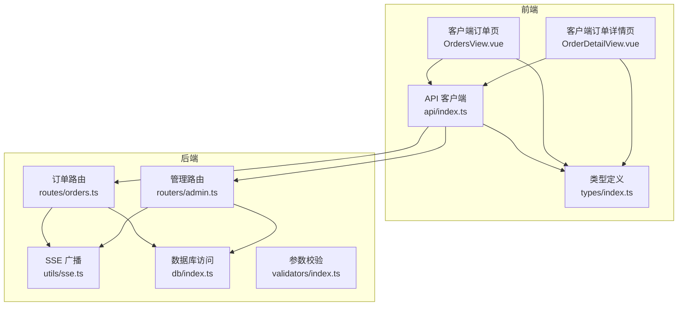
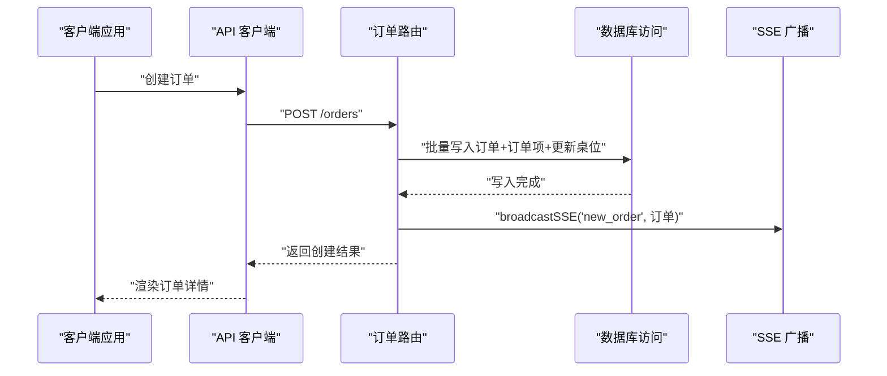
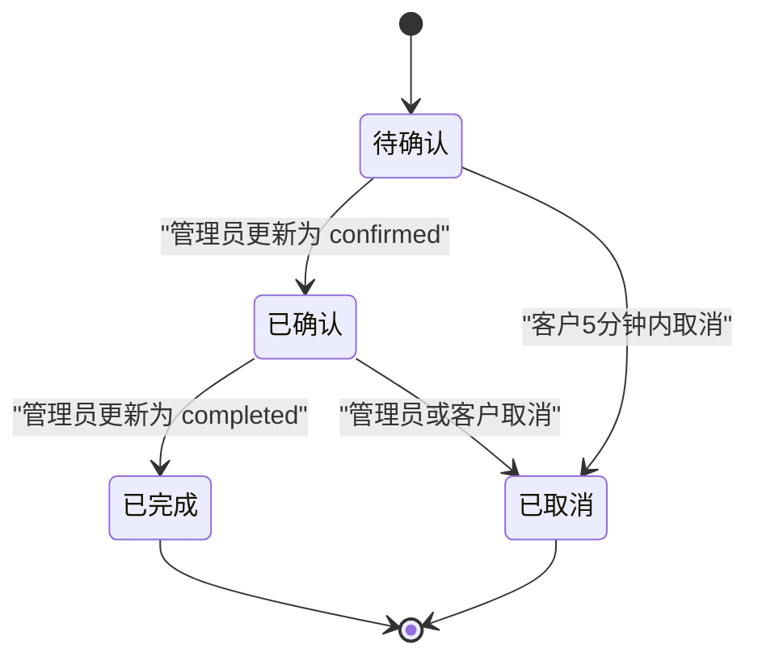
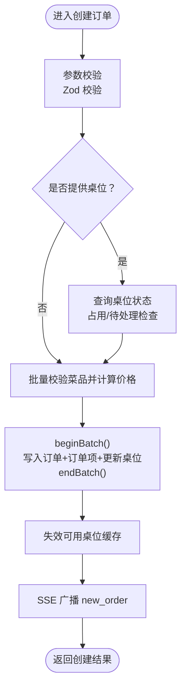
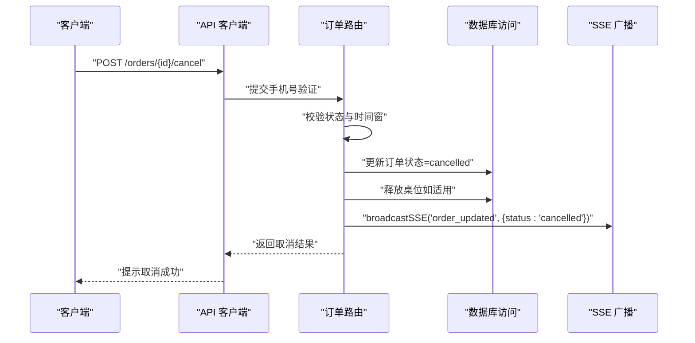
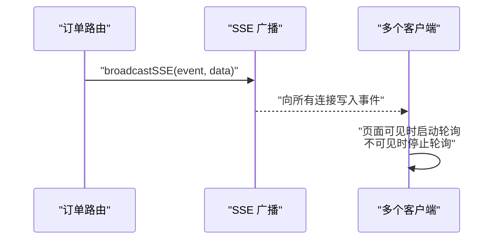
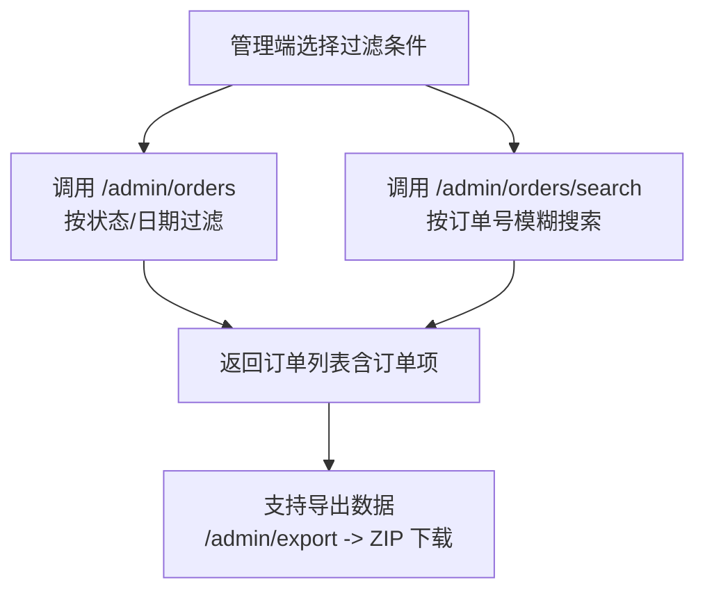
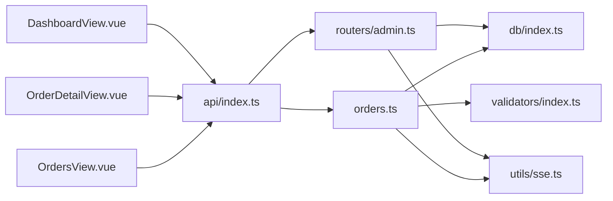

# 订单管理

<cite>
**本文引用的文件**
- [server/src/routes/orders.ts](file://server/src/routes/orders.ts)
- [server/src/utils/sse.ts](file://server/src/utils/sse.ts)
- [server/src/db/index.ts](file://server/src/db/index.ts)
- [server/src/validators/index.ts](file://server/src/validators/index.ts)
- [src/api/index.ts](file://src/api/index.ts)
- [src/types/index.ts](file://src/types/index.ts)
- [src/client/views/OrdersView.vue](file://src/client/views/OrdersView.vue)
- [src/client/views/OrderDetailView.vue](file://src/client/views/OrderDetailView.vue)
- [server/src/routers/admin.ts](file://server/src/routers/admin.ts)
- [src/admin/views/DashboardView.vue](file://src/admin/views/DashboardView.vue)
- [README.md](file://README.md)
</cite>

## 目录
1. [简介](#简介)
2. [项目结构](#项目结构)
3. [核心组件](#核心组件)
4. [架构总览](#架构总览)
5. [详细组件分析](#详细组件分析)
6. [依赖关系分析](#依赖关系分析)
7. [性能考量](#性能考量)
8. [故障排查指南](#故障排查指南)
9. [结论](#结论)
10. [附录](#附录)

## 简介
本文件面向RLRMS餐厅管理系统中的“订单管理”功能，系统化梳理订单的完整生命周期：从客户下单、确认、制作到完成与取消的状态流转；阐述订单状态更新机制、实时推送通知与历史订单查询；解释订单详情查看、批量操作与统计分析能力；并提供高峰期处理策略、异常订单处理流程与客户沟通建议，以及订单数据的过滤、搜索与导出能力。

## 项目结构
订单管理横跨前端与后端，主要涉及以下模块：
- 后端路由层：负责订单的创建、查询、取消、加菜与状态更新
- 数据访问层：基于SQL.js的嵌入式数据库，提供事务批处理与防抖落盘
- 实时推送：基于Server-Sent Events（SSE）向客户端广播订单事件
- 前端视图：客户侧展示订单列表与详情、自动轮询与交互；管理侧支持搜索、筛选与批量状态更新
- 类型定义：统一前后端订单数据结构与状态枚举

图表来源
- [server/src/routes/orders.ts:1-552](file://server/src/routes/orders.ts#L1-L552)
- [server/src/routers/admin.ts:700-899](file://server/src/routers/admin.ts#L700-L899)
- [server/src/utils/sse.ts:1-59](file://server/src/utils/sse.ts#L1-L59)
- [server/src/db/index.ts:1-156](file://server/src/db/index.ts#L1-L156)
- [server/src/validators/index.ts:1-123](file://server/src/validators/index.ts#L1-L123)
- [src/api/index.ts:1-608](file://src/api/index.ts#L1-L608)
- [src/types/index.ts:70-97](file://src/types/index.ts#L70-L97)
- [src/client/views/OrdersView.vue:1-290](file://src/client/views/OrdersView.vue#L1-L290)
- [src/client/views/OrderDetailView.vue:1-672](file://src/client/views/OrderDetailView.vue#L1-L672)

章节来源
- [server/src/routes/orders.ts:1-552](file://server/src/routes/orders.ts#L1-L552)
- [server/src/routers/admin.ts:700-899](file://server/src/routers/admin.ts#L700-L899)
- [server/src/utils/sse.ts:1-59](file://server/src/utils/sse.ts#L1-L59)
- [server/src/db/index.ts:1-156](file://server/src/db/index.ts#L1-L156)
- [server/src/validators/index.ts:1-123](file://server/src/validators/index.ts#L1-L123)
- [src/api/index.ts:1-608](file://src/api/index.ts#L1-L608)
- [src/types/index.ts:70-97](file://src/types/index.ts#L70-L97)
- [src/client/views/OrdersView.vue:1-290](file://src/client/views/OrdersView.vue#L1-L290)
- [src/client/views/OrderDetailView.vue:1-672](file://src/client/views/OrderDetailView.vue#L1-L672)

## 核心组件
- 订单路由（orders.ts）
  - 提供客户侧订单查询、详情、创建、取消、加菜等接口
  - 内置客户端身份验证中间件与参数校验
  - 批量写入与缓存失效，确保一致性与性能
- 管理路由（admin.ts）
  - 提供管理员侧订单查询、按订单号搜索、状态更新、删除等
  - 支持按状态、日期范围过滤
- SSE 广播（sse.ts）
  - 维护客户端连接池，向所有订阅者广播新订单与状态变更事件
- 数据库访问（db/index.ts）
  - 基于SQL.js，提供批处理、防抖保存与事务合并
- 参数校验（validators/index.ts）
  - 使用Zod对订单创建、取消、加菜等请求体进行严格校验
- API 客户端（api/index.ts）
  - 统一封装HTTP请求、超时控制、401处理与缓存策略
  - 提供导出数据能力（ZIP）
- 类型定义（types/index.ts）
  - 统一订单、订单项与状态枚举，保障前后端契约一致
- 客户端视图（OrdersView.vue、OrderDetailView.vue）
  - 展示订单列表与详情，支持轮询、幽灵订单清理与交互操作
- 管理端视图（DashboardView.vue）
  - 支持订单搜索、筛选、批量状态更新与统计面板

章节来源
- [server/src/routes/orders.ts:1-552](file://server/src/routes/orders.ts#L1-L552)
- [server/src/routers/admin.ts:700-899](file://server/src/routers/admin.ts#L700-L899)
- [server/src/utils/sse.ts:1-59](file://server/src/utils/sse.ts#L1-L59)
- [server/src/db/index.ts:1-156](file://server/src/db/index.ts#L1-L156)
- [server/src/validators/index.ts:1-123](file://server/src/validators/index.ts#L1-L123)
- [src/api/index.ts:1-608](file://src/api/index.ts#L1-L608)
- [src/types/index.ts:70-97](file://src/types/index.ts#L70-L97)
- [src/client/views/OrdersView.vue:1-290](file://src/client/views/OrdersView.vue#L1-L290)
- [src/client/views/OrderDetailView.vue:1-672](file://src/client/views/OrderDetailView.vue#L1-L672)
- [src/admin/views/DashboardView.vue:120-241](file://src/admin/views/DashboardView.vue#L120-L241)

## 架构总览
订单管理采用“前端SPA + 后端REST + SSE”的架构模式：
- 前端通过API客户端发起HTTP请求，后端路由层执行业务逻辑并访问数据库
- 关键状态变更通过SSE广播至所有订阅方（管理端与可能的客户端）
- 数据库采用批处理与防抖保存，降低I/O开销并提升吞吐

图表来源
- [server/src/routes/orders.ts:193-353](file://server/src/routes/orders.ts#L193-L353)
- [server/src/utils/sse.ts:37-51](file://server/src/utils/sse.ts#L37-L51)
- [server/src/db/index.ts:46-73](file://server/src/db/index.ts#L46-L73)
- [src/api/index.ts:186-205](file://src/api/index.ts#L186-L205)

章节来源
- [server/src/routes/orders.ts:193-353](file://server/src/routes/orders.ts#L193-L353)
- [server/src/utils/sse.ts:1-59](file://server/src/utils/sse.ts#L1-L59)
- [server/src/db/index.ts:1-156](file://server/src/db/index.ts#L1-L156)
- [src/api/index.ts:1-608](file://src/api/index.ts#L1-L608)

## 详细组件分析

### 订单生命周期与状态流转
- 状态枚举
  - 客户端可见状态：pending（等待确认）、confirmed（已确认）、completed（已完成）、cancelled（已取消）
  - 管理端可更新状态白名单：pending、confirmed、completed、cancelled
- 流程要点
  - 创建订单后初始状态为 pending
  - 管理员可将状态更新为 confirmed（开始制作）、completed（完成）、cancelled（取消）
  - 完成或取消后若关联桌位，自动释放桌位并失效可用桌位缓存

图表来源
- [src/types/index.ts:93-93](file://src/types/index.ts#L93-L93)
- [server/src/routers/admin.ts:795-833](file://server/src/routers/admin.ts#L795-L833)
- [server/src/routes/orders.ts:355-418](file://server/src/routes/orders.ts#L355-L418)

章节来源
- [src/types/index.ts:93-93](file://src/types/index.ts#L93-L93)
- [server/src/routers/admin.ts:795-833](file://server/src/routers/admin.ts#L795-L833)
- [server/src/routes/orders.ts:355-418](file://server/src/routes/orders.ts#L355-L418)

### 订单创建与加菜（服务端价格校验与批量写入）
- 创建订单
  - 客户端身份验证：校验 client_token 并确认用户存在
  - 桌位检查：若提供 table_id，需未被占用且无待处理订单
  - 菜品校验：批量查询菜品并核对状态，使用数据库价格重新计算，防止篡改
  - 批量写入：订单 + 订单项 + 桌位状态更新，完成后广播新订单事件
- 加菜（Update Order Items）
  - 仅允许 pending 或 confirmed 状态的订单加菜
  - 服务端重新校验菜品与价格，删除旧项并插入新项，重置状态为 pending

图表来源
- [server/src/routes/orders.ts:193-353](file://server/src/routes/orders.ts#L193-L353)
- [server/src/validators/index.ts:6-19](file://server/src/validators/index.ts#L6-L19)
- [server/src/utils/sse.ts:37-51](file://server/src/utils/sse.ts#L37-L51)
- [server/src/db/index.ts:46-73](file://server/src/db/index.ts#L46-L73)

章节来源
- [server/src/routes/orders.ts:193-353](file://server/src/routes/orders.ts#L193-L353)
- [server/src/validators/index.ts:6-19](file://server/src/validators/index.ts#L6-L19)
- [server/src/utils/sse.ts:1-59](file://server/src/utils/sse.ts#L1-L59)
- [server/src/db/index.ts:46-73](file://server/src/db/index.ts#L46-L73)

### 订单取消（5分钟时限与手机号验证）
- 客户端取消
  - 仅 pending 状态且创建时间在5分钟内可取消
  - 请求体需携带手机号进行身份验证
  - 取消成功后释放桌位并广播 order_updated
- 管理端取消
  - 通过管理路由将订单状态更新为 cancelled，并释放桌位

图表来源
- [server/src/routes/orders.ts:355-418](file://server/src/routes/orders.ts#L355-L418)
- [server/src/utils/sse.ts:37-51](file://server/src/utils/sse.ts#L37-L51)
- [server/src/db/index.ts:46-73](file://server/src/db/index.ts#L46-L73)

章节来源
- [server/src/routes/orders.ts:355-418](file://server/src/routes/orders.ts#L355-L418)
- [server/src/utils/sse.ts:1-59](file://server/src/utils/sse.ts#L1-L59)
- [server/src/db/index.ts:46-73](file://server/src/db/index.ts#L46-L73)

### 实时推送与轮询（SSE + 前端轮询）
- SSE 广播
  - 新订单与状态变更事件通过 broadcastSSE 推送
  - 客户端可通过 SSE 连接接收实时更新（在管理端实现中体现）
- 前端轮询
  - 订单列表页与详情页均采用定时轮询，避免长连接复杂度
  - 列表页每5秒轮询一次，详情页每3秒轮询一次
  - 页面隐藏时停止轮询，显示时恢复

图表来源
- [server/src/utils/sse.ts:37-51](file://server/src/utils/sse.ts#L37-L51)
- [src/client/views/OrdersView.vue:88-136](file://src/client/views/OrdersView.vue#L88-L136)
- [src/client/views/OrderDetailView.vue:97-149](file://src/client/views/OrderDetailView.vue#L97-L149)

章节来源
- [server/src/utils/sse.ts:1-59](file://server/src/utils/sse.ts#L1-L59)
- [src/client/views/OrdersView.vue:88-136](file://src/client/views/OrdersView.vue#L88-L136)
- [src/client/views/OrderDetailView.vue:97-149](file://src/client/views/OrderDetailView.vue#L97-L149)

### 历史订单查询与搜索（过滤、搜索、导出）
- 客户端历史订单
  - 通过手机号查询个人历史订单，支持幽灵订单清理（verify 接口）
- 管理端订单查询
  - 支持按状态、日期范围过滤
  - 支持按订单号模糊搜索（前缀/包含），返回带订单项的聚合结果
- 数据导出
  - API 提供导出数据接口，返回ZIP文件，前端解析并触发下载

图表来源
- [src/admin/views/DashboardView.vue:162-183](file://src/admin/views/DashboardView.vue#L162-L183)
- [server/src/routers/admin.ts:700-722](file://server/src/routers/admin.ts#L700-L722)
- [server/src/routers/admin.ts:724-793](file://server/src/routers/admin.ts#L724-L793)
- [src/api/index.ts:509-549](file://src/api/index.ts#L509-L549)

章节来源
- [src/admin/views/DashboardView.vue:162-183](file://src/admin/views/DashboardView.vue#L162-L183)
- [server/src/routers/admin.ts:700-722](file://server/src/routers/admin.ts#L700-L722)
- [server/src/routers/admin.ts:724-793](file://server/src/routers/admin.ts#L724-L793)
- [src/api/index.ts:509-549](file://src/api/index.ts#L509-L549)

### 订单详情查看、批量操作与统计分析
- 订单详情
  - 展示桌位、用餐时间、联系人、菜单明细、合计金额
  - 支持展开/折叠菜单、生成订单码（二维码/条形码）、复制订单号
- 批量操作
  - 管理端支持按状态/日期过滤、按订单号搜索、批量更新状态
  - 清空已完成/已取消订单（保留其他状态）
- 统计分析
  - 管理端仪表盘提供今日订单数、收入、待处理订单、可用桌位等指标

章节来源
- [src/client/views/OrderDetailView.vue:1-672](file://src/client/views/OrderDetailView.vue#L1-L672)
- [src/admin/views/DashboardView.vue:120-241](file://src/admin/views/DashboardView.vue#L120-L241)
- [src/types/index.ts:117-124](file://src/types/index.ts#L117-L124)

### 数据模型与约束
- 订单（Order）
  - 包含 order_no（唯一）、table_id（可选）、contact_name/phone、total_amount、status、created_at/updated_at
- 订单项（OrderItem）
  - 关联订单，包含 dish_id/name/spec、quantity、unit_price、subtotal
- 状态约束
  - 客户端可见状态：pending、confirmed、completed、cancelled
  - 管理端状态白名单：同上

章节来源
- [README.md:442-462](file://README.md#L442-L462)
- [server/src/db/init.ts:64-94](file://server/src/db/init.ts#L64-L94)
- [src/types/index.ts:82-97](file://src/types/index.ts#L82-L97)

## 依赖关系分析
- 组件耦合
  - 订单路由依赖数据库访问与SSE工具；管理路由同样依赖数据库与SSE
  - 前端API客户端统一封装HTTP请求，减少重复逻辑
- 外部依赖
  - SQL.js：嵌入式数据库，支持批处理与防抖保存
  - Zod：参数校验，保证输入安全
  - Lucide 图标库：用于界面交互
- 潜在循环依赖
  - 当前模块间通过明确的职责划分（路由/工具/类型）避免循环依赖

图表来源
- [server/src/routes/orders.ts:1-10](file://server/src/routes/orders.ts#L1-L10)
- [server/src/routers/admin.ts:1-20](file://server/src/routers/admin.ts#L1-L20)
- [server/src/db/index.ts:1-20](file://server/src/db/index.ts#L1-L20)
- [server/src/utils/sse.ts:1-10](file://server/src/utils/sse.ts#L1-L10)
- [server/src/validators/index.ts:1-5](file://server/src/validators/index.ts#L1-L5)
- [src/api/index.ts:1-20](file://src/api/index.ts#L1-L20)
- [src/client/views/OrdersView.vue:1-10](file://src/client/views/OrdersView.vue#L1-L10)
- [src/client/views/OrderDetailView.vue:1-15](file://src/client/views/OrderDetailView.vue#L1-L15)
- [src/admin/views/DashboardView.vue:1-20](file://src/admin/views/DashboardView.vue#L1-L20)

章节来源
- [server/src/routes/orders.ts:1-10](file://server/src/routes/orders.ts#L1-L10)
- [server/src/routers/admin.ts:1-20](file://server/src/routers/admin.ts#L1-L20)
- [server/src/db/index.ts:1-20](file://server/src/db/index.ts#L1-L20)
- [server/src/utils/sse.ts:1-10](file://server/src/utils/sse.ts#L1-L10)
- [server/src/validators/index.ts:1-5](file://server/src/validators/index.ts#L1-L5)
- [src/api/index.ts:1-20](file://src/api/index.ts#L1-L20)
- [src/client/views/OrdersView.vue:1-10](file://src/client/views/OrdersView.vue#L1-L10)
- [src/client/views/OrderDetailView.vue:1-15](file://src/client/views/OrderDetailView.vue#L1-L15)
- [src/admin/views/DashboardView.vue:1-20](file://src/admin/views/DashboardView.vue#L1-L20)

## 性能考量
- 批量写入与事务合并
  - 使用 beginBatch/endBatch 将多条写入合并为单次保存，减少磁盘IO
- 防抖保存
  - 通过保存防抖（SAVE_DEBOUNCE_MS）合并高频写入，提升吞吐
- N+1 查询优化
  - 订单列表一次性批量查询订单项，按订单ID分组，避免多次查询
- 前端轮询节流
  - 列表页5秒轮询、详情页3秒轮询，页面隐藏时停止，降低网络与CPU消耗
- 缓存失效
  - 桌位状态变更后失效可用桌位缓存，确保后续查询一致性

章节来源
- [server/src/db/index.ts:46-73](file://server/src/db/index.ts#L46-L73)
- [server/src/db/index.ts:13-44](file://server/src/db/index.ts#L13-L44)
- [server/src/routes/orders.ts:96-130](file://server/src/routes/orders.ts#L96-L130)
- [src/client/views/OrdersView.vue:88-136](file://src/client/views/OrdersView.vue#L88-L136)
- [src/client/views/OrderDetailView.vue:97-149](file://src/client/views/OrderDetailView.vue#L97-L149)

## 故障排查指南
- 订单创建失败
  - 检查手机号格式、菜品是否在售、桌位是否被占用或存在未处理订单
  - 关注服务端参数校验与批量写入日志
- 订单取消失败
  - 确认订单状态为 pending 且创建时间在5分钟内
  - 核对请求体手机号与订单联系人手机号一致
- 实时推送未生效
  - 检查SSE客户端连接与广播函数调用
  - 管理端页面是否正确订阅事件
- 历史订单为空或出现“幽灵订单”
  - 使用 verify 接口清理不存在的订单ID
  - 确保前端轮询与 verify 逻辑正常执行
- 导出失败
  - 检查响应头 Content-Disposition 与Blob下载流程
  - 确认后端导出接口返回ZIP文件

章节来源
- [server/src/validators/index.ts:78-81](file://server/src/validators/index.ts#L78-L81)
- [server/src/routes/orders.ts:355-418](file://server/src/routes/orders.ts#L355-L418)
- [server/src/utils/sse.ts:37-51](file://server/src/utils/sse.ts#L37-L51)
- [src/client/views/OrdersView.vue:33-63](file://src/client/views/OrdersView.vue#L33-L63)
- [src/api/index.ts:509-549](file://src/api/index.ts#L509-L549)

## 结论
RLRMS的订单管理以清晰的路由职责、严格的参数校验与高效的数据库批处理为基础，结合SSE与前端轮询实现了可靠的实时更新与良好的用户体验。管理端提供了完善的搜索、过滤与批量操作能力，辅以导出与统计分析，满足日常运营需求。建议在高峰期适当调整轮询间隔与缓存策略，并持续监控SSE连接健康度与数据库写入性能。

## 附录
- 最佳实践
  - 高峰期策略：适度延长轮询间隔、启用缓存、限制一次性导出数据量
  - 异常处理：对401、网络超时与SSE断连进行优雅降级与重试
  - 客户沟通：在订单详情页提供清晰的状态提示与操作入口（取消、加菜）
- 数据导出
  - 通过 /admin/export 获取ZIP压缩包，前端解析并触发浏览器下载

章节来源
- [src/api/index.ts:509-549](file://src/api/index.ts#L509-L549)
- [src/client/views/OrderDetailView.vue:196-226](file://src/client/views/OrderDetailView.vue#L196-L226)