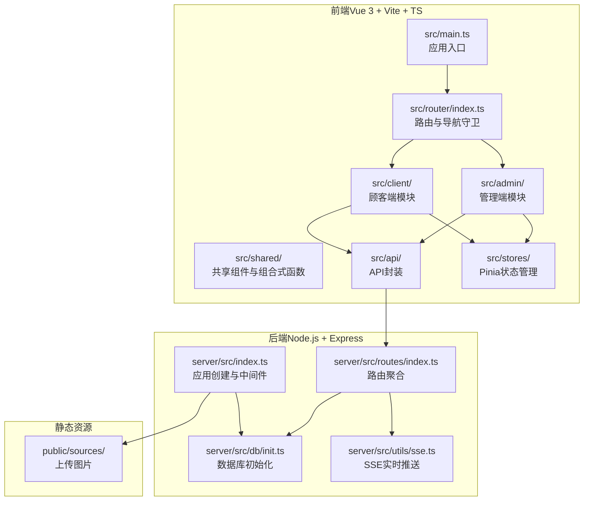
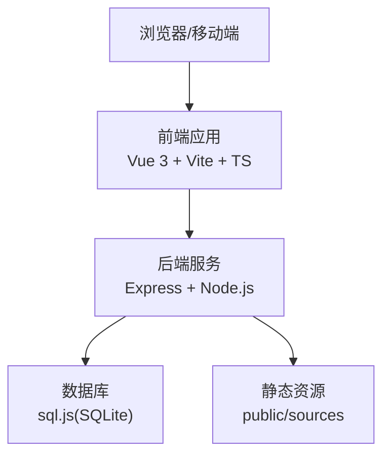
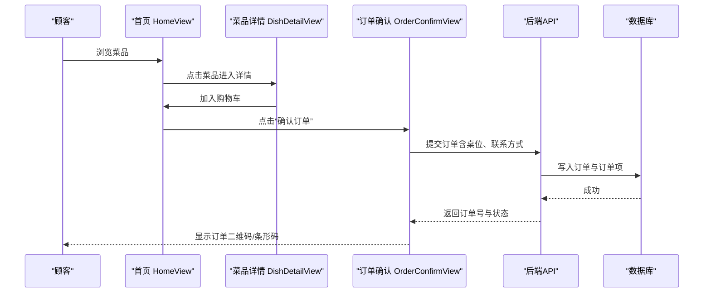
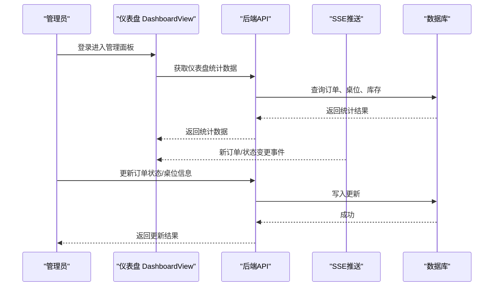
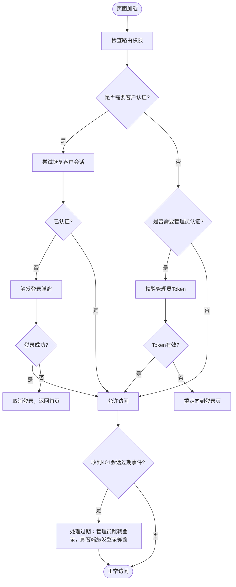
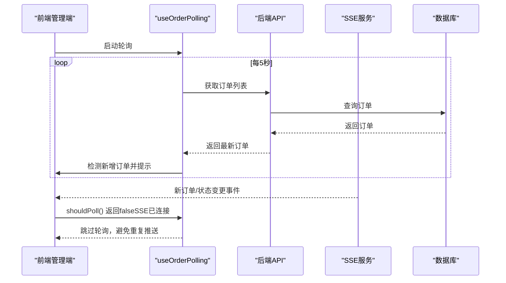
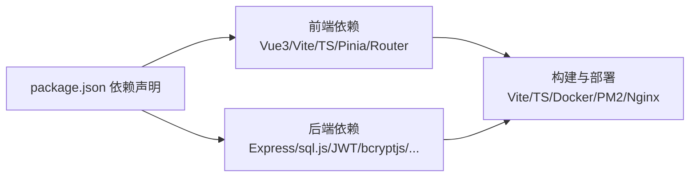

# 项目介绍

<cite>
**本文引用的文件**
- [README.md](file://README.md)
- [PRD（初版）.txt](file://spec/PRD（初版）.txt)
- [package.json](file://package.json)
- [src/main.ts](file://src/main.ts)
- [src/App.vue](file://src/App.vue)
- [src/router/index.ts](file://src/router/index.ts)
- [src/client/views/HomeView.vue](file://src/client/views/HomeView.vue)
- [src/admin/views/DashboardView.vue](file://src/admin/views/DashboardView.vue)
- [server/src/index.ts](file://server/src/index.ts)
- [server/src/routes/index.ts](file://server/src/routes/index.ts)
- [server/src/db/init.ts](file://server/src/db/init.ts)
- [server/src/utils/sse.ts](file://server/src/utils/sse.ts)
- [src/shared/composables/useOrderPolling.ts](file://src/shared/composables/useOrderPolling.ts)
- [src/stores/app.ts](file://src/stores/app.ts)
</cite>

## 目录
1. [项目简介](#项目简介)
2. [项目结构](#项目结构)
3. [核心组件](#核心组件)
4. [架构总览](#架构总览)
5. [详细组件分析](#详细组件分析)
6. [依赖关系分析](#依赖关系分析)
7. [性能考量](#性能考量)
8. [故障排查指南](#故障排查指南)
9. [结论](#结论)
10. [附录](#附录)

## 项目简介
红灯笼食府管理系统是一个面向中小型餐厅的前后端分离餐饮企业管理系统，包含两大核心模块：
- 顾客端（C端）：到店顾客自助点餐，支持菜品浏览、购物车、下单、订单查询等功能
- 管理端（B端）：餐厅管理员/服务员进行桌台管理、菜品管理、订单管理、库存管理等

项目通过前后端分离架构，结合现代化前端技术栈与轻量数据库，实现高效、稳定、易维护的餐厅管理解决方案。系统支持高并发场景，具备完善的认证授权、实时推送、数据导入导出、图片处理等能力，满足餐厅日常运营的多样化需求。

**章节来源**
- [README.md:24-27](file://README.md#L24-L27)
- [PRD（初版）.txt:7-18](file://spec/PRD（初版）.txt#L7-L18)

## 项目结构
项目采用典型的前后端分离架构，前端使用 Vue 3 + Vite + TypeScript，后端使用 Node.js + Express，数据库采用 sql.js（SQLite 的 JavaScript 实现）。整体结构清晰，职责分明：
- 前端 src/：包含 client（顾客端）与 admin（管理端）两大模块，以及公共组件、路由、状态管理、类型定义等
- 后端 server/：包含路由、数据库初始化、工具函数、验证器等
- 静态资源 public/：图片等静态资源
- 构建与部署：Vite 构建前端、TypeScript 编译后端、Docker 多阶段构建镜像

**图表来源**
- [src/main.ts:1-37](file://src/main.ts#L1-L37)
- [src/router/index.ts:1-317](file://src/router/index.ts#L1-L317)
- [server/src/index.ts:1-171](file://server/src/index.ts#L1-L171)
- [server/src/routes/index.ts:1-18](file://server/src/routes/index.ts#L1-L18)
- [server/src/db/init.ts:1-204](file://server/src/db/init.ts#L1-L204)
- [server/src/utils/sse.ts:1-59](file://server/src/utils/sse.ts#L1-L59)

**章节来源**
- [README.md:61-174](file://README.md#L61-L174)
- [package.json:1-64](file://package.json#L1-L64)

## 核心组件
- 前端应用入口与全局配置：负责创建 Vue 应用、挂载路由与状态管理，并进行全局拼写检查禁用与关键路由预加载
- 路由系统：区分顾客端与管理端路由，实现导航守卫与权限控制，支持预取策略提升首屏体验
- 状态管理：Pinia 管理应用主题、加载状态、Toast 提示、用户会话等
- 后端应用：Express 应用创建、CORS、压缩、Cookie、静态资源托管、错误处理、健康检查
- 数据库初始化：sql.js 初始化核心表与索引，创建默认管理员与系统设置，支持幂等迁移
- 实时推送：SSE 服务端推送新订单、订单状态变更等事件
- 订单轮询：组合式函数实现订单刷新与新订单检测，支持页面可见性优化

**章节来源**
- [src/main.ts:1-37](file://src/main.ts#L1-L37)
- [src/router/index.ts:19-317](file://src/router/index.ts#L19-L317)
- [src/stores/app.ts:1-122](file://src/stores/app.ts#L1-L122)
- [server/src/index.ts:29-171](file://server/src/index.ts#L29-L171)
- [server/src/db/init.ts:5-204](file://server/src/db/init.ts#L5-L204)
- [server/src/utils/sse.ts:1-59](file://server/src/utils/sse.ts#L1-L59)
- [src/shared/composables/useOrderPolling.ts:1-74](file://src/shared/composables/useOrderPolling.ts#L1-L74)

## 架构总览
系统采用前后端分离架构，前端通过统一的 API 封装与后端交互；后端提供 RESTful API，路由按模块划分，数据库初始化在应用启动时完成。系统支持开发与生产两种模式，生产环境通过 Nginx/Apache 反向代理与静态资源托管，支持 Docker 部署与 PM2 进程管理。

**图表来源**
- [README.md:29-60](file://README.md#L29-L60)
- [server/src/index.ts:78-119](file://server/src/index.ts#L78-L119)
- [server/src/db/init.ts:11-137](file://server/src/db/init.ts#L11-L137)

**章节来源**
- [README.md:216-234](file://README.md#L216-L234)
- [README.md:510-578](file://README.md#L510-L578)

## 详细组件分析

### 顾客端自助点餐系统
- 首页：菜品分类浏览、菜品网格展示、购物车与“确认订单”入口
- 菜品详情：菜品信息展示、规格选择、加入购物车
- 购物车：购物车抽屉、数量控制、删除菜品、清空购物车
- 订单确认：桌位选择、联系方式填写、下单
- 订单详情：订单状态、二维码/条形码、取消订单（5分钟内）
- 搜索：关键词搜索、历史记录管理
- 全部订单：登录后查看历史订单
- 顾客登录：手机号+密码登录，未注册自动注册
- 设置：主题切换、名片管理

**图表来源**
- [src/client/views/HomeView.vue:1-200](file://src/client/views/HomeView.vue#L1-L200)
- [README.md:235-266](file://README.md#L235-L266)

**章节来源**
- [README.md:235-266](file://README.md#L235-L266)
- [src/client/views/HomeView.vue:1-200](file://src/client/views/HomeView.vue#L1-L200)

### 管理端后台管理系统
- 登录：管理员身份认证，首次登录提示修改密码
- 仪表盘：今日订单统计、收入统计、桌位状态概览、最近订单
- 桌位管理：添加/删除桌位、查看桌位状态、更新桌位信息
- 菜单管理：添加/编辑/删除菜品、分类管理、图片上传、拖拽排序
- 订单管理：查看所有订单、按订单号搜索、更新订单状态、筛选订单
- 库存管理：原材料库存监控、库存预警、入库/出库记录、拖拽排序
- 用户管理：管理员/顾客账号管理、创建/编辑/删除用户、重置密码
- 系统设置：店铺信息配置、数据导入导出、重置数据库、清空历史订单
- 调试工具：SQL 执行与查询、数据库 Schema 浏览、API 接口调试
- 实时推送：通过 SSE 接收新订单、订单状态变更等实时事件

**图表来源**
- [src/admin/views/DashboardView.vue:1-200](file://src/admin/views/DashboardView.vue#L1-L200)
- [server/src/utils/sse.ts:1-59](file://server/src/utils/sse.ts#L1-L59)
- [README.md:252-266](file://README.md#L252-L266)

**章节来源**
- [README.md:252-266](file://README.md#L252-L266)
- [src/admin/views/DashboardView.vue:1-200](file://src/admin/views/DashboardView.vue#L1-L200)

### 认证与会话管理
- 顾客端：通过 Cookie 存储 client_token，支持自动登录与会话过期处理
- 管理端：通过 Cookie 存储 admin_token，路由守卫进行权限校验
- 会话过期：统一通过自定义事件处理，管理员跳转登录页，顾客端触发登录弹窗

**图表来源**
- [src/router/index.ts:201-277](file://src/router/index.ts#L201-L277)
- [src/App.vue:16-47](file://src/App.vue#L16-L47)

**章节来源**
- [src/router/index.ts:201-277](file://src/router/index.ts#L201-L277)
- [src/App.vue:16-47](file://src/App.vue#L16-L47)

### 实时推送与订单轮询
- SSE：后端维护客户端连接池，广播新订单与状态变更事件
- 订单轮询：组合式函数根据页面可见性自动启停轮询，检测新增订单并触发回调

**图表来源**
- [src/shared/composables/useOrderPolling.ts:1-74](file://src/shared/composables/useOrderPolling.ts#L1-L74)
- [server/src/utils/sse.ts:1-59](file://server/src/utils/sse.ts#L1-L59)

**章节来源**
- [src/shared/composables/useOrderPolling.ts:1-74](file://src/shared/composables/useOrderPolling.ts#L1-L74)
- [server/src/utils/sse.ts:1-59](file://server/src/utils/sse.ts#L1-L59)

## 依赖关系分析
- 前端依赖：Vue 3、Vite、TypeScript、Pinia、Vue Router、Lucide Vue Next、Zod 等
- 后端依赖：Express、sql.js、JWT、bcryptjs、QRCode、JsBarcode、Multer、Sharp、Archiver、AdmZip、Cookie-parser、Compression、Uuid 等
- 构建与部署：Vite 构建前端、TypeScript 编译后端、Docker 多阶段构建、PM2 进程管理、Nginx/Apache 反向代理

**图表来源**
- [package.json:16-41](file://package.json#L16-L41)
- [package.json:42-62](file://package.json#L42-L62)

**章节来源**
- [package.json:16-62](file://package.json#L16-L62)

## 性能考量
- 前端性能：关键路由组件预加载、页面切换过渡动画、懒加载与分包策略
- 后端性能：HTTP 压缩（SSE 除外）、静态资源缓存、数据库索引优化、批量事务写入
- 实时性：SSE 无压缩实时推送，轮询作为降级方案，页面可见性优化减少不必要的请求
- 安全性：密码加密存储、JWT Cookie、CORS 配置、请求体大小限制、文件类型与大小限制

**章节来源**
- [src/main.ts:37](file://src/main.ts#L37)
- [server/src/index.ts:44-57](file://server/src/index.ts#L44-L57)
- [server/src/db/init.ts:124-137](file://server/src/db/init.ts#L124-L137)
- [README.md:565-578](file://README.md#L565-L578)

## 故障排查指南
- 数据库初始化失败：检查数据库文件与权限，确认初始化脚本执行日志
- 401 会话过期：检查 Cookie 是否存在、Token 是否过期、路由守卫是否正确处理
- SSE 连接异常：检查代理配置与超时设置，确认心跳保活机制
- 静态资源 404：确认生产环境静态资源托管路径与缓存策略
- 导入导出问题：检查 ZIP 结构与文件路径，避免路径穿越攻击

**章节来源**
- [server/src/index.ts:121-139](file://server/src/index.ts#L121-L139)
- [server/src/db/init.ts:147-160](file://server/src/db/init.ts#L147-L160)
- [README.md:550-557](file://README.md#L550-L557)

## 结论
红灯笼食府管理系统通过前后端分离架构，结合现代化技术栈与轻量数据库，为中小型餐厅提供了高效、稳定、易维护的点餐与库存管理解决方案。系统在用户体验、管理效率、成本控制等方面具有显著优势，适合在快节奏的餐饮环境中推广使用。

## 附录
- 默认管理员账号：用户名 admin，密码 admin123（首次登录后建议立即修改）
- 开发与生产模式：支持集成模式与分离模式，生产环境支持 Docker、PM2、Nginx/Apache 部署
- API 接口：统一返回格式，支持公开接口与管理端接口，具备完善的认证与权限控制

**章节来源**
- [README.md:485-491](file://README.md#L485-L491)
- [README.md:176-234](file://README.md#L176-L234)
- [README.md:267-406](file://README.md#L267-L406)