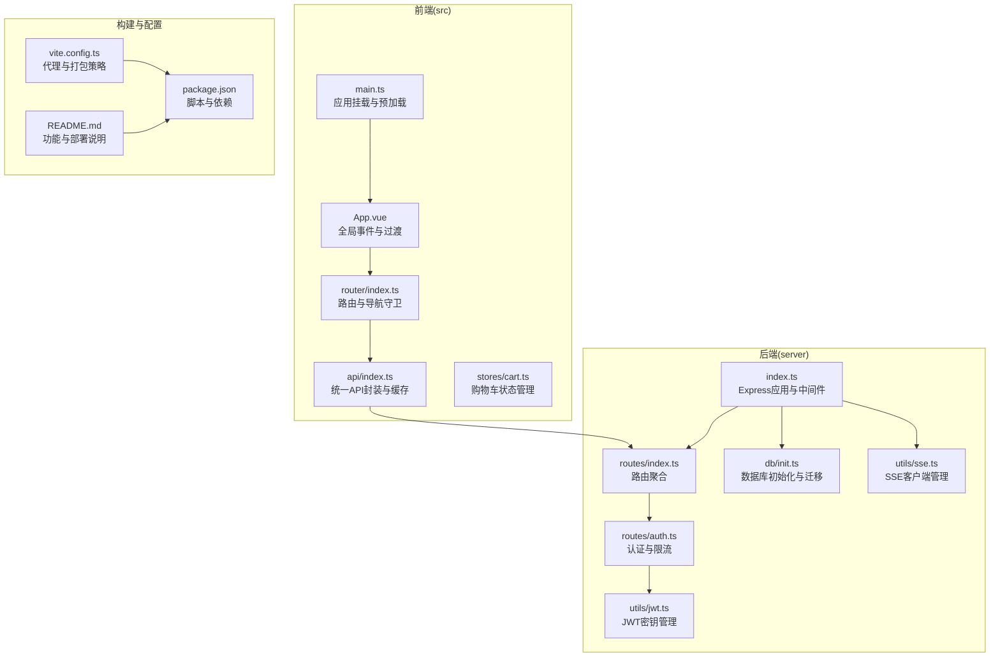
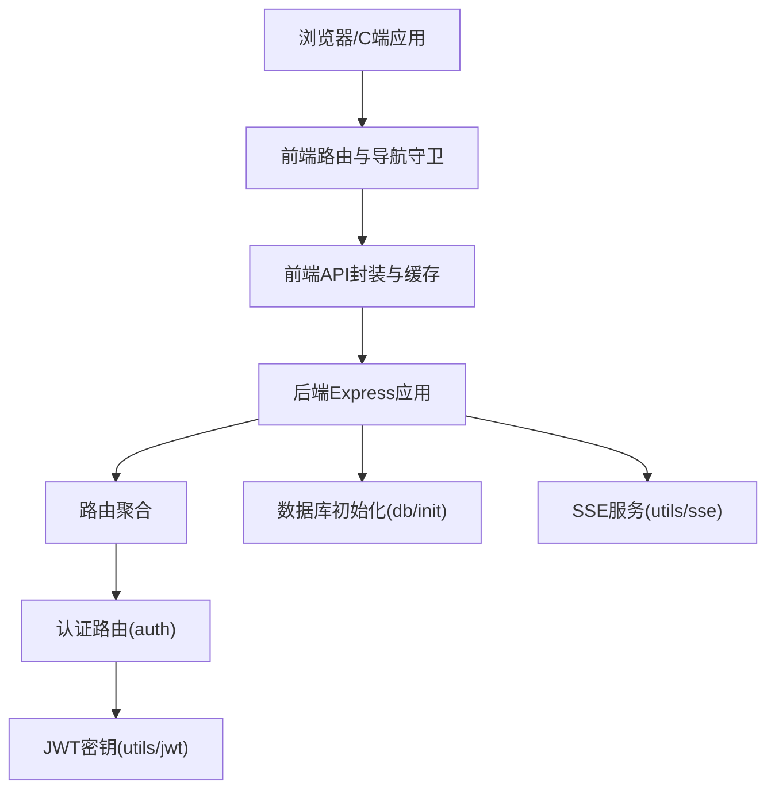
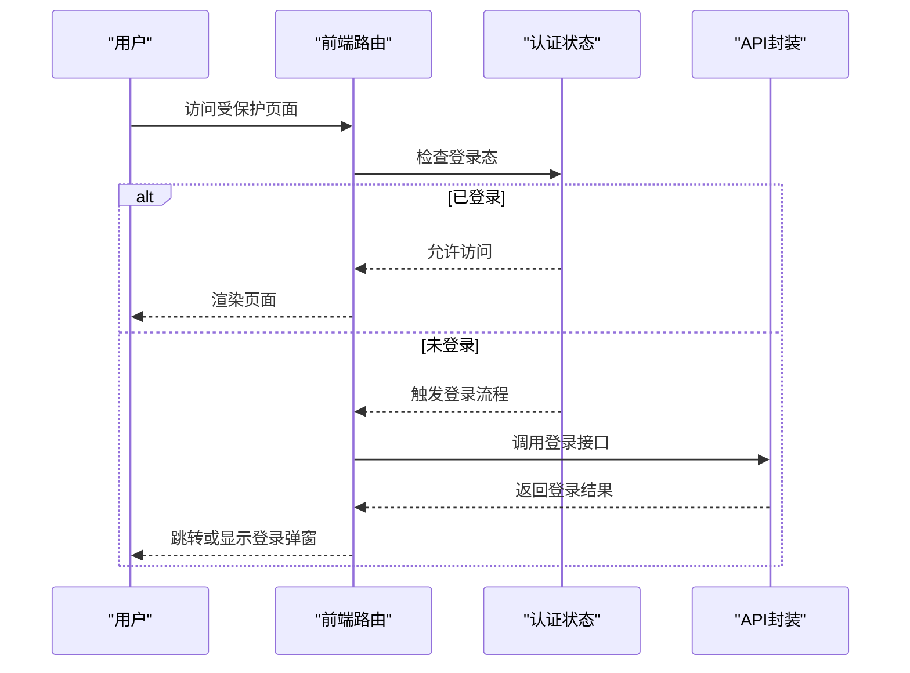
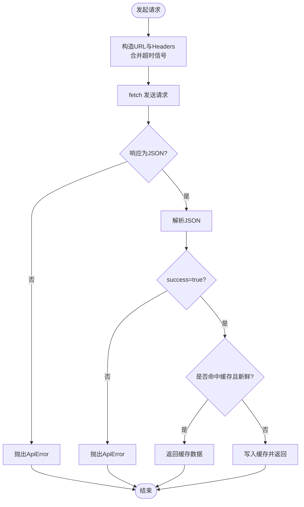
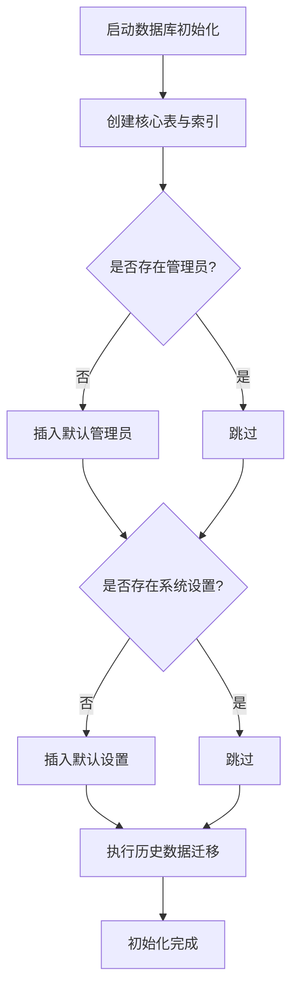
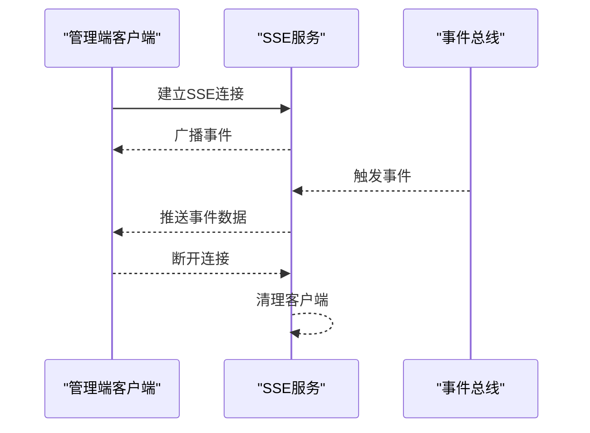
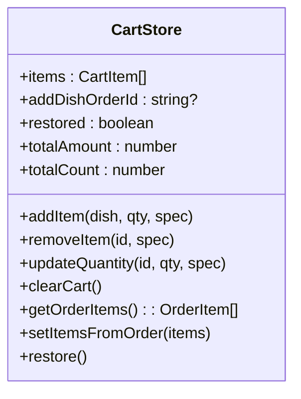
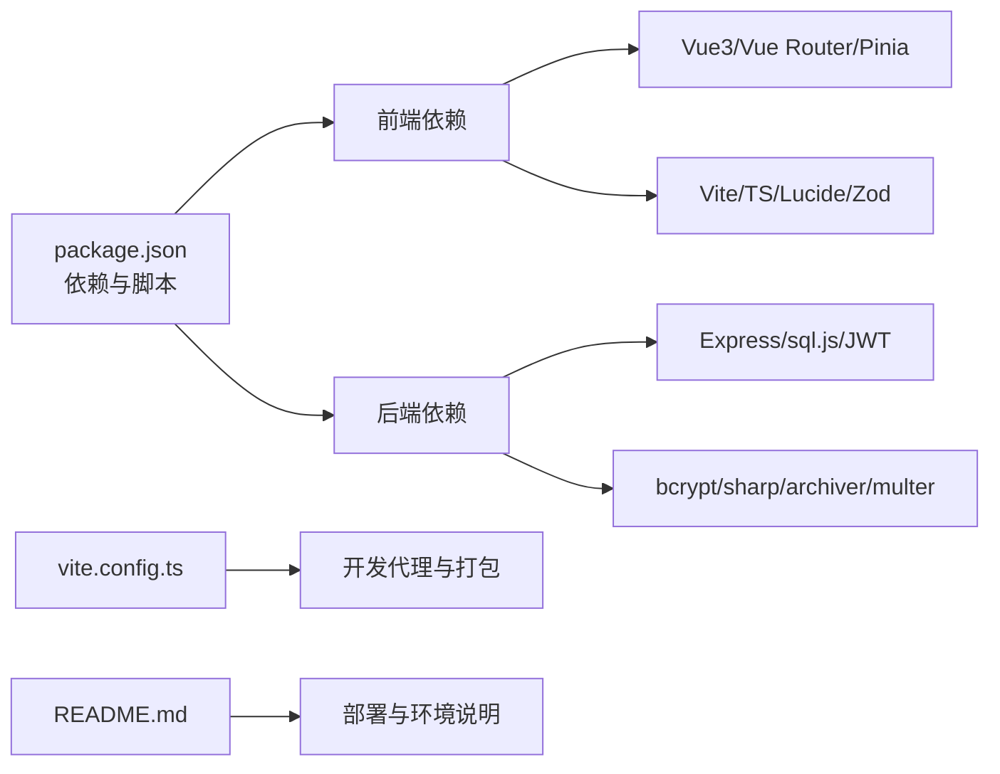

# 项目概述

<cite>
**本文档引用的文件**
- [README.md](file://README.md)
- [package.json](file://package.json)
- [PRD（初版）.txt](file://spec/PRD（初版）.txt)
- [App.vue](file://src/App.vue)
- [main.ts](file://src/main.ts)
- [router/index.ts](file://src/router/index.ts)
- [api/index.ts](file://src/api/index.ts)
- [stores/cart.ts](file://src/stores/cart.ts)
- [index.ts](file://server/src/index.ts)
- [routes/index.ts](file://server/src/routes/index.ts)
- [routes/auth.ts](file://server/src/routes/auth.ts)
- [db/init.ts](file://server/src/db/init.ts)
- [utils/jwt.ts](file://server/src/utils/jwt.ts)
- [utils/sse.ts](file://server/src/utils/sse.ts)
- [vite.config.ts](file://vite.config.ts)
</cite>

## 目录
1. [简介](#简介)
2. [项目结构](#项目结构)
3. [核心组件](#核心组件)
4. [架构总览](#架构总览)
5. [详细组件分析](#详细组件分析)
6. [依赖关系分析](#依赖关系分析)
7. [性能考量](#性能考量)
8. [故障排查指南](#故障排查指南)
9. [结论](#结论)
10. [附录](#附录)

## 简介
红灯笼食府管理系统是一个基于前后端分离架构的轻量级餐饮企业管理系统，服务于两类用户：
- 顾客端（C端）：到店顾客自助点餐、查询订单、扫码核销
- 管理端（B端）：餐厅管理员/服务员进行桌台、菜品、订单、库存、用户与系统设置的日常运营

系统采用“Vue3 + Vite + TypeScript”作为前端技术栈，“Express + sql.js（SQLite）”作为后端技术栈，结合 JWT Cookie 认证、SSE 实时推送、图片压缩与导出导入等能力，满足中小餐厅在点餐与库存管理上的高效需求。

业务价值与目标用户：
- 业务价值：降低人工成本、提升点餐效率、增强数据透明度与可追溯性
- 目标用户：中小型餐厅、连锁快餐、茶餐厅、酒楼等需要标准化点餐与库存管理的场景
- 核心竞争力：一体化前后端、低门槛部署、强安全与稳定性、完善的导入导出与调试工具

## 项目结构
项目采用“前端模块 + 后端模块”的清晰分层，配合统一的 API 命名空间与路由组织，便于维护与扩展。

图表来源
- [main.ts:1-37](file://src/main.ts#L1-L37)
- [App.vue:1-113](file://src/App.vue#L1-L113)
- [router/index.ts:1-317](file://src/router/index.ts#L1-L317)
- [api/index.ts:1-608](file://src/api/index.ts#L1-L608)
- [stores/cart.ts:1-175](file://src/stores/cart.ts#L1-L175)
- [index.ts:1-171](file://server/src/index.ts#L1-L171)
- [routes/index.ts:1-18](file://server/src/routes/index.ts#L1-L18)
- [routes/auth.ts:1-405](file://server/src/routes/auth.ts#L1-L405)
- [db/init.ts:1-204](file://server/src/db/init.ts#L1-L204)
- [utils/jwt.ts:1-27](file://server/src/utils/jwt.ts#L1-L27)
- [utils/sse.ts:1-59](file://server/src/utils/sse.ts#L1-L59)
- [vite.config.ts:1-112](file://vite.config.ts#L1-L112)
- [package.json:1-64](file://package.json#L1-L64)
- [README.md:1-603](file://README.md#L1-L603)

章节来源
- [README.md:61-174](file://README.md#L61-L174)
- [package.json:1-64](file://package.json#L1-L64)

## 核心组件
- 前端应用入口与生命周期
  - 应用挂载与全局事件监听（会话过期、页面过渡动画）
  - 预加载关键路由组件，提升首屏与关键路径体验
- 路由与导航守卫
  - 区分 C 端与 B 端权限，支持登录态恢复与强制登录
  - 自动更新页面标题，提供路由后置预取策略
- API 封装与缓存
  - 统一请求封装、超时与取消、401 全局处理
  - 内存缓存（stale-while-revalidate）优化弱网体验
- 状态管理（Pinia）
  - 购物车状态持久化（IndexedDB），支持结构化克隆与恢复
- 后端服务
  - Express 中间件链：CORS、压缩、Cookie、静态资源、健康检查
  - 路由聚合：公开 API 与管理端 API 分离
  - 认证：JWT Cookie、IP 限流、密码加密
  - 数据库：SQLite（sql.js）初始化、索引、迁移与默认数据
  - 实时：SSE 广播新订单与状态变更

章节来源
- [main.ts:1-37](file://src/main.ts#L1-L37)
- [App.vue:16-47](file://src/App.vue#L16-L47)
- [router/index.ts:201-277](file://src/router/index.ts#L201-L277)
- [api/index.ts:54-126](file://src/api/index.ts#L54-L126)
- [stores/cart.ts:132-160](file://src/stores/cart.ts#L132-L160)
- [index.ts:33-142](file://server/src/index.ts#L33-L142)
- [routes/index.ts:1-18](file://server/src/routes/index.ts#L1-L18)
- [routes/auth.ts:64-144](file://server/src/routes/auth.ts#L64-L144)
- [db/init.ts:5-203](file://server/src/db/init.ts#L5-L203)
- [utils/sse.ts:15-51](file://server/src/utils/sse.ts#L15-L51)

## 架构总览
系统采用前后端分离架构，前端通过统一的 /api 命名空间调用后端接口；后端通过路由聚合模块化管理各领域 API；数据库采用 SQLite（sql.js），在初始化阶段完成表结构、索引与默认数据，并支持后续迁移；认证采用 JWT Cookie，管理端与客户段分别使用不同的 Cookie 名称与过期策略；SSE 用于实时推送新订单与状态变更。

图表来源
- [router/index.ts:189-200](file://src/router/index.ts#L189-L200)
- [api/index.ts:128-148](file://src/api/index.ts#L128-L148)
- [index.ts:33-142](file://server/src/index.ts#L33-L142)
- [routes/index.ts:1-18](file://server/src/routes/index.ts#L1-18)
- [routes/auth.ts:64-144](file://server/src/routes/auth.ts#L64-L144)
- [db/init.ts:5-203](file://server/src/db/init.ts#L5-L203)
- [utils/jwt.ts:20-26](file://server/src/utils/jwt.ts#L20-L26)
- [utils/sse.ts:15-51](file://server/src/utils/sse.ts#L15-L51)

## 详细组件分析

### 前端应用与路由
- 应用入口负责全局事件监听与页面过渡动画，确保会话过期时能正确跳转登录页或触发登录弹窗
- 路由系统区分 C 端与 B 端，支持登录态恢复、登录拦截与标题更新；提供关键路由预加载与后置预取策略，优化用户体验

图表来源
- [router/index.ts:201-277](file://src/router/index.ts#L201-L277)
- [api/index.ts:245-268](file://src/api/index.ts#L245-L268)

章节来源
- [App.vue:16-47](file://src/App.vue#L16-L47)
- [router/index.ts:201-277](file://src/router/index.ts#L201-L277)

### API 封装与缓存策略
- 统一请求封装：超时控制、AbortSignal 合并、凭据携带、401 全局处理
- 缓存策略：stale-while-revalidate，首页与分类数据具备缓存与静默刷新
- 文件上传/下载：图片上传、ZIP 导出/导入、Content-Disposition 解析与下载触发

图表来源
- [api/index.ts:54-126](file://src/api/index.ts#L54-L126)
- [api/index.ts:128-171](file://src/api/index.ts#L128-L171)

章节来源
- [api/index.ts:54-126](file://src/api/index.ts#L54-L126)
- [api/index.ts:128-171](file://src/api/index.ts#L128-L171)

### 认证与安全
- 管理端登录：IP 限流（15分钟5次）、JWT Cookie（httpOnly、secure、sameSite、1天）
- 客户端登录：手机号+密码，自动注册（会员号生成）、JWT Cookie（7天）
- 密码加密：bcrypt 存储
- 令牌校验：解码并校验用户存在性
- 会话过期：401 触发全局事件，自动跳转登录页或弹出登录框

```mermaid
sequenceDiagram
participant C as "客户端"
participant Auth as "认证路由(auth)"
participant JWT as "JWT工具"
participant DB as "数据库"
C->>Auth : POST /api/auth/login
Auth->>DB : 查询管理员用户
DB-->>Auth : 用户信息
Auth->>JWT : 签发JWT
JWT-->>Auth : token
Auth-->>C : 设置admin_token Cookie
C->>Auth : GET /api/auth/verify
Auth->>JWT : 验证token
JWT-->>Auth : 解码payload
Auth-->>C : 返回用户信息
```

图表来源
- [routes/auth.ts:64-144](file://server/src/routes/auth.ts#L64-L144)
- [routes/auth.ts:157-179](file://server/src/routes/auth.ts#L157-L179)
- [utils/jwt.ts:20-26](file://server/src/utils/jwt.ts#L20-L26)

章节来源
- [routes/auth.ts:64-144](file://server/src/routes/auth.ts#L64-L144)
- [routes/auth.ts:157-179](file://server/src/routes/auth.ts#L157-L179)
- [utils/jwt.ts:20-26](file://server/src/utils/jwt.ts#L20-L26)

### 数据库初始化与迁移
- 初始化：创建用户、桌位、分类、菜品、订单、订单项、库存、设置等表，建立常用索引
- 默认数据：首次运行创建管理员与默认系统设置
- 迁移：历史数据回填（用户会员号、订单归属）

图表来源
- [db/init.ts:5-203](file://server/src/db/init.ts#L5-L203)

章节来源
- [db/init.ts:5-203](file://server/src/db/init.ts#L5-L203)

### 实时推送（SSE）
- 客户端连接：添加/移除 SSE 客户端，广播事件
- 服务端：向所有连接的客户端写入事件数据，自动清理不可写连接
- 应用：管理端仪表盘通过 /api/admin/events 接收新订单与状态变更

图表来源
- [utils/sse.ts:15-51](file://server/src/utils/sse.ts#L15-L51)

章节来源
- [utils/sse.ts:15-51](file://server/src/utils/sse.ts#L15-L51)

### 购物车状态管理
- 本地持久化：IndexedDB 存储购物车与关联订单ID，支持恢复与结构化克隆
- 计算属性：总价与总数，便于视图层直接消费
- 订单提交：将购物车映射为订单项结构

图表来源
- [stores/cart.ts:9-174](file://src/stores/cart.ts#L9-L174)

章节来源
- [stores/cart.ts:9-174](file://src/stores/cart.ts#L9-L174)

## 依赖关系分析
- 前端依赖：Vue3、Vue Router、Pinia、Vite、TypeScript、Lucide Vue Next、Zod
- 后端依赖：Express、sql.js、bcryptjs、jsonwebtoken、sharp、adm-zip、archiver、cookie-parser、compression、uuid
- 构建与开发：Vite 配置（代理、代码分割、生产移除 console）、TS 配置、PM2/容器化部署

图表来源
- [package.json:16-41](file://package.json#L16-L41)
- [vite.config.ts:28-112](file://vite.config.ts#L28-L112)
- [README.md:29-60](file://README.md#L29-L60)

章节来源
- [package.json:16-41](file://package.json#L16-L41)
- [vite.config.ts:28-112](file://vite.config.ts#L28-L112)
- [README.md:29-60](file://README.md#L29-L60)

## 性能考量
- 前端性能
  - 代码分割与命名策略，第三方库独立 chunk，CSS 分割，生产移除 console
  - 预加载关键路由组件，路由后置预取相关页面
  - API 缓存（stale-while-revalidate）降低网络往返
- 后端性能
  - 压缩中间件（SSE 例外），静态资源缓存与 ETag
  - 数据库索引优化常见查询（订单、菜品、用户、桌位）
  - 健康检查与数据库初始化状态保护
- 安全与稳定性
  - CORS 仅在生产启用，安全响应头，Cookie 安全属性
  - JWT 密钥动态生成（生产可配置），开发基于机器特征
  - SSE 心跳与断开清理，防止资源泄露

章节来源
- [vite.config.ts:63-112](file://vite.config.ts#L63-L112)
- [router/index.ts:23-40](file://src/router/index.ts#L23-L40)
- [api/index.ts:128-148](file://src/api/index.ts#L128-L148)
- [index.ts:36-78](file://server/src/index.ts#L36-L78)
- [db/init.ts:124-136](file://server/src/db/init.ts#L124-L136)
- [utils/jwt.ts:20-26](file://server/src/utils/jwt.ts#L20-L26)
- [utils/sse.ts:15-51](file://server/src/utils/sse.ts#L15-L51)

## 故障排查指南
- 会话过期
  - 现象：401 响应触发全局事件，B 端跳登录页，C 端弹登录框
  - 处理：重新登录，确认 Cookie 是否被清除或过期
- 登录失败/限流
  - 现象：IP 限流导致 429，用户名/密码错误 401
  - 处理：稍后再试，检查用户名/密码格式
- 数据库初始化失败
  - 现象：/health 返回初始化中或服务不可用
  - 处理：查看日志，确认数据库文件与权限，重新初始化
- SSE 无法接收事件
  - 现象：SSE 连接断开或无事件
  - 处理：检查代理超时配置，确认断开清理逻辑正常
- 图片上传/导出异常
  - 现象：上传失败、导出文件名乱码、ZIP 导入失败
  - 处理：检查文件类型与大小限制、Content-Disposition 解析、ZIP 结构合法性

章节来源
- [App.vue:16-47](file://src/App.vue#L16-L47)
- [routes/auth.ts:69-75](file://server/src/routes/auth.ts#L69-L75)
- [index.ts:68-78](file://server/src/index.ts#L68-L78)
- [utils/sse.ts:15-51](file://server/src/utils/sse.ts#L15-L51)
- [api/index.ts:498-549](file://src/api/index.ts#L498-L549)

## 结论
红灯笼食府管理系统以“Vue3 + Express + SQLite”为核心，构建了前后端分离、安全稳定、易于部署与扩展的餐饮管理方案。通过路由守卫、API 封装、JWT 认证、SSE 实时推送与数据库初始化/迁移机制，系统在功能完整性与工程实践之间取得良好平衡。对于初学者，系统提供了清晰的目录结构与统一的开发规范；对于有经验的开发者，系统的模块化设计、缓存策略与安全实践均可作为参考与扩展基础。

## 附录
- 快速开始与开发模式
  - 集成模式：统一在 3000 端口提供服务，适合本地开发
  - 分离模式：前端 Vite 与后端 Express 分离，通过代理转发 /api、/sources、/health
- 生产构建与部署
  - 前端：Vite 构建，静态资源带内容哈希，生产移除 console
  - 后端：TypeScript 编译，配合 PM2 或 Docker Compose 部署
- 默认账号
  - 管理员：admin / admin123（首次登录建议修改密码）

章节来源
- [README.md:176-234](file://README.md#L176-L234)
- [README.md:485-491](file://README.md#L485-L491)
- [README.md:510-564](file://README.md#L510-L564)